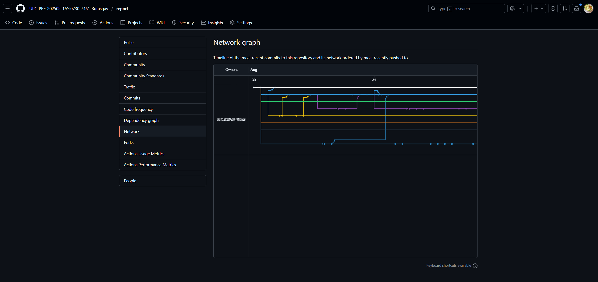
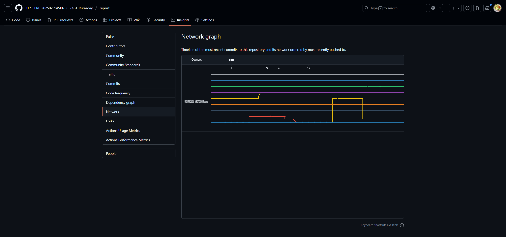
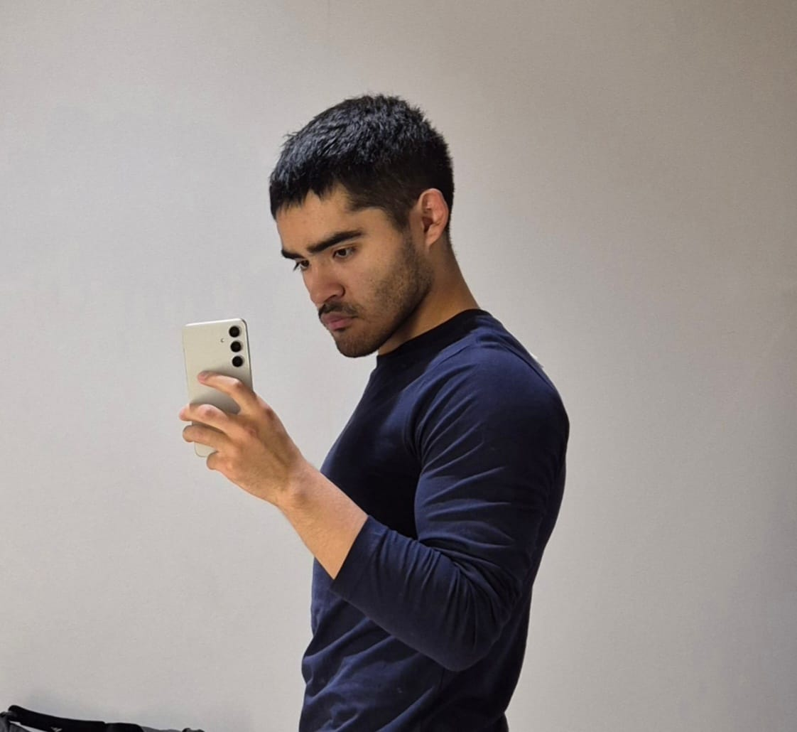
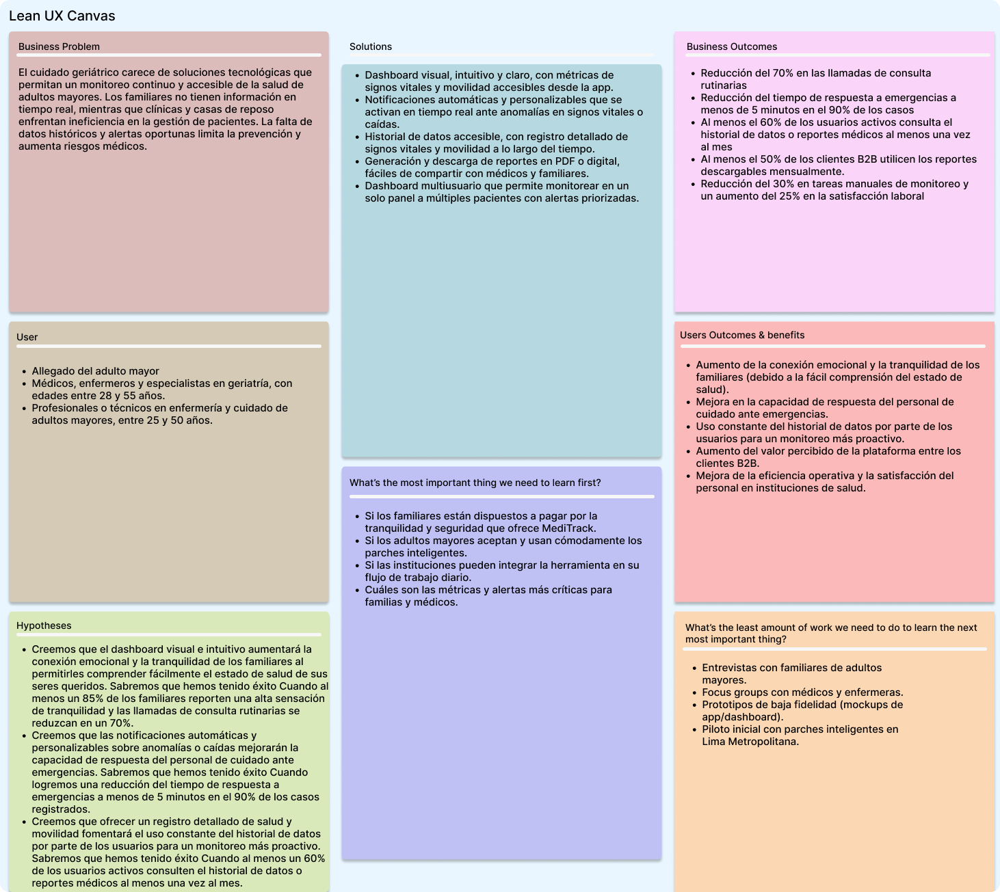

### UNIVERSIDAD PERUANA DE CIENCIAS APLICADAS

### Ingeniería de Software

### 5TO Ciclo

### Código: 1ASI0730

### Curso: Desarrollo de Aplicaciones Webs - Presencial

### NRC: 7461

### Docente: Ángel Augusto Velazques Nuñez

### Informe de Trabajo Final

### Startup: RurasqaySoft

### Producto: MediTrack

### Intregrantes:

<table>
  <thead>
    <tr>
      <th style="background-color: #333; color: #fff;">Apellidos y Nombres</th>
      <th style="background-color: #333; color: #fff;">Código de Alumno</th>
    </tr>
  </thead>
  <tbody>
    <tr>
      <td>Barrientos Quispe, Marcelo</td>
      <td>U20221E646</td>
    </tr>
    <tr>
      <td>Beingolea Montalvo, Sebastian Martin</td>
      <td>U202217853</td>
    </tr>
    <tr>
      <td>Cuba Pareja, Joaquin Antonio</td>
      <td>U201621281</td>
    </tr>
    <tr>
      <td>Rioja Nuñez, Franco Diego</td>
      <td>U202221597</td>
    </tr>
    <tr>
      <td>Rivera Ayala, Gabriel Alejandro</td>
      <td>U202223279</td>
    </tr>
  </tbody>
</table>

## AGOSTO - 2025

# Control de versiones

| Versión | Fecha    | Autor(es)                            | Descripción de cambios                                               |
| ------- | -------- | ------------------------------------ | -------------------------------------------------------------------- |
| 1.00    | 03/09/25 | Barrientos Quispe, Marcelo           | Definición de la estructura inicial del proyecto.                    |
| 1.01    | 03/09/25 | Beingolea Montalvo, Sebastian Martin | Agregados los resultados esperados para los estudiantes.             |
| 1.02    | 04/09/25 | Cuba Pareja, Joaquin Antonio         | Incorporación del Lean UX Canvas como herramienta base del proyecto. |
| 1.03    | 04/09/25 | Cuba Pareja, Joaquin Antonio         | Actualización del perfil del equipo de trabajo.                      |
| 1.04    | 05/09/25 | Barrientos Quispe, Marcelo           | Implementación de control de versiones con Git.                      |
| 1.05    | 08/09/25 | Beingolea Montalvo, Sebastian Martin | Integración de la rama con el capítulo 1 (introducción).             |
| 1.06    | 09/09/25 | Barrientos Quispe, Marcelo           | Creación del capítulo 2 del proyecto.                                |
| 1.07    | 09/09/25 | Rioja Nuñez, Franco Diego            | Inclusión de preguntas para entrevistas con usuarios.                |
| 1.08    | 10/09/25 | Barrientos Quispe, Marcelo           | Elaboración e incorporación del análisis de la competencia.          |
| 1.09    | 10/09/25 | Beingolea Montalvo, Sebastian Martin | Definición del recorrido del usuario basado en el user persona.      |
| 1.10    | 11/09/25 | Rivera Ayala, Gabriel Alejandro      | Adición del mapa de empatía al capítulo 2.                           |
| 1.11    | 12/09/25 | Rivera Ayala, Gabriel Alejandro      | Corrección y refinamiento del arquetipo de usuario.                  |
| 1.12    | 15/09/25 | Barrientos Quispe, Marcelo           | Inclusión de contenido detallado en el análisis de entrevistas.      |
| 1.13    | 15/09/25 | Rioja Nuñez, Franco Diego            | Agregados resúmenes estructurados de las entrevistas.                |

# Project Report Collaboration Insights

- Barrientos Quispe, Marcelo
- Cuba Pareja, Joaquin Antonio
- Rioja Nuñez, Franco Diego
- Beingolea Montalvo, Sebastian Martin
- Rivera Ayala, Gabriel Alejandro

Url del repositorio: [https://github.com/UPC-PRE-202502-1ASI0730-7461-Rurasqay/report](https://github.com/UPC-PRE-202502-1ASI0730-7461-Rurasqay/report)

TB1:

Team Collaboration Commits

Aquí se ve nuestro historial de commits, con un PR verificado y un ritmo constante de cambios. Nosotros hicimos avances en wireframes, wireflows, mockups y el diagrama de clases, además de sumar “student outcome” y partes del reporte como el capítulo 4 y la sección 2.4. También hicimos merges entre ramas para mantener todo alineado y dejamos mensajes claros para la trazabilidad. Con esto, nuestra aplicación progresa de forma ordenada y el equipo se mantiene en la misma página.

Team Collaboration Network

Aquí se ve el network graph del repo con varias ramas moviéndose en paralelo. Nosotros hicimos ramas por feature y fuimos fusionando a main mediante PRs para mantener un flujo limpio. Con esto, nuestra aplicación avanza sin frenar a nadie y el historial queda claro para todo el equipo.

En este segundo gráfico se nota cómo abrimos y cerramos ramas con cortes controlados. Nosotros hicimos sincronizaciones frecuentes con main para evitar conflictos y, cuando fue necesario, hicimos rebase para ordenar los commits. Así mantenemos nuestra aplicación estable mientras seguimos iterando rápido.

En el tercero se aprecian integraciones más grandes y varios puntos de merge. Nosotros hicimos consolidaciones por hitos, revisamos los cambios entre equipos y cuidamos que main quedara liberable en cualquier momento. Esto nos permitió planear despliegues seguros y medir el progreso real de nuestra aplicación.
# Contenido

## Tabla de Contenidos

- [Student Outcome](#student-outcome)

- [Capítulo I: Introducción](#capítulo-i-introducción)

- [1.1. Startup Profile](#11-startup-profile)
  - [1.1.1. Descripción de la Startup](#111-descripción-de-la-startup)
  - [1.1.2. Perfiles de integrantes del equipo](#112-perfiles-de-integrantes-del-equipo)
- [1.2. Solution Profile](#12-solution-profile)
  - [1.2.1. Antecedentes y problemática](#121-antecedentes-y-problemática)
  - [1.2.2. Lean UX Process](#122-lean-ux-process)
    - [1.2.2.1. Lean UX Problem Statement](#1221-lean-ux-problem-statement)
    - [1.2.2.2. Lean UX Assumptions](#1222-lean-ux-assumptions)
    - [1.2.2.3. Lean UX Hypothesis Statements](#1223-lean-ux-hypothesis-statements)
    - [1.2.2.4. Lean UX Canvas](#1224-lean-ux-canvas)
- [1.3. Segmentos objetivo](#13-segmentos-objetivo)

- [Capítulo II: Requirements Elicitation & Analysis](#capítulo-ii-requirements-elicitation--analysis)

- [2.1. Competidores](#21-competidores)
  - [2.1.1. Análisis competitivo](#211-análisis-competitivo)
  - [2.1.2. Estrategias y tácticas frente a competidores](#212-estrategias-y-tácticas-frente-a-competidores)
- [2.2. Entrevistas](#22-entrevistas)
  - [2.2.1. Diseño de entrevistas](#221-diseño-de-entrevistas)
  - [2.2.2. Registro de entrevistas](#222-registro-de-entrevistas)
  - [2.2.3. Análisis de entrevistas](#223-análisis-de-entrevistas)
- [2.3. Needfinding](#23-needfinding)
  - [2.3.1. User Personas](#231-user-personas)
  - [2.3.2. User Task Matrix](#232-user-task-matrix)
  - [2.3.3. User Journey Mapping](#233-user-journey-mapping)
  - [2.3.4. Empathy Mapping](#234-empathy-mapping)
- [2.4. Big Picture EventStorming](#24-big-picture-eventstorming)
- [2.5. Ubiquitous Language](#25-ubiquitous-language)

- [Capítulo III: Requirements Specification](#capítulo-iii-requirements-specification)

- [3.1. User Stories](#31-user-stories)
- [3.2. Impact Mapping](#32-impact-mapping)
- [3.4. Product Backlog](#34-product-backlog)

- [Capítulo IV: Product Design](#capítulo-iv-product-design)

- [4.1. Style Guidelines](#41-style-guidelines)
  - [4.1.1. General Style Guidelines](#411-general-style-guidelines)
  - [4.1.2. Web Style Guidelines](#412-web-style-guidelines)
- [4.2. Information Architecture](#42-information-architecture)
  - [4.2.1. Organization Systems](#421-organization-systems)
  - [4.2.2. Labeling Systems](#422-labeling-systems)
  - [4.2.3. SEO Tags and Meta Tags](#423-seo-tags-and-meta-tags)
  - [4.2.4. Searching Systems](#424-searching-systems)
  - [4.2.5. Navigation Systems](#425-navigation-systems)
- [4.3. Landing Page UI Design](#43-landing-page-ui-design)
  - [4.3.1. Landing Page Wireframe](#431-landing-page-wireframe)
  - [4.3.2. Landing Page Mock-up](#432-landing-page-mock-up)
- [4.4. Web Applications UX/UI Design](#44-web-applications-uxui-design)
  - [4.4.1. Web Applications Wireframes](#441-web-applications-wireframes)
  - [4.4.2. Web Applications Wireflow Diagrams](#442-web-applications-wireflow-diagrams)
  - [4.4.3. Web Applications Mock-ups](#443-web-applications-mock-ups)
  - [4.4.4. Web Applications User Flow Diagrams](#444-web-applications-user-flow-diagrams)
- [4.5. Web Applications Prototyping](#45-web-applications-prototyping)
- [4.6. Domain-Driven Software Architecture](#46-domain-driven-software-architecture)
  - [4.6.1. Software Architecture Context Diagram](#461-software-architecture-context-diagram)
  - [4.6.2. Software Architecture Container Diagrams](#462-software-architecture-container-diagrams)
  - [4.6.3. Software Architecture Components Diagrams](#463-software-architecture-components-diagrams)
- [4.7. Software Object-Oriented Design](#47-software-object-oriented-design)
  - [4.7.1. Class Diagrams](#471-class-diagrams)
- [4.8. Database Design](#48-database-design)

  - [4.8.1. Database Diagrams](#481-database-diagrams)

- [Capítulo V: Product Implementation, Validation & Deployment](#capítulo-v-product-implementation-validation--deployment)

- [5.1. Software Configuration Management](#51-software-configuration-management)
  - [5.1.1. Software Development Environment Configuration](#511-software-development-environment-configuration)
  - [5.1.2. Source Code Management](#512-source-code-management)
  - [5.1.3. Source Code Style Guide & Conventions](#513-source-code-style-guide--conventions)
  - [5.1.4. Software Deployment Configuration](#514-software-deployment-configuration)
- [5.2. Landing Page, Services & Applications Implementation](#52-landing-page-services--applications-implementation)
  - [5.2.1. Sprint 1](#521-sprint-1)
    - [5.2.1.1. Sprint Planning 1](#5211-sprint-planning-1)
    - [5.2.1.2. Aspect Leaders and Collaborators](#5212-aspect-leaders-and-collaborators)
    - [5.2.1.3. Sprint Backlog 1](#5213-sprint-backlog-1)
    - [5.2.1.4. Development Evidence for Sprint Review](#5214-development-evidence-for-sprint-review)
    - [5.2.1.5. Execution Evidence for Sprint Review](#5215-execution-evidence-for-sprint-review)
    - [5.2.1.6. Services Documentation Evidence for Sprint Review](#5216-services-documentation-evidence-for-sprint-review)
    - [5.2.1.7. Software Deployment Evidence for Sprint Review](#5217-software-deployment-evidence-for-sprint-review)
    - [5.2.1.8. Team Collaboration Insigths during Sprint](#5218-team-collaboration-insigths-during-sprint)
- [5.3. Validation Interviews](#53-validation-interviews)

  - [5.3.1. Diseño de Entrevistas](#531-diseño-de-entrevistas)
  - [5.3.2. Registro de Entrevistas](#532-registro-de-entrevistas)
  - [5.3.3. Evaluaciones según heurísticas](#533-evaluaciones-según-heurísticas)

- [Conclusiones](#conclusiones)

  - [Conclusiones y recomendaciones](#conclusiones-y-recomendaciones)
  - [Video About-the-Product](#video-about-the-product)

- [Bibliografía](#bibliografía)

- [Anexos](#anexos)

# Student Outcome

ABET – EAC - Student Outcome 5: La capacidad de funcionar efectivamente en un equipo cuyos miembros juntos proporcionan liderazgo, crean un entorno de colaboración e inclusivo, establecen objetivos, planifican tareas y cumplen objetivos.

En el siguiente cuadro se describe las acciones realizadas y enunciados de conclusiones por parte del grupo, que permiten sustentar el haber alcanzado el logro del ABET – EAC - Student Outcome 5.

| Criterio específico                                                                                 | Acciones realizadas                                                                                                                                                                                                                                                                                                                                                                                                                                                                                                                                                                                                                                                                                                                                                                                                                                                                                                                                                                                                                                              | Conclusiones                                                                                                                                                                                                                                                                                                                                                                                                                                                                                                                                                                                                                                                                                                                                                                                                                                                                                                                                                                                                                                                                                                                                                                                                                                                                                                                                                                                                                                          |
| --------------------------------------------------------------------------------------------------- | ---------------------------------------------------------------------------------------------------------------------------------------------------------------------------------------------------------------------------------------------------------------------------------------------------------------------------------------------------------------------------------------------------------------------------------------------------------------------------------------------------------------------------------------------------------------------------------------------------------------------------------------------------------------------------------------------------------------------------------------------------------------------------------------------------------------------------------------------------------------------------------------------------------------------------------------------------------------------------------------------------------------------------------------------------------------- | ----------------------------------------------------------------------------------------------------------------------------------------------------------------------------------------------------------------------------------------------------------------------------------------------------------------------------------------------------------------------------------------------------------------------------------------------------------------------------------------------------------------------------------------------------------------------------------------------------------------------------------------------------------------------------------------------------------------------------------------------------------------------------------------------------------------------------------------------------------------------------------------------------------------------------------------------------------------------------------------------------------------------------------------------------------------------------------------------------------------------------------------------------------------------------------------------------------------------------------------------------------------------------------------------------------------------------------------------------------------------------------------------------------------------------------------------------- |
| **Trabaja en equipo para proporcionar liderazgo en forma conjunta.**                                | **Rioja Nuñez, Franco Diego** **TB1** Me esforcé en aportar al grupo, cumpliedo todas mis tareas encomendadas y ayudando en lo que aún faltaba por completar.    **TP**   Durante el desarrollo del proyecto, mantuve una presencia constante en las llamadas grupales, donde participé activamente en las discusiones y ofrecí mi perspectiva en la mejora del informe y ayude en la implementacion de la aplicación frontend.     **Barrientos Quispe, Marcelo**   **TB1**   Apoyé de manera activa al desarrollo del trabajo, apoyando, mejorando y arregalndo varias partes del proyecto, además de claro hacer mis tareas encomendadas.     **TP**   Para esta segunda entrega alcancé el logro del outcome ya que durante reuniones vía discord o zoom organicé y asigne tareas a mis compañeros además de ayudarlos a corregir errores en código y estar constantemente pendiente del trabajo. Tambien desarrollé el bounded context de allegados en el frontend.     **Beingolea Montalvo, Sebastian Martin**   **TB1**   Me encargue de realizar las entrevistas al primer segmento objetivo tambien me encargue de los user persona y el analisis de entrevistas y parte del event storming     **TP**   Me encargue del big picture event storming y también de la asignación de tareas en el trello y la actualización de descripciones de imágenes como también la actualización del canva.     **Rivera Ayala, Gabriel**   **TB1**   Apoyé a mis compañeros a investigar las necesidades de nuestros usuarios, brindé soporte y priorizé la colaboración y comunicación.     **TP**   Colaboré con mi grupo de trabajo al desarrollar las interfaces del usuario en nuestra aplicación frontend al igual que corregir ciertos errores en anteriores entregas.     **Joaquin Antonio Cuba Pareja**   **TB1**   Me encargue de la elaboracion de la Landing Page 4.1. el event storming y Class diagram     **TP**   El desarrollo del proyecto fue una experiencia integral que combinó esfuerzos técnicos y colaborativos. Durante el proceso, mantuve una participación activa en las reuniones, contribuyendo en las discusiones y ofreciendo mi visión para mejorar el informe.                       | **Rioja Nuñez, Franco Diego** **TB1** La constante participación y aporte al gupo fue importante para mi desarrollo como estudiante, ya que pude obtener inforamción valiosa, más quen con el desarrollo de ciertos apartados sobre el análisis de usuarios    **TP**   Durante el desarrollo del proyecto, mantuve una presencia constante en las llamadas grupales, donde participé activamente en las discusiones y ofrecí mi perspectiva en la mejora del informe y ayude en la implementacion de la aplicación frontend.     **Barrientos Quispe, Marcelo**   **TB1**   Gracias a mi gran aporte, mejore muchas de mis habilidades con respecto al desarrollo de una aplicación de este tipo, lo que me será de mucha ayuda en mi desarrollo como profesional.     **TP**   Para esta segunda entrega alcancé el logro del outcome ya que durante reuniones vía discord o zoom organicé y asigne tareas a mis compañeros además de ayudarlos a corregir errores en código y estar constantemente pendiente del trabajo. Tambien desarrollé el bounded context de allegados en el frontend.     **Beingolea Montalvo, Sebastian Martin**   **TB1**   La participación activa en el diseño y ejecución de entrevistas al primer segmento objetivo permitió aportar información valiosa al equipo. Esta contribución fortaleció la toma de decisiones conjuntas y reflejó un liderazgo distribuido, basado en la colaboración y en la construcción colectiva de resultados.     **TP**   Me encargue del big picture event storming y también de la asignación de tareas en el trello y la actualización de descripciones de imágenes como también la actualización del canva.     **Rivera Ayala, Gabriel**   **TB1**   Apoyé a mis compañeros a investigar las necesidades de nuestros usuarios, brindé soporte y priorizé la colaboración y comunicación.     **TP**   Colaboré con mi grupo de trabajo al desarrollar las interfaces del usuario en nuestra aplicación frontend al igual que corregir ciertos errores en anteriores entregas.     **Joaquin Antonio Cuba Pareja**   **TB1**  Como equipo, nos dimos retroalimentación de forma constante, lo cual nos ayudó a reforzar nuestras áreas de oportunidad y mejorar nuestro desempeño   **TP**   El desarrollo del proyecto fue una experiencia integral que combinó esfuerzos técnicos y colaborativos. Durante el proceso, mantuve una participación activa en las reuniones, contribuyendo en las discusiones y ofreciendo mi visión para mejorar el informe.                                                                                                                        |
| **Crea un entorno colaborativo e inclusivo, establece metas, planifica tareas y cumple objetivos.** | **Rioja Nuñez, Franco Diego** **TB1** Me encargué de realizar una entrevista, una buena parte del needfinding, dividir los user stories por épicas y me encargué del diagrama de la base de datos  **TP**  Coordiné la priorización de tareas y participé activamente en las reuniones de sprint, asegurando el avance de los entregables y documentando decisiones técnicas relevantes.  **Barrientos Quispe, Marcelo**   **TB1**   Me encargué de la elaboración del wireframe, wireflow, mokups, segmentos objetivos, parte del capitulo 1, entrevistas y su diseño, landing page, muy buena parte del capitulo 4 y el capitulo 5     **TP**  Implementé una primera versión del frontend junto a mi equipo de trabajo creando un ambiente colaborativo.    **Beingolea Montalvo, Sebastian Martin**   **TB1**  Me encargue de realizar las entrevistas al primer segmento objetivo tambien me encargue de los user persona y el analisis de entrevistas y parte del event storming     **TP**  Organicé las tareas en un Trello para mejorar la colaboración y manejo de tareas.    **Rivera Ayala, Gabriel**   **TB1**   Apoyé a mis compañeros a investigar las necesidades de nuestros usuarios, brindé soporte y priorizé la colaboración y comunicación.     **TP**  Colaboré en la implementación de las interfaces y en la corrección de errores del frontend, además de corregir errores en pasadas entregas.    **Joaquin Antonio Cuba Pareja**   **TB1**   Me encargue de la elaboracion de la Landing Page 4.1. el event storming y Class diagram     **TP**  El desarrollo del proyecto fue una experiencia integral que combinó esfuerzos técnicos y colaborativos. Durante el proceso, mantuve una participación activa en las reuniones, contribuyendo en las discusiones y ofreciendo mi visión para mejorar el informe. | **Rioja Nuñez, Franco Diego** **TB1** Gracias a la elaboración del needfiding, mejoré mi habilidad para ver como se siente al cliente con varios aspectos de nuestra aplicación, loq e me permite dar un producto muhco mejor para los usuarios.  **Barrientos Quispe, Marcelo**   **TB1**   Gracias al desarrollo del trabajo mejoré muchas habildies, tanto como del desarrollo de la idea del proyecto, sino también con respecto al desarollo de landigns pages, ya que ahora siento que se como atraer mejor ala gente con esta sección tan importante del proyecto.     **TP**  Implementé una primera versión del frontend junto a mi equipo de trabajo creando un ambiente colaborativo.    **Beingolea Montalvo, Sebastian Martin**   **TB1**   Al elaborar los user personas y analizar entrevistas, se facilitó un espacio de diálogo y entendimiento mutuo entre los miembros del equipo, asegurando que las diferentes perspectivas fueran integradas en el desarrollo del proyecto. Este enfoque inclusivo permitió que el producto respondiera mejor a las necesidades reales de los usuarios.     **TP**  Organicé las tareas en un Trello para mejorar la colaboración y manejo de tareas.    **Rivera Ayala, Gabriel**   **TB1**   Apoyé a mis compañeros a investigar las necesidades de nuestros usuarios, brindé soporte y priorizé la colaboración y comunicación.     **TP**   Colaboré en la implementación de las interfaces y en la corrección de errores del frontend, además de corregir errores en pasadas entregas.    **Joaquin Antonio Cuba Pareja**   **TB1**   A lo largo del desarrollo del trabajo se logro establecer un ambiente colabortivo lo cual nos permitio refinar nuestra aprendisaje y el desarrollo del trabjo     **TP** El desarrollo del proyecto fue una experiencia integral que combinó esfuerzos técnicos y colaborativos. Durante el proceso, mantuve una participación activa en las reuniones, contribuyendo en las discusiones y ofreciendo mi visión para mejorar el informe. |

# Capítulo I: Introducción

## 1.1. Startup Profile

### 1.1.1. Descripción de la Startup

**RurasqaySoft** es una startup tecnológica enfocada en el desarrollo de soluciones digitales innovadoras para el sector salud, con especial atención en el cuidado de pacientes geriátricos. Nuestro propósito es aprovechar la tecnología para mejorar la calidad de vida de los adultos mayores mediante herramientas accesibles, seguras y sostenibles que permitan un monitoreo constante, una atención preventiva y una conexión más cercana entre pacientes, familiares e instituciones de salud.

Nuestra solución es MediTrack, una plataforma de salud digital que utiliza parches inteligentes como dispositivos IoT para el monitoreo remoto de pacientes geriatricos. MediTrack permite registrar signos vitales, detectar emergencias y compartir información en tiempo real con familiares, médicos y aseguradoras, garantizando un cuidado preventivo, seguro y personalizado.

La propuesta de RurasqaySoft se centra en construir un ecosistema de salud digital inclusivo, escalable y orientado a resultados, donde los parches inteligentes y las plataformas de gestión se convierten en un puente entre innovación tecnológica y bienestar social. Buscamos que cada adulto mayor pueda ser monitoreado en tiempo real, reduciendo riesgos, optimizando diagnósticos y facilitando la toma de decisiones médicas y familiares.

**Misión:** Desarrollar herramientas digitales accesibles y efectivas que permitan a pacientes, familias e instituciones de salud monitorear y gestionar la salud de los adultos mayores en tiempo real, brindando seguridad, confianza y eficiencia.

**Visión:** En los próximos 5 años, consolidar a RurasqaySoft como una la empresa líder en soluciones de salud digital en Latinoamérica, siendo reconocidos por nuestra capacidad de mejorar la calidad de vida y prevenir riesgos mediante el uso de innovación tecnológica accesible y escalable.

**Alcance del proyecto:** El alcance inicial de MediTrack está orientado al cuidado geriátrico, ofreciendo una plataforma web y móvil que integra dispositivos IoT en forma de parches inteligentes para registrar signos vitales, alertar en casos de emergencia y compartir información en tiempo real con familiares, médicos y aseguradoras. A mediano plazo, buscamos ampliar el impacto de la solución hacia hospitales, clínicas y casas de reposo, consolidando un modelo de monitoreo preventivo y predictivo que transforme la manera en que se gestiona la salud de los adultos mayores en Latinoamérica.

### 1.1.2. Perfiles de integrantes del equipo

| Foto                                                                             | Apellido y Nombre                    | Código     | Carrera                | Habilidades                                                                                                                                                                                                                                                                                                                                                                                     |
| -------------------------------------------------------------------------------- | ------------------------------------ | ---------- | ---------------------- | ----------------------------------------------------------------------------------------------------------------------------------------------------------------------------------------------------------------------------------------------------------------------------------------------------------------------------------------------------------------------------------------------- |
|  | Beingolea Montalvo, Sebastian Martin | U202217853 | Ingeniería de Software | Comunicación efectiva, trabajo en equipo, empatía, pensamiento crítico, tengo conocimientos de python basico como de c++ tambien soy autodidacta ya que aprendo lenguajes de programacion por mi cuenta.                                                                                                                                                                                        |
|                                         | Rivera Ayala, Gabriel Alejandro      | U202223279 | Ingeniería de Software | Soy estudiante de Ingeniería de Software. Me interesa el aprendizaje continuo en todo lo relacionado al desarrollo de aplicaciones interactivas. He desarrollado proyectos en C++, Python, HTML y CSS. Actualmente estoy aprendiendo a realizar aplicaciones web usando el framework Angular y Vue. Me considero una persona trabajadora y apoyaré a mis compañeros a realizar un buen trabajo. |
|            | Cuba Pareja, Joaquin Antonio         | U201621281 | Ingeniería de Software | Conocimientos en desarrollo web y CLI. Manejo de JavaScript, C++ y Python, con algo de experiencia en Go. Familiarizado con tecnologías front-end como HTML, CSS y TypeScript. Interesado en el desarrollo full stack, la optimización de código y la resolución de problemas. Con disposición para aprender nuevas tecnologías y trabajar en equipo.                                           |
|                                       | Rioja Nuñez, Franco Diego            | U202221597 | Ingeniería de Software | Me considero una persona adaptable al entorno, sé trabajar en equipo y aprendo rápido. Mentalidad para resolver problemas. Conocimiento básico de las funcionalidades de software.                                                                                                                                                                                                              |
|                                         | Barrientos Quispe, Marcelo           | U20221e646 | Ingeniería de Software | Me considero una persona adaptable al entorno, sé trabajar en equipo y aprendo rápido. Cuento con conocimientos técnicos en tecnologías de JavaScript.                                                                                                                                                                                                                                          |

## 1.2. Solution Profile

El **Solution Profile** presenta una descripción general de la solución propuesta, abordando el contexto, los problemas detectados y las suposiciones estratégicas que guían el desarrollo del producto. Esta sección busca conectar los hallazgos obtenidos en la fase de descubrimiento con una propuesta clara de valor, estableciendo las bases para el diseño, validación y desarrollo de la solución.

### 1.2.1. Antecedentes y problemática

En esta sección se analiza el contexto en el que surge la problemática principal, considerando los factores sociales, tecnológicos y emocionales que la rodean. A través de la **técnica de las 5 ‘W’s y 2 ‘H’s**, se busca responder de forma estructurada a las preguntas clave sobre el qué, quién, cuándo, dónde, por qué, cómo y cuánto, con el fin de comprender de manera integral la situación actual y justificar la pertinencia de la solución propuesta.

**Técnica de The 5 'W's y 2 'H's**

**What(Qué)?**  
¿Cuál es el problema?

El envejecimiento poblacional en el Perú y América Latina ha incrementado la demanda de soluciones de monitoreo en salud geriátrica. Según la Organización Panamericana de la Salud (OPS, s. f.), para el año 2050, 1 de cada 5 personas en la región será adulto mayor. Sin embargo, gran parte de esta población enfrenta limitaciones para un control adecuado de sus enfermedades crónicas debido a la falta de acceso a tecnología comprensible, la escasez de seguimiento médico continuo y la sobrecarga de los familiares que asumen su cuidado.

Actualmente, muchos dispositivos de monitoreo existentes requieren habilidades tecnológicas que los adultos mayores no poseen, lo que genera una brecha digital en el cuidado geriátrico, reduciendo la calidad de atención y aumentando el riesgo de emergencias médicas no atendidas a tiempo.

**When(Cuando)?**  
¿Cuándo sucede el problema?

El problema ocurre de manera constante, pero se intensifica en las etapas más avanzadas de la vejez, cuando las enfermedades crónicas y las limitaciones físicas o cognitivas aumentan la dependencia del adulto mayor. La necesidad de monitoreo es diaria y continua, especialmente en pacientes con hipertensión, diabetes o afecciones cardíacas.

En situaciones cotidianas, como cuando los adultos mayores están solos en casa o durante la noche, las caídas o variaciones en los signos vitales pueden pasar desapercibidas, impidiendo una intervención médica oportuna y elevando el riesgo de complicaciones graves.

**Where(Dónde)?**  
¿Dónde surge el problema?

El problema se presenta principalmente en entornos urbanos del Perú, donde la población geriátrica está en crecimiento y los sistemas de salud se encuentran sobrecargados. Según el Instituto Nacional de Estadística e Informática (INEI, 2024), el 13% de la población peruana ya supera los 60 años, y se proyecta un crecimiento sostenido en la próxima década.

En las ciudades, muchos adultos mayores viven solos o en casas de reposo, lo que incrementa la necesidad de monitoreo remoto y continuo. En áreas rurales, la falta de infraestructura médica y especialistas agrava el problema, ya que limita el acceso a controles periódicos y servicios de salud adecuados.

En conjunto, tanto los entornos urbanos como rurales enfrentan limitaciones en la atención geriátrica continua, reforzando la necesidad de soluciones tecnológicas locales, accesibles y adaptadas al contexto peruano.

**Who(Quién)?**  
¿Quiénes son los afectados?

Los principales afectados son:

- **Adultos mayores**, que requieren monitoreo constante de su salud pero que enfrentan dificultades para usar herramientas tecnológicas complejas.

- **Familiares y allegados**, quienes muchas veces cargan con la responsabilidad de vigilar el bienestar del paciente sin contar con información precisa oportuna.

- **Clínicas y hospitales**, que necesitan soluciones de telemetría que permitan descongestionar la atención presencial y realizar un seguimiento más eficiente.

- **Casas de reposo y centros geriátricos**, que deben garantizar la seguridad de sus residentes y responder rápidamente ante emergencias de salud.

**Why(Por qué)?**  
¿Cuál es la causa del problema?

- **Falta de monitoreo continuo y accesible:** Los sistemas de salud en el Perú están centrados en la atención reactiva, sin priorizar la prevención ni el seguimiento remoto.

- **Limitaciones tecnológicas en adultos mayores:** Según la Encuesta Nacional de Hogares (ENAHO, INEI, 2023), solo el 22% de los adultos mayores peruanos accede regularmente a internet, y menos del 10% utiliza aplicaciones móviles de salud.

- **Sobrecarga del sistema de salud:** La atención médica presencial presenta largas esperas, lo que retrasa diagnósticos y controles regulares.

- **Escasez de herramientas locales adaptadas:** La mayoría de los wearables disponibles están diseñados para mercados extranjeros y no se ajustan al contexto socioeconómico ni cultural peruano.

- **Dependencia de familiares y cuidadores:** La falta de sistemas confiables de alerta temprana obliga a los familiares a asumir una vigilancia constante, generando altos niveles de estrés y agotamiento emocional.

**How(Cómo)?**  
¿Cómo se utilizará el producto?

Para responder a esta necesidad, MediTrack propone un sistema integral de monitoreo geriátrico compuesto por un parche inteligente y un dashboard digital que facilita el acceso a información médica en tiempo real.

- **Para los pacientes geriátricos:** Solo deben portar el parche inteligente, el cual registra automáticamente sus signos vitales sin necesidad de conocimientos tecnológicos.

- **Para los familiares:** Accederán a una plataforma intuitiva donde podrán visualizar la salud del paciente en tiempo real, recibir notificaciones de alerta y acceder al historial médico.

- **Para clínicas y casas de reposo:** Podrán supervisar simultáneamente múltiples pacientes, generar reportes médicos automatizados y tomar decisiones basadas en datos objetivos.

Este sistema busca mejorar la calidad de vida del adulto mayor, reducir la carga emocional de los familiares y optimizar la gestión institucional del cuidado geriátrico. Su enfoque accesible y adaptado al contexto peruano diferencia a MediTrack de otras soluciones internacionales más costosas y complejas.

**How much(Cuánto)?**  
¿Cuánto costará implementar la solución?

La implementación de MediTrack requiere una inversión inicial orientada al desarrollo tecnológico, infraestructura de soporte y estrategias de lanzamiento. Esta inversión representa un paso clave hacia la modernización del cuidado geriátrico en el Perú, ofreciendo una alternativa local, accesible y escalable frente a dispositivos importados de alto costo.

**Presupuesto estimado:**

**Desarrollo de Software**

- Diseño y desarrollo del dashboard web: S/ 3,500 – S/ 5,000

- Backend, API y base de datos segura: S/ 3,000 – S/ 4,500

- Dominio, hosting y servidores (anual): S/ 1,200 – S/ 2,000

**Hardware (Parches inteligentes)**

- Diseño y prototipado de parches: S/ 5,000 – S/ 7,000

- Producción inicial (lote piloto de 100 unidades): S/ 8,000 – S/ 10,000

**Marketing y Lanzamiento:**

- Estrategia digital y materiales promocionales: S/ 2,500 – S/ 4,000

- Alianzas con clínicas y casas de reposo: S/ 1,500 – S/ 2,000

- Mantenimiento y Soporte (anual):

- Actualizaciones de software y soporte técnico: S/ 3,000 – S/ 5,000

**Total estimado:** S/ 28,700 – S/ 40,500

### 1.2.2. Lean UX Process

El proceso Lean UX que adoptamos está orientado a maximizar la eficiencia en el desarrollo de nuestro producto, enfocándose en principios fundamentales como la validación continua, el pensamiento crítico y la acción rápida. A partir de esta filosofía, hemos estructurado nuestro propio enfoque Lean UX, basado en cuatro componentes esenciales: definición de problemas, formulación de suposiciones, creación de hipótesis y desarrollo de un lienzo estratégico.

#### 1.2.2.1. Lean UX Problem Statement.

El propósito de MediTrack es ofrecer una solución digital integral que permita monitorear en tiempo real los signos vitales y la movilidad de los adultos mayores mediante dispositivos portátiles (wearables). Nuestra meta es proporcionar tranquilidad a las familias y eficiencia al personal médico, facilitando la toma de decisiones preventivas y mejorando la calidad de vida del paciente geriátrico.

El problema surge cuando familiares y cuidadores se enfrentan a la falta de información inmediata sobre el estado de salud de los adultos mayores, especialmente ante situaciones críticas como caídas o cambios súbitos en sus signos vitales. Actualmente, las plataformas de monitoreo existentes son fragmentadas, costosas o no se adaptan al entorno geriátrico local, dificultando su implementación en clínicas, casas de reposo o entornos domésticos.

Hemos observado que esta situación genera preocupación constante en los familiares, sobrecarga laboral en los cuidadores y retrasos en la atención médica preventiva, lo que deriva en una menor calidad de vida para el adulto mayor.
La ausencia de una solución accesible, escalable y de fácil uso crea una brecha entre la necesidad de monitoreo continuo y las herramientas tecnológicas disponibles actualmente.

Ante esta problemática, surge la siguiente pregunta: **¿Cómo podríamos ofrecer una solución tecnológica accesible y confiable que permita monitorear la salud y el bienestar de los adultos mayores en tiempo real, brindando tranquilidad a sus familias y eficiencia al personal médico?**

**Domain:** Salud digital, cuidado geriátrico, tecnología portátil (wearables).

**Customer Segments:**

- Familiares de pacientes geriátrico
- Personal médico de clínicas.
- Personal de las casas de reposo

**Pain Points:**

- Incertidumbre y preocupación familiar por la salud del adulto mayor.
- Ineficiencia en el monitoreo de múltiples pacientes en clínicas y casas de reposo.
- Riesgo de caídas y la falta de alertas en tiempo real.
- Falta de datos históricos para la prevención médica.

**Gap:** No existe una solución en el mercado que combine un monitoreo integral de signos vitales y movilidad con una plataforma visual y escalable, adaptada tanto para el uso individual en el hogar como para la gestión institucional.

**Vision/Strategy:** Ser la empresa líder en soluciones de salud digital para adultos mayores en Latinoamérica, mejorando la calidad de vida y previniendo riesgos mediante una innovación tecnológica accesible y escalable.

**Initial Segment:** Familias con adultos mayores en Lima Metropolitana que tienen acceso a dispositivos móviles y buscan una forma más segura de monitorear la salud de sus seres queridos.

#### 1.2.2.2. Lean UX Assumptions.

Los siguientes supuestos representan las creencias iniciales sobre el modelo de negocio, el mercado y la viabilidad del producto MediTrack.

**Business Assumptions**

Estas Business Assumptions servirán como base para formular los Feature Assumptions e Hypothesis Statements, permitiendo validar los elementos críticos del modelo durante las iteraciones del proceso Lean UX.

1. Creemos que los usuarios necesitan monitorear de forma continua la salud de los adultos mayores para reducir los riesgos médicos y la carga emocional familiar.

2. Creemos que una solución digital que combine parches inteligentes con un dashboard accesible puede satisfacer esta necesidad y mejorar la prevención médica.

3. Creemos que nuestros clientes iniciales serán familias y pequeñas instituciones geriátricas en Lima Metropolitana que busquen seguridad y eficiencia en el cuidado.

4. Creemos que el valor más importante que buscan nuestros clientes es la **tranquilidad** de tener información en tiempo real sobre la salud de sus seres queridos.

5. Creemos que nuestro modelo **Freemium + Suscripción Enterprise** nos permitirá escalar en ambos segmentos (B2C y B2B) sin depender de un único flujo de ingresos.

6. Creemos que nuestra ventaja competitiva radica en integrar métricas de salud y movilidad en una sola plataforma, algo que la competencia actual no ofrece.

7. Creemos que podremos reducir las llamadas de emergencia y consultas médicas presenciales al proporcionar monitoreo remoto confiable.

8. Reconocemos que el mayor riesgo es la desconfianza tecnológica; lo mitigaremos con pilotos gratuitos, certificaciones médicas y testimonios de usuarios reales.

9. Creemos que la relación costo–beneficio de MediTrack será más accesible que las soluciones importadas equivalentes.

**User Assumptions**

En esta etapa del Lean UX Process, se identificaron los principales supuestos sobre los usuarios, sus necesidades y el contexto de uso del producto. Estos Assumptions representan las creencias iniciales del equipo antes de realizar pruebas o validaciones.

**¿Quién es el usuario?**

- Allegados de adultos mayores: Hijos, nietos o cuidadores principales que viven con el adulto mayor o a distancia, preocupados por su salud, seguridad y bienestar.

- Clínicas y casas de reposo: Personal médico, cuidadores y administradores que necesitan una herramienta para monitorear a múltiples pacientes de manera simultánea.

**¿Dónde encaja nuestro producto en su vida?**

- Para los allegados: Se integra en su rutina diaria como una capa de seguridad y tranquilidad.

- Para las clínicas y casas de reposo: Se convierte en una herramienta central de gestión y monitoreo.

**¿Qué problemas resuelve nuestro producto?**

- Incertidumbre y preocupación: Las familias eliminan la ansiedad al tener datos de salud en tiempo real.

- Falta de monitoreo continuo: La solución permite un seguimiento constante de signos vitales y movilidad, incluso a distancia.

- Ineficiencia en la gestión: Las instituciones pueden monitorear a múltiples residentes de forma simultánea, recibiendo alertas automáticas que les permiten reaccionar rápidamente ante emergencias.

- Prevención limitada: La disponibilidad de datos históricos ayuda a identificar patrones y a tomar decisiones médicas preventivas.

**¿Cuándo y cómo se usa nuestro producto?**

- Para el usuario B2C (familiar): La app web se usa varias veces al día para chequear el estado del adulto mayor, o al recibir una alerta. La instalación del parche es un proceso inicial y sencillo, y el monitoreo es automático.

- Para el usuario B2B (institución): El dashboard se usa de forma continua en una computadora o tablet en la estación de enfermería. Se consulta para ver el estado de los pacientes, verificar alertas y generar reportes para el personal o los familiares.

**¿Qué características son importantes?**

- Alertas en tiempo real: Por caídas, cambios bruscos en signos vitales o anomalías en el patrón de movilidad.
- Dashboard visual: Una interfaz clara con gráficos y un mapa de movilidad.
- Historial de datos: La capacidad de ver métricas de salud a lo largo del tiempo.
- Reportes descargables: Para consultas médicas o comunicación con familiares.

**¿Cómo debería lucir y comportarse el producto?**
Debe ser intuitivo, sencillo y confiable. Los colores deben ser calmados (sin alarmar al usuario con rojo o naranjas, a menos que sea una alerta crítica), con una tipografía clara y botones grandes. El comportamiento debe ser rápido y responsivo, sin retrasos en la entrega de datos, y debe inspirar confianza y seguridad en el usuario.

### Feature Assumptions

En esta sección se detallan los supuestos relacionados con las características funcionales del producto. Cada **Feature Assumption** busca conectar las necesidades de los usuarios con las posibles soluciones de diseño, anticipando el impacto esperado en la experiencia y el comportamiento del usuario. Estas suposiciones servirán de base para la formulación de hipótesis y posteriores validaciones durante el proceso de desarrollo del producto.

1. Creemos que un **dashboard visual y amigable** permitirá a familiares y personal médico interpretar fácilmente la salud de los adultos mayores sin conocimientos técnicos.  
   aumentar en un 80% la comprensión de los datos de salud reportada por los usuarios.\*

2. Creemos que las **notificaciones automáticas y personalizables** mejorarán la respuesta ante emergencias.

3. Creemos que un **historial de datos accesible** fomentará la prevención y seguimiento médico continuo.

4. Creemos que los **reportes descargables** aumentarán la comunicación efectiva entre familiares y médicos.

5. Creemos que el **monitoreo de múltiples pacientes** en un solo panel mejorará la eficiencia de las instituciones.

### User Outcome Assumptions

- Aumento de la conexión emocional y la tranquilidad de los familiares (debido a la fácil comprensión del estado de salud).

- Mejora en la capacidad de respuesta del personal de cuidado ante emergencias.

- Uso constante del historial de datos por parte de los usuarios para un monitoreo más proactivo.

- Aumento del valor percibido de la plataforma entre los clientes B2B.

- Mejora de la eficiencia operativa y la satisfacción del personal en instituciones de salud.

### Business Outcome Assumptions

- Reducción del 70% en las llamadas de consulta rutinarias 

- Reducción del tiempo de respuesta a emergencias a menos de 5 minutos en el 90% de los casos

- Al menos el 60% de los usuarios activos consulta el historial de datos o reportes médicos al menos una vez al mes

- Al menos el 50% de los clientes B2B utilicen los reportes descargables mensualmente.

- Reducción del 30% en tareas manuales de monitoreo y un aumento del 25% en la satisfacción laboral

#### 1.2.2.3. Lean UX Hypothesis Statements.

Los **Hypothesis Statements** constituyen una evolución de los Assumptions, transformándolos en afirmaciones medibles y verificables. Cada hipótesis sigue el formato propuesto por el enfoque Lean UX, integrando el *business outcome*, el *user outcome* y la *feature* correspondiente. De esta manera, se facilita la validación empírica de las ideas y se asegura que el producto responda tanto a los objetivos del negocio como a las necesidades reales del usuario.

- Hypothesis Statement 1:

**Creemos que** el dashboard visual e intuitivo aumentará la conexión emocional y la tranquilidad de los familiares al permitirles comprender fácilmente el estado de salud de sus seres queridos.

**Sabremos que hemos tenido éxito**

**Cuando** al menos un 85% de los familiares reporten una alta sensación de tranquilidad y las llamadas de consulta rutinarias se reduzcan en un 70%.

- Hypothesis Statement 2:

**Creemos que** las notificaciones automáticas y personalizables sobre anomalías o caídas mejorarán la capacidad de respuesta del personal de cuidado ante emergencias.

**Sabremos que hemos tenido éxito**

**Cuando** logremos una reducción del tiempo de respuesta a emergencias a menos de 5 minutos en el 90% de los casos registrados.

- Hypothesis Statement 3:

**Creemos que** ofrecer un registro detallado de salud y movilidad fomentará el uso constante del historial de datos por parte de los usuarios para un monitoreo más proactivo.

**Sabremos que hemos tenido éxito**

**Cuando** al menos un 60% de los usuarios activos consulten el historial de datos o reportes médicos al menos una vez al mes.

- Hypothesis Statement 4:

**Creemos que** la capacidad de generar y compartir reportes digitales de manera sencilla aumentará el valor percibido de la plataforma entre los clientes B2B.

**Sabremos que** hemos tenido éxito

**Cuando** al menos un 50% de los clientes B2B utilicen los reportes descargables mensualmente.

- Hypothesis Statement 5:

**Creemos que** la visualización de múltiples pacientes en un solo dashboard centralizado mejorará la eficiencia operativa y la satisfacción del personal en instituciones de salud.

**Sabremos que** hemos tenido éxito

**Cuando** el personal experimente una reducción del 30% en tareas manuales de monitoreo y un aumento del 25% en su satisfacción laboral.

#### 1.2.2.4. Lean UX Canvas

El **Lean UX Canvas** sintetiza la información clave del proceso de descubrimiento, los Assumptions y las Hypothesis Statements. Su propósito es proporcionar una visión integral y colaborativa del proyecto, ayudando al equipo a alinear la estrategia de producto, los objetivos de negocio y las métricas de validación. Este canvas se convierte en una herramienta esencial para guiar el aprendizaje continuo y priorizar las decisiones de diseño con base en evidencia.

## 1.3. Segmentos objetivo

En esta sección se identifican y describen los **segmentos de usuarios** hacia los cuales se dirige la solución. A partir del análisis de necesidades, motivaciones y comportamientos, se definen los perfiles clave que se beneficiarán del producto. Estos segmentos servirán de referencia para la personalización de las funcionalidades, el diseño de la experiencia de usuario y las estrategias de comunicación dentro del desarrollo de MediTrack.

- **Allegados de pacientes geriátricos**

**Descripción:**

Son familiares o cuidadores cercanos de adultos mayores que requieren atención continua. Este segmento busca soluciones que les permitan supervisar la salud de sus seres queridos de manera remota, con alertas oportunas que reduzcan la incertidumbre y brinden tranquilidad.

**Características demográficas y comportamiento:**

- Generalmente hijos adultos con una edad promedio entre 30 y 59 años.

- Prefieren soluciones tecnológicas fáciles de usar y accesibles desde la web.

- Valoran la inmediatez de la información y la posibilidad de recibir notificaciones en tiempo real ante emergencias.

- Dispuestos a invertir en herramientas que garanticen la seguridad de sus familiares mayores y reduzcan la carga emocional de los cuidados.

**Sustento estadístico:**

- Según la OMS (2022), más del 60% de adultos mayores en América Latina dependen del apoyo directo de familiares para su cuidado.

- En Perú, el 75% de personas de más de 60 años viven con familiares (INEI, 2023), lo que hace a los allegados actores claves en la toma de decisiones sobre el cuidado.

- **Personal medíco de clínicas**

**Descripción:**

Profesionales de la salud encargados de monitorear y dar tratamiento a adultos mayores con enfermedades crónicas o en estado de recuperación. Este segmento necesita herramientas que les permitan un seguimiento ágil y confiable, reduciendo el margen de error y mejorando la atención preventiva.

**Características demográficas y comportamiento:**

- Médicos, enfermeros y especialistas en geriatría, con edades entre 28 y 55 años.

- Manejan información crítica y requieren plataformas con altos estándares de seguridad de datos.

- Se apoyan en dashboards intuitivos para la toma de decisiones clínicas.

- Valoran soluciones que optimicen el tiempo de atención, reduzcan hospitalizaciones y permitan consultas remotas.

**Sustento estadístico:**

- La Sociedad Peruana de Geriatría (2021) señala que un adulto mayor con enfermedades crónicas requiere en promedio 7 consultas médicas al año, lo que genera sobrecarga de seguimiento.

- En Latinoamérica, el 42% del personal médico afirma que las herramientas digitales mejoran la capacidad de atención y seguimiento de pacientes crónicos (IDB, 2020)

- **Personal de las casas de reposo**

Cuidadores y personal administrativo de residencias geriátricas que tienen a su cargo el bienestar físico y emocional de los adultos mayores que viven en sus instalaciones. Necesitan herramientas que faciliten el monitoreo colectivo de múltiples pacientes a la vez.

**Descripción:**

**Características demográficas y comportamiento:**

- Profesionales y cuidadores de adultos mayores, entre 25 y 50 años.

- Manejan simultáneamente la atención de 10 a 30 residentes por turno, lo que dificulta el seguimiento individualizado.

- Requieren soluciones que automaticen alertas y centralicen la información de varios pacientes en un solo panel de control.

- Valoran la reducción de riesgos y el respaldo tecnológico como garantía de calidad del servicio.

**Sustento estadístico:**

- En Perú, existen más de 1,200 casas de reposo registradas y la demanda crece un 20% anual debido al envejecimiento poblacional (Minsa, 2022).

- Un estudio del Banco Mundial (2020) indica que el uso de tecnologías de monitoreo en residencias geriátricas puede reducir en un 35% los incidentes críticos no detectados en adultos mayores.

# Capítulo II: Requirements Elicitation & Analysis

## 2.1. Competidores

### 2.1.1. Análisis competitivo

### 2.1.2. Estrategias y tácticas frente a competidores

## 2.2. Entrevistas

### 2.2.1. Diseño de entrevistas

### 2.2.2. Registro de entrevistas

### 2.2.3. Análisis de entrevistas

## 2.3. Needfinding

### 2.3.1. User Personas

### 2.3.2. User Task Matrix

### 2.3.3. User Journey Mapping

### 2.3.4. Empathy Mapping

## 2.4. Big Picture EventStorming

## 2.5. Ubiquitous Language

# Capítulo III: Requirements Specification

## 3.1. User Stories

## 3.2. Impact Mapping

## 3.4. Product Backlog

# Capítulo IV: Product Design

## 4.1. Style Guidelines

### 4.1.1. General Style Guidelines

### 4.1.2. Web Style Guidelines

## 4.2. Information Architecture

### 4.2.1. Organization Systems

### 4.2.2. Labeling Systems

### 4.2.3. SEO Tags and Meta Tags

### 4.2.4. Searching Systems

### 4.2.5. Navigation Systems

## 4.3. Landing Page UI Design

### 4.3.1. Landing Page Wireframe

### 4.3.2. Landing Page Mock-up

## 4.4. Web Applications UX/UI Design

### 4.4.1. Web Applications Wireframes

### 4.4.2. Web Applications Wireflow Diagrams

### 4.4.3. Web Applications Mock-ups

### 4.4.4. Web Applications User Flow Diagrams

## 4.5. Web Applications Prototyping

## 4.6. Domain-Driven Software Architecture

### 4.6.1. Software Architecture Context Diagram

### 4.6.2. Software Architecture Container Diagrams

### 4.6.3. Software Architecture Components Diagrams

## 4.7. Software Object-Oriented Design

### 4.7.1. Class Diagrams

## 4.8. Database Design

### 4.8.1. Database Diagrams

# Capítulo V: Product Implementation, Validation & Deployment

## 5.1. Software Configuration Management

### 5.1.1. Software Development Environment Configuration

### 5.1.2. Source Code Management

### 5.1.3. Source Code Style Guide & Conventions

### 5.1.4. Software Deployment Configuration

## 5.2. Landing Page, Services & Applications Implementation

### 5.2.1. Sprint 1

#### 5.2.1.1. Sprint Planning 1

#### 5.2.1.2. Aspect Leaders and Collaborators

#### 5.2.1.3. Sprint Backlog 1

#### 5.2.1.4. Development Evidence for Sprint Review

#### 5.2.1.5. Execution Evidence for Sprint Review

#### 5.2.1.6. Services Documentation Evidence for Sprint Review

#### 5.2.1.7. Software Deployment Evidence for Sprint Review

#### 5.2.1.8. Team Collaboration Insigths during Sprint

## 5.3. Validation Interviews

### 5.3.1. Diseño de Entrevistas

### 5.3.2. Registro de Entrevistas

### 5.3.3. Evaluaciones según heurísticas

# Conclusiones

## Conclusiones y recomendaciones

## Video About-the-Product

# Bibliografía

# Anexos
