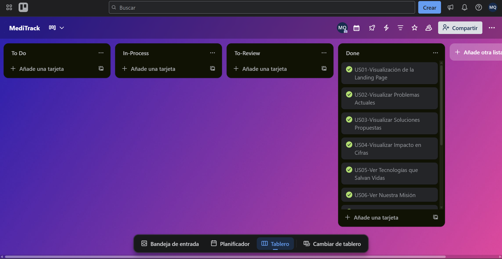
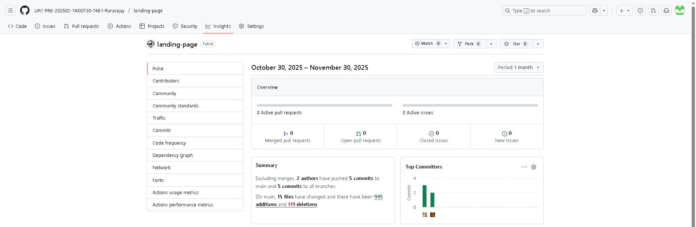

### UNIVERSIDAD PERUANA DE CIENCIAS APLICADAS

### Ingeniería de Software

### 5TO Ciclo

### Código: 1ASI0730

### Curso: Desarrollo de Aplicaciones Webs - Presencial

### NRC: 7461

### Docente: Ángel Augusto Velazques Nuñez

### Informe de Trabajo Final

### Startup: RurasqaySoft

### Producto: MediTrack

### Intregrantes:

<table>
  <thead>
    <tr>
      <th style="background-color: #333; color: #fff;">Apellidos y Nombres</th>
      <th style="background-color: #333; color: #fff;">Código de Alumno</th>
    </tr>
  </thead>
  <tbody>
    <tr>
      <td>Barrientos Quispe, Marcelo</td>
      <td>U20221E646</td>
    </tr>
    <tr>
      <td>Beingolea Montalvo, Sebastian Martin</td>
      <td>U202217853</td>
    </tr>
    <tr>
      <td>Cuba Pareja, Joaquin Antonio</td>
      <td>U201621281</td>
    </tr>
    <tr>
      <td>Rioja Nuñez, Franco Diego</td>
      <td>U202221597</td>
    </tr>
    <tr>
      <td>Rivera Ayala, Gabriel Alejandro</td>
      <td></td>
    </tr>
  </tbody>
</table>

## AGOSTO - 2025

# Registro de Versiones del Informe

# Project Report Collaboration Insights

# Contenido

## Tabla de Contenidos

- [Student Outcome](#student-outcome)

- [Capítulo I: Introducción](#capítulo-i-introducción)

- [1.1. Startup Profile](#11-startup-profile)
  - [1.1.1. Descripción de la Startup](#111-descripción-de-la-startup)
  - [1.1.2. Perfiles de integrantes del equipo](#112-perfiles-de-integrantes-del-equipo)
- [1.2. Solution Profile](#12-solution-profile)
  - [1.2.1. Antecedentes y problemática](#121-antecedentes-y-problemática)
  - [1.2.2. Lean UX Process](#122-lean-ux-process)
    - [1.2.2.1. Lean UX Problem Statement](#1221-lean-ux-problem-statement)
    - [1.2.2.2. Lean UX Assumptions](#1222-lean-ux-assumptions)
    - [1.2.2.3. Lean UX Hypothesis Statements](#1223-lean-ux-hypothesis-statements)
    - [1.2.2.4. Lean UX Canvas](#1224-lean-ux-canvas)
- [1.3. Segmentos objetivo](#13-segmentos-objetivo)

- [Capítulo II: Requirements Elicitation & Analysis](#capítulo-ii-requirements-elicitation--analysis)

- [2.1. Competidores](#21-competidores)
  - [2.1.1. Análisis competitivo](#211-análisis-competitivo)
  - [2.1.2. Estrategias y tácticas frente a competidores](#212-estrategias-y-tácticas-frente-a-competidores)
- [2.2. Entrevistas](#22-entrevistas)
  - [2.2.1. Diseño de entrevistas](#221-diseño-de-entrevistas)
  - [2.2.2. Registro de entrevistas](#222-registro-de-entrevistas)
  - [2.2.3. Análisis de entrevistas](#223-análisis-de-entrevistas)
- [2.3. Needfinding](#23-needfinding)
  - [2.3.1. User Personas](#231-user-personas)
  - [2.3.2. User Task Matrix](#232-user-task-matrix)
  - [2.3.3. User Journey Mapping](#233-user-journey-mapping)
  - [2.3.4. Empathy Mapping](#234-empathy-mapping)
- [2.4. Big Picture EventStorming](#24-big-picture-eventstorming)
- [2.5. Ubiquitous Language](#25-ubiquitous-language)

- [Capítulo III: Requirements Specification](#capítulo-iii-requirements-specification)

- [3.1. User Stories](#31-user-stories)
- [3.2. Impact Mapping](#32-impact-mapping)
- [3.4. Product Backlog](#34-product-backlog)

- [Capítulo IV: Product Design](#capítulo-iv-product-design)

- [4.1. Style Guidelines](#41-style-guidelines)
  - [4.1.1. General Style Guidelines](#411-general-style-guidelines)
  - [4.1.2. Web Style Guidelines](#412-web-style-guidelines)
- [4.2. Information Architecture](#42-information-architecture)
  - [4.2.1. Organization Systems](#421-organization-systems)
  - [4.2.2. Labeling Systems](#422-labeling-systems)
  - [4.2.3. SEO Tags and Meta Tags](#423-seo-tags-and-meta-tags)
  - [4.2.4. Searching Systems](#424-searching-systems)
  - [4.2.5. Navigation Systems](#425-navigation-systems)
- [4.3. Landing Page UI Design](#43-landing-page-ui-design)
  - [4.3.1. Landing Page Wireframe](#431-landing-page-wireframe)
  - [4.3.2. Landing Page Mock-up](#432-landing-page-mock-up)
- [4.4. Web Applications UX/UI Design](#44-web-applications-uxui-design)
  - [4.4.1. Web Applications Wireframes](#441-web-applications-wireframes)
  - [4.4.2. Web Applications Wireflow Diagrams](#442-web-applications-wireflow-diagrams)
  - [4.4.3. Web Applications Mock-ups](#443-web-applications-mock-ups)
  - [4.4.4. Web Applications User Flow Diagrams](#444-web-applications-user-flow-diagrams)
- [4.5. Web Applications Prototyping](#45-web-applications-prototyping)
- [4.6. Domain-Driven Software Architecture](#46-domain-driven-software-architecture)
  - [4.6.1. Software Architecture Context Diagram](#461-software-architecture-context-diagram)
  - [4.6.2. Software Architecture Container Diagrams](#462-software-architecture-container-diagrams)
  - [4.6.3. Software Architecture Components Diagrams](#463-software-architecture-components-diagrams)
- [4.7. Software Object-Oriented Design](#47-software-object-oriented-design)
  - [4.7.1. Class Diagrams](#471-class-diagrams)
- [4.8. Database Design](#48-database-design)
  - [4.8.1. Database Diagrams](#481-database-diagrams)

- [Capítulo V: Product Implementation, Validation & Deployment](#capítulo-v-product-implementation-validation--deployment)

- [5.1. Software Configuration Management](#51-software-configuration-management)
  - [5.1.1. Software Development Environment Configuration](#511-software-development-environment-configuration)
  - [5.1.2. Source Code Management](#512-source-code-management)
  - [5.1.3. Source Code Style Guide & Conventions](#513-source-code-style-guide--conventions)
  - [5.1.4. Software Deployment Configuration](#514-software-deployment-configuration)
- [5.2. Landing Page, Services & Applications Implementation](#52-landing-page-services--applications-implementation)
  - [5.2.1. Sprint 1](#521-sprint-1)
    - [5.2.1.1. Sprint Planning 1](#5211-sprint-planning-1)
    - [5.2.1.2. Aspect Leaders and Collaborators](#5212-aspect-leaders-and-collaborators)
    - [5.2.1.3. Sprint Backlog 1](#5213-sprint-backlog-1)
    - [5.2.1.4. Development Evidence for Sprint Review](#5214-development-evidence-for-sprint-review)
    - [5.2.1.5. Execution Evidence for Sprint Review](#5215-execution-evidence-for-sprint-review)
    - [5.2.1.6. Services Documentation Evidence for Sprint Review](#5216-services-documentation-evidence-for-sprint-review)
    - [5.2.1.7. Software Deployment Evidence for Sprint Review](#5217-software-deployment-evidence-for-sprint-review)
    - [5.2.1.8. Team Collaboration Insigths during Sprint](#5218-team-collaboration-insigths-during-sprint)
- [5.3. Validation Interviews](#53-validation-interviews)
  - [5.3.1. Diseño de Entrevistas](#531-diseño-de-entrevistas)
  - [5.3.2. Registro de Entrevistas](#532-registro-de-entrevistas)
  - [5.3.3. Evaluaciones según heurísticas](#533-evaluaciones-según-heurísticas)

- [Conclusiones](#conclusiones)
  - [Conclusiones y recomendaciones](#conclusiones-y-recomendaciones)
  - [Video About-the-Product](#video-about-the-product)

- [Bibliografía](#bibliografía)

- [Anexos](#anexos)

# Student Outcome

# Capítulo I: Introducción

## 1.1. Startup Profile

### 1.1.1. Descripción de la Startup

### 1.1.2. Perfiles de integrantes del equipo

## 1.2. Solution Profile

### 1.2.1. Antecedentes y problemática

### 1.2.2. Lean UX Process

#### 1.2.2.1. Lean UX Problem Statement.

#### 1.2.2.2. Lean UX Assumptions.

#### 1.2.2.3. Lean UX Hypothesis Statements.

#### 1.2.2.4. Lean UX Canvas

## 1.3. Segmentos objetivo

# Capítulo II: Requirements Elicitation & Analysis

## 2.1. Competidores

### 2.1.1. Análisis competitivo

### 2.1.2. Estrategias y tácticas frente a competidores

## 2.2. Entrevistas

### 2.2.1. Diseño de entrevistas

### 2.2.2. Registro de entrevistas

### 2.2.3. Análisis de entrevistas

## 2.3. Needfinding

### 2.3.1. User Personas

### 2.3.2. User Task Matrix

### 2.3.3. User Journey Mapping

### 2.3.4. Empathy Mapping

## 2.4. Big Picture EventStorming

## 2.5. Ubiquitous Language

# Capítulo III: Requirements Specification

## 3.1. User Stories

## 3.2. Impact Mapping

## 3.4. Product Backlog

# Capítulo IV: Product Design

## 4.1. Style Guidelines

### 4.1.1. General Style Guidelines

### 4.1.2. Web Style Guidelines

## 4.2. Information Architecture

### 4.2.1. Organization Systems

### 4.2.2. Labeling Systems

### 4.2.3. SEO Tags and Meta Tags

### 4.2.4. Searching Systems

### 4.2.5. Navigation Systems

## 4.3. Landing Page UI Design

### 4.3.1. Landing Page Wireframe

### 4.3.2. Landing Page Mock-up

## 4.4. Web Applications UX/UI Design

### 4.4.1. Web Applications Wireframes

### 4.4.2. Web Applications Wireflow Diagrams

### 4.4.3. Web Applications Mock-ups

### 4.4.4. Web Applications User Flow Diagrams

## 4.5. Web Applications Prototyping

## 4.6. Domain-Driven Software Architecture

### 4.6.1. Software Architecture Context Diagram

### 4.6.2. Software Architecture Container Diagrams

### 4.6.3. Software Architecture Components Diagrams

## 4.7. Software Object-Oriented Design

### 4.7.1. Class Diagrams

## 4.8. Database Design

### 4.8.1. Database Diagrams

# Capítulo V: Product Implementation, Validation & Deployment

## 5.1. Software Configuration Management

### 5.1.1. Software Development Environment Configuration

#### Gestión de Proyecto (Project Management)

**GitHub Pages**: Servicio en línea que permite publicar sitios web directamente desde un repositorio de GitHub. Brinda una manera sencilla de compartir documentación y proyectos, favoreciendo la colaboración y el acceso público o privado a los contenidos.  
**Ruta de acceso:** [https://pages.github.com](https://pages.github.com)

#### Gestión de Requisitos (Requirements Management)

**Trello**: Herramienta en línea que permite organizar actividades, asignar tareas y dar seguimiento al progreso del equipo. Se usará para coordinar las responsabilidades y controlar el avance de sprints e historias de usuario.  
**Ruta de acceso:** [https://trello.com/es](https://trello.com/es)

#### Diseño de UX/UI del Producto (Product UX/UI Design)

**Figma**: Plataforma colaborativa para diseñar interfaces y prototipos gráficos. Se utilizará para crear las versiones Desktop y Mobile de la aplicación.  
**Ruta de acceso:** [https://www.figma.com/login](https://www.figma.com/login)

**Overflow**: Aplicación especializada en la creación de diagramas de flujo y wireflows, útil para representar la experiencia del usuario en el sistema.  
**Ruta de acceso:** [https://overflow.io](https://overflow.io)

---

#### Desarrollo de Software (Software Development)

**Visual Studio Code**: Editor de código versátil empleado para programar y compilar, gracias a su compatibilidad con múltiples lenguajes y extensiones.  
**Ruta de acceso:** [https://code.visualstudio.com](https://code.visualstudio.com)

**WebStorm**: IDE para desarrollo en JavaScript y TypeScript, que ofrece potentes herramientas de refactorización y navegación.  
**Ruta de acceso:** [https://www.jetbrains.com/webstorm](https://www.jetbrains.com/webstorm)

**IntelliJ IDEA**: Entorno de desarrollo avanzado diseñado para proyectos en Java y Kotlin, fundamental en la construcción de componentes del sistema.  
**Ruta de acceso:** [https://www.jetbrains.com/idea](https://www.jetbrains.com/idea)

**HTML5**: Lenguaje de marcado utilizado para estructurar y dar forma al contenido web.  
**Ruta de acceso:** [https://developer.mozilla.org/en-US/docs/Web/HTML](https://developer.mozilla.org/en-US/docs/Web/HTML)

**CSS**: Lenguaje de estilos para definir la presentación visual de las páginas web, garantizando una experiencia de usuario consistente.  
**Ruta de acceso:** [https://developer.mozilla.org/en-US/docs/Web/CSS](https://developer.mozilla.org/en-US/docs/Web/CSS)

**JavaScript**: Lenguaje de programación que habilita la interactividad en las interfaces web, esencial para la dinámica del sistema.  
**Ruta de acceso:** [https://developer.mozilla.org/en-US/docs/Web/JavaScript](https://developer.mozilla.org/en-US/docs/Web/JavaScript)

**Vue.js**: Framework progresivo de JavaScript para construir interfaces de usuario interactivas y aplicaciones de una sola página.  
**Ruta de acceso**: [https://vuejs.org](https://vuejs.org)

**C#**: Lenguaje de programación orientado a objetos desarrollado por Microsoft, utilizado para crear aplicaciones modernas, seguras y escalables en diferentes plataformas.  
**Ruta de acceso**: [https://learn.microsoft.com/dotnet/csharp](https://learn.microsoft.com/dotnet/csharp)

**.NET**: Framework de desarrollo multiplataforma de Microsoft que permite construir aplicaciones web, de escritorio, móviles, servicios en la nube y más.  
**Ruta de acceso**: [https://dotnet.microsoft.com](https://dotnet.microsoft.com)

---

#### Despliegue de Software (Software Deployment)

**Git**: Sistema de control de versiones que permite registrar cambios en el código, colaborar en equipo y mantener un historial completo del proyecto.  
**Ruta de acceso:** [https://git-scm.com](https://git-scm.com)

---

#### Documentación del Software (Software Documentation)

**Markdown**: Sintaxis ligera de marcado que facilita la creación de documentación clara y legible, especialmente en repositorios colaborativos.  
**Ruta de acceso:** [https://www.markdownguide.org](https://www.markdownguide.org)

**GitHub Pages**: Herramienta integrada en GitHub que permite publicar documentación y sitios web directamente desde un repositorio, ofreciendo una forma sencilla y gratuita de compartir contenidos en línea.  
**Ruta de acceso:** [https://pages.github.com](https://pages.github.com)

**Structurizr**: Modelado arquitectónico como código: Structurizr permite definir un modelo arquitectónico en un lenguaje de dominio específico (DSL) y luego generar múltiples diagramas (C4, contexto, contenedores, componentes) desde ese modelo único. Además, puede combinarse con documentación y registros de decisiones arquitectónicas embebidos.  
**Ruta de acceso**: [https://structurizr.com](https://structurizr.com)

**Lucidchart** Herramienta colaborativa basada en la web para la creación de diagramas técnicos (UML, ERD, procesos, arquitectura). Permite colaboración en tiempo real, importación de datos, plantillas para distintos tipos de diagramas y edición visual.  
**Ruta de acceso**: [https://www.lucidchart.com](https://www.lucidchart.com)

### 5.1.2. Source Code Management

GitHub será la herramienta principal para el control de versiones del proyecto. En este espacio se presentarán los enlaces a los repositorios correspondientes a la documentación, el informe y la página de aterrizaje (Landing Page).

#### URL de Repositorios

- **Documentación e Informe**: [https://github.com/UPC-PRE-202502-1ASI0730-7461-Rurasqay/report](https://github.com/UPC-PRE-202502-1ASI0730-7461-Rurasqay/report)
- **Landing Page**: [https://github.com/UPC-PRE-202502-1ASI0730-7461-Rurasqay/landing-page](https://github.com/UPC-PRE-202502-1ASI0730-7461-Rurasqay/landing-page)

Cada repositorio contendrá todos los archivos relacionados con el proyecto.

#### Modelo de GitFlow

**GitFlow** se adoptará como la estrategia de ramificación del proyecto, garantizando una gestión ordenada de las ramas y una integración continua y eficiente entre los desarrolladores.


#### Ramas principales

- **Master (`master`)**  
  Rama principal del proyecto. Aquí siempre estará el código estable y listo para ser desplegado en producción.

- **Desarrollo (`develop`)**  
  Rama destinada al trabajo de desarrollo. Todas las mejoras y nuevas funcionalidades se integran primero aquí antes de pasar a `main`.

- **Funcionalidades (`feature`)**  
  Cada nueva característica se desarrolla en una rama independiente creada a partir de `develop`.  
  Convención: `feature/nombre-de-la-funcionalidad`  
  Ejemplo: `feature/ch1-target-segment`

- **Liberaciones (`release`)**  
  Se crean a partir de `develop` para preparar una nueva versión estable.  
  En estas ramas se corrigen errores menores, se hacen pruebas finales y se documenta el código previo al lanzamiento.  
  Convención: `release/version`  
  Ejemplo: `release/v1.0.0`

- **Correcciones urgentes (`hotfix`)**  
  Usadas para solucionar errores críticos detectados en producción. Estas ramas parten de `main`.  
  Convención: `hotfix/nombre-de-la-corrección`  
  Ejemplo: `hotfix/imagen-bug`

---

#### Convenciones para Versiones

Se utilizará **Semantic Versioning (SemVer)** para todas las versiones publicadas, siguiendo el formato:  
`MAJOR.MINOR.PATCH` (por ejemplo: `1.0.0`).

---

#### Convenciones para Commits

Se seguirá el estándar **Conventional Commits** para garantizar claridad y consistencia en los mensajes:

- `feat`: Introducción de nuevas características.
- `fix`: Solución de errores.
- `docs`: Modificaciones en la documentación.
- `style`: Cambios de formato sin afectar la lógica.
- `refactor`: Reestructuración del código sin alterar su comportamiento.
- `test`: Creación o modificación de pruebas.
- `chore`: Tareas de mantenimiento.

### 5.1.3. Source Code Style Guide & Conventions

#### HTML

**Estándares base**  
Adoptamos **W3Schools – HTML5 Syntax** y la **Google HTML/CSS Style Guide** para garantizar legibilidad, consistencia y mantenibilidad del marcado. Estas pautas cubren estructura del documento, semántica, formato, atributos, accesibilidad y validación.

**Formato y espacios**

- **Indentación:** 2 espacios por nivel (no tabs).
- **Líneas y ancho:** evitar superar ~**80–100** caracteres; divide atributos largos o listas de clases extensas.
- **Espacios en etiquetas:** no incluir espacios antes de `>` ni entre el nombre de la etiqueta y `>`; deja un **espacio** entre el nombre de atributo y `=` y entre pares de atributos.
  ```html
  <!-- Correcto -->
  <input type="email" name="userEmail" required />
  <!-- Incorrecto -->
  <input type="email" name="userEmail" required />
  ```
- **Mayúsculas/minúsculas:** etiquetas y atributos **en minúsculas**; valores literales consistentes (comillas dobles).

**Sentencias y bloques**

- **Estructura mínima válida:** `<!DOCTYPE html>`, `<html lang="...">`, `<head>`, `<meta charset="utf-8">`, `<meta name="viewport"...>`, `<title>`, `<body>`.
- **Cierre de etiquetas:** cerrar correctamente todos los elementos no vacíos. No usar barra de cierre en elementos **void** (p. ej., ``, `<br>`, `<hr>`, `<meta>`, `<link>`).
  ```html
  <!-- Correcto -->
  
  <!-- Incorrecto (XHTML autocierre no requerido en HTML5) -->
  
  ```
- **Anidación:** seguir el orden semántico correcto; no superponer etiquetas.

**Comentarios**

- Comentar secciones lógicas del documento con claridad y sin exceso.
  ```html
  <!-- =======================================
       Cabecera del sitio
     ======================================= -->
  ```
- No comentar código muerto; elimínalo o justifica su permanencia.

**Nomenclatura y declaraciones**

- **Atributos booleanos** sin valor redundante: `required`, `disabled`, `checked` (no `required="required"`).
- **Orden de atributos:** prioriza legibilidad; sugerido: `id`, `class`, `name`, `data-*`, `type`, `href/src`, `alt`, `aria-*`, `role`.
- **Clases:** en minúsculas y con guiones (`.site-header`, `.hero-title`). Evita IDs salvo para anclas o integración con scripts.
- **Rutas y archivos:** nombres en minúsculas, sin espacios; usa `-` para separar palabras: `about-us.html`, `user-profile.jpg`.

**Strings y literales**

- En atributos, usa **comillas dobles** y escapa correctamente entidades cuando incrustes texto en atributos (`&quot;`, `&amp;`).
- Usa entidades para símbolos especiales cuando sea necesario (`&copy;`, `&nbsp;`, `&lt;`, `&gt;`).

**Funciones y callbacks**

- **Evita `onclick` y otros manejadores inline**. Separa el comportamiento en archivos JS y añade listeners desde el script.
- No incrustes bloques de `<script>` largos en el HTML; referencia archivos externos y colócalos al final del `<body>` o con `defer`.

**Bucles y condicionales**

- (No aplican directamente al HTML). En motores de plantillas, mantén la lógica mínima y deja la presentación al HTML/CSS.

**Etiquetas (estructura semántica)**

- Emplea **etiquetas semánticas**: `header`, `nav`, `main`, `section`, `article`, `aside`, `footer`, `figure/figcaption`.
- Usa `ul/ol` para listas, `dl` para definiciones, y tablas (`table`, `thead`, `tbody`, `th`, `td`, `caption`) **solo para datos tabulares**.
- Para formularios, agrupa con `form`, `fieldset`, `legend`, y asocia etiquetas con `label for`/`id`.

**Web APIs y seguridad**

- Proveer **atributos `alt`** descriptivos en `img`. Si la imagen es decorativa, `alt=""`.
- En enlaces externos, usa `rel="noopener noreferrer"` cuando apliques `target="_blank"`.
- No incrustes HTML no confiable; sanitiza contenido dinámico del lado del servidor.

**Accesibilidad (a11y)**

- Añadir `lang` al elemento `<html>` y metadatos adecuados.
- Mantener un **orden de encabezados** lógico (`h1`–`h6`) y un **único `h1`** por página.
- Asegurar **foco visible**, etiquetas `label` asociadas y `aria-*` solo cuando sea necesario (no para sustituir semántica nativa).
- Usar `title` descriptivo y `meta`/landmarks correctos para navegación asistida.

**Ejemplo breve**

```html
<!DOCTYPE html>
<html lang="es">
  <head>
    <meta charset="utf-8" />
    <meta name="viewport" content="width=device-width, initial-scale=1" />
    <title>Mi página accesible</title>
    <link rel="stylesheet" href="/assets/styles.css" />
  </head>
  <body>
    <!-- =======================================
         Cabecera
       ======================================= -->
    <header class="site-header" role="banner">
      <h1 class="site-title">Marca</h1>
      <nav class="site-nav" aria-label="Principal">
        <ul>
          <li><a href="/">Inicio</a></li>
          <li><a href="/productos.html">Productos</a></li>
          <li><a href="/contacto.html">Contacto</a></li>
        </ul>
      </nav>
    </header>

    <main id="main" class="site-main">
      <article class="hero">
        <h2 class="hero-title">Bienvenido</h2>
        <p>Contenido introductorio.</p>
        <figure>
          
          <figcaption>Tu compañía, en cualquier dispositivo.</figcaption>
        </figure>
      </article>
    </main>

    <footer class="site-footer" role="contentinfo">
      <p>&copy; 2025 Mi Compañía</p>
    </footer>

    <script src="/assets/app.js" defer></script>
  </body>
</html>
```

#### CSS

**Estándares base**  
Adoptamos la **Google HTML/CSS Style Guide** para asegurar legibilidad, consistencia y mantenibilidad del código CSS en el equipo. Estas pautas cubren formato, nomenclatura, organización, especificidad, modularidad y buenas prácticas para desarrollo web colaborativo.

**Formato y espacios**

- **Indentación:** 2 espacios por nivel de anidación (no tabs).
- **Llaves y líneas:** llave de apertura en la misma línea del selector (con un espacio antes) y llave de cierre en línea nueva alineada con el selector.
- **Una declaración por línea** y **un selector por línea** cuando se usen listas de selectores.
- **Espacios:** un espacio después de `:` en cada propiedad y después de comas en funciones (`rgba(0, 0, 0, 0.5)`).
- **Punto y coma final:** todas las declaraciones terminan con `;`, incluida la última.
- **Separación visual:** dejar una línea en blanco entre bloques de reglas.
- **Longitud de línea:** evitar superar ~**80–100** caracteres; dividir listas de selectores o valores largos.

**Sentencias y bloques**

- **Bloques de reglas:** agrupar propiedades relacionadas y mantener un **orden lógico** (posición/modelo de caja → tipografía → color/visual).
- **Selectores múltiples:** separar con comas y colocar **cada selector en una línea** para legibilidad.
- **Especificidad moderada:** evitar encadenamientos profundos; máximo **3 niveles**. Preferir clases sobre IDs.
- **No usar `!important`** salvo excepciones documentadas y justificadas.
- **Evitar estilos en línea**; centralizar estilos en hojas `.css`/`.scss`.

**Comentarios**

- Encabezar secciones con bloques delimitados, por ejemplo:
  ```css
  /* ==========================================================================
     Componentes
     ========================================================================== */
  ```
- Comentar decisiones no obvias (hacks, compatibilidad, razones de diseño).
- Evitar comentarios superfluos; los nombres semánticos deben explicar el propósito.

**Nomenclatura y declaraciones**

- **Clases en minúsculas con guiones** (`.product-card`, `.main-header`). Evitar nombres genéricos (`.red`, `.center`).
- **Convención recomendada:** **BEM** (Block**Element--Modifier), p. ej. `.card**title--highlighted`.
- **Evitar IDs** como selectores en CSS para mejorar reutilización y reducir especificidad.
- **Una regla por responsabilidad:** mantener componentes/modularidad; evitar reglas monolíticas.
- **Importaciones:** usar `@import` (si aplica) o mejor un **bundler** (PostCSS/Sass) para concatenar/minificar en build.

**Strings y literales**

- **Comillas dobles** para strings: `content: "";` `font-family: "Roboto", sans-serif;`
- **Colores:** hex en minúsculas (`#fff`), `rgb()/rgba()` o `hsl()/hsla()` cuando mejore la claridad. Preferir **variables CSS** `var(--color-primary)`.
- **Unidades:** omitir unidades en cero (`0` en lugar de `0px`). Usar unidades **relativas** (`rem`, `em`, `%`) para tipografía y espaciado flexible.
- **Shorthand:** usar abreviados solo si no se pierde intención (p. ej., `margin: 10px 0;`).

**Funciones y callbacks**

- **Funciones CSS:** usar `calc()`, `min()`, `max()`, `clamp()` con espacios alrededor de operadores para legibilidad (`calc(100% - 2rem)`).
- **Variables (custom properties):** definir en ámbitos predecibles (`:root`) y documentar su propósito.
- **Compatibilidad:** evitar prefijos manuales; usar **Autoprefixer** en la build.

**Bucles y condicionales**

- En **preprocesadores** (Sass/SCSS), limitar anidación a **máx. 3 niveles** y evitar lógica compleja. Mantener reglas simples y predecibles.
- **Cascada y herencia:** diseñar pensando en la cascada; no depender de especificidad alta para “ganar” estilos.

**Objetos y arreglos**

- **Arquitectura de componentes:** separar **base**, **componentes**, **layout**, **utilidades**.
- **Utilidades atómicas** (opcional): clases pequeñas y reutilizables (`.mt-2`, `.text-center`) si el equipo las adopta de forma consistente.
- **Estructura recomendada del archivo/proyecto:**
  1. Variables y tokens de diseño
  2. Reset/Normalize
  3. Elementos base (html, body, headings, links)
  4. Layout (grid, contenedores)
  5. Componentes (botones, cards, modales)
  6. Utilidades y helpers

**Logs y diagnóstico**

- **Depuración visual:** usar `outline: 1px dashed` temporalmente para diagnosticar layout; **remover antes de producción**.
- **Herramientas:** apoyarse en DevTools para auditoría de cascada y especificidad. Evitar dejar reglas “debug” en commits.

**Web APIs y seguridad (cuando aplica)**

- Evitar estilos embebidos por JavaScript que podrían introducir inconsistencias; preferir añadir/remover **clases** controladas.
- Cuidar temas de **accesibilidad** (contraste, `prefers-reduced-motion`, tamaños relativos, estados `:focus` visibles).

**Asincronía**

- _No aplica directamente a CSS_. Si se cargan estilos de forma diferida, documentar el comportamiento (p. ej., `media="print"` + `onload`).

**Ejemplo breve**

```css
/* Base */
:root {
  --color-primary: #0a84ff;
}

html {
  font-size: 16px;
}

body {
  margin: 0;
  color: #333;
  background-color: #fff;
  font-family:
    "Inter",
    system-ui,
    -apple-system,
    Segoe UI,
    Roboto,
    sans-serif;
}

/* Componente */
.button {
  display: inline-block;
  padding: 0.5rem 1rem;
  border: 0;
  border-radius: 4px;
  background-color: var(--color-primary);
  color: #fff;
  text-decoration: none;
}

.button:hover {
  background-color: #006edb;
}
.button:focus {
  outline: 2px solid #000;
  outline-offset: 2px;
}
```

#### JS

**Estándares base**  
Usamos las “JavaScript Coding Conventions” de W3Schools y las “Guidelines for writing JavaScript code examples” de MDN para asegurar legibilidad, consistencia y mantenibilidad del código. Estas guías cubren nombres, espacios en blanco, indentación, sentencias, comentarios y prácticas modernas del lenguaje.

**Formato y espacios**

- **Espacios alrededor de operadores y después de comas**.  
  _Ej:_ `let total = a + b;` · `const cars = ["Volvo", "Saab", "Fiat"];`
- **Indentación**: 2 espacios (no tabs).
- **Longitud de línea**: evita superar **80** caracteres; si es necesario, divide tras coma u operador.
- **Formateador**: para consistencia automática, adoptar **Prettier** con una configuración compartida del repositorio.

**Sentencias y bloques**

- **Punto y coma**: terminar **siempre** las sentencias simples con `;`.
- **Llaves en compuestos**: llave de apertura al final de la primera línea (con un espacio antes) y cierre en línea nueva; no terminar el bloque con `;`.
- **Control de flujo**: si un `if` termina con `return`, **omite** el `else` y continúa después.

**Comentarios**

- **Usa comentarios de línea** (`//`) y evita `/* ... */` para bloques; cada línea comentada debe iniciar con `//`. Añade un espacio tras `//` y escribe frases claras.
- **Comentarios de salida**: cuando uses `console.log()` en ejemplos, puedes anotar el **resultado esperado** al final de la línea para facilitar la lectura.
- **Elipsis**: si omites partes del ejemplo, marca con `// …` para mantener el código **válido** al copiar/pegar.

**Nomenclatura y declaraciones**

- **camelCase** para variables y funciones; evita guiones en identificadores; **UPPER_CASE** para constantes globales cuando aplique.
- **Una variable por línea** para claridad y para evitar globals implícitas por asignaciones encadenadas.
- **`const` y `let` en lugar de `var`**; prefiere `const` si no hay reasignación.
- **Evita coerciones implícitas** como `+val` o `"" + val`; usa `Number(val)` y `String(val)`.

**Strings y literales**

- **Template literals** para interpolación y evitar errores de espaciado: `` `Hola, ${name}` ``.  
  Si no hay sustituciones, usa string literal normal.

**Funciones y callbacks**

- **Prefiere declaraciones de función** sobre expresiones asignadas, cuando sea posible.
- **Callbacks**: usa **arrow functions** cuando no necesites `this`. Prefiere **return implícito** si cabe en una expresión.
- **Métodos/identificadores**: evita asignar funciones a identificadores con `=>` para métodos; usa `function` cuando definas métodos.

**Bucles y condicionales**

- Para iterar colecciones, **prefiere** `for...of` o `.forEach()` a `for(;;)`; declara el iterador con `const`/`let` correctamente.
- **Atajos booleanos**: usa `if (x)` y `if (!x)` en lugar de comparar con `true`/`false`, salvo que manejes explícitamente truthy/falsy.

**Objetos y arreglos**

- **Objetos**: llave de apertura en la misma línea; `prop: valor` con un espacio tras `:`; sin coma final; cierra en línea nueva y termina con `;`. Los objetos cortos pueden ir en una sola línea si conservan espacios.
- **Arreglos**: espacio después de cada coma.

**Logs y diagnóstico**

- Usa `console.log()` para mensajes y `console.error()` para errores; en ejemplos estáticos, anota la salida esperada como comentario de fin de línea.

**Web APIs y seguridad (cuando se manipula DOM)**

- **Evita `innerHTML`** para insertar **texto**; usa `textContent` para reducir riesgos XSS.
- **Evita APIs obsoletas**; prefiere alternativas modernas (p.ej., `fetch()` sobre XHR).

**Asincronía**

- **Prefiere `async/await`** sobre Promesas encadenadas cuando sea posible; evita `top-level await` fuera de ES Modules.

#### GERKHIN

Se utilizó el lenguaje Gherkin para redactar escenarios de las User Stories, empleando palabras clave como:

- Given

- When

- Then

- And

### 5.1.4. Software Deployment Configuration

#### Despliegue de la Landing Page

El despliegue de la Landing Page se realizó utilizando **GitHub Pages**, aprovechando su simplicidad y accesibilidad.  
El archivo `index.html` fue definido como el punto de entrada principal del sitio.


- **Landing URL**: [https://upc-pre-202502-1asi0730-7461-rurasqay.github.io/landing-page/](https://upc-pre-202502-1asi0730-7461-rurasqay.github.io/landing-page/)

## 5.2. Landing Page, Services & Applications Implementation

### 5.2.1. Sprint 1

Durante el Sprint 1 del proyecto MediTrack, el equipo de RurasqaySoft se enfocó en el diseño y desarrollo funcional de la Landing Page de la plataforma. Se implementaron las secciones principales como el mensaje de bienvenida, los botones de registro y navegación y la información de contacto. También se trabajó en aspectos de interacción, incluyendo la fijación del encabezado al hacer scroll y una presentación atractiva de la propuesta de valor. El equipo logró finalizar todas las tareas planificadas, priorizando siempre la navegación fluida, la accesibilidad y la claridad en la comunicación con los nuevos usuarios. RurasqaySoft implementó la totalidad de las funcionalidades de la Landing Page y realizó el diseño completo de la misma, incorporando llamados a la acción (CTA), diseño responsive, sección de planes, testimonios, preguntas frecuentes y una navegación optimizada y fluida, concluyendo con éxito todo lo necesario para garantizar una mejor experiencia de usuario.

#### 5.2.1.1. Sprint Planning 1

# Sprint 1

| **Sprint #** | Sprint 1 |
| ------------ | -------- |

| **Sprint Planning Background** |                                                                               |
| ------------------------------ | ----------------------------------------------------------------------------- |
| **Date**                       | 1 de septiembre del 2025                                                      |
| **Time**                       | 10:00 PM                                                                      |
| **Location**                   | Vía Discord                                                                   |
| **Prepared By**                | Barrientos Quispe Marcelo                                                     |
| **Attendees (to planning)**    | Franco Diego, Rioja Gabriel, Rivera Juaquin, Cuba Parejo, Sebastián Beingolea |

---

| **Sprint 1 – Review Summary**        | El equipo logró publicar la primera versión de la **Landing Page de MediTrack** en GitHub Pages, incluyendo las secciones principales de bienvenida, misión, visión, planes, formulario de contacto y preguntas frecuentes. Se alcanzó la meta de contar con un entorno de despliegue operativo que permite validar la propuesta de valor y facilita la interacción inicial con los usuarios. |
| ------------------------------------ | --------------------------------------------------------------------------------------------------------------------------------------------------------------------------------------------------------------------------------------------------------------------------------------------------------------------------------------------------------------------------------------------- |
| **Sprint 1 – Retrospective Summary** | El equipo identificó como fortaleza la capacidad de entrega en el tiempo planificado y el compromiso demostrado en el desarrollo de la landing. Sin embargo, se reconoció la necesidad de mejorar la coordinación en la integración de cambios y reforzar la comunicación interna para optimizar la colaboración en próximos sprints.                                                         |

---

| **Sprint Goal & User Stories** |                                                                                                                                                                                                                                                                                                              |
| ------------------------------ | ------------------------------------------------------------------------------------------------------------------------------------------------------------------------------------------------------------------------------------------------------------------------------------------------------------ |
| **Sprint 1 Goal**              | Nuestro objetivo fue diseñar, desarrollar y desplegar la Landing Page de MediTrack con una experiencia visual clara, navegación fluida y compatibilidad responsive. Buscamos validar la propuesta de valor inicial y brindar a los usuarios un acceso confiable a la información principal de la plataforma. |
| **Sprint 1 Velocity**          | 18                                                                                                                                                                                                                                                                                                           |
| **Sum of Story Points**        | 18                                                                                                                                                                                                                                                                                                           |

#### 5.2.1.2. Aspect Leaders and Collaborators

| Nombre             | GitHub User  | Crear landing page principal | Mostrar problemas de geriatría | Mostrar soluciones tecnológicas | Mostrar indicadores de impacto | Mostrar lista de tecnologías | Mostrar misión institucional | Mostrar visión a futuro | Crear sección plan gratuito | Crear sección plan premium | Crear sección plan enterprise | Crear formulario de contacto | Mostrar información de contacto |
| ------------------ | ------------ | ---------------------------- | ------------------------------ | ------------------------------- | ------------------------------ | ---------------------------- | ---------------------------- | ----------------------- | --------------------------- | -------------------------- | ----------------------------- | ---------------------------- | ------------------------------- |
| Joaquín Cuba       | joacuba      | L                            | L                              | L                               | L                              | C                            | C                            | C                       | C                           | C                          | C                             | C                            | C                               |
| Marcelo Barrientos | MarceBq      | C                            | C                              | C                               | C                              | L                            | L                            | L                       | C                           | C                          | C                             | C                            | C                               |
| Sebastian Montalvo | sebaxchen    | C                            | C                              | C                               | C                              | C                            | C                            | C                       | L                           | L                          | C                             | C                            | C                               |
| Gabriel Rivera     | guestwhoo    | C                            | C                              | C                               | C                              | C                            | C                            | C                       | C                           | C                          | L                             | L                            | C                               |
| Diego Rioja        | FrancoDiegoR | C                            | C                              | C                               | C                              | C                            | C                            | C                       | C                           | C                          | C                             | C                            | L                               |

#### 5.2.1.3. Sprint Backlog 1

Durante el primer sprint backlog, el equipo de MediTrack tuvo como objetivo principal diseñar y completar la Landing Page. Para la organización y gestión de los miembros se utilizó Trello, lo que permitió dividir las user stories en tareas manejables y asignarlas a cada integrante según sus habilidades. El propósito de este sprint fue construir en su totalidad la landing page, asegurando que fuera atractiva, funcional y alineada con la propuesta de valor de MediTrack.



Enlace del Panel de Trello: [https://trello.com/invite/b/68ce4ba3a9cf2239270c2cd3/ATTI8d7ced15e22c90258829bd96cb36bae55FF3F4E7/1asi0729-7394-meditrack](https://trello.com/invite/b/68ce4ba3a9cf2239270c2cd3/ATTI8d7ced15e22c90258829bd96cb36bae55FF3F4E7/1asi0729-7394-meditrack)

| Sprint # | Sprint 1 |
| -------- | -------- |

| US-ID | Title                               | ID   | Title                           | Description                                                                | Estimation (Hours) | Assigned To        | Status |
| ----- | ----------------------------------- | ---- | ------------------------------- | -------------------------------------------------------------------------- | ------------------ | ------------------ | ------ |
| US01  | Visualización de la Landing Page    | UT01 | Crear landing page principal    | Como visitante, quiero acceder a la landing page para conocer la solución. | 6                  | Joaquín Cuba       | Done   |
| US02  | Visualizar Problemas Actuales       | UT02 | Mostrar problemas de geriatría  | Como familiar, quiero ver los problemas actuales en el cuidado geriátrico. | 5                  | Joaquín Cuba       | Done   |
| US03  | Visualizar Soluciones Propuestas    | UT03 | Mostrar soluciones tecnológicas | Como médico, quiero ver las soluciones tecnológicas de MediTrack.          | 7                  | Joaquín Cuba       | Done   |
| US04  | Visualizar Impacto en Cifras        | UT04 | Mostrar indicadores de impacto  | Como visitante, quiero ver indicadores de impacto.                         | 4                  | Joaquín Cuba       | Done   |
| US05  | Ver Tecnologías que Salvan Vidas    | UT05 | Mostrar lista de tecnologías    | Como enfermero, quiero conocer los sensores y dispositivos.                | 8                  | Marcelo Barrientos | Done   |
| US06  | Ver Nuestra Misión                  | UT06 | Mostrar misión institucional    | Como familiar, quiero entender la misión de MediTrack.                     | 3                  | Marcelo Barrientos | Done   |
| US07  | Ver Nuestra Visión                  | UT07 | Mostrar visión a futuro         | Como médico, quiero conocer la visión a futuro de MediTrack.               | 4                  | Marcelo Barrientos | Done   |
| US08  | Consultar Plan Gratuito             | UT08 | Crear sección plan gratuito     | Como visitante, quiero ver el plan gratuito.                               | 5                  | Sebastian Montalvo | Done   |
| US09  | Consultar Plan Premium              | UT09 | Crear sección plan premium      | Como allegado, quiero ver el plan premium.                                 | 6                  | Sebastian Montalvo | Done   |
| US10  | Consultar Plan Enterprise           | UT10 | Crear sección plan enterprise   | Como médico o institución, quiero ver el plan enterprise.                  | 5                  | Gabriel Rivera     | Done   |
| US11  | Acceder al Formulario de Contacto   | UT11 | Crear formulario de contacto    | Como visitante, quiero llenar un formulario.                               | 6                  | Gabriel Rivera     | Done   |
| US12  | Información de Contacto Alternativa | UT12 | Mostrar información de contacto | Como médico, quiero ver datos de contacto directo.                         | 3                  | Franco Rioja       | Done   |

#### 5.2.1.4. Development Evidence for Sprint Review

| Repository                                                            | Branch  | Commit Id | Commit Message                                                                                  | Commit Message Body                                | Committed on (Date) |
| --------------------------------------------------------------------- | ------- | --------- | ----------------------------------------------------------------------------------------------- | -------------------------------------------------- | ------------------- |
| https://github.com/UPC-PRE-202502-1ASI0730-7461-Rurasqay/landing-page | main    | 130fcc9   | chore: added .gitignore file                                                                    | chore: added .gitignore file                       | 17/09/25            |
| https://github.com/UPC-PRE-202502-1ASI0730-7461-Rurasqay/landing-page | main    | 4a7ec75   | docs: add readme and license                                                                    | docs: add readme and license                       | 17/09/25            |
| https://github.com/UPC-PRE-202502-1ASI0730-7461-Rurasqay/landing-page | main    | 1b2f145   | chore: added boostrap base file styles and assets                                               | chore: added boostrap base file styles and assets  | 17/09/25            |
| https://github.com/UPC-PRE-202502-1ASI0730-7461-Rurasqay/landing-page | main    | 49ce789   | feat(hero): added hero section                                                                  | feat(hero): added hero section                     | 17/09/25            |
| https://github.com/UPC-PRE-202502-1ASI0730-7461-Rurasqay/landing-page | main    | 05bcfad   | Merge pull request #1 from UPC-PRE-202502-1ASI0730-7461-Rurasqay/feature/hero-section           | First Merge                                        | 17/09/25            |
| https://github.com/UPC-PRE-202502-1ASI0730-7461-Rurasqay/landing-page | main    | 13b2e61   | feat(services): added services section                                                          | feat(services): added services section             | 17/09/25            |
| https://github.com/UPC-PRE-202502-1ASI0730-7461-Rurasqay/landing-page | main    | fb9e6b7   | Merge pull request #2 from UPC-PRE-202502-1ASI0730-7461-Rurasqay/feature/service-section        | Second Merge                                       | 18/09/25            |
| https://github.com/UPC-PRE-202502-1ASI0730-7461-Rurasqay/landing-page | main    | 4c5682b   | feat(mission-vision): added mission vision section                                              | feat(mission-vision): added mission vision section | 18/09/25            |
| https://github.com/UPC-PRE-202502-1ASI0730-7461-Rurasqay/landing-page | main    | c888dbb   | Merge pull request #3 from UPC-PRE-202502-1ASI0730-7461-Rurasqay/feature/mission-vision-section | Third Merge                                        | 18/09/25            |
| https://github.com/UPC-PRE-202502-1ASI0730-7461-Rurasqay/landing-page | develop | 2710bbe   | fix: fix premium printing cart                                                                  | Third Merge                                        | 18/09/25            |
| https://github.com/UPC-PRE-202502-1ASI0730-7461-Rurasqay/landing-page | develop | 2710bbe   | feat(plans): added plans section                                                                | feat(plans): added plans section                   | 18/09/25            |
| https://github.com/UPC-PRE-202502-1ASI0730-7461-Rurasqay/landing-page | main    | e3f64de   | Merge pull request #4 from UPC-PRE-202502-1ASI0730-7461-Rurasqay/feature/plans-section          | Fourth Merge                                       | 18/09/25            |
| https://github.com/UPC-PRE-202502-1ASI0730-7461-Rurasqay/landing-page | develop | 5a5be28   | feat(contact): added contact section                                                            | feat(contact): added contact section               | 18/09/25            |
| https://github.com/UPC-PRE-202502-1ASI0730-7461-Rurasqay/landing-page | main    | e53865d   | Merge pull request #5 from UPC-PRE-202502-1ASI0730-7461-Rurasqay/feature/contact-section        | Fifth                                              | 18/09/25            |
| https://github.com/UPC-PRE-202502-1ASI0730-7461-Rurasqay/landing-page | develop | 4fb92cb   | feat(footer): added footer section                                                              | feat(footer): added footer section                 | 18/09/25            |
| https://github.com/UPC-PRE-202502-1ASI0730-7461-Rurasqay/landing-page | main    | 2539286   | Merge pull request #6 from UPC-PRE-202502-1ASI0730-7461-Rurasqay/feature/footer-section         | Sixth Merge                                        | 18/09/25            |
| https://github.com/UPC-PRE-202502-1ASI0730-7461-Rurasqay/landing-page | develop | 9c624ad   | feat(animations): added js animations                                                           | feat(animations): added js animations              | 18/09/25            |
| https://github.com/UPC-PRE-202502-1ASI0730-7461-Rurasqay/landing-page | main    | 1965aae   | Merge pull request #7 from UPC-PRE-202502-1ASI0730-7461-Rurasqay/feature/animations             | Seventh Merge                                      | 12/09/25            |
| https://github.com/UPC-PRE-202502-1ASI0730-7461-Rurasqay/landing-page | develop | 3e36c12   | feat: added button switcher in the ui                                                           | feat: added button switcher in the ui              | 18/09/25            |
| https://github.com/UPC-PRE-202502-1ASI0730-7461-Rurasqay/landing-page | develop | 08b6b2e   | feat(i18n): add i18n support                                                                    | feat(i18n): add i18n support                       | 18/09/25            |
| https://github.com/UPC-PRE-202502-1ASI0730-7461-Rurasqay/landing-page | develop | 29091cb   | fix(footer): fix copyrigth section transalation                                                 | fix(footer): fix copyrigth section transalation    | 18/09/25            |
| https://github.com/UPC-PRE-202502-1ASI0730-7461-Rurasqay/landing-page | develop | 9ac0477   | fix: i18n typo errors                                                                           | fix: i18n typo errors                              | 18/09/25            |
| https://github.com/UPC-PRE-202502-1ASI0730-7461-Rurasqay/landing-page | main    | 184c6d3   | Merge pull request #8 from UPC-PRE-202502-1ASI0730-7461-Rurasqay/feature/i18n                   | Eight Merge                                        | 18/09/25            |

#### 5.2.1.5. Execution Evidence for Sprint Review

Durante el Sprint 1 se logró implementar de manera satisfactoria la Landing Page del proyecto. Esta página incluye diferentes secciones orientadas a brindar a los usuarios información clara y completa acerca del producto y sus funcionalidades más relevantes.

# Estructura de la Landing Page

## 1. Hero Section

Incluye nuestro **header**, que contiene tanto el **logo** como la **navegación** principal para recorrer la página web.


---

## 2. Desafíos y Problemáticas

Sección donde presentamos los **desafíos y problemáticas** que afrontamos, explicando el contexto y la importancia de la solución que ofrecemos.


---

## 3. Sobre Nosotros

Un apartado para dar a conocer **quiénes somos**, nuestra historia, valores y el propósito que nos impulsa.


---

## 4. Planes y Servicios

Aquí mostramos los distintos **planes y servicios** que ofrecemos, detallando beneficios y opciones para nuestros usuarios.


---

## 5. Formulario y Footer

Sección final con un **formulario de contacto** para interactuar con los usuarios y el **footer** que incluye enlaces útiles y redes sociales.


#### 5.2.1.6. Services Documentation Evidence for Sprint Review

Para este primer sprint no se vio una ejecutación de servicios.

#### 5.2.1.7. Software Deployment Evidence for Sprint Review

# Sprint 1 - MediTrack

Durante el **Sprint 1** del desarrollo de **MediTrack**, se ejecutaron las primeras tareas de despliegue, centradas en la **publicación de la Landing Page**.

#### Inicialización y preparación del proyecto de desarrollo

- Se creó el **repositorio principal en GitHub**, estableciendo la rama **main** como línea base.
- Se organizó la estructura del proyecto para la **Landing Page**.
- Se definió el archivo `index.html` como punto de inicio principal.
- Se definió la carpeta `assets` como fuente de acceso para el contenido multimedia utilizados.
- Se definió la carpeta `css` como fuente de acceso para el contenido de estilos utilizados.
- Se definió la carpeta `js` como fuente de acceso para el contenido scripts utilizados.

#### Configuración del entorno de publicación

- Se adoptó **GitHub Pages** como solución de hosting inicial para la Landing Page, debido a su simplicidad y rapidez de integración.
- El repositorio quedó vinculado al entorno de despliegue.
- Cada actualización enviada a la rama **main** se publica de forma automática y continua.

#### Activación de GitHub Pages en el repositorio


#### Visualización activa del dominio temporal generado por GitHub Pages


Enlace de la Landing Page: [https://upc-pre-202502-1asi0730-7461-rurasqay.github.io/landing-page/](https://upc-pre-202502-1asi0730-7461-rurasqay.github.io/landing-page/)

#### 5.2.1.8. Team Collaboration Insigths during Sprint

| Nombre             | GitHub User  | Actividades                                                                                                                   |
| ------------------ | ------------ | ----------------------------------------------------------------------------------------------------------------------------- |
| Joaquín Cuba       | joacuba      | Crear landing page principal, Mostrar problemas de geriatría, Mostrar soluciones tecnológicas, Mostrar indicadores de impacto |
| Marcelo Barrientos | MarceBq      | Mostrar lista de tecnologías, Mostrar misión institucional, Mostrar visión a futuro                                           |
| Diego Rioja        | FrancoDiegoR | Crear sección plan gratuito, Crear sección plan premium                                                                       |
| Gabriel Rivera     | guestwhoo    | Crear sección plan enterprise, Crear formulario de contacto                                                                   |
| Sebastian Montalvo | sebaxchen    | Mostrar información de contacto                                                                                               |



> **Nota:**  
> Para este repositorio se evidenció el trabajo colaborativo de los estudiantes. Sin embargo, la gráfica de GitHub muestra que un solo usuario realizó la mayoría de los cambios. Esto se debió a la falta de tiempo y a errores imprevistos que impidieron que los demás integrantes integraran sus aportes. Aun así, podemos asegurar que el trabajo fue realizado de manera colaborativa por todo el equipo.

### 5.2.2. Sprint 2

#### 5.2.2.1. Sprint Planning 2

| **Sprint #** | Sprint 2 |
| ------------ | -------- |

| **Sprint Planning Background** |                                                                               |
| ------------------------------ | ----------------------------------------------------------------------------- |
| **Date**                       | 29 de septiembre del 2025                                                     |
| **Time**                       | 16:00 PM                                                                      |
| **Location**                   | Vía Discord                                                                   |
| **Prepared By**                | Barrientos Quispe Marcelo                                                     |
| **Attendees (to planning)**    | Franco Diego, Rioja Gabriel, Rivera Juaquin, Cuba Parejo, Sebastián Beingolea |

---

| **Sprint 1 – Review Summary**        | El equipo logró publicar la primera versión de la **aplicación front-end de MediTrack** en GitHub Pages, incorporando las secciones principales de bienvenida, misión, visión, planes, formulario de contacto y preguntas frecuentes. Además, se desarrollaron y configuraron las **rutas de navegación**, el **formulario de registro e inicio de sesión**, la **visualización de datos mediante gráficos estadísticos** y el **registro de información de usuarios**. Se alcanzó la meta de contar con un entorno de despliegue funcional que permite validar la propuesta de valor del proyecto y facilita la interacción inicial con los usuarios, brindando una experiencia fluida y accesible desde la interfaz web. |
| ------------------------------------ | -------------------------------------------------------------------------------------------------------------------------------------------------------------------------------------------------------------------------------------------------------------------------------------------------------------------------------------------------------------------------------------------------------------------------------------------------------------------------------------------------------------------------------------------------------------------------------------------------------------------------------------------------------------------------------------------------------------------------- |
| **Sprint 1 – Retrospective Summary** | El equipo destacó como fortaleza la capacidad de cumplir con los plazos establecidos y el compromiso demostrado durante el desarrollo de la aplicación. No obstante, se identificó la necesidad de **mejorar la comunicación interna y la coordinación en la asignación e integración de tareas**, con el fin de optimizar la colaboración y la eficiencia en los próximos sprints.                                                                                                                                                                                                                                                                                                                                        |
|                                      |

---

| **Sprint Goal & User Stories** |                                                                                                                                                                                                                                                                                                                                                                                    |
| ------------------------------ | ---------------------------------------------------------------------------------------------------------------------------------------------------------------------------------------------------------------------------------------------------------------------------------------------------------------------------------------------------------------------------------- |
| **Sprint 1 Goal**              | Nuestro objetivo fue diseñar, desarrollar y desplegar la **aplicación front-end de MediTrack**, priorizando una experiencia visual clara, una navegación fluida y compatibilidad responsive. Buscamos validar la propuesta de valor inicial de la plataforma y ofrecer a los usuarios un acceso confiable e interactivo a las principales funcionalidades y secciones del sistema. |
|                                |
| **Sprint 1 Velocity**          |                                                                                                                                                                                                                                                                                                                                                                                    |
| **Sum of Story Points**        |                                                                                                                                                                                                                                                                                                                                                                                    |

#### 5.2.2.2. Aspect Leaders and Collaborators

#### 5.2.2.3. Sprint Backlog 2

#### 5.2.2.4. Development Evidence for Sprint Review

#### 5.2.2.5. Execution Evidence for Sprint Review

#### 5.2.2.6. Services Documentation Evidence for Sprint Review

#### 5.2.2.7. Software Deployment Evidence for Sprint Review

#### 5.2.2.8. Team Collaboration Insights during Sprint

# Conclusiones

## Conclusiones y recomendaciones

## Video About-the-Product

# Bibliografía

- Instituto Nacional de Estadística e Informática. (2023a, 29 de diciembre). 42.2 % of households of the country have among their members a person of 60 years of age and older [Nota de prensa]. Gobierno del Perú.

- Instituto Nacional de Estadística e Informática. (2023b, tercer trimestre). Population of 60 years of age and older with some chronic health problem reached 80.8 % [Informe técnico]. Gobierno del Perú.

- Instituto Nacional de Estadística e Informática. (2024a, segundo trimestre). Aumenta población adulta mayor que hace uso de Internet [Nota de prensa]. Gestión.

- Instituto Nacional de Estadística e Informática. (2024b, 11 de julio). Up to 2024 the Peruvian population reaches 34 million 39 thousand inhabitants [Nota de prensa]. Gobierno del Perú.

- Instituto Nacional de Estadística e Informática. (2025, 26 de marzo). 42.0 % of the households of the country has among their members, at least one person of 60 years old and older or older adult [Nota de prensa]. Gobierno del Perú.

- Organización Panamericana de la Salud. (s. f.). Health in the Americas+ country profile: Peru [Perfil país]. OPS.

# Anexos

### VIDEOS:

| Título                            | Descripción                                        | Enlace                    |
| --------------------------------- | -------------------------------------------------- | ------------------------- |
| Video de exposición TB1           | Video explicativo de los avances de la entrega TB1 |                           |
| Video de exposición TP            | Video explicativo de los avances de la entrega TP1 |                           |
| Video de exposición TB2           | Video explicativo de los avances de la entrega TB2 |                           |
| Video de exposición TF            | Video explicativo de los avances de la entrega TF1 |                           |
| Needfinding interviews            | Video recopilatorio de todas las entrevistas       | https://shorturl.at/VvNz9 |
| Validation interviews             | Video recopilatorio de todas las entrevistas       |                           |
| Video About the Product           | Video About the Product                            |                           |
| Video About the Product - YouTube | Video About the Product - YouTube                  |                           |
| Video About the Team              | Video About the Team                               |                           |
| Video About the Team - YouTube    | Video About the Team - YouTube                     |                           |

### UX/UI

| Título | Descripción                                                           | Enlace                                                                                          |
| ------ | --------------------------------------------------------------------- | ----------------------------------------------------------------------------------------------- |
| Figma  | Proyecto de figma con el diseño planteado para la solución planteada. | https://www.figma.com/design/5pPYbw6ldTV7ILDVfciH8l/MediTrack?node-id=68-2&t=cLuXhW6jD5n7WWOn-1 |

### GITHUB

| Título                | Descripción                            | Enlace                                                                      |
| --------------------- | -------------------------------------- | --------------------------------------------------------------------------- |
| Organización          | Enlace a la organización               | https://github.com/UPC-PRE-202502-1ASI0730-7461-Rurasqay                    |
| Reporte               | Enlace al repositorio del reporte      | https://github.com/UPC-PRE-202502-1ASI0730-7461-Rurasqay/report             |
| Landing Page          | Enlace al repositorio del Landing Page | https://github.com/UPC-PRE-202502-1ASI0730-7461-Rurasqay/landing-page       |
| Frontend              | Enlace al repositorio del frontend     | https://github.com/UPC-PRE-202502-1ASI0730-7461-Rurasqay/meditrack-frontend |
| Backend               | Enlace al repositorio del backend      |                                                                             |
| Deployed Landing Page | Enlace del deploy del Landing Page     | https://upc-pre-202502-1asi0730-7461-rurasqay.github.io/landing-page/       |
| Deployed Frontend     | Enlace del deploy del frontend         |                                                                             |
| Deployed Backend      | Enlace del deploy del backend          |                                                                             |
