<div align="center">


### UNIVERSIDAD PERUANA DE CIENCIAS APLICADAS

### Ingeniería de Software

### 5TO Ciclo

### Código: 1ASI0730

### Curso: Desarrollo de Aplicaciones Webs - Presencial

### NRC: 7461

### Docente: Ángel Augusto Velazques Nuñez

### Informe de Trabajo Final

### Startup: RurasqaySoft

### Producto: MediTrack

### Intregrantes:

<table>
  <thead>
    <tr>
      <th style="background-color: #333; color: #fff;">Apellidos y Nombres</th>
      <th style="background-color: #333; color: #fff;">Código de Alumno</th>
    </tr>
  </thead>
  <tbody>
    <tr>
      <td>Barrientos Quispe, Marcelo</td>
      <td>U20221E646</td>
    </tr>
    <tr>
      <td>Cespedes Pillco, Jarod Jack</td>
      <td>U202318588</td>
    </tr>
    <tr>
      <td>Rioja Nuñez, Franco Diego</td>
      <td>U202221597</td>
    </tr>
    <tr>
      <td>Rivera Ayala, Gabriel Alejandro</td>
      <td>U202223279</td>
    </tr>
  </tbody>
</table>

## AGOSTO - 2025

</div>

# Control de versiones

| Versión | Fecha    | Autor(es)                            | Descripción de cambios                                               |
| ------- | -------- | ------------------------------------ | -------------------------------------------------------------------- |
| 1.00    | 03/09/25 | Barrientos Quispe, Marcelo           | Definición de la estructura inicial del proyecto.                    |
| 1.01    | 03/09/25 | Beingolea Montalvo, Sebastian Martin | Agregados los resultados esperados para los estudiantes.             |
| 1.02    | 04/09/25 | Cuba Pareja, Joaquin Antonio         | Incorporación del Lean UX Canvas como herramienta base del proyecto. |
| 1.03    | 04/09/25 | Cuba Pareja, Joaquin Antonio         | Actualización del perfil del equipo de trabajo.                      |
| 1.04    | 05/09/25 | Barrientos Quispe, Marcelo           | Implementación de control de versiones con Git.                      |
| 1.05    | 08/09/25 | Beingolea Montalvo, Sebastian Martin | Integración de la rama con el capítulo 1 (introducción).             |
| 1.06    | 09/09/25 | Barrientos Quispe, Marcelo           | Creación del capítulo 2 del proyecto.                                |
| 1.07    | 09/09/25 | Rioja Nuñez, Franco Diego            | Inclusión de preguntas para entrevistas con usuarios.                |
| 1.08    | 10/09/25 | Barrientos Quispe, Marcelo           | Elaboración e incorporación del análisis de la competencia.          |
| 1.09    | 10/09/25 | Beingolea Montalvo, Sebastian Martin | Definición del recorrido del usuario basado en el user persona.      |
| 1.10    | 11/09/25 | Rivera Ayala, Gabriel Alejandro      | Adición del mapa de empatía al capítulo 2.                           |
| 1.11    | 12/09/25 | Rivera Ayala, Gabriel Alejandro      | Corrección y refinamiento del arquetipo de usuario.                  |
| 1.12    | 15/09/25 | Barrientos Quispe, Marcelo           | Inclusión de contenido detallado en el análisis de entrevistas.      |
| 3.1    | 1/11/25 | Barrientos Quispe, Marcelo            | Cambio de intregrantes.                |
| 3.2    | 3/11/25 | Rioja Nuñez, Franco Diego            | Inclusión de Diagrama de Base de Datos.                |
| 3.3    | 3/11/25 | Rioja Nuñez, Franco Diego            | Inclusión de Diagrama UML.                |
| 3.4    | 3/11/25 | Barrientos Quispe, Marcelo           | Implemetanción nueva del Figma           |
| 3.5    | 5/11/25 | Rioja Nuñez, Franco Diego            | Cambio en el lenguaje ubicuo.                |
| 3.6    | 6/11/25 | Rivera Ayala, Gabriel Alejandro           | Implementación del Sprint 3                |
| 3.7    | 8/11/25 | Rioja Nuñez, Franco Diego            | Desarrollo del Sprint 3.                |

# Project Report Collaboration Insights

- Barrientos Quispe, Marcelo
- Cespedes Pillco, Jarod Jack
- Rioja Nuñez, Franco Diego
- Rivera Ayala, Gabriel Alejandro

Url del repositorio: [https://github.com/UPC-PRE-202502-1ASI0730-7461-Rurasqay/report](https://github.com/UPC-PRE-202502-1ASI0730-7461-Rurasqay/report)

TB1:

Team Collaboration Commits

https://github.com/UPC-PRE-202502-1ASI0730-7461-Rurasqay/report

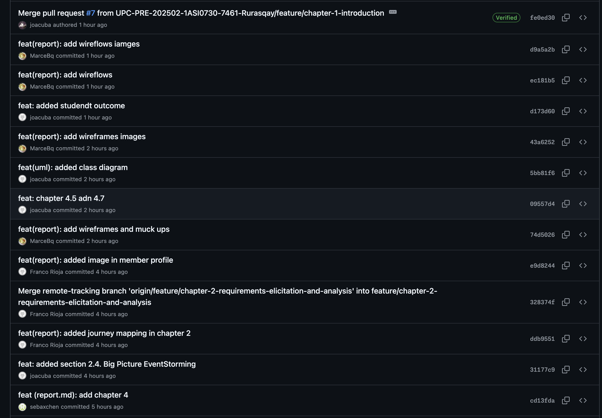
Aquí se ve nuestro historial de commits, con un PR verificado y un ritmo constante de cambios. Nosotros hicimos avances en wireframes, wireflows, mockups y el diagrama de clases, además de sumar “student outcome” y partes del reporte como el capítulo 4 y la sección 2.4. También hicimos merges entre ramas para mantener todo alineado y dejamos mensajes claros para la trazabilidad. Con esto, nuestra aplicación progresa de forma ordenada y el equipo se mantiene en la misma página.

Team Collaboration Network


Aquí se ve el network graph del repo con varias ramas moviéndose en paralelo. Nosotros hicimos ramas por feature y fuimos fusionando a main mediante PRs para mantener un flujo limpio. Con esto, nuestra aplicación avanza sin frenar a nadie y el historial queda claro para todo el equipo.

En este segundo gráfico se nota cómo abrimos y cerramos ramas con cortes controlados. Nosotros hicimos sincronizaciones frecuentes con main para evitar conflictos y, cuando fue necesario, hicimos rebase para ordenar los commits. Así mantenemos nuestra aplicación estable mientras seguimos iterando rápido.

En el tercero se aprecian integraciones más grandes y varios puntos de merge. Nosotros hicimos consolidaciones por hitos, revisamos los cambios entre equipos y cuidamos que main quedara liberable en cualquier momento. Esto nos permitió planear despliegues seguros y medir el progreso real de nuestra aplicación.

<br>

TP1:

Team Collaboration Commits


Aquí se ve nuestro historial de commits, con un PR verificado y un ritmo constante de cambios. Nosotros hicimos la realización del front end y partes del reporte como el capítulo 5. También hicimos merges entre ramas para mantener todo alineado y dejamos mensajes claros para la trazabilidad. Con esto, nuestra aplicación progresa de forma ordenada y el equipo se mantiene en la misma página.

Team Collaboration Network


Aquí se ve el network graph del repo con varias ramas moviéndose en paralelo. Ralizamos ramas por feature y fuimos fusionando a main mediante PRs para mantener un flujo limpio. Con esto, nuestra aplicación avanza sin frenar a nadie y el historial queda claro para todo el equipo.

En este segundo gráfico se nota cómo seguimos el trabajo realizado mediante los mismos flujos.

En el tercero se aprecian integraciones más grandes y mayores puntos de trabajo

En el tercero se aprecian integraciones finales del trabajo para este entregable


TB2:

Team Collaboration Commits


Aquí se ve nuestro historial de commits, con un PR verificado y un ritmo constante de cambios. Nosotros hicimos la realización y conección del backend con el front end y partes del reporte como el capítulo 5, incluyendo el Spint Backlog 3.

Team Collaboration Network


Aquí se ve el network graph del repo con varias ramas moviéndose en paralelo. Nosotros hicimos ramas por feature y fuimos fusionando a main mediante PRs para mantener un flujo limpio. Con esto, nuestra aplicación avanza sin frenar a nadie y el historial queda claro para todo el equipo.

En este segundo gráfico se nota cómo abrimos y cerramos ramas con cortes controlados. Nosotros hicimos sincronizaciones frecuentes con main para evitar conflictos y, cuando fue necesario, hicimos rebase para ordenar los commits. Así mantenemos nuestra aplicación estable mientras seguimos iterando rápido.

En el tercero se aprecian integraciones más grandes y varios puntos de merge. Nosotros hicimos consolidaciones por hitos, revisamos los cambios entre equipos y cuidamos que main quedara liberable en cualquier momento. Esto nos permitió planear despliegues seguros y medir el progreso real de nuestra aplicación.


## Tabla de Contenidos

- [Student Outcome](#student-outcome)

- [Capítulo I: Introducción](#capítulo-i-introducción)

- [1.1. Startup Profile](#11-startup-profile)
  - [1.1.1. Descripción de la Startup](#111-descripción-de-la-startup)
  - [1.1.2. Perfiles de integrantes del equipo](#112-perfiles-de-integrantes-del-equipo)
- [1.2. Solution Profile](#12-solution-profile)
  - [1.2.1. Antecedentes y problemática](#121-antecedentes-y-problemática)
  - [1.2.2. Lean UX Process](#122-lean-ux-process)
    - [1.2.2.1. Lean UX Problem Statement](#1221-lean-ux-problem-statement)
    - [1.2.2.2. Lean UX Assumptions](#1222-lean-ux-assumptions)
    - [1.2.2.3. Lean UX Hypothesis Statements](#1223-lean-ux-hypothesis-statements)
    - [1.2.2.4. Lean UX Canvas](#1224-lean-ux-canvas)
- [1.3. Segmentos objetivo](#13-segmentos-objetivo)

- [Capítulo II: Requirements Elicitation & Analysis](#capítulo-ii-requirements-elicitation--analysis)

- [2.1. Competidores](#21-competidores)
  - [2.1.1. Análisis competitivo](#211-análisis-competitivo)
  - [2.1.2. Estrategias y tácticas frente a competidores](#212-estrategias-y-tácticas-frente-a-competidores)
- [2.2. Entrevistas](#22-entrevistas)
  - [2.2.1. Diseño de entrevistas](#221-diseño-de-entrevistas)
  - [2.2.2. Registro de entrevistas](#222-registro-de-entrevistas)
  - [2.2.3. Análisis de entrevistas](#223-análisis-de-entrevistas)
- [2.3. Needfinding](#23-needfinding)
  - [2.3.1. User Personas](#231-user-personas)
  - [2.3.2. User Task Matrix](#232-user-task-matrix)
  - [2.3.3. User Journey Mapping](#233-user-journey-mapping)
  - [2.3.4. Empathy Mapping](#234-empathy-mapping)
- [2.4. Big Picture EventStorming](#24-big-picture-eventstorming)
- [2.5. Ubiquitous Language](#25-ubiquitous-language)

- [Capítulo III: Requirements Specification](#capítulo-iii-requirements-specification)

- [3.1. User Stories](#31-user-stories)
- [3.2. Impact Mapping](#32-impact-mapping)
- [3.4. Product Backlog](#34-product-backlog)

- [Capítulo IV: Product Design](#capítulo-iv-product-design)

- [4.1. Style Guidelines](#41-style-guidelines)
  - [4.1.1. General Style Guidelines](#411-general-style-guidelines)
  - [4.1.2. Web Style Guidelines](#412-web-style-guidelines)
- [4.2. Information Architecture](#42-information-architecture)
  - [4.2.1. Organization Systems](#421-organization-systems)
  - [4.2.2. Labeling Systems](#422-labeling-systems)
  - [4.2.3. SEO Tags and Meta Tags](#423-seo-tags-and-meta-tags)
  - [4.2.4. Searching Systems](#424-searching-systems)
  - [4.2.5. Navigation Systems](#425-navigation-systems)
- [4.3. Landing Page UI Design](#43-landing-page-ui-design)
  - [4.3.1. Landing Page Wireframe](#431-landing-page-wireframe)
  - [4.3.2. Landing Page Mock-up](#432-landing-page-mock-up)
- [4.4. Web Applications UX/UI Design](#44-web-applications-uxui-design)
  - [4.4.1. Web Applications Wireframes](#441-web-applications-wireframes)
  - [4.4.2. Web Applications Wireflow Diagrams](#442-web-applications-wireflow-diagrams)
  - [4.4.3. Web Applications Mock-ups](#443-web-applications-mock-ups)
  - [4.4.4. Web Applications User Flow Diagrams](#444-web-applications-user-flow-diagrams)
- [4.5. Web Applications Prototyping](#45-web-applications-prototyping)
- [4.6. Domain-Driven Software Architecture](#46-domain-driven-software-architecture)
  - [4.6.1. Software Architecture Context Diagram](#461-software-architecture-context-diagram)
  - [4.6.2. Software Architecture Container Diagrams](#462-software-architecture-container-diagrams)
  - [4.6.3. Software Architecture Components Diagrams](#463-software-architecture-components-diagrams)
- [4.7. Software Object-Oriented Design](#47-software-object-oriented-design)
  - [4.7.1. Class Diagrams](#471-class-diagrams)
- [4.8. Database Design](#48-database-design)

  - [4.8.1. Database Diagrams](#481-database-diagrams)

- [Capítulo V: Product Implementation, Validation & Deployment](#capítulo-v-product-implementation-validation--deployment)

- [5.1. Software Configuration Management](#51-software-configuration-management)
  - [5.1.1. Software Development Environment Configuration](#511-software-development-environment-configuration)
  - [5.1.2. Source Code Management](#512-source-code-management)
  - [5.1.3. Source Code Style Guide & Conventions](#513-source-code-style-guide--conventions)
  - [5.1.4. Software Deployment Configuration](#514-software-deployment-configuration)
- [5.2. Landing Page, Services & Applications Implementation](#52-landing-page-services--applications-implementation)
  - [5.2.1. Sprint 1](#521-sprint-1)
    - [5.2.1.1. Sprint Planning 1](#5211-sprint-planning-1)
    - [5.2.1.2. Aspect Leaders and Collaborators](#5212-aspect-leaders-and-collaborators)
    - [5.2.1.3. Sprint Backlog 1](#5213-sprint-backlog-1)
    - [5.2.1.4. Development Evidence for Sprint Review](#5214-development-evidence-for-sprint-review)
    - [5.2.1.5. Execution Evidence for Sprint Review](#5215-execution-evidence-for-sprint-review)
    - [5.2.1.6. Services Documentation Evidence for Sprint Review](#5216-services-documentation-evidence-for-sprint-review)
    - [5.2.1.7. Software Deployment Evidence for Sprint Review](#5217-software-deployment-evidence-for-sprint-review)
    - [5.2.1.8. Team Collaboration Insigths during Sprint](#5218-team-collaboration-insigths-during-sprint)
- [5.3. Validation Interviews](#53-validation-interviews)

  - [5.3.1. Diseño de Entrevistas](#531-diseño-de-entrevistas)
  - [5.3.2. Registro de Entrevistas](#532-registro-de-entrevistas)
  - [5.3.3. Evaluaciones según heurísticas](#533-evaluaciones-según-heurísticas)

- [Conclusiones](#conclusiones)

  - [Conclusiones y recomendaciones](#conclusiones-y-recomendaciones)
  - [Video About-the-Product](#video-about-the-product)

- [Bibliografía](#bibliografía)

- [Anexos](#anexos)

# Student Outcome

ABET – EAC - Student Outcome 5: La capacidad de funcionar efectivamente en un equipo cuyos miembros juntos proporcionan liderazgo, crean un entorno de colaboración e inclusivo, establecen objetivos, planifican tareas y cumplen objetivos.

En el siguiente cuadro se describe las acciones realizadas y enunciados de conclusiones por parte del grupo, que permiten sustentar el haber alcanzado el logro del ABET – EAC - Student Outcome 5.

| Criterio específico                                                                                 | Acciones realizadas                                                                                                                                                                                                                                                                                                                                                                                                                                                                                                                                                                                                                                                                                                                                                                                                                                                                                                                                                                                                                                                                                                                                                                                                                                                                                                                                                                                                                                                                                                                                                                                                                                                                                                                                                                                                                                                                                                                                                                                                                                                                                                                                                                                                                                                                                                                                                                                                                                                                                                                                                                                                                                                                                                                                                                                                                                                                                                                                                                                                                                                                                    | Conclusiones                                                                                                                                                                                                                                                                                                                                                                                                                                                                                                                                                                                                                                                                                                                                                                                                                                                                                                                                                                                                                                                                                                                                                                                                                                                                                                                                                                                                                                                                                                                                                                                                                                                                                                                                                                                                                                                                                                                                                                                                                                                                                                                                                                                                                                                                                                                                                                                                                                                                                                                                                                                                                                                                                                                                                                                                                                                                                                                                                                                                                                                                                                                                                                                                                                                                                    |
| --------------------------------------------------------------------------------------------------- | ------------------------------------------------------------------------------------------------------------------------------------------------------------------------------------------------------------------------------------------------------------------------------------------------------------------------------------------------------------------------------------------------------------------------------------------------------------------------------------------------------------------------------------------------------------------------------------------------------------------------------------------------------------------------------------------------------------------------------------------------------------------------------------------------------------------------------------------------------------------------------------------------------------------------------------------------------------------------------------------------------------------------------------------------------------------------------------------------------------------------------------------------------------------------------------------------------------------------------------------------------------------------------------------------------------------------------------------------------------------------------------------------------------------------------------------------------------------------------------------------------------------------------------------------------------------------------------------------------------------------------------------------------------------------------------------------------------------------------------------------------------------------------------------------------------------------------------------------------------------------------------------------------------------------------------------------------------------------------------------------------------------------------------------------------------------------------------------------------------------------------------------------------------------------------------------------------------------------------------------------------------------------------------------------------------------------------------------------------------------------------------------------------------------------------------------------------------------------------------------------------------------------------------------------------------------------------------------------------------------------------------------------------------------------------------------------------------------------------------------------------------------------------------------------------------------------------------------------------------------------------------------------------------------------------------------------------------------------------------------------------------------------------------------------------------------------------------------------------ | ----------------------------------------------------------------------------------------------------------------------------------------------------------------------------------------------------------------------------------------------------------------------------------------------------------------------------------------------------------------------------------------------------------------------------------------------------------------------------------------------------------------------------------------------------------------------------------------------------------------------------------------------------------------------------------------------------------------------------------------------------------------------------------------------------------------------------------------------------------------------------------------------------------------------------------------------------------------------------------------------------------------------------------------------------------------------------------------------------------------------------------------------------------------------------------------------------------------------------------------------------------------------------------------------------------------------------------------------------------------------------------------------------------------------------------------------------------------------------------------------------------------------------------------------------------------------------------------------------------------------------------------------------------------------------------------------------------------------------------------------------------------------------------------------------------------------------------------------------------------------------------------------------------------------------------------------------------------------------------------------------------------------------------------------------------------------------------------------------------------------------------------------------------------------------------------------------------------------------------------------------------------------------------------------------------------------------------------------------------------------------------------------------------------------------------------------------------------------------------------------------------------------------------------------------------------------------------------------------------------------------------------------------------------------------------------------------------------------------------------------------------------------------------------------------------------------------------------------------------------------------------------------------------------------------------------------------------------------------------------------------------------------------------------------------------------------------------------------------------------------------------------------------------------------------------------------------------------------------------------------------------------------------------------------- |
| **Trabaja en equipo para proporcionar liderazgo en forma conjunta.**                                | **Rioja Nuñez, Franco Diego**<br>**TB1**<br>Me esforcé en aportar al grupo, cumpliedo todas mis tareas encomendadas y ayudando en lo que aún faltaba por completar. <br><br> **TP** <br> Durante el desarrollo del proyecto, mantuve una presencia constante en las llamadas grupales, donde participé activamente en las discusiones y ofrecí mi perspectiva en la mejora del informe y ayude en la implementacion de la aplicación frontend.<br><br>**TB2**<br>Durante el desarrollo del proyecto, realice el desarrollo de la plataforma enfocandonme en el approach estudiado en clase y así, trabajar correctamente durante el transcurso del entregable <br><br> **Barrientos Quispe, Marcelo** <br> **TB1** <br> Apoyé de manera activa al desarrollo del trabajo, apoyando, mejorando y arregalndo varias partes del proyecto, además de claro hacer mis tareas encomendadas. <br> <br> **TP** <br> Para esta segunda entrega alcancé el logro del outcome ya que durante reuniones vía discord o zoom organicé y asigne tareas a mis compañeros además de ayudarlos a corregir errores en código y estar constantemente pendiente del trabajo. Tambien desarrollé el bounded context de allegados en el frontend. <br><br>**TB2**<br>Para este entregable fuí claro y conciente de las responsabilidades que iba a tratar en este entregable y en base a ello organziar y preparar mi presentación y aporte al equipo<br><br> **Beingolea Montalvo, Sebastian Martin** <br> **TB1** <br> Me encargue de realizar las entrevistas al primer segmento objetivo tambien me encargue de los user persona y el analisis de entrevistas y parte del event storming <br> <br> **TP** <br> Me encargue del big picture event storming y también de la asignación de tareas en el trello y la actualización de descripciones de imágenes como también la actualización del canva. <br> <br> **Rivera Ayala, Gabriel** <br> **TB1** <br> Apoyé a mis compañeros a investigar las necesidades de nuestros usuarios, brindé soporte y priorizé la colaboración y comunicación. <br> <br> **TP** <br> Colaboré con mi grupo de trabajo al desarrollar las interfaces del usuario en nuestra aplicación frontend al igual que corregir ciertos errores en anteriores entregas. <br><br>**TB2**<br>Para este entregable, desarrollé la plataforma base que se utilizará para nuestro sistema, guiándome de lo aprendido en clase.<br><br> **Joaquin Antonio Cuba Pareja** <br> **TB1** <br> Me encargue de la elaboracion de la Landing Page 4.1. el event storming y Class diagram <br> <br> **TP** <br> El desarrollo del proyecto fue una experiencia integral que combinó esfuerzos técnicos y colaborativos. Durante el proceso, mantuve una participación activa en las reuniones, contribuyendo en las discusiones y ofreciendo mi visión para mejorar el informe. <br><br> **Cespedes Pillco, Jarod Jack** <br>**TB2**<br> Para desarrollar este entregable me enfoque en el desarrollo de la plataforma backend para el sistema a trabajar, apoyando a mis compañeros en el desarrollo de la misma. | **Rioja Nuñez, Franco Diego**<br>**TB1**<br>La constante participación y aporte al gupo fue importante para mi desarrollo como estudiante, ya que pude obtener inforamción valiosa, más quen con el desarrollo de ciertos apartados sobre el análisis de usuarios <br><br> **TP** <br> Durante el desarrollo del proyecto, mantuve una presencia constante en las llamadas grupales, donde participé activamente en las discusiones y ofrecí mi perspectiva en la mejora del informe y ayude en la implementacion de la aplicación frontend.<br><br> **TB2** <br> El constante trabajo y esfuerzo del equipo dió grandes resultados para un entregable accesible, limpio y coherente. <br> <br> **Barrientos Quispe, Marcelo** <br> **TB1** <br> Gracias a mi gran aporte, mejore muchas de mis habilidades con respecto al desarrollo de una aplicación de este tipo, lo que me será de mucha ayuda en mi desarrollo como profesional. <br> <br> **TP** <br> Para esta segunda entrega alcancé el logro del outcome ya que durante reuniones vía discord o zoom organicé y asigne tareas a mis compañeros además de ayudarlos a corregir errores en código y estar constantemente pendiente del trabajo. Tambien desarrollé el bounded context de allegados en el frontend.<br> <br> **TB2**<br>Para este entregable, logramos coordinar con mayor anticipación y de esta manera lograr que el trabajo tenga un mayor impacto en relación al os objetivos planteados.<br> <br> **Beingolea Montalvo, Sebastian Martin** <br> **TB1** <br> La participación activa en el diseño y ejecución de entrevistas al primer segmento objetivo permitió aportar información valiosa al equipo. Esta contribución fortaleció la toma de decisiones conjuntas y reflejó un liderazgo distribuido, basado en la colaboración y en la construcción colectiva de resultados. <br> <br> **TP** <br> Me encargue del big picture event storming y también de la asignación de tareas en el trello y la actualización de descripciones de imágenes como también la actualización del canva. <br> <br> **Rivera Ayala, Gabriel** <br> **TB1** <br> Apoyé a mis compañeros a investigar las necesidades de nuestros usuarios, brindé soporte y priorizé la colaboración y comunicación. <br> <br> **TP** <br> Colaboré con mi grupo de trabajo al desarrollar las interfaces del usuario en nuestra aplicación frontend al igual que corregir ciertos errores en anteriores entregas. <br> <br> **TB2** <br> En este entregable pude apotar al equipo con mayor nitidez y de esta forma lograr el objetivo deseado<br> <br> **Joaquin Antonio Cuba Pareja** <br> **TB1** <br>Como equipo, nos dimos retroalimentación de forma constante, lo cual nos ayudó a reforzar nuestras áreas de oportunidad y mejorar nuestro desempeño <br> **TP** <br> El desarrollo del proyecto fue una experiencia integral que combinó esfuerzos técnicos y colaborativos. Durante el proceso, mantuve una participación activa en las reuniones, contribuyendo en las discusiones y ofreciendo mi visión para mejorar el informe. <br><br> **Cespedes Pillco, Jarod Jack** <br>**TB2**<br> En este trabajo aporte con mis conocimientos y mi responsabilidad por el bien del equipo y los objetivos planteados que teniamos. <br> |
| **Crea un entorno colaborativo e inclusivo, establece metas, planifica tareas y cumple objetivos.** | **Rioja Nuñez, Franco Diego**<br>**TB1**<br>Me encargué de realizar una entrevista, una buena parte del needfinding, dividir los user stories por épicas y me encargué del diagrama de la base de datos<br><br>**TP**<br> Coordiné la priorización de tareas y participé activamente en las reuniones de sprint, asegurando el avance de los entregables y documentando decisiones técnicas relevantes.<br><br>**TB2**<br>Para este entregable logramos desarrollar con éxito lo que se me fué asignado, siendo de entre ellos desarrollar o apoyar en la plataforma backend coordinandome con otro compañero.<br><br>**Barrientos Quispe, Marcelo** <br> **TB1** <br> Me encargué de la elaboración del wireframe, wireflow, mokups, segmentos objetivos, parte del capitulo 1, entrevistas y su diseño, landing page, muy buena parte del capitulo 4 y el capitulo 5 <br> <br/> **TP**<br> Implementé una primera versión del frontend junto a mi equipo de trabajo creando un ambiente colaborativo.<br><br>**TB2**<br>Realicé mi tarea asignada para este entregable que fué realizar el backend<br/> **Beingolea Montalvo, Sebastian Martin** <br/> **TB1** <br/>Me encargue de realizar las entrevistas al primer segmento objetivo tambien me encargue de los user persona y el analisis de entrevistas y parte del event storming <br> <br/> **TP**<br> Organicé las tareas en un Trello para mejorar la colaboración y manejo de tareas.<br> <br/> **Rivera Ayala, Gabriel** <br> **TB1** <br> Apoyé a mis compañeros a investigar las necesidades de nuestros usuarios, brindé soporte y priorizé la colaboración y comunicación. <br> <br/> **TP**<br> Colaboré en la implementación de las interfaces y en la corrección de errores del frontend, además de corregir errores en pasadas entregas.<br><br>**TB2**<br>Coordiné y realicé el backend para el sistema de nuestro trabajo<br/> **Joaquin Antonio Cuba Pareja** <br> **TB1** <br> Me encargue de la elaboracion de la Landing Page 4.1. el event storming y Class diagram <br/> <br> **TP**<br> El desarrollo del proyecto fue una experiencia integral que combinó esfuerzos técnicos y colaborativos. Durante el proceso, mantuve una participación activa en las reuniones, contribuyendo en las discusiones y ofreciendo mi visión para mejorar el informe.<br><br> **Cespedes Pillco, Jarod Jack** <br>**TB2**<br> Me encargué de realizar el backend bajo coordinación y previo planteamiento de nuestro equipo. <br>                                                                                                                                                                                                                                                                                                                                                                                                                                                                                                                                                                                                                                                                                                                                                                                                                                                                                                                                                                                                                                                                                                                             | **Rioja Nuñez, Franco Diego**<br>**TB1**<br>Gracias a la elaboración del needfiding, mejoré mi habilidad para ver como se siente al cliente con varios aspectos de nuestra aplicación, lo que me permite dar un producto mucho mejor para los usuarios.<br><br>**TB2**<br>En este trabajo pude realizar y apoyar en el desarrollo de nuestra plataforma backend gracias al contenido aplicado en clase<br><br>**Barrientos Quispe, Marcelo** <br> **TB1** <br> Gracias al desarrollo del trabajo mejoré muchas habildies, tanto como del desarrollo de la idea del proyecto, sino también con respecto al desarollo de landigns pages, ya que ahora siento que se como atraer mejor ala gente con esta sección tan importante del proyecto. <br> <br/> **TP**<br> Implementé una primera versión del frontend junto a mi equipo de trabajo creando un ambiente colaborativo.<br><br>**TB2**<br>En este trabajo pude realizar y apoyar en el desarrollo de nuestra plataforma backend para el bounded context de Relatives, utilizando el contenido enseñado en clase.<br><br> <br/> **Beingolea Montalvo, Sebastian Martin** <br/> **TB1** <br/> Al elaborar los user personas y analizar entrevistas, se facilitó un espacio de diálogo y entendimiento mutuo entre los miembros del equipo, asegurando que las diferentes perspectivas fueran integradas en el desarrollo del proyecto. Este enfoque inclusivo permitió que el producto respondiera mejor a las necesidades reales de los usuarios. <br> <br/> **TP**<br> Organicé las tareas en un Trello para mejorar la colaboración y manejo de tareas.<br> <br/> **Rivera Ayala, Gabriel** <br> **TB1** <br> Apoyé a mis compañeros a investigar las necesidades de nuestros usuarios, brindé soporte y priorizé la colaboración y comunicación. <br> <br/> **TP** <br> Colaboré en la implementación de las interfaces y en la corrección de errores del frontend, además de corregir errores en pasadas entregas.<br> <br>**TB2**<br>Para este entregable pude realizar correctamente el sistema y con ello presentar un trabajo que cumplía con todos los objetivos planteados<br><br/> **Joaquin Antonio Cuba Pareja** <br> **TB1** <br> A lo largo del desarrollo del trabajo se logro establecer un ambiente colabortivo lo cual nos permitio refinar nuestra aprendisaje y el desarrollo del trabjo <br/> <br> **TP** El desarrollo del proyecto fue una experiencia integral que combinó esfuerzos técnicos y colaborativos. Durante el proceso, mantuve una participación activa en las reuniones, contribuyendo en las discusiones y ofreciendo mi visión para mejorar el informe.<br><br> **Cespedes Pillco, Jarod Jack** <br>**TB2**<br> Logré comprender con mayor claridad los elementos estudiados en clase y así aplicarlo en el sistema desarrollado con mis compañeros. <br>                                                                                                                                                                                                                                                                                                                                                                                                                                                                                                                                                                                                                                                                                                                                                                                                                                                                                                                                                                                                                                                                                                                                                       |

# Capítulo I: Introducción

## 1.1. Startup Profile

### 1.1.1. Descripción de la Startup

**RurasqaySoft** es una startup tecnológica enfocada en el desarrollo de soluciones digitales innovadoras para el sector salud, con especial atención en el cuidado de pacientes geriátricos. Nuestro propósito es aprovechar la tecnología para mejorar la calidad de vida de los adultos mayores mediante herramientas accesibles, seguras y sostenibles que permitan un monitoreo constante, una atención preventiva y una conexión más cercana entre pacientes, familiares e instituciones de salud.

Nuestra solución es MediTrack, una plataforma de salud digital que utiliza parches inteligentes como dispositivos IoT para el monitoreo remoto de pacientes geriatricos. MediTrack permite registrar signos vitales, detectar emergencias y compartir información en tiempo real con familiares, médicos y aseguradoras, garantizando un cuidado preventivo, seguro y personalizado.

La propuesta de RurasqaySoft se centra en construir un ecosistema de salud digital inclusivo, escalable y orientado a resultados, donde los parches inteligentes y las plataformas de gestión se convierten en un puente entre innovación tecnológica y bienestar social. Buscamos que cada adulto mayor pueda ser monitoreado en tiempo real, reduciendo riesgos, optimizando diagnósticos y facilitando la toma de decisiones médicas y familiares.

**Misión:** Desarrollar herramientas digitales accesibles y efectivas que permitan a pacientes, familias e instituciones de salud monitorear y gestionar la salud de los adultos mayores en tiempo real, brindando seguridad, confianza y eficiencia.

**Visión:** En los próximos 5 años, consolidar a RurasqaySoft como una la empresa líder en soluciones de salud digital en Latinoamérica, siendo reconocidos por nuestra capacidad de mejorar la calidad de vida y prevenir riesgos mediante el uso de innovación tecnológica accesible y escalable.

**Alcance del proyecto:** El alcance inicial de MediTrack está orientado al cuidado geriátrico, ofreciendo una plataforma web y móvil que integra dispositivos IoT en forma de parches inteligentes para registrar signos vitales, alertar en casos de emergencia y compartir información en tiempo real con familiares, médicos y aseguradoras. A mediano plazo, buscamos ampliar el impacto de la solución hacia hospitales, clínicas y casas de reposo, consolidando un modelo de monitoreo preventivo y predictivo que transforme la manera en que se gestiona la salud de los adultos mayores en Latinoamérica.

### 1.1.2. Perfiles de integrantes del equipo

| Foto                                                                     | Apellido y Nombre               | Código     | Carrera                | Habilidades                                                                                                                                                                                                                                                                                                                                                                                     |
| ------------------------------------------------------------------------ | ------------------------------- | ---------- | ---------------------- | ----------------------------------------------------------------------------------------------------------------------------------------------------------------------------------------------------------------------------------------------------------------------------------------------------------------------------------------------------------------------------------------------- |
|  | Cespedes Pillco, Jarod Jack     | U202318588 | Ingeniería de Software | Conocimientos en desarrollo web front-end y back-end. Manejo de JavaScript, Python y C++. Familiarizado con frameworks como React y Node.js.                                                                                                                                                                                                                                                    |
|                                 | Rivera Ayala, Gabriel Alejandro | U202223279 | Ingeniería de Software | Soy estudiante de Ingeniería de Software. Me interesa el aprendizaje continuo en todo lo relacionado al desarrollo de aplicaciones interactivas. He desarrollado proyectos en C++, Python, HTML y CSS. Actualmente estoy aprendiendo a realizar aplicaciones web usando el framework Angular y Vue. Me considero una persona trabajadora y apoyaré a mis compañeros a realizar un buen trabajo. |
| 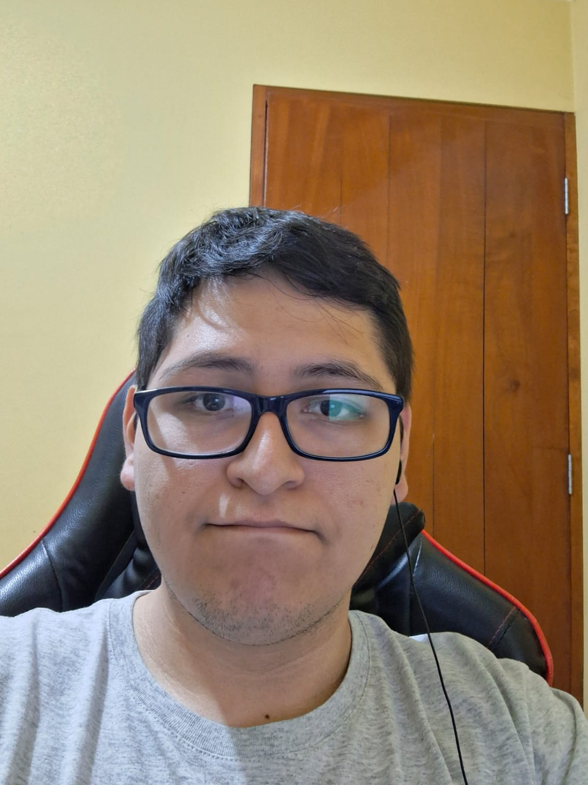                              | Rioja Nuñez, Franco Diego       | U202221597 | Ingeniería de Software | Me considero una persona adaptable al entorno, sé trabajar en equipo y aprendo rápido. Mentalidad para resolver problemas. Conocimiento básico de las funcionalidades de software.                                                                                                                                                                                                              |
|                                 | Barrientos Quispe, Marcelo      | U20221e646 | Ingeniería de Software | Me considero una persona adaptable al entorno, sé trabajar en equipo y aprendo rápido. Cuento con conocimientos técnicos en tecnologías de JavaScript.                                                                                                                                                                                                                                          |

## 1.2. Solution Profile

El **Solution Profile** presenta una descripción general de la solución propuesta, abordando el contexto, los problemas detectados y las suposiciones estratégicas que guían el desarrollo del producto. Esta sección busca conectar los hallazgos obtenidos en la fase de descubrimiento con una propuesta clara de valor, estableciendo las bases para el diseño, validación y desarrollo de la solución.

### 1.2.1. Antecedentes y problemática

En esta sección se analiza el contexto en el que surge la problemática principal, considerando los factores sociales, tecnológicos y emocionales que la rodean. A través de la **técnica de las 5 ‘W’s y 2 ‘H’s**, se busca responder de forma estructurada a las preguntas clave sobre el qué, quién, cuándo, dónde, por qué, cómo y cuánto, con el fin de comprender de manera integral la situación actual y justificar la pertinencia de la solución propuesta.

**Técnica de The 5 'W's y 2 'H's**

**What(Qué)?** <br>
¿Cuál es el problema?

El envejecimiento poblacional en el Perú y América Latina ha incrementado la demanda de soluciones de monitoreo en salud geriátrica. Según la Organización Panamericana de la Salud (OPS, s. f.), para el año 2050, 1 de cada 5 personas en la región será adulto mayor. Sin embargo, gran parte de esta población enfrenta limitaciones para un control adecuado de sus enfermedades crónicas debido a la falta de acceso a tecnología comprensible, la escasez de seguimiento médico continuo y la sobrecarga de los familiares que asumen su cuidado.

Actualmente, muchos dispositivos de monitoreo existentes requieren habilidades tecnológicas que los adultos mayores no poseen, lo que genera una brecha digital en el cuidado geriátrico, reduciendo la calidad de atención y aumentando el riesgo de emergencias médicas no atendidas a tiempo.

**When(Cuando)?** <br>
¿Cuándo sucede el problema?

El problema ocurre de manera constante, pero se intensifica en las etapas más avanzadas de la vejez, cuando las enfermedades crónicas y las limitaciones físicas o cognitivas aumentan la dependencia del adulto mayor. La necesidad de monitoreo es diaria y continua, especialmente en pacientes con hipertensión, diabetes o afecciones cardíacas.

En situaciones cotidianas, como cuando los adultos mayores están solos en casa o durante la noche, las caídas o variaciones en los signos vitales pueden pasar desapercibidas, impidiendo una intervención médica oportuna y elevando el riesgo de complicaciones graves.

**Where(Dónde)?** <br>
¿Dónde surge el problema?

El problema se presenta principalmente en entornos urbanos del Perú, donde la población geriátrica está en crecimiento y los sistemas de salud se encuentran sobrecargados. Según el Instituto Nacional de Estadística e Informática (INEI, 2024), el 13% de la población peruana ya supera los 60 años, y se proyecta un crecimiento sostenido en la próxima década.

En las ciudades, muchos adultos mayores viven solos o en casas de reposo, lo que incrementa la necesidad de monitoreo remoto y continuo. En áreas rurales, la falta de infraestructura médica y especialistas agrava el problema, ya que limita el acceso a controles periódicos y servicios de salud adecuados.

En conjunto, tanto los entornos urbanos como rurales enfrentan limitaciones en la atención geriátrica continua, reforzando la necesidad de soluciones tecnológicas locales, accesibles y adaptadas al contexto peruano.

**Who(Quién)?** <br>
¿Quiénes son los afectados?

Los principales afectados son:

- **Adultos mayores**, que requieren monitoreo constante de su salud pero que enfrentan dificultades para usar herramientas tecnológicas complejas.

- **Familiares y allegados**, quienes muchas veces cargan con la responsabilidad de vigilar el bienestar del paciente sin contar con información precisa oportuna.

- **Clínicas y hospitales**, que necesitan soluciones de telemetría que permitan descongestionar la atención presencial y realizar un seguimiento más eficiente.

- **Casas de reposo y centros geriátricos**, que deben garantizar la seguridad de sus residentes y responder rápidamente ante emergencias de salud.

**Why(Por qué)?** <br>
¿Cuál es la causa del problema?

- **Falta de monitoreo continuo y accesible:** Los sistemas de salud en el Perú están centrados en la atención reactiva, sin priorizar la prevención ni el seguimiento remoto.

- **Limitaciones tecnológicas en adultos mayores:** Según la Encuesta Nacional de Hogares (ENAHO, INEI, 2023), solo el 22% de los adultos mayores peruanos accede regularmente a internet, y menos del 10% utiliza aplicaciones móviles de salud.

- **Sobrecarga del sistema de salud:** La atención médica presencial presenta largas esperas, lo que retrasa diagnósticos y controles regulares.

- **Escasez de herramientas locales adaptadas:** La mayoría de los wearables disponibles están diseñados para mercados extranjeros y no se ajustan al contexto socioeconómico ni cultural peruano.

- **Dependencia de familiares y cuidadores:** La falta de sistemas confiables de alerta temprana obliga a los familiares a asumir una vigilancia constante, generando altos niveles de estrés y agotamiento emocional.

**How(Cómo)?** <br>
¿Cómo se utilizará el producto?

Para responder a esta necesidad, MediTrack propone un sistema integral de monitoreo geriátrico compuesto por un parche inteligente y un dashboard digital que facilita el acceso a información médica en tiempo real.

- **Para los pacientes geriátricos:** Solo deben portar el parche inteligente, el cual registra automáticamente sus signos vitales sin necesidad de conocimientos tecnológicos.

- **Para los familiares:** Accederán a una plataforma intuitiva donde podrán visualizar la salud del paciente en tiempo real, recibir notificaciones de alerta y acceder al historial médico.

- **Para clínicas y casas de reposo:** Podrán supervisar simultáneamente múltiples pacientes, generar reportes médicos automatizados y tomar decisiones basadas en datos objetivos.

Este sistema busca mejorar la calidad de vida del adulto mayor, reducir la carga emocional de los familiares y optimizar la gestión institucional del cuidado geriátrico. Su enfoque accesible y adaptado al contexto peruano diferencia a MediTrack de otras soluciones internacionales más costosas y complejas.

**How much(Cuánto)?** <br>
¿Cuánto costará implementar la solución?

La implementación de MediTrack requiere una inversión inicial orientada al desarrollo tecnológico, infraestructura de soporte y estrategias de lanzamiento. Esta inversión representa un paso clave hacia la modernización del cuidado geriátrico en el Perú, ofreciendo una alternativa local, accesible y escalable frente a dispositivos importados de alto costo.

**Presupuesto estimado:**

**Desarrollo de Software**

- Diseño y desarrollo del dashboard web: S/ 3,500 – S/ 5,000

- Backend, API y base de datos segura: S/ 3,000 – S/ 4,500

- Dominio, hosting y servidores (anual): S/ 1,200 – S/ 2,000

**Hardware (Parches inteligentes)**

- Diseño y prototipado de parches: S/ 5,000 – S/ 7,000

- Producción inicial (lote piloto de 100 unidades): S/ 8,000 – S/ 10,000

**Marketing y Lanzamiento:**

- Estrategia digital y materiales promocionales: S/ 2,500 – S/ 4,000

- Alianzas con clínicas y casas de reposo: S/ 1,500 – S/ 2,000

- Mantenimiento y Soporte (anual):

- Actualizaciones de software y soporte técnico: S/ 3,000 – S/ 5,000

**Total estimado:** S/ 28,700 – S/ 40,500

### 1.2.2. Lean UX Process

El proceso Lean UX que adoptamos está orientado a maximizar la eficiencia en el desarrollo de nuestro producto, enfocándose en principios fundamentales como la validación continua, el pensamiento crítico y la acción rápida. A partir de esta filosofía, hemos estructurado nuestro propio enfoque Lean UX, basado en cuatro componentes esenciales: definición de problemas, formulación de suposiciones, creación de hipótesis y desarrollo de un lienzo estratégico.

#### 1.2.2.1. Lean UX Problem Statement.

El propósito de MediTrack es ofrecer una solución digital integral que permita monitorear en tiempo real los signos vitales y la movilidad de los adultos mayores mediante dispositivos portátiles (wearables). Nuestra meta es proporcionar tranquilidad a las familias y eficiencia al personal médico, facilitando la toma de decisiones preventivas y mejorando la calidad de vida del paciente geriátrico.

El problema surge cuando familiares y cuidadores se enfrentan a la falta de información inmediata sobre el estado de salud de los adultos mayores, especialmente ante situaciones críticas como caídas o cambios súbitos en sus signos vitales. Actualmente, las plataformas de monitoreo existentes son fragmentadas, costosas o no se adaptan al entorno geriátrico local, dificultando su implementación en clínicas, casas de reposo o entornos domésticos.

Hemos observado que esta situación genera preocupación constante en los familiares, sobrecarga laboral en los cuidadores y retrasos en la atención médica preventiva, lo que deriva en una menor calidad de vida para el adulto mayor.
La ausencia de una solución accesible, escalable y de fácil uso crea una brecha entre la necesidad de monitoreo continuo y las herramientas tecnológicas disponibles actualmente.

Ante esta problemática, surge la siguiente pregunta: **¿Cómo podríamos ofrecer una solución tecnológica accesible y confiable que permita monitorear la salud y el bienestar de los adultos mayores en tiempo real, brindando tranquilidad a sus familias y eficiencia al personal médico?**

**Domain:** Salud digital, cuidado geriátrico, tecnología portátil (wearables).

**Customer Segments:**

- Familiares de pacientes geriátrico
- Personal médico de clínicas.
- Personal de las casas de reposo

**Pain Points:**

- Incertidumbre y preocupación familiar por la salud del adulto mayor.
- Ineficiencia en el monitoreo de múltiples pacientes en clínicas y casas de reposo.
- Riesgo de caídas y la falta de alertas en tiempo real.
- Falta de datos históricos para la prevención médica.

**Gap:** No existe una solución en el mercado que combine un monitoreo integral de signos vitales y movilidad con una plataforma visual y escalable, adaptada tanto para el uso individual en el hogar como para la gestión institucional.

**Vision/Strategy:** Ser la empresa líder en soluciones de salud digital para adultos mayores en Latinoamérica, mejorando la calidad de vida y previniendo riesgos mediante una innovación tecnológica accesible y escalable.

**Initial Segment:** Familias con adultos mayores en Lima Metropolitana que tienen acceso a dispositivos móviles y buscan una forma más segura de monitorear la salud de sus seres queridos.

#### 1.2.2.2. Lean UX Assumptions.

Los siguientes supuestos representan las creencias iniciales sobre el modelo de negocio, el mercado y la viabilidad del producto MediTrack.

**Business Assumptions**

Estas Business Assumptions servirán como base para formular los Feature Assumptions e Hypothesis Statements, permitiendo validar los elementos críticos del modelo durante las iteraciones del proceso Lean UX.

1. Creemos que los usuarios necesitan monitorear de forma continua la salud de los adultos mayores para reducir los riesgos médicos y la carga emocional familiar.

2. Creemos que una solución digital que combine parches inteligentes con un dashboard accesible puede satisfacer esta necesidad y mejorar la prevención médica.

3. Creemos que nuestros clientes iniciales serán familias y pequeñas instituciones geriátricas en Lima Metropolitana que busquen seguridad y eficiencia en el cuidado.

4. Creemos que el valor más importante que buscan nuestros clientes es la **tranquilidad** de tener información en tiempo real sobre la salud de sus seres queridos.

5. Creemos que nuestro modelo **Freemium + Suscripción Enterprise** nos permitirá escalar en ambos segmentos (B2C y B2B) sin depender de un único flujo de ingresos.

6. Creemos que nuestra ventaja competitiva radica en integrar métricas de salud y movilidad en una sola plataforma, algo que la competencia actual no ofrece.

7. Creemos que podremos reducir las llamadas de emergencia y consultas médicas presenciales al proporcionar monitoreo remoto confiable.

8. Reconocemos que el mayor riesgo es la desconfianza tecnológica; lo mitigaremos con pilotos gratuitos, certificaciones médicas y testimonios de usuarios reales.

9. Creemos que la relación costo–beneficio de MediTrack será más accesible que las soluciones importadas equivalentes.

**User Assumptions**

En esta etapa del Lean UX Process, se identificaron los principales supuestos sobre los usuarios, sus necesidades y el contexto de uso del producto. Estos Assumptions representan las creencias iniciales del equipo antes de realizar pruebas o validaciones.

**¿Quién es el usuario?**

- Allegados de adultos mayores: Hijos, nietos o cuidadores principales que viven con el adulto mayor o a distancia, preocupados por su salud, seguridad y bienestar.

- Clínicas y casas de reposo: Personal médico, cuidadores y administradores que necesitan una herramienta para monitorear a múltiples pacientes de manera simultánea.

**¿Dónde encaja nuestro producto en su vida?**

- Para los allegados: Se integra en su rutina diaria como una capa de seguridad y tranquilidad.

- Para las clínicas y casas de reposo: Se convierte en una herramienta central de gestión y monitoreo.

**¿Qué problemas resuelve nuestro producto?**

- Incertidumbre y preocupación: Las familias eliminan la ansiedad al tener datos de salud en tiempo real.

- Falta de monitoreo continuo: La solución permite un seguimiento constante de signos vitales y movilidad, incluso a distancia.

- Ineficiencia en la gestión: Las instituciones pueden monitorear a múltiples residentes de forma simultánea, recibiendo alertas automáticas que les permiten reaccionar rápidamente ante emergencias.

- Prevención limitada: La disponibilidad de datos históricos ayuda a identificar patrones y a tomar decisiones médicas preventivas.

**¿Cuándo y cómo se usa nuestro producto?**

- Para el usuario B2C (familiar): La app web se usa varias veces al día para chequear el estado del adulto mayor, o al recibir una alerta. La instalación del parche es un proceso inicial y sencillo, y el monitoreo es automático.

- Para el usuario B2B (institución): El dashboard se usa de forma continua en una computadora o tablet en la estación de enfermería. Se consulta para ver el estado de los pacientes, verificar alertas y generar reportes para el personal o los familiares.

**¿Qué características son importantes?**

- Alertas en tiempo real: Por caídas, cambios bruscos en signos vitales o anomalías en el patrón de movilidad.
- Dashboard visual: Una interfaz clara con gráficos y un mapa de movilidad.
- Historial de datos: La capacidad de ver métricas de salud a lo largo del tiempo.
- Reportes descargables: Para consultas médicas o comunicación con familiares.

**¿Cómo debería lucir y comportarse el producto?**
Debe ser intuitivo, sencillo y confiable. Los colores deben ser calmados (sin alarmar al usuario con rojo o naranjas, a menos que sea una alerta crítica), con una tipografía clara y botones grandes. El comportamiento debe ser rápido y responsivo, sin retrasos en la entrega de datos, y debe inspirar confianza y seguridad en el usuario.

### Feature Assumptions

En esta sección se detallan los supuestos relacionados con las características funcionales del producto. Cada **Feature Assumption** busca conectar las necesidades de los usuarios con las posibles soluciones de diseño, anticipando el impacto esperado en la experiencia y el comportamiento del usuario. Estas suposiciones servirán de base para la formulación de hipótesis y posteriores validaciones durante el proceso de desarrollo del producto.

1. Creemos que un **dashboard visual y amigable** permitirá a familiares y personal médico interpretar fácilmente la salud de los adultos mayores sin conocimientos técnicos.  
   aumentar en un 80% la comprensión de los datos de salud reportada por los usuarios.\*

2. Creemos que las **notificaciones automáticas y personalizables** mejorarán la respuesta ante emergencias.

3. Creemos que un **historial de datos accesible** fomentará la prevención y seguimiento médico continuo.

4. Creemos que los **reportes descargables** aumentarán la comunicación efectiva entre familiares y médicos.

5. Creemos que el **monitoreo de múltiples pacientes** en un solo panel mejorará la eficiencia de las instituciones.

### User Outcome Assumptions

- Aumento de la conexión emocional y la tranquilidad de los familiares (debido a la fácil comprensión del estado de salud).

- Mejora en la capacidad de respuesta del personal de cuidado ante emergencias.

- Uso constante del historial de datos por parte de los usuarios para un monitoreo más proactivo.

- Aumento del valor percibido de la plataforma entre los clientes B2B.

- Mejora de la eficiencia operativa y la satisfacción del personal en instituciones de salud.

### Business Outcome Assumptions

- Reducción del 70% en las llamadas de consulta rutinarias

- Reducción del tiempo de respuesta a emergencias a menos de 5 minutos en el 90% de los casos

- Al menos el 60% de los usuarios activos consulta el historial de datos o reportes médicos al menos una vez al mes

- Al menos el 50% de los clientes B2B utilicen los reportes descargables mensualmente.

- Reducción del 30% en tareas manuales de monitoreo y un aumento del 25% en la satisfacción laboral

#### 1.2.2.3. Lean UX Hypothesis Statements.

Los **Hypothesis Statements** constituyen una evolución de los Assumptions, transformándolos en afirmaciones medibles y verificables. Cada hipótesis sigue el formato propuesto por el enfoque Lean UX, integrando el _business outcome_, el _user outcome_ y la _feature_ correspondiente. De esta manera, se facilita la validación empírica de las ideas y se asegura que el producto responda tanto a los objetivos del negocio como a las necesidades reales del usuario.

- Hypothesis Statement 1:

**Creemos que** el dashboard visual e intuitivo aumentará la conexión emocional y la tranquilidad de los familiares al permitirles comprender fácilmente el estado de salud de sus seres queridos.

**Sabremos que hemos tenido éxito**

**Cuando** al menos un 85% de los familiares reporten una alta sensación de tranquilidad y las llamadas de consulta rutinarias se reduzcan en un 70%.

- Hypothesis Statement 2:

**Creemos que** las notificaciones automáticas y personalizables sobre anomalías o caídas mejorarán la capacidad de respuesta del personal de cuidado ante emergencias.

**Sabremos que hemos tenido éxito**

**Cuando** logremos una reducción del tiempo de respuesta a emergencias a menos de 5 minutos en el 90% de los casos registrados.

- Hypothesis Statement 3:

**Creemos que** ofrecer un registro detallado de salud y movilidad fomentará el uso constante del historial de datos por parte de los usuarios para un monitoreo más proactivo.

**Sabremos que hemos tenido éxito**

**Cuando** al menos un 60% de los usuarios activos consulten el historial de datos o reportes médicos al menos una vez al mes.

- Hypothesis Statement 4:

**Creemos que** la capacidad de generar y compartir reportes digitales de manera sencilla aumentará el valor percibido de la plataforma entre los clientes B2B.

**Sabremos que** hemos tenido éxito

**Cuando** al menos un 50% de los clientes B2B utilicen los reportes descargables mensualmente.

- Hypothesis Statement 5:

**Creemos que** la visualización de múltiples pacientes en un solo dashboard centralizado mejorará la eficiencia operativa y la satisfacción del personal en instituciones de salud.

**Sabremos que** hemos tenido éxito

**Cuando** el personal experimente una reducción del 30% en tareas manuales de monitoreo y un aumento del 25% en su satisfacción laboral.

#### 1.2.2.4. Lean UX Canvas

El **Lean UX Canvas** sintetiza la información clave del proceso de descubrimiento, los Assumptions y las Hypothesis Statements. Su propósito es proporcionar una visión integral y colaborativa del proyecto, ayudando al equipo a alinear la estrategia de producto, los objetivos de negocio y las métricas de validación. Este canvas se convierte en una herramienta esencial para guiar el aprendizaje continuo y priorizar las decisiones de diseño con base en evidencia.


## 1.3. Segmentos objetivo

En esta sección se identifican y describen los **segmentos de usuarios** hacia los cuales se dirige la solución. A partir del análisis de necesidades, motivaciones y comportamientos, se definen los perfiles clave que se beneficiarán del producto. Estos segmentos servirán de referencia para la personalización de las funcionalidades, el diseño de la experiencia de usuario y las estrategias de comunicación dentro del desarrollo de MediTrack.

- **Allegados de pacientes geriátricos**

**Descripción:**

Son familiares o cuidadores cercanos de adultos mayores que requieren atención continua. Este segmento busca soluciones que les permitan supervisar la salud de sus seres queridos de manera remota, con alertas oportunas que reduzcan la incertidumbre y brinden tranquilidad.

**Características demográficas y comportamiento:**

- Generalmente hijos adultos con una edad promedio entre 30 y 59 años.

- Prefieren soluciones tecnológicas fáciles de usar y accesibles desde la web.

- Valoran la inmediatez de la información y la posibilidad de recibir notificaciones en tiempo real ante emergencias.

- Dispuestos a invertir en herramientas que garanticen la seguridad de sus familiares mayores y reduzcan la carga emocional de los cuidados.

**Sustento estadístico:**

- Según la OMS (2022), más del 60% de adultos mayores en América Latina dependen del apoyo directo de familiares para su cuidado.

- En Perú, el 75% de personas de más de 60 años viven con familiares (INEI, 2023), lo que hace a los allegados actores claves en la toma de decisiones sobre el cuidado.

- **Personal medíco de clínicas**

**Descripción:**

Profesionales de la salud encargados de monitorear y dar tratamiento a adultos mayores con enfermedades crónicas o en estado de recuperación. Este segmento necesita herramientas que les permitan un seguimiento ágil y confiable, reduciendo el margen de error y mejorando la atención preventiva.

**Características demográficas y comportamiento:**

- Médicos, enfermeros y especialistas en geriatría, con edades entre 28 y 55 años.

- Manejan información crítica y requieren plataformas con altos estándares de seguridad de datos.

- Se apoyan en dashboards intuitivos para la toma de decisiones clínicas.

- Valoran soluciones que optimicen el tiempo de atención, reduzcan hospitalizaciones y permitan consultas remotas.

**Sustento estadístico:**

- La Sociedad Peruana de Geriatría (2021) señala que un adulto mayor con enfermedades crónicas requiere en promedio 7 consultas médicas al año, lo que genera sobrecarga de seguimiento.

- En Latinoamérica, el 42% del personal médico afirma que las herramientas digitales mejoran la capacidad de atención y seguimiento de pacientes crónicos (IDB, 2020)

- **Personal de las casas de reposo**

Cuidadores y personal administrativo de residencias geriátricas que tienen a su cargo el bienestar físico y emocional de los adultos mayores que viven en sus instalaciones. Necesitan herramientas que faciliten el monitoreo colectivo de múltiples pacientes a la vez.

**Descripción:**

**Características demográficas y comportamiento:**

- Profesionales y cuidadores de adultos mayores, entre 25 y 50 años.

- Manejan simultáneamente la atención de 10 a 30 residentes por turno, lo que dificulta el seguimiento individualizado.

- Requieren soluciones que automaticen alertas y centralicen la información de varios pacientes en un solo panel de control.

- Valoran la reducción de riesgos y el respaldo tecnológico como garantía de calidad del servicio.

**Sustento estadístico:**

- En Perú, existen más de 1,200 casas de reposo registradas y la demanda crece un 20% anual debido al envejecimiento poblacional (Minsa, 2022).

- Un estudio del Banco Mundial (2020) indica que el uso de tecnologías de monitoreo en residencias geriátricas puede reducir en un 35% los incidentes críticos no detectados en adultos mayores.

# Capítulo II: Requirements Elicitation & Analysis

## 2.1. Competidores

En esta sección analizaremos a los que consideramos los principales competidores de nuestra solución, que son los siguientes:

- ### VitalConnect
  VitalConnect es una empresa de salud digital que ofrece el VitalPatch, un parche biométrico desechable que monitorea en tiempo real signos vitales y actividad del paciente, usado principalmente en hospitales y telemedicina para seguimiento continuo y prevención de reingresos.
- ### BioSticker
  BioIntelliSense es la empresa creadora del BioSticker, un parche portátil que se coloca en el torso y permite el monitoreo continuo y pasivo de signos vitales y síntomas (frecuencia cardíaca, respiratoria, temperatura, actividad), enfocado en la detección temprana de complicaciones médicas y en el seguimiento remoto de pacientes crónicos y adultos mayores.
- ### CarePredict
  CarePredict es una empresa enfocada en el cuidado de adultos mayores que desarrolla un wearable en forma de pulsera, capaz de registrar movilidad, patrones de sueño, alimentación y actividades diarias, utilizando inteligencia artificial para detectar cambios de comportamiento y riesgo de caídas, facilitando la prevención y la comunicación con familiares y cuidadores.

### 2.1.1. Análisis competitivo

#### ¿Por qué llevar a cabo este análisis?

Realizar un análisis competitivo de MediTrack es importante para identificar las fortalezas y debilidades de los principales rivales, así como resaltar los diferenciales únicos de la solución.

|                         |                                                       | <br/>MediTrack                                                         |  <br/> VitalConnect |  <br/> BioIntelliSense | <br/>CarePredict |
| ----------------------- | ----------------------------------------------------- | ------------------------------------------------------------------------------------------------------------------------------------- | ------------------------------------------------------------------------------------------ | ----------------------------------------------------------------------------------------------------- | --------------------------------------------------------------------------------------- |
| **Perfil**              | Overview                                              | Parches inteligentes y dashboard que integran signos vitales, movilidad y alertas en tiempo real para adultos mayores.                | Parche biométrico para monitoreo hospitalario y remoto de signos vitales.                  | Parche portátil para monitoreo continuo y detección temprana en crónicos.                             | Pulsera para adultos mayores que usa IA para prevenir caídas y cambios de conducta.     |
|                         | Ventaja competitiva ¿Qué valor ofrece a los clientes? | Combina mapa de movilidad y métricas de salud en un solo sistema, con un modelo flexible.                                             | Seguimiento clínico preciso y continuo en hospitales y post-alta                           | Monitoreo pasivo y detección temprana de complicaciones.                                              | Prevención de caídas y cambios de salud mediante IA en adultos mayores.                 |
| **Perfil de Marketing** | Mercado objetivo                                      | Adultos mayores en el hogar, familias, clínicas y casas de reposo en Latinoamérica.                                                   | Hospitales y clínicas para monitoreo hospitalario y post-alta.                             | Pacientes crónicos y adultos mayores en seguimiento remoto.                                           | Adultos mayores en hogares y residencias geriátricas.                                   |
|                         | Estrategias de marketing                              | Pruebas piloto gratuitas, descuentos por volumen, reposición de parches y paneles personalizados para instituciones.                  | Alianzas con hospitales y proveedores de salud.                                            | Enfoque en telemedicina y seguros de salud.                                                           | Venta directa a familias y residencias geriátricas.                                     |
| **Perfil de Producto**  | Productos & Servicios                                 | Parches inteligentes, app y dashboard web con métricas, historial, reportes y alertas en tiempo real.                                 | Parche VitalPatch y plataforma de monitoreo clínico.                                       | BioSticker y BioButton con servicios de monitoreo remoto.                                             | Pulsera Tempo y app con alertas basadas en IA.                                          |
|                         | Precios & Costos                                      | Modelo Freemium–Premium para usuarios individuales y plan Enterprise para instituciones; costos escalables según número de pacientes. | Modelo B2B con costos por dispositivo y servicio hospitalario.                             | Suscripción mensual con dispositivos incluidos.                                                       | Dispositivo con pago inicial y suscripción para servicios y alertas.                    |
|                         | Canales de distribución                               | Descarga directa de la app, venta online de dispositivos y alianzas con clínicas y casas de reposo.                                   | Distribución a través de hospitales y sistemas de salud.                                   | Venta mediante proveedores de salud y aseguradoras.                                                   | Comercialización online y alianzas con residencias geriátricas.                         |
| **Análisis SWOT**       | Fortalezas                                            | Integración única de movilidad y salud, escalabilidad de B2C a B2B y modelo de negocio adaptable.                                     | Alta precisión clínica y validación hospitalaria.                                          | Monitoreo pasivo y amplio rango de parámetros.                                                        | IA predictiva y enfoque específico en adultos mayores.                                  |
|                         | Debilidades                                           | Requiere validación clínica y adopción tecnológica por parte de adultos mayores y cuidadores.                                         | Enfoque limitado al entorno hospitalario, poco accesible al usuario final.                 | Dependencia de suscripción y costos elevados.                                                         | Cobertura restringida a rutinas y movilidad, menos datos clínicos.                      |
|                         | Oportunidades                                         | Creciente demanda de telemedicina y monitoreo geriátrico en Latinoamérica, con baja oferta especializada.                             | Expansión al cuidado domiciliario y programas de telemedicina.                             | Creciente demanda de monitoreo remoto en pacientes crónicos.                                          | Mayor necesidad de prevención de caídas en adultos mayores independientes.              |
|                         | Amenazas                                              | Competencia de wearables globales (Apple, Fitbit) y startups especializadas (VitalConnect, BioSticker, CarePredict).                  | Competencia de wearables más accesibles como Apple Watch o Fitbit                          | Regulaciones estrictas y adopción lenta por parte de sistemas de salud.                               | Avances de competidores con dispositivos multiparámetro más completos.                  |

### 2.1.2. Estrategias y tácticas frente a competidores

Para esta sección haremos un análisis FODA (Fortalezas, Oportunidades, Debilidades y Amenazas) y CAME (Corregir, Afrontar, Mantener y Explotar) de nuestra solución MediTrack frente a los competidores analizados.

**Matriz FODA**

| **Interno / Externo** | **Positivo**                                                                | **Negativo**                                                           |
| --------------------- | --------------------------------------------------------------------------- | ---------------------------------------------------------------------- |
| **Interno**           | **Fortalezas (F):**                                                         | **Debilidades (D):**                                                   |
|                       | - Integración única de movilidad + métricas de salud.                       | - Requiere validación clínica para ganar confianza.                    |
|                       | - Modelo de negocio flexible (Freemium, Premium, Enterprise).               | - Adopción tecnológica limitada en adultos mayores y cuidadores.       |
|                       | - Escalabilidad de B2C (familias) a B2B (clínicas y casas de reposo)\*\*.   | - Recursos iniciales limitados frente a grandes competidores globales. |
| **Externo**           | **Oportunidades (O):**                                                      | **Amenazas (A):**                                                      |
|                       | - Creciente demanda de telemedicina y monitoreo geriátrico en LatAm.        | - Competencia fuerte de wearables globales (Apple, Fitbit).            |
|                       | - Baja oferta de soluciones especializadas en adultos mayores en la región. | - Startups especializadas (VitalConnect, BioSticker, CarePredict).     |
|                       | - Tendencia de gobiernos y aseguradoras a impulsar salud digital.           | - Regulaciones sanitarias estrictas para aprobación médica.            |

**Matriz CAME**

| Estrategia                      | Acción                                                                                                                                                                                                                                                         |
| ------------------------------- | -------------------------------------------------------------------------------------------------------------------------------------------------------------------------------------------------------------------------------------------------------------- |
| **C (Corregir Debilidades):**   | - Validar clínicamente los parches inteligentes mediante pilotos en clínicas. <br> - Diseñar interfaces simples y capacitaciones para mejorar adopción por parte de adultos mayores y cuidadores.                                                              |
| **A (Afrontar Amenazas):**      | - Diferenciarse de Apple/Fitbit con un enfoque 100% en geriatría. <br> - Reforzar la propuesta de valor con mapa de movilidad visual que los competidores no integran. <br> - Ajustar precios accesibles para el mercado latinoamericano.                      |
| **M (Mantener Fortalezas):**    | - Seguir potenciando la escalabilidad de uso individual a institucional. <br> - Mantener el modelo freemium-premium-enterprise como ventaja comercial. <br> - Continuar desarrollando el dashboard visual como punto de diferenciación.                        |
| **E (Explotar Oportunidades):** | - Expandir en Latinoamérica con alianzas con clínicas, casas de reposo y aseguradoras. <br> - Posicionarse como pionero en soluciones de monitoreo geriátrico digital en la región. <br> - Aprovechar incentivos y programas gubernamentales de salud digital. |

## 2.2. Entrevistas

Para este bloque se realizaron entrevistas semiestructuradas para comprender las necesidades, hábitos y percepciones de los segmentos objetivo respecto al monitoreo de adultos mayores. El objetivo fue identificar oportunidades, frustraciones y barreras en el uso de tecnologías de salud.

### 2.2.1. Diseño de entrevistas

Las preguntas se adaptaron a tres segmentos clave: familiares, profesionales médicos y personal de casas de reposo. Este enfoque permitió obtener evidencia cualitativa relevante para sustentar el análisis de usuarios y los artefactos del proceso de Needfinding.

**Preguntas dirigidas al primer segmento**

- ¿Cuál es tu edad, ocupación y lugar de residencia?

- ¿Cuál es tu relación con el adulto mayor?

- ¿Con qué frecuencia lo visitas o te comunicas con él/ella?

- ¿Qué dispositivo usas más para comunicarte con tu familiar o cuidador?

- ¿Qué apps o canales usas con más frecuencia?

- ¿Qué navegador usas más en tu día a día?

- ¿Qué preocupaciones principales tienes sobre la salud y seguridad de tu familiar adulto mayor?

- ¿Cómo sueles monitorear su estado de salud actualmente?

- ¿Qué situaciones de riesgo has enfrentado que te hubiera gustado prevenir?

- ¿Qué tipo de información en tiempo real consideras más valiosa recibir?

- ¿Cómo reaccionas actualmente cuando ocurre una emergencia?

- ¿Qué tan cómodo te sentirías usando una app para monitorear la salud de tu familiar?

- ¿Qué funcionalidades serían imprescindibles para confiar en una solución como MediTrack?

- ¿Qué barreras podrían impedirte adoptar una tecnología como esta?

- ¿Qué tan dispuesto estarías a pagar por una solución que te brinde tranquilidad?

**Preguntas dirigidas al segundo segmento**

- ¿Cuál es tu especialidad y experiencia en el cuidado de pacientes geriátricos?

- ¿Cuántos pacientes adultos mayores atiendes en promedio a la semana?

- ¿Qué dispositivo usas más para tu trabajo?

- ¿Qué canales digitales utilizas con pacientes y familiares?

- ¿Qué navegador usas con frecuencia en el trabajo?

- ¿Qué sistema de monitoreo de pacientes utilizas en tus prácticas médicas?

- ¿Qué dificultades enfrentas en el monitoreo de la salud de pacientes geriátricos?

- ¿Con qué frecuencia recibes emergencias relacionadas con caídas, descompensaciones o crisis en pacientes mayores?

- ¿Qué información en tiempo real te resultaría más útil para mejorar la atención y prevención?

- ¿Cómo coordinas actualmente con familiares de los pacientes respecto a su estado de salud?

- ¿Qué impacto tendría en tu labor clínica contar con reportes digitales y alertas inmediatas?

- ¿Qué tan dispuesto estarías a implementar una herramienta como MediTrack en tu práctica?

- ¿Qué características clínicas consideras imprescindibles para confiar en un sistema de monitoreo remoto?

- ¿Qué obstáculos podrían dificultar la adopción en tu clínica?

- ¿Consideras que deberían cubrir parte del costo de una solución como esta?

**Preguntas dirigidas al tercer segmento**

- ¿Qué cargo ocupas en la casa de reposo?

- ¿Cuántos residentes adultos mayores tienes bajo tu supervisión diaria?

- ¿Qué herramientas o protocolos utilizas actualmente para monitorear su estado de salud?

- ¿Qué canales usas para comunicarte con las familias de los residentes?

- ¿Qué navegadores usan en los equipos de la residencia?

- ¿Qué sistemas de monitoreo utilizas para saber el estado de salud actual de los asistidos?

- ¿Qué problemas frecuentes enfrentas en el cuidado y supervisión de los adultos mayores?

- ¿Cuáles son los eventos más críticos que suelen presentarse?

- ¿Qué tan difícil resulta monitorear simultáneamente a varios residentes?

- ¿Qué información en tiempo real te permitiría mejorar la atención y reducir riesgos?

- ¿Cómo sueles actuar actualmente en casos de emergencia o deterioro repentino de la salud de un residente?

- ¿Qué tan útil consideras que sería un parche inteligente como MediTrack para el cuidado diario de los residentes?

- ¿Qué funcionalidades considerarías imprescindibles para implementarlo en tu institución?

- ¿Qué obstáculos crees que existirían para adoptarlo?

- ¿Crees que los familiares estarían dispuestos a pagar un valor adicional por contar con esta tecnología en la casa de reposo?

### 2.2.2. Registro de entrevistas

#### Entrevistas segmento objetivo allegados de adultos mayores

##### Allegado Adulto Mayor

- Nombres: Andres
- Apellidos: Cocca
- Edad: 19
- Distrito: San Miguel
- Video Entrevista:
  [https://upcedupe-my.sharepoint.com/:v:/g/personal/u20221e646_upc_edu_pe/EbMya_8QywNLmNK4sv9l58gBgwDyZ6O5ipVFQkSkJQwQ9Q?e=jlb4Fl&nav=eyJyZWZlcnJhbEluZm8iOnsicmVmZXJyYWxBcHAiOiJTdHJlYW1XZWJBcHAiLCJyZWZlcnJhbFZpZXciOiJTaGFyZURpYWxvZy1MaW5rIiwicmVmZXJyYWxBcHBQbGF0Zm9ybSI6IldlYiIsInJlZmVycmFsTW9kZSI6InZpZXcifSwicGxheWJhY2tPcHRpb25zIjp7InN0YXJ0VGltZUluU2Vjb25kcyI6MzE0OC41NH19](https://upcedupe-my.sharepoint.com/:v:/g/personal/u20221e646_upc_edu_pe/EbMya_8QywNLmNK4sv9l58gBgwDyZ6O5ipVFQkSkJQwQ9Q?e=jlb4Fl&nav=eyJyZWZlcnJhbEluZm8iOnsicmVmZXJyYWxBcHAiOiJTdHJlYW1XZWJBcHAiLCJyZWZlcnJhbFZpZXciOiJTaGFyZURpYWxvZy1MaW5rIiwicmVmZXJyYWxBcHBQbGF0Zm9ybSI6IldlYiIsInJlZmVycmFsTW9kZSI6InZpZXcifSwicGxheWJhY2tPcHRpb25zIjp7InN0YXJ0VGltZUluU2Vjb25kcyI6MzE0OC41NH19)
- Timing:
- Inicio: 52:28
- Fin: 1:01:53
- Duración: 9 minutos con 25 segundos

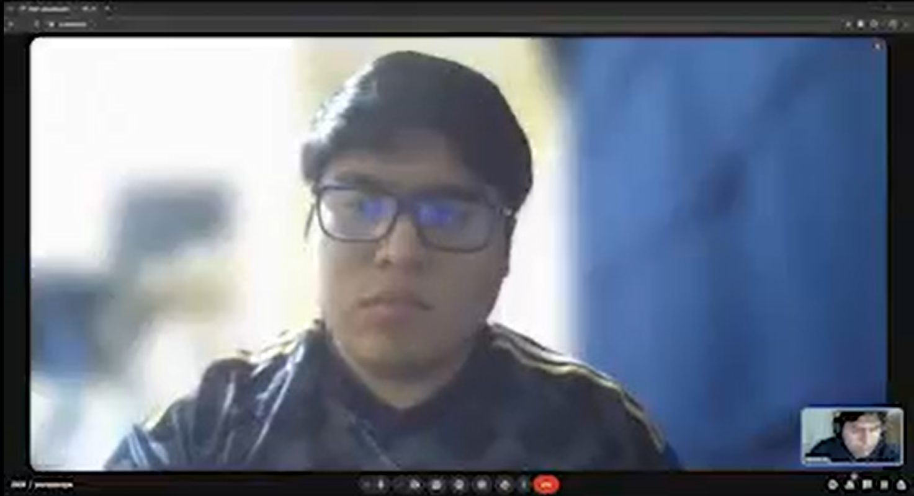

- Resumen:

El entrevistado es un joven de 19 años que reside en San Miguel y actualmente se desempeña como estudiante universitario. No trabaja, pero tiene experiencia en el cuidado de su bisabuela, una persona adulta mayor que enfrentaba problemas de salud relacionados con la edad, como afecciones cardíacas y de presión arterial. Su rol consistía en apoyarla en actividades cotidianas, incluyendo mandados, asistencia en la alimentación y atención general, lo que muestra un nivel de compromiso familiar y sensibilidad hacia el cuidado de personas mayores.

En cuanto a su relación con la tecnología, manifiesta interés en contar con una aplicación que le permita monitorear los datos biométricos de su familiar, así como recibir alertas en caso de detectar irregularidades. Esto refleja una preocupación genuina por la prevención y la detección temprana de complicaciones de salud, además de una disposición positiva hacia la incorporación de soluciones digitales en el cuidado.

Respecto al uso de dispositivos y programas, señala que su navegador de preferencia es Google Chrome, el cual utiliza para sus actividades diarias. Maneja también herramientas como Excel para la gestión de información, lo que indica un nivel de familiaridad con la organización de datos, aunque su experiencia tecnológica se encuentra más vinculada a un contexto académico que clínico.

Sobre el monitoreo de los adultos mayores, reconoce que actualmente depende de la observación personal y de su apoyo directo en la vida cotidiana de su bisabuela, sin contar con un sistema de seguimiento en tiempo real. En ese sentido, resalta el valor que tendría una herramienta digital capaz de registrar y reportar datos médicos de manera automática, ya que permitiría reducir la incertidumbre y mejorar la capacidad de respuesta ante emergencias.

En relación con su disposición a utilizar nuevas soluciones como MediTrack, se muestra abierto e interesado, siempre que el sistema garantice confiabilidad y precisión en los datos. Su motivación principal se centra en facilitar el cuidado y la prevención de riesgos para los adultos mayores a su cargo.

Además, el entrevistado utiliza principalmente WhatsApp y llamadas telefónicas para mantenerse en contacto con su bisabuela y familiares. Aunque se considera familiarizado con la tecnología, no ha utilizado antes aplicaciones de salud o monitoreo, lo que sugiere una necesidad de interfaces simples y confiables. Expresa que su mayor frustración ocurre cuando no puede estar presente para prevenir o responder ante una emergencia, y su motivación principal es sentirse tranquilo sabiendo que su familiar está segura en todo momento.

En conjunto, el entrevistado transmite una visión juvenil y proactiva sobre el cuidado de adultos mayores. Combina sensibilidad personal con interés en herramientas digitales, identificando en la tecnología una aliada clave para mejorar la seguridad y el bienestar de las personas mayores, pese a que su experiencia se limita al ámbito familiar y no profesional.

##### Allegado Adulto Mayor

- Nombres: Teofilo
- Apellidos: Beingolea
- Edad: 58
- Distrito: Jesus Maria
- Video Entrevista:
  [https://upcedupe-my.sharepoint.com/:v:/g/personal/u20221e646_upc_edu_pe/EbMya_8QywNLmNK4sv9l58gBgwDyZ6O5ipVFQkSkJQwQ9Q?e=dnSCtO&nav=eyJyZWZlcnJhbEluZm8iOnsicmVmZXJyYWxBcHAiOiJTdHJlYW1XZWJBcHAiLCJyZWZlcnJhbFZpZXciOiJTaGFyZURpYWxvZy1MaW5rIiwicmVmZXJyYWxBcHBQbGF0Zm9ybSI6IldlYiIsInJlZmVycmFsTW9kZSI6InZpZXcifSwicGxheWJhY2tPcHRpb25zIjp7InN0YXJ0VGltZUluU2Vjb25kcyI6MjcwOS4xfX0%3D](https://upcedupe-my.sharepoint.com/:v:/g/personal/u20221e646_upc_edu_pe/EbMya_8QywNLmNK4sv9l58gBgwDyZ6O5ipVFQkSkJQwQ9Q?e=dnSCtO&nav=eyJyZWZlcnJhbEluZm8iOnsicmVmZXJyYWxBcHAiOiJTdHJlYW1XZWJBcHAiLCJyZWZlcnJhbFZpZXciOiJTaGFyZURpYWxvZy1MaW5rIiwicmVmZXJyYWxBcHBQbGF0Zm9ybSI6IldlYiIsInJlZmVycmFsTW9kZSI6InZpZXcifSwicGxheWJhY2tPcHRpb25zIjp7InN0YXJ0VGltZUluU2Vjb25kcyI6MjcwOS4xfX0%3D)
- Timing:
- Inicio: 45:09
- Fin: 52:27
- Duración: 7 minutos con 19 segundos

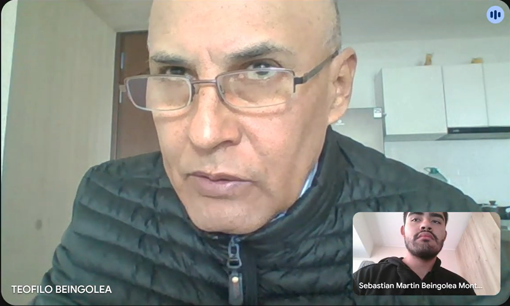

- Resumen:

Teófilo, de 58 años y residente en Lima, mantiene una relación cercana con el adulto mayor, a quien visita varias veces por semana y con la que se comunica casi a diario, principalmente a través del celular con sistema operativo,Iphone, usando llamadas y WhatsApp. En su vida cotidiana utiliza mayormente el navegador Google Chrome.

Sus principales preocupaciones giran en torno a la salud y seguridad del adulto mayor, especialmente las caídas, los problemas de presión arterial y que pueda requerir ayuda estando sola. Actualmente la monitorea con llamadas frecuentes y consultas sobre su estado, además de los controles médicos regulares, aunque siente que estos métodos no siempre son suficientes.

Ha vivido episodios de riesgo como mareos y una caída que no pudieron anticipar, lo cual le genera el deseo de contar con información en tiempo real. Considera especialmente valioso recibir alertas sobre caídas, ritmo cardíaco y recordatorios de medicación.

En caso de emergencias, suele acudir personalmente o llamar a una ambulancia, pero reconoce la angustia de no tener información clara al instante. Teófilo se muestra abierto al uso de una aplicación como MediTrack, siempre que sea sencilla y confiable. Entre las funcionalidades que considera imprescindibles están: alertas inmediatas de emergencias, acceso al historial médico y conexión directa con servicios de salud.

Aunque percibe como barreras la complejidad tecnológica y la falta de confianza en las plataformas digitales, asegura que estaría dispuesto a pagar por una solución que le brinde tranquilidad y garantice el bienestar del adulto mayor.

##### Allegado Adulto Mayor

- Nombres: Jorge
- Apellidos: Rioja
- Edad: 25
- Distrito: Puente Piedra
- Video Entrevista:
  [https://upcedupe-my.sharepoint.com/:v:/g/personal/u20221e646_upc_edu_pe/EbMya_8QywNLmNK4sv9l58gBgwDyZ6O5ipVFQkSkJQwQ9Q?e=C7GhYD&nav=eyJyZWZlcnJhbEluZm8iOnsicmVmZXJyYWxBcHAiOiJTdHJlYW1XZWJBcHAiLCJyZWZlcnJhbFZpZXciOiJTaGFyZURpYWxvZy1MaW5rIiwicmVmZXJyYWxBcHBQbGF0Zm9ybSI6IldlYiIsInJlZmVycmFsTW9kZSI6InZpZXcifSwicGxheWJhY2tPcHRpb25zIjp7InN0YXJ0VGltZUluU2Vjb25kcyI6MzIxLjcyfX0%3D](https://upcedupe-my.sharepoint.com/:v:/g/personal/u20221e646_upc_edu_pe/EbMya_8QywNLmNK4sv9l58gBgwDyZ6O5ipVFQkSkJQwQ9Q?e=C7GhYD&nav=eyJyZWZlcnJhbEluZm8iOnsicmVmZXJyYWxBcHAiOiJTdHJlYW1XZWJBcHAiLCJyZWZlcnJhbFZpZXciOiJTaGFyZURpYWxvZy1MaW5rIiwicmVmZXJyYWxBcHBQbGF0Zm9ybSI6IldlYiIsInJlZmVycmFsTW9kZSI6InZpZXcifSwicGxheWJhY2tPcHRpb25zIjp7InN0YXJ0VGltZUluU2Vjb25kcyI6MzIxLjcyfX0%3D)
- Timing:
- Inicio: 5:21
- Fin: 9:55
- Duración: 4 minutos con 34 segundos

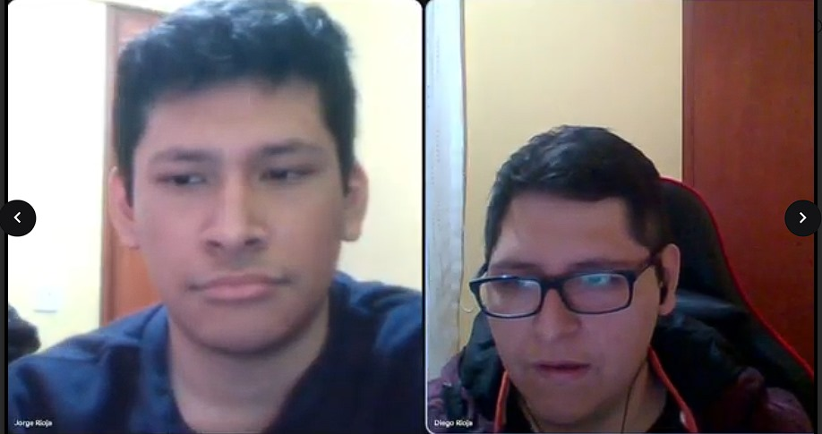

- Resumen:

Jorge, de 25 años, reside en Puente Piedra y trabaja como practicante profesional en un banco. Vive junto a su abuelo y el resto de su familia, manteniendo una relación cercana y constante con él. Su principal preocupación se centra en la salud de su abuelo, especialmente en el control de la presión arterial, ya que los monitoreos actuales solo se realizan cuando aparecen síntomas como mareos o dolores de cabeza. Estas limitaciones han derivado en episodios de desmayo que han generado gran preocupación en el entorno familiar.

En cuanto al uso de tecnología, Jorge utiliza un smartphone Android y navega principalmente con Google Chrome, lo que refleja un perfil digital activo. Para comunicarse con su familia, recurre habitualmente a WhatsApp y llamadas telefónicas, destacando la necesidad de canales rápidos y confiables. Su conocimiento tecnológico es suficiente para adoptar herramientas digitales, siempre que sean intuitivas y accesibles.

Entre sus principales necesidades, resalta la posibilidad de contar con información en tiempo real sobre el estado de salud de su abuelo, particularmente en lo relacionado con presión arterial, caídas y ubicación. Señala como una de sus frustraciones la imposibilidad de monitorear de forma constante y la dependencia del aviso de otros familiares cuando ocurre una emergencia.

En el aspecto emocional, su motivación proviene del deseo de prevenir situaciones de riesgo y de brindar tranquilidad a su familia, asegurando el bienestar de su abuelo incluso cuando él no puede estar presente. Valora positivamente la propuesta de MediTrack, considerándola una herramienta que podría optimizar la atención y reducir la incertidumbre en el cuidado del adulto mayor.

Jorge considera imprescindibles las funcionalidades de localización, detección de caídas y monitoreo de presión arterial, siempre que los datos ofrecidos sean precisos y confiables. Aunque identifica como principal barrera la confianza en la exactitud del sistema, afirma que estaría dispuesto a pagar por una herramienta que garantice seguridad, prevención y comunicación inmediata ante cualquier emergencia.

#### Entrevistas segmento objetivo profesionales de la salud

##### Doctor Medico General

- Nombres: Vicente Alonso
- Apellidos: Cuba Pareja
- Edad: 29
- Distrito: Miraflores
- Timing:
  [https://upcedupe-my.sharepoint.com/:v:/g/personal/u20221e646_upc_edu_pe/EbMya_8QywNLmNK4sv9l58gBgwDyZ6O5ipVFQkSkJQwQ9Q?e=MbjybG&nav=eyJyZWZlcnJhbEluZm8iOnsicmVmZXJyYWxBcHAiOiJTdHJlYW1XZWJBcHAiLCJyZWZlcnJhbFZpZXciOiJTaGFyZURpYWxvZy1MaW5rIiwicmVmZXJyYWxBcHBQbGF0Zm9ybSI6IldlYiIsInJlZmVycmFsTW9kZSI6InZpZXcifSwicGxheWJhY2tPcHRpb25zIjp7InN0YXJ0VGltZUluU2Vjb25kcyI6Mzk5NC42N319](https://upcedupe-my.sharepoint.com/:v:/g/personal/u20221e646_upc_edu_pe/EbMya_8QywNLmNK4sv9l58gBgwDyZ6O5ipVFQkSkJQwQ9Q?e=MbjybG&nav=eyJyZWZlcnJhbEluZm8iOnsicmVmZXJyYWxBcHAiOiJTdHJlYW1XZWJBcHAiLCJyZWZlcnJhbFZpZXciOiJTaGFyZURpYWxvZy1MaW5rIiwicmVmZXJyYWxBcHBQbGF0Zm9ybSI6IldlYiIsInJlZmVycmFsTW9kZSI6InZpZXcifSwicGxheWJhY2tPcHRpb25zIjp7InN0YXJ0VGltZUluU2Vjb25kcyI6Mzk5NC42N319)
- Timing:
- Inicio: 1:06:34
- Fin: 1:19:06
- Duración: 12 minutos con 32 segundos

  

- Resumen:

El entrevistado es un médico general que trabaja en un centro de salud de nivel 14 y atiende principalmente a pacientes geriátricos. Con una carga promedio de 75 a 100 pacientes mayores por semana, demuestra amplia experiencia en este grupo etario, reflejando una personalidad práctica, empática y orientada al servicio.

En cuanto a la tecnología que utiliza, menciona que su herramienta principal es la computadora del centro de salud, donde gestiona las historias clínicas mediante el sistema ESSI (EsSalud). Además, utiliza un iPhone para la comunicación con familiares de pacientes, prefiriendo WhatsApp como canal rápido y directo, lo que muestra adaptabilidad ante la falta de plataformas institucionales ágiles.

Respecto al navegador, emplea Google Chrome tanto para acceder al sistema ESSI como para realizar consultas médicas en bases de datos especializadas como PubMed o UpToDate, evidenciando una actitud profesional de actualización constante.

Entre sus principales necesidades, resalta la de contar con información en tiempo real sobre los pacientes geriátricos, especialmente ante caídas, descompensaciones o crisis de salud. Reconoce que actualmente depende de reportes manuales o del aviso de familiares, lo que limita la capacidad de respuesta y genera incertidumbre en la atención.

Sus frustraciones se centran en la falta de alertas inmediatas, la dependencia de información tardía y la escasa interoperabilidad entre los sistemas institucionales y las soluciones domésticas. Estas carencias afectan la eficiencia y la prevención médica.

En el aspecto motivacional, el entrevistado valora la posibilidad de mejorar la prevención clínica y la atención domiciliaria, reduciendo la brecha entre el paciente y el profesional de salud. Se muestra abierto al uso de MediTrack, siempre que la herramienta garantice precisión, confiabilidad y respaldo médico.

Considera como barreras principales los costos de implementación, la necesidad de capacitación del personal y la confianza en la veracidad de los datos biométricos. Sin embargo, propone un modelo de costo compartido entre instituciones y familias como una alternativa viable para su adopción.

En conjunto, el médico expresa una visión realista y progresista sobre el uso de tecnología en geriatría. Combina herramientas institucionales con canales informales, y percibe en soluciones como MediTrack una oportunidad para optimizar la prevención, la comunicación y la eficiencia médica, siempre que se garantice su rigor técnico y clínico.

##### Doctora Medico General

- Nombres: Valentina
- Apellidos: Pareja Centeno
- Edad: 25
- Distrito: Surco
- Timing:
  [https://upcedupe-my.sharepoint.com/:v:/g/personal/u20221e646_upc_edu_pe/EbMya_8QywNLmNK4sv9l58gBgwDyZ6O5ipVFQkSkJQwQ9Q?e=QEHQrF&nav=eyJyZWZlcnJhbEluZm8iOnsicmVmZXJyYWxBcHAiOiJTdHJlYW1XZWJBcHAiLCJyZWZlcnJhbFZpZXciOiJTaGFyZURpYWxvZy1MaW5rIiwicmVmZXJyYWxBcHBQbGF0Zm9ybSI6IldlYiIsInJlZmVycmFsTW9kZSI6InZpZXcifSwicGxheWJhY2tPcHRpb25zIjp7InN0YXJ0VGltZUluU2Vjb25kcyI6MzcxNC41Nn19](https://upcedupe-my.sharepoint.com/:v:/g/personal/u20221e646_upc_edu_pe/EbMya_8QywNLmNK4sv9l58gBgwDyZ6O5ipVFQkSkJQwQ9Q?e=QEHQrF&nav=eyJyZWZlcnJhbEluZm8iOnsicmVmZXJyYWxBcHAiOiJTdHJlYW1XZWJBcHAiLCJyZWZlcnJhbFZpZXciOiJTaGFyZURpYWxvZy1MaW5rIiwicmVmZXJyYWxBcHBQbGF0Zm9ybSI6IldlYiIsInJlZmVycmFsTW9kZSI6InZpZXcifSwicGxheWJhY2tPcHRpb25zIjp7InN0YXJ0VGltZUluU2Vjb25kcyI6MzcxNC41Nn19)
- Timing:
- Inicio: 1:01:54
- Fin: 1:06:33
- Duración: 4 minutos con 39 segundos

  

- Resumen:

La doctora Valentina es médica general con amplia experiencia en la atención de pacientes geriátricos, atendiendo entre 50 y 60 adultos mayores por semana. Su perfil refleja un compromiso constante con este grupo poblacional y una comprensión profunda de las particularidades que implica su cuidado.

En cuanto a su relación con la tecnología, utiliza principalmente una laptop o PC para registrar las consultas y gestionar información clínica. Posee un iPhone, el cual emplea como herramienta complementaria para la comunicación digital. Su navegador preferido es Google Chrome, reflejando un manejo habitual de herramientas informáticas en su práctica profesional.

Respecto a los canales de comunicación, menciona el uso frecuente del correo electrónico para coordinación formal con pacientes y familiares, además de WhatsApp, que considera un medio práctico y directo. Esta combinación evidencia un equilibrio entre formalidad médica y eficiencia comunicacional.

Entre sus principales necesidades, destaca la falta de un sistema de monitoreo continuo para los adultos mayores, lo que impide un seguimiento real de los tratamientos y genera brechas en la atención preventiva. Señala que una herramienta capaz de emitir alertas sobre caídas o descompensaciones, así como de verificar la adherencia a medicamentos, resultaría fundamental para mejorar la calidad asistencial.

Sus frustraciones se centran en la dependencia de terceros para el traslado de los pacientes, la falta de información en tiempo real y la escasa coordinación interprofesional, factores que derivan en emergencias evitables. Estas limitaciones revelan la necesidad de soluciones digitales que reduzcan la carga manual y optimicen la respuesta médica.

En cuanto a sus motivaciones, la doctora muestra una clara disposición hacia herramientas tecnológicas que mejoren la eficiencia del cuidado y fortalezcan la conexión con familiares y cuidadores. Considera que MediTrack podría representar un avance significativo, siempre que garantice precisión en los datos, facilidad de uso y respaldo clínico validado.

Identifica como barreras principales los costos de implementación, la resistencia al cambio y la necesidad de capacitación del personal de salud. Propone un modelo de financiamiento compartido entre instituciones, familias y profesionales para viabilizar su adopción.

En conjunto, la doctora Valentina ofrece una visión realista y equilibrada sobre la digitalización de la atención geriátrica. Combina recursos tecnológicos básicos con canales modernos, reconoce los desafíos estructurales del sistema de salud y ve en soluciones como MediTrack una oportunidad tangible para mejorar la prevención, la comunicación y la calidad de vida de los adultos mayores.

##### Doctor Medico General

- Nombres: Alcides Gustavo
- Apellidos: Rivera Chipana
- Edad: 56
- Distrito: Pueblo Libre
- Video Entrevista:
  [https://upcedupe-my.sharepoint.com/:v:/g/personal/u20221e646_upc_edu_pe/EbMya_8QywNLmNK4sv9l58gBgwDyZ6O5ipVFQkSkJQwQ9Q?e=WGjNJc&nav=eyJyZWZlcnJhbEluZm8iOnsicmVmZXJyYWxBcHAiOiJTdHJlYW1XZWJBcHAiLCJyZWZlcnJhbFZpZXciOiJTaGFyZURpYWxvZy1MaW5rIiwicmVmZXJyYWxBcHBQbGF0Zm9ybSI6IldlYiIsInJlZmVycmFsTW9kZSI6InZpZXcifSwicGxheWJhY2tPcHRpb25zIjp7InN0YXJ0VGltZUluU2Vjb25kcyI6NDc0OS4yM319](https://upcedupe-my.sharepoint.com/:v:/g/personal/u20221e646_upc_edu_pe/EbMya_8QywNLmNK4sv9l58gBgwDyZ6O5ipVFQkSkJQwQ9Q?e=WGjNJc&nav=eyJyZWZlcnJhbEluZm8iOnsicmVmZXJyYWxBcHAiOiJTdHJlYW1XZWJBcHAiLCJyZWZlcnJhbFZpZXciOiJTaGFyZURpYWxvZy1MaW5rIiwicmVmZXJyYWxBcHBQbGF0Zm9ybSI6IldlYiIsInJlZmVycmFsTW9kZSI6InZpZXcifSwicGxheWJhY2tPcHRpb25zIjp7InN0YXJ0VGltZUluU2Vjb25kcyI6NDc0OS4yM319)
- Timing:
- Inicio: 1:19:09
- Fin: 1:28:34
- Duración: 9 minutos y 25 segundos

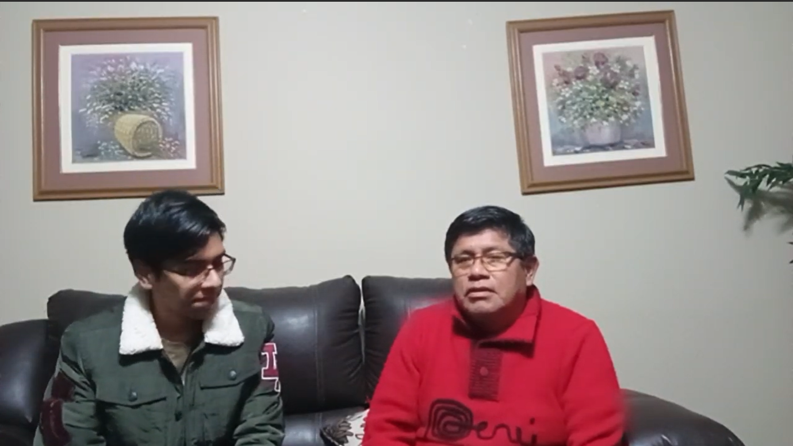

- Resumen:

El entrevistado es Alcides Rivera, un geriatra con más de 15 años de experiencia en medicina preventiva. Atiende entre 30 y 40 pacientes adultos mayores por semana y realiza su labor apoyándose principalmente en una laptop y un smartphone con sistema operativo Android. Para la comunicación digital con pacientes y familiares utiliza llamadas, correos electrónicos y WhatsApp. En el monitoreo clínico, se basa en expedientes médicos digitales y mediciones manuales realizadas durante las consultas.

El geriatra comenta que una de las principales dificultades en su labor es la falta de datos continuos sobre el estado de los pacientes, ya que la información disponible suele limitarse al momento de la cita médica. Esta limitación se refleja en la alta frecuencia de emergencias, recibiendo entre una o dos llamadas semanales relacionadas con caídas, descompensaciones o crisis de salud en adultos mayores.

Considera que disponer de información en tiempo real sobre signos vitales, patrones de actividad y alertas de riesgo sería de gran utilidad para mejorar la atención y la toma de decisiones. Actualmente, la coordinación con familiares se realiza por teléfono o correo electrónico, principalmente para actualizaciones y coordinación de citas médicas.

Alcides cree que contar con reportes digitales y alertas inmediatas fortalecería la detección temprana de complicaciones y optimizaría la respuesta médica. Ante la propuesta de una herramienta como MediTrack, se muestra dispuesto a adoptarla, siempre que demuestre ser una solución clínica confiable. Señala que los factores clave para confiar en un sistema de monitoreo remoto son la precisión de los datos, la posibilidad de personalizar alertas y el acceso al historial médico completo.

No obstante, identifica algunos desafíos para su implementación en la práctica médica, como el costo, la compatibilidad con los sistemas actuales y la curva de aprendizaje del personal. Además, considera que el financiamiento de una herramienta como esta debería ser compartido entre los pacientes y las instituciones de salud.

#### Entrevistas segmento objetivo personal de las casas de reposo

##### Cuidadores Casas De Reposo

- Nombres: Ana Rosa
- Apellidos: Quispe
- Edad: 48
- Distrito: Madrid - España
- Video Entrevista:
  [https://upcedupe-my.sharepoint.com/:v:/g/personal/u20221e646_upc_edu_pe/EbMya_8QywNLmNK4sv9l58gBgwDyZ6O5ipVFQkSkJQwQ9Q?e=owqpVJ&nav=eyJyZWZlcnJhbEluZm8iOnsicmVmZXJyYWxBcHAiOiJTdHJlYW1XZWJBcHAiLCJyZWZlcnJhbFZpZXciOiJTaGFyZURpYWxvZy1MaW5rIiwicmVmZXJyYWxBcHBQbGF0Zm9ybSI6IldlYiIsInJlZmVycmFsTW9kZSI6InZpZXcifSwicGxheWJhY2tPcHRpb25zIjp7InN0YXJ0VGltZUluU2Vjb25kcyI6MTIxNy4wOX19](https://upcedupe-my.sharepoint.com/:v:/g/personal/u20221e646_upc_edu_pe/EbMya_8QywNLmNK4sv9l58gBgwDyZ6O5ipVFQkSkJQwQ9Q?e=owqpVJ&nav=eyJyZWZlcnJhbEluZm8iOnsicmVmZXJyYWxBcHAiOiJTdHJlYW1XZWJBcHAiLCJyZWZlcnJhbFZpZXciOiJTaGFyZURpYWxvZy1MaW5rIiwicmVmZXJyYWxBcHBQbGF0Zm9ybSI6IldlYiIsInJlZmVycmFsTW9kZSI6InZpZXcifSwicGxheWJhY2tPcHRpb25zIjp7InN0YXJ0VGltZUluU2Vjb25kcyI6MTIxNy4wOX19)
- Timing:
- Inicio: 20:16
- Fin: 45:08
- Duración: 24 minutos con 51 segundos


- Resumen:

La entrevistada es Ana Rosa Quispe, profesional en asistencia social con más de diez años de experiencia en la Beneficencia de Lima, donde se dedicó al cuidado y apoyo de adultos mayores en situación de vulnerabilidad. Actualmente continúa su labor en España, brindando asistencia particular a personas mayores. Su trayectoria refleja un compromiso sostenido con este grupo etario y una comprensión profunda de los desafíos que implica su atención.

Durante su paso por la Beneficencia, enfrentó diversas dificultades derivadas de las condiciones de salud de los adultos mayores, quienes en su mayoría padecían múltiples enfermedades y malestares. A ello se sumaban la escasez de personal especializado y la falta de una comunicación efectiva entre los equipos de trabajo, lo que dificultaba ofrecer un servicio integral y oportuno. Estas limitaciones generaban un entorno laboral exigente, caracterizado por un cuidado continuo, emocionalmente desgastante y, en muchos casos, altamente estresante.

En cuanto a las herramientas utilizadas en ese contexto, menciona el uso de Internet Explorer como navegador y Microsoft Excel como recurso principal para la organización de datos. Actualmente utiliza un iPhone como su dispositivo móvil y emplea WhatsApp y correo electrónico como medios de comunicación con familiares y pacientes. Si bien estas herramientas resultan funcionales, reconoce que son insuficientes para gestionar la complejidad del cuidado geriátrico.

A partir de su experiencia, considera indispensable contar con una aplicación que permita un monitoreo organizado y eficiente de la salud de los adultos mayores, incorporando sistemas de alertas tempranas que faciliten la detección de emergencias o irregularidades. A su juicio, una herramienta de este tipo no solo mejoraría la calidad del servicio, sino que también reduciría la carga emocional y el nivel de estrés de los cuidadores.

En conjunto, Ana Rosa transmite una visión crítica y realista sobre las limitaciones del cuidado institucional de adultos mayores, pero al mismo tiempo muestra una clara apertura hacia la adopción de soluciones digitales. Su testimonio evidencia la necesidad urgente de herramientas tecnológicas que optimicen la organización, fortalezcan la comunicación entre profesionales y garanticen la seguridad y bienestar de los residentes en casas de reposo.

##### Cuidadores Casas De Reposo

- Nombres: Fanny
- Apellidos: Mendivil
- Edad: 57
- Distrito: Novara - Italia
- Video Entrevista:
  [https://upcedupe-my.sharepoint.com/:v:/g/personal/u20221e646_upc_edu_pe/EbMya_8QywNLmNK4sv9l58gBgwDyZ6O5ipVFQkSkJQwQ9Q?e=nYM0Mf&nav=eyJyZWZlcnJhbEluZm8iOnsicmVmZXJyYWxBcHAiOiJTdHJlYW1XZWJBcHAiLCJyZWZlcnJhbFZpZXciOiJTaGFyZURpYWxvZy1MaW5rIiwicmVmZXJyYWxBcHBQbGF0Zm9ybSI6IldlYiIsInJlZmVycmFsTW9kZSI6InZpZXcifSwicGxheWJhY2tPcHRpb25zIjp7InN0YXJ0VGltZUluU2Vjb25kcyI6NTk2LjA1fX0%3D](https://upcedupe-my.sharepoint.com/:v:/g/personal/u20221e646_upc_edu_pe/EbMya_8QywNLmNK4sv9l58gBgwDyZ6O5ipVFQkSkJQwQ9Q?e=nYM0Mf&nav=eyJyZWZlcnJhbEluZm8iOnsicmVmZXJyYWxBcHAiOiJTdHJlYW1XZWJBcHAiLCJyZWZlcnJhbFZpZXciOiJTaGFyZURpYWxvZy1MaW5rIiwicmVmZXJyYWxBcHBQbGF0Zm9ybSI6IldlYiIsInJlZmVycmFsTW9kZSI6InZpZXcifSwicGxheWJhY2tPcHRpb25zIjp7InN0YXJ0VGltZUluU2Vjb25kcyI6NTk2LjA1fX0%3D)
- Timing:
- Inicio: 9:56
- Fin: 20:16
- Duración: 10 minutos con 20 segundos


- Resumen:

La entrevistada es Fanny Mendívil, de 57 años, quien actualmente reside en Italia y se dedica a la asistencia de adultos mayores, tanto de manera particular como en entornos colectivos. Su experiencia le ha permitido conocer de cerca las demandas físicas y emocionales del cuidado, señalando que esta labor puede resultar exigente y requiere un trato constante basado en la paciencia, empatía y calma, especialmente considerando que muchos de los adultos mayores a su cargo padecen enfermedades crónicas, principalmente de tipo cardíaco y respiratorio.

En su rutina laboral destaca la importancia del monitoreo frecuente, ya que considera esencial revisar periódicamente el estado de salud de los adultos mayores para prevenir complicaciones y responder con rapidez ante cualquier emergencia. Este enfoque refuerza su interés en contar con herramientas digitales que optimicen la supervisión diaria y permitan una atención más organizada y segura.

Respecto al uso de la tecnología, menciona que su navegador principal es Google Chrome y que utiliza un iPhone como su dispositivo central para las actividades cotidianas. Emplea con frecuencia WhatsApp y correo electrónico para comunicarse con familiares o coordinadores, lo que refleja un perfil práctico y habituado al uso de herramientas móviles, facilitando la adopción de aplicaciones orientadas al cuidado geriátrico.

Fanny considera de gran valor la implementación de una solución como MediTrack, especialmente si permite un monitoreo organizado y la generación de alertas inmediatas ante irregularidades en los datos biométricos. En su opinión, una herramienta de este tipo no solo fortalecería la seguridad y bienestar de los adultos mayores, sino que también representaría un apoyo emocional y operativo para los cuidadores, al reducir el nivel de carga y estrés asociado al trabajo constante.

En conjunto, Fanny Mendívil transmite una visión empática y realista del cuidado de adultos mayores. Reconoce las dificultades inherentes a la labor, pero al mismo tiempo muestra una actitud abierta hacia la innovación tecnológica, identificando en las aplicaciones móviles una oportunidad concreta para mejorar tanto la calidad del cuidado como la salud emocional de quienes lo brindan.

##### Cuidadores Casas De Reposo

- Nombres: Judith Jesus
- Apellidos: Ayala Maurtua
- Edad: 56
- Distrito: Pueblo Libre
- Video Entrevista:
  [https://upcedupe-my.sharepoint.com/:v:/g/personal/u20221e646_upc_edu_pe/EbMya_8QywNLmNK4sv9l58gBgwDyZ6O5ipVFQkSkJQwQ9Q?e=a1lUch&nav=eyJyZWZlcnJhbEluZm8iOnsicmVmZXJyYWxBcHAiOiJTdHJlYW1XZWJBcHAiLCJyZWZlcnJhbFZpZXciOiJTaGFyZURpYWxvZy1MaW5rIiwicmVmZXJyYWxBcHBQbGF0Zm9ybSI6IldlYiIsInJlZmVycmFsTW9kZSI6InZpZXcifSwicGxheWJhY2tPcHRpb25zIjp7fX0%3D](https://upcedupe-my.sharepoint.com/:v:/g/personal/u20221e646_upc_edu_pe/EbMya_8QywNLmNK4sv9l58gBgwDyZ6O5ipVFQkSkJQwQ9Q?e=a1lUch&nav=eyJyZWZlcnJhbEluZm8iOnsicmVmZXJyYWxBcHAiOiJTdHJlYW1XZWJBcHAiLCJyZWZlcnJhbFZpZXciOiJTaGFyZURpYWxvZy1MaW5rIiwicmVmZXJyYWxBcHBQbGF0Zm9ybSI6IldlYiIsInJlZmVycmFsTW9kZSI6InZpZXcifSwicGxheWJhY2tPcHRpb25zIjp7fX0%3D)
- Timing:
- Inicio: 0:00
- Fin: 5:21
- Duración: 5 minutos con 21 segundos


- Resumen:

La entrevistada es Judith Ayala, enfermera de turno rotativo en una casa de reposo, responsable de la supervisión diaria de entre 18 y 20 residentes. Su labor combina la atención médica directa con la gestión del monitoreo general de los pacientes, lo que implica una alta carga de responsabilidad y coordinación constante. Para el desarrollo de sus tareas utiliza principalmente smartphones y computadoras para actualizar los datos clínicos, además de comunicarse con familiares y médicos mediante llamadas semanales y WhatsApp, reflejando un uso práctico y adaptado de la tecnología.

En cuanto al monitoreo del estado de salud de los residentes, explica que se realizan rondas cada hora, especialmente en el caso de los pacientes más críticos. Sin embargo, identifica como principal dificultad la falta de personal y equipos suficientes, lo que vuelve complejo y tedioso supervisar a todos los residentes de manera simultánea. Entre los eventos críticos más frecuentes menciona desniveles en la presión arterial, falta de oxígeno y aceleraciones cardíacas, situaciones que requieren respuesta inmediata.

Judith considera que la información en tiempo real sobre la ubicación, los malestares generales y las alertas automáticas ante accidentes o variaciones de salud sería de gran ayuda para optimizar su labor. En casos de emergencia, el procedimiento actual consiste en contactar al hospital más cercano mientras se aplican primeros auxilios dentro del establecimiento.

Respecto a una solución como MediTrack, la enfermera destaca su alto potencial para facilitar los chequeos médicos y mejorar la seguridad de los residentes. Entre las funcionalidades que considera imprescindibles se encuentran la obtención de datos biométricos, las alertas inmediatas y un sistema de mapa de calor que permita detectar patrones de movimiento diario.

No obstante, identifica como principales barreras para su implementación el costo del sistema y la capacitación necesaria para el personal. Aun así, expresa que los familiares de los residentes probablemente estarían dispuestos a pagar un valor adicional por el servicio, al brindarles tranquilidad y confianza en el cuidado de sus seres queridos. Judith utiliza un dispositivo Android, lo que demuestra familiaridad con entornos móviles y una buena disposición hacia la adopción de soluciones digitales.

### 2.2.3. Análisis de entrevistas

**Segmento 1: Allegados de adultos mayores**

El segmento de aliados o familiares está conformado por tres entrevistados, todos con experiencias directas en el cuidado de adultos mayores dentro del entorno familiar. Los participantes tienen entre 19 y 58 años y residen en distintas zonas de Lima Metropolitana. Este grupo se caracteriza por un alto nivel de compromiso emocional, una preocupación constante por la salud y seguridad de sus familiares mayores, y una predisposición favorable hacia el uso de soluciones tecnológicas que faciliten el monitoreo remoto.

**Características objetivas**

| Característica                                                               | Descripción                                                                                  | Porcentaje |
| ---------------------------------------------------------------------------- | -------------------------------------------------------------------------------------------- | ---------- |
| Uso de smartphone Android                                                    | Dos de los tres entrevistados utilizan dispositivos Android, mientras que uno emplea iPhone. | 67 %       |
| Navegador principal: Google Chrome                                           | Todos los entrevistados señalaron que Chrome es su navegador de preferencia.                 | 100 %      |
| Canal de comunicación principal: WhatsApp                                    | Todos utilizan WhatsApp para comunicarse con sus familiares o cuidadores.                    | 100 %      |
| Frecuencia de contacto con el adulto mayor: diaria o varias veces por semana | Muestran una comunicación constante con el familiar a su cuidado.                            | 100 %      |

**Características subjetivas**

| Categoría                                                                   | Descripción                                                                                      | Porcentaje |
| --------------------------------------------------------------------------- | ------------------------------------------------------------------------------------------------ | ---------- |
| Motivación principal: bienestar y prevención de riesgos                     | Los tres entrevistados expresaron preocupación por prevenir emergencias y garantizar seguridad.  | 100 %      |
| Frustración: falta de información en tiempo real                            | Dos entrevistados mencionaron la angustia de no saber el estado del adulto mayor en emergencias. | 67 %       |
| Actitud hacia la tecnología: positiva y confiada                            | Todos manifestaron disposición a usar una app si ofrece datos confiables y fáciles de entender.  | 100 %      |
| Barreras percibidas: complejidad tecnológica o desconfianza en la precisión | Dos participantes señalaron estos factores como obstáculos para adoptar la app.                  | 67 %       |
| Disposición de pago por la solución                                         | Todos indicaron estar dispuestos a pagar por una herramienta que brinde tranquilidad.            | 100 %      |

**Segmento 2: Médicos**

El segmento de médicos está conformado por tres profesionales generales que ejercen activamente en centros de salud de nivel básico a intermedio en Lima Metropolitana. Todos atienden regularmente entre 50 y 100 adultos mayores por semana y cuentan con experiencia significativa en geriatría. Este grupo se caracteriza por un enfoque técnico y orientado a resultados, una preocupación constante por la prevención y la atención eficiente de emergencias en adultos mayores, y una disposición favorable hacia el uso de herramientas digitales clínicamente validadas que faciliten el monitoreo en tiempo real y el seguimiento de tratamientos.

**Características objetivas**

| Característica                          | Descripción                                                                                              | Porcentaje                 |
| --------------------------------------- | -------------------------------------------------------------------------------------------------------- | -------------------------- |
| Experiencia en atención geriátrica      | Todos los médicos atienden adultos mayores regularmente, con cargas semanales de 30 a 100 pacientes.     | 100 %                      |
| Uso de smartphone                       | Dos utilizan iPhone y uno Android para comunicación con pacientes/familiares.                            | 67 % iPhone / 33 % Android |
| Uso de computadora/laptop               | Todos usan PC para registrar consultas y gestionar información clínica.                                  | 100 %                      |
| Navegador principal                     | Todos utilizan Google Chrome para sistemas institucionales y consultas médicas.                          | 100 %                      |
| Canales de comunicación principales     | Todos usan WhatsApp, correo electrónico y llamadas telefónicas para contacto con pacientes y familiares. | 100 %                      |
| Necesidad de información en tiempo real | Todos destacan la importancia de contar con datos inmediatos sobre los pacientes geriátricos.            | 100 %                      |

**Características subjetivas**

| Categoría                                      | Descripción                                                                                            | Porcentaje |
| ---------------------------------------------- | ------------------------------------------------------------------------------------------------------ | ---------- |
| Motivación principal                           | Mejorar prevención, atención domiciliaria y calidad de cuidado de adultos mayores.                     | 100 %      |
| Frustración                                    | Dependencia de información tardía, falta de alertas inmediatas y coordinación limitada entre sistemas. | 100 %      |
| Actitud hacia la tecnología                    | Positiva, abierta a usar MediTrack si garantiza precisión, confiabilidad y respaldo clínico.           | 100 %      |
| Barreras percibidas                            | Costos de implementación, necesidad de capacitación y confianza en la veracidad de datos.              | 100 %      |
| Disposición de pago o modelo de financiamiento | Prefieren modelos compartidos entre instituciones, pacientes y familias para viabilizar la adopción.   | 100 %      |

**Segmento 3: Cuidadores en Casas de Reposo**

El segmento de cuidadores está conformado por tres profesionales con experiencia directa en instituciones geriátricas en Perú y Europa. Los participantes tienen entre 48 y 57 años y poseen más de 10 años de experiencia en el cuidado de adultos mayores. Este grupo se caracteriza por enfrentar altos niveles de estrés debido a la falta de personal y recursos, pero al mismo tiempo muestra una alta apertura hacia soluciones digitales como MediTrack. Son usuarios habituales de Google Chrome y teléfonos móviles, evidenciando adaptabilidad tecnológica práctica. Se destacan por valorar herramientas que reduzcan la carga laboral, mejoren la eficiencia mediante alertas tempranas y permitan un seguimiento más efectivo de los tratamientos y signos vitales, además de favorecer la comunicación entre cuidadores, familiares y médicos.

### Segmento: Cuidadores

**Características objetivas**

| Característica                        | Descripción                                                                                                           | Porcentaje                 |
| ------------------------------------- | --------------------------------------------------------------------------------------------------------------------- | -------------------------- |
| Experiencia en cuidado geriátrico     | Todos cuentan con más de 10 años de experiencia en instituciones geriátricas.                                         | 100 %                      |
| Carga de residentes/pacientes         | Supervisan entre 18 y 100 adultos mayores según el centro de trabajo.                                                 | 100 %                      |
| Dispositivo principal                 | Dos utilizan iPhone y uno Android para comunicación y gestión diaria.                                                 | 67 % iPhone / 33 % Android |
| Navegador principal                   | Google Chrome como herramienta digital principal.                                                                     | 100 %                      |
| Canales de comunicación               | WhatsApp, correo electrónico y llamadas telefónicas con familiares y otros cuidadores.                                | 100 %                      |
| Necesidad de monitoreo en tiempo real | Todos destacan la importancia de recibir alertas inmediatas y seguimiento constante de signos vitales y tratamientos. | 100 %                      |

**Características subjetivas**

| Categoría                       | Descripción                                                                                                        | Porcentaje |
| ------------------------------- | ------------------------------------------------------------------------------------------------------------------ | ---------- |
| Motivación principal            | Mejorar la eficiencia del cuidado, reducir estrés laboral y garantizar la seguridad de los adultos mayores.        | 100 %      |
| Frustración                     | Escasez de personal, falta de recursos y comunicación insuficiente entre equipos y familiares.                     | 100 %      |
| Actitud hacia la tecnología     | Positiva, alta disposición para adoptar soluciones digitales como MediTrack.                                       | 100 %      |
| Barreras percibidas             | Costo del sistema y necesidad de capacitación del personal.                                                        | 100 %      |
| Funcionalidades clave valoradas | Alertas inmediatas, monitoreo de signos vitales, seguimiento de tratamientos y organización de la atención diaria. | 100 %      |
| Disposición de pago             | Consideran que familiares podrían estar dispuestos a pagar por tranquilidad y seguridad adicional.                 | 100 %      |

## 2.3. Needfinding

En esta sección, MediTrack busca identificar y comprender de manera profunda las necesidades, motivaciones y frustraciones de los distintos actores involucrados en el cuidado de adultos mayores. A través de entrevistas y observaciones, se ha recopilado información cualitativa que permite detectar oportunidades de mejora y diseñar soluciones que respondan de manera efectiva a los desafíos reales que enfrentan los usuarios.

### 2.3.1. User Personas

Para traducir los hallazgos del needfinding en herramientas de diseño concretas, se han desarrollado user personas que representan de manera clara y detallada los distintos segmentos de usuarios. Estas personas sintetizan características objetivas y subjetivas, permitiendo a MediTrack comprender mejor a sus usuarios, anticipar sus necesidades y diseñar funcionalidades que generen valor tanto para adultos mayores como para cuidadores y profesionales de la salud.

### User Persona – Doctor

Esta persona se construyó directamente a partir de las entrevistas a médicos generales y geriatras. Refleja sus necesidades de contar con información en tiempo real, mejorar la prevención y atención de emergencias, y utilizar herramientas digitales confiables. Los hallazgos muestran sus frustraciones con los sistemas actuales y la disposición a adoptar soluciones como MediTrack.


### User Persona – Allegado de Adulto Mayor

Esta persona se creó basándose en las entrevistas a familiares de adultos mayores. Representa a usuarios comprometidos con el cuidado y la seguridad de sus seres queridos, preocupados por recibir información confiable y constantes actualizaciones sobre su bienestar. También refleja la necesidad de interfaces simples y claras para facilitar la adopción de la app.


### User Persona – Cuidador

Esta persona se basa en las entrevistas a cuidadores de casas de reposo. Refleja la experiencia, la carga laboral y la necesidad de herramientas que faciliten el monitoreo diario de los adultos mayores, con alertas inmediatas y seguimiento de tratamientos. Destaca la disposición a usar soluciones digitales que reduzcan estrés y mejoren la organización del trabajo.


### 2.3.2. User Task Matrix

En esta sección se presenta el User Task Matrix de los segmentos objetivos del proyecto: allegados, personal médico y personal de casas de reposo.
El objetivo es identificar y organizar las tareas que cada segmento realiza en su actividad diaria, antes de la implementación de MediTrack, destacando la frecuencia y la importancia de cada tarea.
Esta información permitirá comprender mejor las necesidades reales de los usuarios y servir como base para el diseño de soluciones efectivas.

| TASK                                        | Allegados – FREQUENCY | Allegados – IMPORTANCE | Personal médico – FREQUENCY | Personal médico – IMPORTANCE | Casas de reposo – FREQUENCY | Casas de reposo – IMPORTANCE |
| ------------------------------------------- | --------------------- | ---------------------- | --------------------------- | ---------------------------- | --------------------------- | ---------------------------- |
| Llamar o contactar al adulto mayor          | Often                 | High                   | Rarely                      | Medium                       | Rarely                      | Medium                       |
| Coordinar visitas o citas                   | Often                 | High                   | Often                       | High                         | Often                       | High                         |
| Revisar estado de salud manualmente         | Sometimes             | Medium                 | Often                       | High                         | Often                       | High                         |
| Registrar datos de pacientes manualmente    | Sometimes             | Medium                 | Often                       | High                         | Often                       | High                         |
| Supervisar signos vitales o rutinas diarias | Rarely                | Medium                 | Often                       | High                         | Often                       | High                         |
| Atender emergencias o incidentes            | Rarely                | High                   | Often                       | High                         | Often                       | High                         |
| Revisar reportes de familiares o cuidadores | Often                 | High                   | Sometimes                   | Medium                       | Sometimes                   | Medium                       |
| Coordinar con otros profesionales de salud  | Sometimes             | Medium                 | Often                       | High                         | Often                       | High                         |
| Dar seguimiento a tratamientos o medicación | Sometimes             | Medium                 | Often                       | High                         | Often                       | High                         |

### 2.3.3. User Journey Mapping

En esta sección se presentan los Journey Maps de los segmentos objetivos: doctor, allegado de adulto mayor y enfermera.
Los Journey Maps permiten visualizar paso a paso la experiencia de cada usuario en relación con la atención y cuidado de adultos mayores, identificando puntos críticos, oportunidades de mejora y emociones asociadas a cada etapa de su interacción con el servicio.

### Journey Mapping – Doctor

El journey map de Luis Jiménez, médico geriatra en una casa de reposo, muestra cómo descubre en MediTrack una herramienta clave para mejorar la atención de sus pacientes mayores. A lo largo de su experiencia, pasa de enfrentar la falta de datos en tiempo real y la sobrecarga de trabajo a utilizar alertas y reportes automatizados que optimizan su diagnóstico y prevención, reflejando una evolución hacia una práctica médica más eficiente, conectada y confiable.


### Journey Mapping – Allegado de Adulto Mayor

El journey map de Valeria Pancorbo, arquitecta e hija de una adulta mayor, refleja cómo encuentra en MediTrack una solución tecnológica para cuidar a su madre a distancia. Su experiencia pasa de la ansiedad y la incertidumbre por no poder estar presente todo el tiempo, a la tranquilidad de recibir alertas y monitorear signos vitales en tiempo real, lo que le permite equilibrar su vida laboral con el bienestar y seguridad de su madre.


### Journey Mapping – Enfermera

El journey map de Carla Fernández, enfermera en una casa de reposo, refleja su transición de la frustración por no poder supervisar a todos los adultos mayores simultáneamente hacia la satisfacción de contar con MediTrack como apoyo tecnológico. Gracias al monitoreo en tiempo real y las alertas automáticas, Carla logra optimizar su trabajo, reducir el estrés y brindar una atención más segura y coordinada a sus residentes.


### 2.3.4. Empathy Mapping

En esta sección se presentan los Empathy Maps correspondientes a los segmentos objetivos: doctor, allegado de adulto mayor y enfermera.
Los Empathy Maps ayudan a comprender las necesidades, preocupaciones, motivaciones y frustraciones de los usuarios, proporcionando un entendimiento profundo de su perspectiva y sirviendo como base para diseñar soluciones centradas en sus experiencias y emociones.

### Empathy Mapping – Doctor

El Dr. Luis Jiménez, médico geriatra en una casa de reposo, se siente frustrado por la sobrecarga de pacientes y la falta de información en tiempo real que le impide anticiparse a emergencias. Escucha a colegas y familiares demandar soluciones más confiables y observa la necesidad de herramientas digitales que mejoren el monitoreo y la coordinación. Busca brindar atención médica de calidad, reducir complicaciones y ofrecer tranquilidad a las familias mediante tecnología que respalde su labor clínica.


### Empathy Mapping – Allegado de Adulto Mayor

El Empathy Map de Valeria Pancorbo muestra a una hija cuidadora que vive la ansiedad de no poder estar físicamente con su madre y el miedo a que algo ocurra sin que ella lo sepa. Busca una solución tecnológica confiable que le brinde tranquilidad, permitiéndole monitorear la salud de su madre a distancia y reaccionar ante emergencias. Valeria desea equilibrar su vida laboral con el cuidado familiar, reducir su carga emocional y sentirse segura de que su madre está protegida en todo momento.


### Empathy Mapping – Enfermera

El Empathy Map de Carla Fernández refleja la realidad de una enfermera que enfrenta la presión de cuidar simultáneamente a numerosos adultos mayores con recursos limitados y sistemas poco integrados. Se siente preocupada por no poder atender a todos a tiempo, pero confía en que la tecnología puede ayudarla a reducir riesgos y mejorar la atención. Busca herramientas que automaticen alertas, faciliten la coordinación con médicos y familiares, y le brinden tranquilidad al disminuir su carga laboral y el estrés diario.


## 2.4. Big Picture EventStorming

El equipo llevó a cabo una sesión colaborativa de Big Picture Event Storming (BPES) con el propósito de comprender de manera integral el dominio del negocio de MediTrack. Esta dinámica permitió identificar los eventos significativos del sistema, sus relaciones y dependencias, construyendo así una visión de alto nivel sobre los procesos clave. El ejercicio no solo buscó mapear el landscape del negocio, sino también detectar oportunidades de mejora, riesgos potenciales y áreas críticas para la futura implementación tecnológica.

### Resumen del proceso:

La sesión se desarrolló siguiendo la guía de pasos recomendada en BPES Step-by-Step Guide
, adaptándola al contexto de MediTrack. El flujo de trabajo incluyó:

Exploración inicial del dominio: Cada integrante aportó conocimiento desde su rol, identificando interacciones entre usuarios principales (adultos mayores, médicos, cuidadores, administradores de clínica y familiares).

Identificación de eventos clave: Se mapearon eventos de negocio como “Usuario registrado”, “Agregado miembro de familia”, “Dispositivo IoT registrado”, “Dato de presión arterial registrado” o “Se envió alerta crítica”

Agrupación en bounded contexts: Los eventos se organizaron en agregados y bounded contexts tales como:

User Management

Device Management

Dashboard & Analytics

Relationship Management

Report Management

Identity & Access Management

Detección de políticas y reglas de negocio: Se documentaron políticas asociadas, como la necesidad de validación de datos, gestión de usuarios premium/enterprise y generación de reportes automatizados

### Capturas y explicación de etapas

En la siguiente imagen del mapa de eventos se visualizan los eventos distribuidos en tarjetas (post-its), conectados con agregados y bounded contexts:

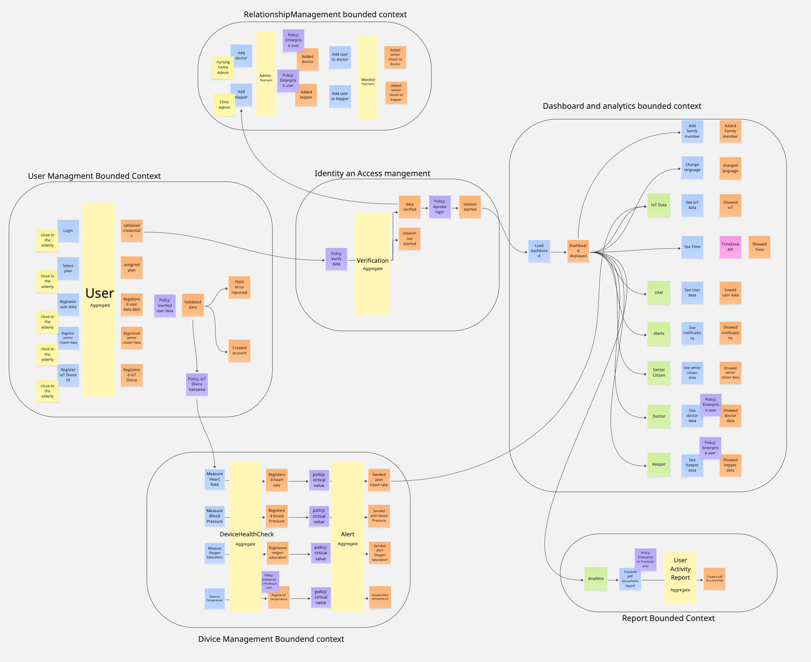

Zona de Registro y Validación: Incluye eventos como creación de cuenta, validación de credenciales y asociación de familiares. Esta sección refleja la importancia de la seguridad y la confiabilidad de datos de los adultos mayores.

Zona de Monitoreo y Dispositivos IoT: Representa los registros de signos vitales (frecuencia cardíaca, presión arterial, saturación de oxígeno, temperatura) y la generación automática de alertas críticas. Se evidencia la integración con dispositivos de salud como un punto central del dominio

Zona de Relación y Gestión Médica: Destaca la asignación de adultos mayores a médicos o cuidadores, mostrando la necesidad de coordinación multi-actor.

Zona de Reportes y Analítica: Muestra la generación de documentos PDF, reportes de actividad y analítica para clínicas y familiares, revelando la orientación a trazabilidad y toma de decisiones.

## 2.5. Ubiquitous Language

En esta sección, se definen los términos clave utilizados en el dominio de negocio de MediTrack, una plataforma digital diseñada para facilitar el monitoreo, gestión y acompañamiento de la salud de adultos mayores en clínicas, casas de reposo y entornos familiares. Siguiendo el enfoque de Ubiquitous Language propuesto por Eric Evans en Domain-Driven Design, estas definiciones buscan establecer un lenguaje común, claro y coherente entre todos los involucrados en el proyecto: equipo de desarrollo, diseñadores, stakeholders y usuarios finales. Este lenguaje compartido permite alinear la visión del producto con las necesidades reales de los adultos mayores y sus cuidadores, facilitando la toma de decisiones, el diseño funcional y el desarrollo de soluciones efectivas y centradas en el usuario.

- Admin
  Usuario con permisos de gestión dentro de una clínica o casa de reposo afiliada a MediTrack. Es responsable de registrar pacientes, asignar doctores y cuidadores, supervisar el estado de salud de los adultos mayores y generar reportes institucionales.

- Doctor
  Profesional de la salud registrado en MediTrack por administrador. Puede acceder a la información médica de los adultos mayores asignados, registrar diagnósticos, prescribir tratamientos y generar reportes clínicos.

- Caregiver

  Profesional que brinda asistencia directa y diaria a un adulto mayor en casa de reposo, registrado por un administrador. Su función principal es actualizar la información en tiempo real (estado de ánimo, signos vitales) y responder a alertas generadas por el sistema.

- Senior citizen
  Usuario principal de MediTrack. Representa a la persona de la tercera edad que es el centro del sistema y sobre la cual se administran todos los datos médicos y de bienestar. Puede ser portador del dispositivo IoT (para el monitoreo en tiempo real) y/o utilizar la Web Application para visualizar su información y recibir notificaciones. Su perfil es gestionado y acompañado por doctores, cuidadores y administradores dentro de la plataforma.

- Report
  Registro estructurado de información relevante en la plataforma. Puede referirse a un estado clínico, evolución médica, incidente o evaluación periódica del adulto mayor. Los reportes pueden ser generados por doctores, cuidadores o administradores.

- Alert
  Notificación inmediata generada por la plataforma ante situaciones críticas o inusuales (ejemplo: caída, anomalía en signos vitales). Su objetivo es garantizar una respuesta rápida de cuidadores y doctores según la gravedad del evento.

- Vital signs
  Información registrada periódicamente sobre parámetros de salud del adulto mayor (frecuencia cardíaca, presión arterial, oxigenación, temperatura). Base para alertas y reportes médicos.

- IoT Device
  Equipamiento utilizado para el monitoreo en tiempo real de los adultos mayores, enviando datos sobre actividad y signos vitales a MediTrack.

- Profile
  Conjunto de información personal y médica de un adulto mayor, allegado, doctor, cuidador o administrador. Central para la gestión y acceso a la información en MediTrack.

- Save / Register
  Acción de almacenar información en la plataforma. Puede aplicarse a datos de adultos mayores, signos vitales, reportes, tratamientos o configuraciones.

- Add
  Acción de introducir nuevos elementos en la plataforma, como un adulto mayor, un cuidador, un doctor o un plan de cuidado.

- Statistic
  Representa datos agregados sobre la salud, bienestar y seguimiento de los adultos mayores. Incluye indicadores como evolución de signos vitales, cumplimiento de tratamientos, frecuencia de alertas o actividad física. Estas métricas son consultadas por doctores, cuidadores, administradores y allegados para tomar decisiones informadas.

- Specialty
Representa la información o profeción de un doctor registrado en el sistema.

- Assigned to
Referencia a que cuidador o doctor se encuentra asignado un senior citizen.

- LogOut
Acción enfocada en la salida o cierre de sesión de un usuario en la plataforma. 

# Capítulo III: Requirements Specification

## 3.1. User Stories

Las User Stories representan los requisitos funcionales del sistema desde la perspectiva del usuario. Cada historia describe una necesidad específica, su contexto y los criterios de aceptación que garantizan su correcta implementación. En este conjunto se abarcan flujos clave como el registro, inicio de sesión, visualización de información, gestión de usuarios y administración de clínicas y casas de reposo, priorizadas según su valor para el negocio.

| EPIC ID | TÍTULO                                       |
| ------- | -------------------------------------------- |
| EP01    | Landing Page e Información Inicial           |
| EP02    | Registro e Inicio de Sesión                  |
| EP03    | Gestión de Clínicas                          |
| EP04    | Gestión de Casas de Reposo                   |
| EP05    | Dashboard del Usuario (Allegados/Familiares) |
| EP06    | Operaciones Generales                        |

| Story ID | Título                                                              | Descripción                                                                                                                                                                                       | Criterios de Aceptación                                                                                                                                                                                                                                                                                                                                                                                                                                                                                                                                                                                                                                                                                                                                                                                                                                                                                                                                                                                                                          | Epic ID |
| -------- | ------------------------------------------------------------------- | ------------------------------------------------------------------------------------------------------------------------------------------------------------------------------------------------- | ------------------------------------------------------------------------------------------------------------------------------------------------------------------------------------------------------------------------------------------------------------------------------------------------------------------------------------------------------------------------------------------------------------------------------------------------------------------------------------------------------------------------------------------------------------------------------------------------------------------------------------------------------------------------------------------------------------------------------------------------------------------------------------------------------------------------------------------------------------------------------------------------------------------------------------------------------------------------------------------------------------------------------------------------ | ------- |
| US01     | Visualización de la Landing Page                                    | Como visitante, quiero acceder a la landing page para conocer la solución de cuidado geriatrico                                                                                                   | Escenario 1: Acceso a la landing page.<br>Given tengo el url de acceso a la página principal de la landing page<br>When hago click en la url<br>Then se muestra completamente la información general de la solución propuesta.<br> Escenario 2: Falla en la carga<br>Given que la pagina no responde o no carga<br>When el servidor responde con error<br>Then <br>se muestra un mensaje de error genérico y la opción de intentar de nuevo                                                                                                                                                                                                                                                                                                                                                                                                                                                                                                                                                                                                      | EP01    |
| US02     | Visualizar Problemas Actuales                                       | Como visitante, quiero ver claramente los problemas actuales en el cuidado geriátrico para entender la importancia de la solución.                                                                | Escenario 1:<br>Given estoy en la landing page<br>When hago scroll a la sección de problemas<br>Then se muestran los puntos de "Emergencias No Detectadas", "Monitoreo Irregular" y "Desconexión Familiar".                                                                                                                                                                                                                                                                                                                                                                                                                                                                                                                                                                                                                                                                                                                                                                                                                                      | EP01    |
| US03     | Visualizar Soluciones Propuestas                                    | Como visitante, quiero ver las soluciones tecnológicas de MediTrack para evaluar su utilidad en mi práctica profesional.                                                                          | Escenario 1:<br>Given estoy en la sección de "Nuestra Solución"<br>When reviso la información<br>Then se muestran claramente "Detección Inmediata", "Monitoreo Continuo" y "Conexión Total".                                                                                                                                                                                                                                                                                                                                                                                                                                                                                                                                                                                                                                                                                                                                                                                                                                                     | EP01    |
| US04     | Visualizar Impacto en Cifras                                        | Como visitante, quiero ver indicadores de impacto (reducción de emergencias, satisfacción familiar, etc.) para confiar en la solución.                                                            | Escenario 1:<br>Given estoy en la sección de impacto<br>When hago scroll<br>Then se muestran métricas de reducción de emergencias (85%), satisfacción (95%), reducción en hospitalizaciones (85%), monitoreo continuo (24/7).                                                                                                                                                                                                                                                                                                                                                                                                                                                                                                                                                                                                                                                                                                                                                                                                                    | EP01    |
| US05     | Ver Tecnologías que Salvan Vidas                                    | Como visitante, quiero conocer los dispositivos y sensores que usa MediTrack para evaluar su fiabilidad.                                                                                          | Escenario 1:<br>Given estoy en la sección de "Tecnologías que salvan vidas"<br>When la reviso<br>Then se muestran conectividad, seguridad, autonomía, sensores, tiempo real y precisión.                                                                                                                                                                                                                                                                                                                                                                                                                                                                                                                                                                                                                                                                                                                                                                                                                                                         | EP01    |
| US06     | Ver Nuestra Misión                                                  | Como visitante, quiero entender la misión de MediTrack para confiar en la seriedad de la empresa.                                                                                                 | Escenario 1:<br>Given estoy en la sección de "Misión y Visión"<br>When reviso<br>Then veo una misión clara enfocada en mejorar la calidad de vida con tecnología accesible.                                                                                                                                                                                                                                                                                                                                                                                                                                                                                                                                                                                                                                                                                                                                                                                                                                                                      | EP01    |
| US07     | Ver Nuestra Visión                                                  | Como visitante, quiero conocer la visión a futuro de MediTrack para evaluar su proyección en el mercado.                                                                                          | Escenario 1:<br>Given estoy en la misma sección<br>When hago scroll<br>Then se muestra una visión con metas a 5 años y liderazgo en América Latina.                                                                                                                                                                                                                                                                                                                                                                                                                                                                                                                                                                                                                                                                                                                                                                                                                                                                                              | EP01    |
| US08     | Consultar Plan Gratuito                                             | Como visitante, quiero ver el plan gratuito para empezar a probar MediTrack sin compromiso.                                                                                                       | Escenario 1:<br>Given estoy en la sección de planes<br>When revisó el plan gratuito<br>Then se muestran beneficios: monitoreo de signos vitales, alertas en tiempo real, acceso web.                                                                                                                                                                                                                                                                                                                                                                                                                                                                                                                                                                                                                                                                                                                                                                                                                                                             | EP01    |
| US09     | Consultar Plan Premium                                              | Como visitante, quiero ver el plan premium con más beneficios para decidir si invertir.                                                                                                           | Escenario 1:<br>Given estoy en la sección de planes<br>When seleccionó Premium<br>Then veo beneficios: informes personalizados, soporte prioritario, etc.                                                                                                                                                                                                                                                                                                                                                                                                                                                                                                                                                                                                                                                                                                                                                                                                                                                                                        | EP01    |
| US10     | Consultar Plan Enterprise                                           | Como visitante, quiero ver el plan Enterprise para soluciones a gran escala.                                                                                                                      | Escenario 1:<br>Given estoy en la sección de planes<br>When selecciono Enterprise<br>Then se muestra opción de contacto directo para cotización.                                                                                                                                                                                                                                                                                                                                                                                                                                                                                                                                                                                                                                                                                                                                                                                                                                                                                                 | EP01    |
| US11     | Acceder al Formulario de Contacto                                   | Como visitante, quiero llenar un formulario para recibir más información personalizada.                                                                                                           | Escenario 1:<br>Given estoy en la sección de contacto<br>When ingreso mis datos y presiono enviar<br>Then se confirma que la solicitud fue registrada.                                                                                                                                                                                                                                                                                                                                                                                                                                                                                                                                                                                                                                                                                                                                                                                                                                                                                           | EP01    |
| US12     | Información de Contacto Alternativa                                 | Como visitante, quiero ver datos de contacto directo (teléfono, email) para comunicarme sin usar formulario.                                                                                      | Escenario 1:<br>Given estoy en la sección de contacto<br>When revisó los datos<br>Then se muestran teléfono, correo electrónico y dirección.                                                                                                                                                                                                                                                                                                                                                                                                                                                                                                                                                                                                                                                                                                                                                                                                                                                                                                     | EP01    |
| US13     | Visualizar Planes Disponibles                                       | Como visitante, quiero visualizar los planes que ofrece MediTrack, para elegir el que mejor se adapte a mis necesidades.                                                                          | Escenario 1: Visualización de planesGiven selecciono “No tengo cuenta” en la pantalla de inicio de sesión When accedo a la sección de planesThen visualizo tres planes que me ofrece MediTrack con nombre, características y precio.                                                                                                                                                                                                                                                                                                                                                                                                                                                                                                                                                                                                                                                                                                                                                                                                             | EP01    |
| US14     | Acceso al formulario de inicio de sesión                            | Como visitante, quiero acceder al formulario de inicio de sesión del Aplicativo al hacer clic en el botón para poder ingresar mis credenciales.                                                   | Escenario 1: Visualización de formulario<br>Given ingreso a la landing page<br>When hago click en la opción de inicio de sesión<br>Then visualizo el formulario de inicio de sesión.<br>Escenario 2: Acceso directo mediante enlace URL<br>Given que accedo mediante el enlace directo<br>When la página carga<br>Then el formulario carga correctamente.                                                                                                                                                                                                                                                                                                                                                                                                                                                                                                                                                                                                                                                                                        | EP02    |
| US15     | Iniciar Sesión en MediTrack                                         | Como usuario, quiero iniciar sesión con mis credenciales, para acceder a mi dashboard y gestionar la información de salud correspondiente.                                                        | Escenario 1: Inicio de sesión exitoso Given tengo una cuenta válida When ingreso mi correo y contraseña correctos Then accedo directamente al dashboard de MediTrack.<br>Escenario 2: Inicio de sesión fallido Given no ingreso credenciales válidas When intento iniciar sesión Then el sistema muestra un mensaje de error indicando “Usuario o contraseña incorrectos”.                                                                                                                                                                                                                                                                                                                                                                                                                                                                                                                                                                                                                                                                       | EP02    |
| US16     | Registrarse en MediTrack                                            | Como visitante, quiero completar un formulario de registro según el plan seleccionado, para crear una cuenta y acceder a la plataforma.                                                           | Escenario 1: Registro exitoso Given selecciono un plan When completo todos los campos obligatorios del formulario Then el sistema crea mi cuenta y me lleva a la pestaña para agregar a mi familiar<br>Escenario 2: Registro fallido Given no completo todos los campos obligatorios When intento registrarme Then el sistema me muestra mensajes de validación en los campos faltantes.                                                                                                                                                                                                                                                                                                                                                                                                                                                                                                                                                                                                                                                         | EP02    |
| US17     | Registro de clínica                                                 | Como administrador de una clínica, quiero registrar a mi clínica en la plataforma, para obtener una cuenta enterprise y habilitar el acceso a mi personal.                                        | Escenario 01: Registro exitoso de la clínica<br>Given que el representante se encuentra en el formulario de registro de clínicaWhen ingresa los datos obligatorios de la clínica( nombre, RUC, dirección, correo institucional) de manera válidaAnd confirma el registroThen el sistema crea la cuenta enterprise de la clínicaAnd muestra un mensaje confirmando el registro exitoso<br><br>Escenario 02: Datos incompletos o inválidos<br>Given que el representante se encuentra en el formulario de registro de clínicaWhen deja campos obligatorios vacíos o ingresa información inválidaAnd confirma el registroThen el sistema muestra un mensaje de error indicando los campos faltantes o incorrectosAnd no permite continuar con el registro.<br><br>Escenario 03: Clínica ya registrada<br>Given que una clínica con el mismo RUC o dominio ya existe en la plataformaWhen el representante intenta registrarla nuevamenteThen el sistema muestra un mensaje indicando que la clínica ya está registradaAnd no crea una nueva cuenta. | EP03    |
| US18     | Creación automática del rol de administrador                        | Como administrador de una clínica,<br>quiero recibir un correo con las credenciales del administrador único,<br>para gestionar doctores, adultos mayores y allegados desde un solo panel.         | Escenario 01: Generación automática del administrador<br>Given que una clínica se registró exitosamente en la plataformaWhen el sistema finaliza el proceso de registroThen crea automáticamente un usuario con rol “Administrador” asociado a esa clínica<br><br>Escenario 02: Envío de credenciales al correo institucional<br>Given que el administrador de la clínica fue creado por el sistemaWhen el registro de clínica es exitosoThen el sistema envía un correo al correo institucional de la clínica con el usuario y contraseña inicial.                                                                                                                                                                                                                                                                                                                                                                                                                                                                                              | EP03    |
| US19     | Acceso inicial del administrador sin cambio obligatorio             | Como administrador de la clínica, quiero iniciar sesión con mis credenciales válidas para acceder al panel de gestión de la clínica.                                                              | Escenario 01: Inicio de sesión exitoso<br>Given que el administrador de la clínica tiene credenciales válidas<br>When ingresa correctamente las credenciales en la pantalla de login<br>And presiona el botón "Iniciar sesión"<br>Then el sistema valida las credenciales<br>And redirige al administrador al dashboard de MediTrack<br>Escenario 02: Credenciales inválidas<br>Given que el administrador de la clínica está en la pantalla de login<br>When ingresa un usuario o contraseña incorrecta<br>And presiona "Iniciar sesión"<br>Then el sistema muestra un mensaje de error indicando "Credenciales inválidas"<br>And no permite el acceso a la plataforma.<br>Escenario 03: Campos obligatorios vacíos<br>Given que el administrador de la clínica está en la pantalla de login<br>When inicia sesión sin ingresar correo y/o contraseña<br>Then el sistema muestra un mensaje indicando que ambos campos son obligatorios<br>                                                                                                     | EP03    |
| US20     | Registro de adultos mayores                                         | Como administrador de la clínica<br>quiero registrar adultos mayores<br>para que puedan ser monitoreados dentro del sistema                                                                       | Escenario 01: Registro exitoso de adulto mayor<br>Given que el administrador de la clínica está autenticado en el panel de gestión<br>When ingresa los datos obligatorios del adulto mayor (nombre, apellido, DNI,edad, peso, altura, género)<br>And presiona "Registrar"<br>Then el sistema guarda al adulto mayor en la base de datos<br>And muestra un mensaje "Adulto mayor registrado exitosamente"<br>And el adulto mayor aparece en la lista de adultos mayores de la clínica.<br>Escenario 02: Campos Obligatorios incompletos<br>Given que el administrador de la clínica está registrando un adulto mayor<br>When deja en blanco un campo obligatorio<br>And presiona "Registrar"<br>Then el sistema muestra un mensaje indicando qué campo falta completar<br>And no permite guardar el adulto mayor.                                                                                                                                                                                                                                 | EP03    |
| US21     | Añadir doctor                                                       | Como administrador de la clínica<br>quiero añadir doctores en la plataforma para que tengan una cuenta y puedan acceder a la gestión de adultos mayores                                           | Escenario 01: Registro exitoso de un doctor<br>Given que el administrador accede al módulo de gestión de doctores<br>When completa el formulario de registro con nombre, especialidad y correo institucional <br>And confirma el registro<br>Then el sistema crea la cuenta del doctor<br>And envía un correo al doctor con sus credenciales de acceso iniciales.<br>Escenario 2: Registro fallido por correo inválido<br>Given que el administrador está registrando un nuevo doctor<br>When ingresa un correo con formato inválido o duplicado en el sistema<br>Then el sistema rechaza el registro<br>And muestra un mensaje de error indicando que el correo no es válido o ya está en uso.<br>Escenario 03: Listado de doctores registrados<br>Given que el administrador ha registrado doctores en la plataforma<br>When accede al listado de doctores<br>Then el sistema muestra los nombres, especialidades de cada doctor.                                                                                                              | EP03    |
| US22     | Ver lista de adultos mayores asignados en clínica                   | Como administrador de una clínica, quiero ver la lista de adultos mayores asignados para monitorear su estado                                                                                     | Escenario 01: Visualización de adultos mayores asignados<br>Given que el doctor inició sesión con credenciales válidas<br>When accede al módulo “Mis adultos mayores”<br>Then el sistema muestra una lista con los adultos mayores que le fueron asignados<br>And cada adulto mayor se presenta con nombre, edad y estado de salud resumido.<br><br>Escenario 02: Sin adultos mayores asignados<br>Given que el doctor inició sesión con credenciales válidas<br>When accede al módulo “Mis adultos mayores asignados”<br>And no tiene adultos mayores asignados<br>Then el sistema muestra un mensaje indicando que aún no tiene adultos mayores asignados.                                                                                                                                                                                                                                                                                                                                                                                     | EP03    |
| US23     | Visualizar información clínica del adulto mayor en clínica          | Como administrador de una clínica, quiero visualizar la información clínica del adulto mayor para dar seguimiento                                                                                 | Escenario 01: Visualización exitosa de datos clínicos<br>Given que el doctor tiene adultos mayores asignados<br>When selecciona un adulto mayor en su lista<br>Then el sistema muestra su signos vitales <br>And la información se presenta de forma clara y actualizada.                                                                                                                                                                                                                                                                                                                                                                                                                                                                                                                                                                                                                                                                                                                                                                        | EP03    |
| US24     | Recibir alertas críticas de adultos mayores en clínicas             | Como administrador de una clínica, quiero recibir alertas sobre cambios críticos en los adultos mayores para actuar a tiempo.                                                                     | Escenario 01: Alerta crítica recibida<br>Given que el sistema detecta un cambio crítico en los datos de un adulto mayor asignado (ej. frecuencia cardíaca anómala)<br>When se genera la alerta<br>Then el sistema envía una notificación en tiempo real al doctor.                                                                                                                                                                                                                                                                                                                                                                                                                                                                                                                                                                                                                                                                                                                                                                               | EP03    |
| US25     | Añadir un adulto mayor junto a sus datos en la clínica              | Como administrador de una clínica quiero poder agregar un adulto mayor en base a su nombre, apellido, edad, peso, altura, dni y id del parche, para poder asignarle a un doctor                   | Escenario 1: Añade a un adulto mayor correctamente<br>Given que el administrador de una clínica quiere añadir a un adulto mayor<br>When va a la sección correspondiente para añadir al adulto mayor<br>And ponga los datos correspondientes<br>Then se añadirá correctamente al adulto mayor<br>Escenario 2: Añade a un adulto mayor de manera fallida<br><br>Given que el administrador de una clínica quiere añadir a un adulto mayor<br>When va a la sección correspondiente para añadir al adulto mayor<br>And no ponga todos los datos necesarios<br>Then el sistema muestra un mensaje de error indicando los campos faltantes o incorrectos                                                                                                                                                                                                                                                                                                                                                                                               | EP03    |
| US26     | Añadir doctor para asignar adulto mayor en la clínica               | Como administrador de una clínica quiero poder agregar un doctor para que atiende a un adulto mayor                                                                                               | Escenario 1: Añadir doctor<br>Given que el administrador de una clínica quiere añadir un doctor para asignarle un adulto mayor<br>When vaya a la sección correspondiente<br>Then se selecciona al doctor que quiera asignar un adulto mayor                                                                                                                                                                                                                                                                                                                                                                                                                                                                                                                                                                                                                                                                                                                                                                                                      | EP03    |
| US27     | Asignar adulto mayor a un doctor en la clínica                      | Como administrador de una clínica quiero poder asignar un adulto mayor a un doctor para que sea atendido por el doctor                                                                            | Escenario 1: Asignar adulto mayor a un doctor<br>Given que se seleccionó a un doctor para asignarle un adulto mayor<br>When se le dé al botón de añadir<br>And se despliegue la lista de adultos mayores<br>Then se podrá seleccionar al adulto mayor que se desea asignar al doctor                                                                                                                                                                                                                                                                                                                                                                                                                                                                                                                                                                                                                                                                                                                                                             | EP03    |
| US28     | Recibir alertas críticas de adultos mayores en casa de reposo       | Como administrador de una casa de reposo, quiero recibir alertas sobre cambios críticos en el estado de salud de los adultos mayores, para coordinar asistencia inmediata con el equipo médico.   | Escenario 1: Alerta crítica recibida<br>Given que el sistema detecta un cambio crítico en un adulto mayor (ej. caída, frecuencia cardíaca anómala)<br>When se genera la alerta<br>Then el sistema envía una notificación en tiempo real al panel del administrador<br>And muestra opciones de contacto con el doctor asignado.                                                                                                                                                                                                                                                                                                                                                                                                                                                                                                                                                                                                                                                                                                                   | EP04    |
| US29     | Visualizar información clínica de adultos mayores en casa de reposo | Como administrador de una casa de reposo, quiero visualizar la información clínica básica de los adultos mayores, para dar seguimiento a su estado y reportar incidencias oportunamente.          | Escenario 1: Visualización exitosa<br>Given que el cuidador tiene acceso autorizado a un adulto mayor<br>When selecciona el perfil del adulto mayor<br>Then el sistema muestra historial clínico básico, signos vitales y alertas recientes.                                                                                                                                                                                                                                                                                                                                                                                                                                                                                                                                                                                                                                                                                                                                                                                                     | EP04    |
| US30     | Ver lista de adultos mayores asignados en casa de reposo            | Como administrador de una casa de reposo, quiero ver la lista de adultos mayores bajo mi responsabilidad, para monitorear su estado y asegurar un control adecuado de la información.             | Escenario 1: Lista disponible<br>Given que el administrador inició sesión<br>When accede a la sección “Mis adultos mayores”<br>Then el sistema muestra la lista de adultos mayores con nombre, edad y estado de salud resumido.<br>Escenario 2: Sin adultos mayores asignados<br>Given que el administrador no tiene adultos mayores adultos mayores registrados<br>When accede a la sección “Mis adultos mayores adultos mayore”<br>Then el sistema muestra un mensaje: “Aún no hay adultos mayores adultos mayores asignados”.                                                                                                                                                                                                                                                                                                                                                                                                                                                                                                                 | EP04    |
| US31     | Añadir un adulto mayor junto a sus datos en la casa de reposo       | Como administrador de casa de una reposo quiero poder agregar un adulto mayor en base a su nombre, apellido, edad, peso, altura, dni y id del parche, para poder asignarle a un cuidador          | Escenario 1: Añade a un adulto mayor correctamente<br>Given que el administrador de una casa de reposo quiere añadir a un adulto mayor<br>When va a la sección correspondiente para añadir al adulto mayor<br>And ponga los datos correspondientes<br>Then se añadirá correctamente al adulto mayor<br>Escenario 2: Añade a un adulto mayor de manera fallida<br><br>Given que el administrador de una casa de reposo quiere añadir a un adulto mayor<br>When va a la sección correspondiente para añadir al adulto mayor<br>And no ponga todos los datos necesarios<br>Then el sistema muestra un mensaje de error indicando los campos faltantes o incorrectos                                                                                                                                                                                                                                                                                                                                                                                 | EP04    |
| US32     | Añadir cuidador para asignar adulto mayor en la casa de reposo      | Como administrador de una casa de reposo quiero poder agregar un cuidador para que atiende a un adulto mayor                                                                                      | Escenario 1: Añadir cuidador<br>Given que el administrador de una casa de reposo<br>quiere añadir un cuidador para asignarle un adulto mayor<br>When vaya a la sección correspondiente<br>Then selecciona al cuidador que quiera asignar un adulto mayor                                                                                                                                                                                                                                                                                                                                                                                                                                                                                                                                                                                                                                                                                                                                                                                         | EP04    |
| US33     | Asignar adulto mayor a un cuidador en la casa de reposo             | Como administrador de una casa de reposo quiero poder asignar un adulto mayor a un cuidador para que sea atendido por el cuidador                                                                 | Escenario 1: Asignar adulto mayor a un cuidador<br>Given que se seleccionó a un cuidador para asignarle un adulto mayor<br>When se le dé al botón de añadir<br>And se despliegue la lista de adultos mayores<br>Then se podrá seleccionar al adulto mayor que se desea asignar al cuidador                                                                                                                                                                                                                                                                                                                                                                                                                                                                                                                                                                                                                                                                                                                                                       | EP04    |
| US34     | Añadir cuidador                                                     | Como administrador de la casa de reposo<br>quiero añadir cuidadores en la plataforma para que tengan una cuenta y puedan acceder a la gestión de adultos mayores                                  | Escenario 01: Registro exitoso de un cuidador<br>Given que el administrador accede al módulo de gestión de cuidadores<br>When completa el formulario de registro con nombre, especialidad y correo institucional <br>And confirma el registro<br>Then el sistema crea la cuenta del cuidador<br>And envía un correo al cuidador con sus credenciales de acceso iniciales.<br>Escenario 2: Registro fallido por correo inválido<br>Given que el administrador está registrando un nuevo cuidador<br>When ingresa un correo con formato inválido o duplicado en el sistema<br>Then el sistema rechaza el registro<br>And muestra un mensaje de error indicando que el correo no es válido o ya está en uso.<br>Escenario 03: Listado de cuidadores registrados<br>Given que el administrador ha registrado cuidadores en la plataforma<br>When accede al listado de cuidadores<br>Then el sistema muestra los nombres, especialidades de cada cuidador.                                                                                            | EP04    |
| US35     | Acceso al dashboard MediTrack                                       | Como allegado, quiero acceder al dashboard para visualizar la información general de mi adulto mayor.                                                                                             | Escenario 1: Acceso exitoso Given que tengo cuenta en el sistema When inicio sesión correctamente Then se muestra el dashboard MediTrack con la información de inicio.                                                                                                                                                                                                                                                                                                                                                                                                                                                                                                                                                                                                                                                                                                                                                                                                                                                                           | EP05    |
| US36     | Visualizar signos vitales básicos                                   | Como allegado, quiero visualizar los signos vitales básicos (presión arterial, ritmo cardíaco, saturación de oxígeno y gráficas estadísticas) para conocer el estado de salud de mi adulto mayor. | Escenario 1: Consulta exitosa Given que accedo al dashboard básico When selecciono la opción de “Signos vitales” Then el sistema muestra presión arterial, ritmo cardíaco y saturación de oxígeno.                                                                                                                                                                                                                                                                                                                                                                                                                                                                                                                                                                                                                                                                                                                                                                                                                                               | EP05    |
| US37     | Visualizar signos vitales premium                                   | Como allegado, quiero ver signos vitales adicionales como temperatura para tener un seguimiento más completo y que estos datos estén en las gráficas estadísticas                                 | Escenario 1: Acceso premium Given que tengo una cuenta premium When accedo a la sección de “Signos vitales” Then se muestran presión arterial, ritmo cardíaco, saturación de oxígeno y temperatura                                                                                                                                                                                                                                                                                                                                                                                                                                                                                                                                                                                                                                                                                                                                                                                                                                               | EP05    |
| US38     | Recibir alertas de caídas                                           | Como allegado, quiero recibir alertas en caso de caída del adulto mayor para actuar rápidamente.                                                                                                  | Escenario 1: Detección de caída Given que el sistema detecta una caída When se genera la alerta Then recibo una notificación inmediata en la aplicación y correo electrónico.                                                                                                                                                                                                                                                                                                                                                                                                                                                                                                                                                                                                                                                                                                                                                                                                                                                                    | EP05    |
| US39     | Recibir alertas de salud                                            | Como allegado, quiero recibir alertas en el dashboard para estar informado de cambios importantes en la salud del adulto mayor.                                                                   | Escenario 1: Alerta generada<br>Given que ocurre una alteración en los signos vitales del adulto mayor<br>When el sistema detecta el evento<br>Then se muestra una notificación en el dashboard indicando el tipo de alerta.                                                                                                                                                                                                                                                                                                                                                                                                                                                                                                                                                                                                                                                                                                                                                                                                                     | EP05    |
| US40     | Adaptar Dashboard según Plan                                        | Como usuario, quiero que el sistema adapte las funciones del dashboard según mi plan, para visualizar las herramientas disponibles en mi suscripción.                                             | Escenario 1: Funcionalidades disponibles según plan Given inicié sesión con un plan básico When accedo al dashboard Then solo veo las funcionalidades incluidas en el plan básico.<br>Escenario 2: Funcionalidades restringidas Given tengo un plan estándar When intento acceder a una funcionalidad Premium Then el sistema muestra un mensaje: “Disponible solo en plan Premium o Enterprise”.                                                                                                                                                                                                                                                                                                                                                                                                                                                                                                                                                                                                                                                | EP06    |
| US41     | Acceso a soporte desde el dashboard                                 | Como usuario, quiero acceder fácilmente a soporte técnico desde el dashboard para resolver problemas rápidamente.                                                                                 | Escenario 1: Acceso a soporte Given que estoy en el dashboard When selecciono la opción “Soporte” Then se muestra un formulario de contacto o chat de ayuda.                                                                                                                                                                                                                                                                                                                                                                                                                                                                                                                                                                                                                                                                                                                                                                                                                                                                                     | EP06    |
| US42     | Selección de idioma                                                 | Como usuario, quiero poder cambiar el idioma de la plataforma entre inglés y español desde un botón visible, para usarla en el idioma que prefiera.                                               | Escenario 1: Cambio exitoso de idioma<br>Given que el usuario está en la plataforma<br>When hace clic en el botón de idioma y selecciona “EN”<br>Then toda la interfaz se actualiza y muestra textos en inglés.<br>Escenario 2: Cambio de idioma a español<br>Given que el usuario está en la plataforma<br>When hace clic en el botón de idioma y selecciona “ES”<br>Then toda la interfaz se actualiza y muestra textos en español.                                                                                                                                                                                                                                                                                                                                                                                                                                                                                                                                                                                                            | EP06    |
| US43     | Consultar la hora exacta                                            | Como usuario quiero ver la hora actualizada y precisa de mi zona horaria para tener certeza de la hora correcta.                                                                                  | Escenario 1: Hora local automática<br>Given que abro MediTrack <br>When la app detecta mi ubicación<br>Then debería mostrarme la hora actual de mi zona local sincronizada con la API                                                                                                                                                                                                                                                                                                                                                                                                                                                                                                                                                                                                                                                                                                                                                                                                                                                            | EP06    |
| TS1      | Endpoint para registro de organizaciones                            | Como developer, quiero crear un endpoint para registrar nuevas organizaciones                                                                                                                     | Escenario 1: Organización registrada correctamente<br>Given que se envían todos los datos requeridos (nombre, dirección, email)<br>When se realiza un POST a /api/v1/organizations<br>Then el sistema guarda la organización y responde con código 201 Created<br><br>Escenario 2: Datos inválidos<br>Given que faltan campos obligatorios<br>When se intenta crear la organización<br>Then el sistema responde con código 400 Bad Request                                                                                                                                                                                                                                                                                                                                                                                                                                                                                                                                                                                                       |         |
| TS2      | Endpoint para obtener organización por ID                           | Como developer, quiero crear un endpoint para obtener los datos de una organización específica                                                                                                    | Escenario 1: Administradores listados correctamente<br>Given que existen administradores registrados<br>When se hace un GET a /api/v1/organization/{organizationId}/admin<br>Then el sistema devuelve la lista con código 200 OK<br><br>Escenario 2: Sin administradores registrados<br>Given que la organización no tiene administradores<br>When se hace un GET a /api/v1/organization/{organizationId}/admin<br>Then el sistema devuelve una lista vacía con código 200 OK                                                                                                                                                                                                                                                                                                                                                                                                                                                                                                                                                                    |         |
| TS3      | Endpoint para listar administradores de una organización            | Como developer, quiero crear un endpoint para listar los administradores asociados a una organización .                                                                                           | Escenario 1: Administradores listados correctamente<br>Given que existen administradores registrados<br>When se hace un GET a /api/v1/organization/{organizationId}/admin<br>Then el sistema devuelve la lista con código 200 OK<br><br>Escenario 2: Sin administradores registrados<br>Given que la organización no tiene administradores<br>When se hace un GET a /api/v1/organization/{organizationId}/admin<br>Then el sistema devuelve una lista vacía con código 200 OK                                                                                                                                                                                                                                                                                                                                                                                                                                                                                                                                                                    |         |
| TS4      | Endpoint para registrar administrador de organización               | Como developer, quiero crear un endpoint para agregar administradores a una organización y permitir su gestión dentro del sistema.                                                                | Escenario 1: Administrador agregado correctamente<br>Given que se envían datos válidos<br>When se realiza un POST a /api/v1/organization/{organizationId}/admin<br>Then el sistema guarda el nuevo administrador y responde con 201 Created<br><br>Escenario 2: Usuario ya registrado como admin<br>Given que el usuario ya es administrador<br>When intenta registrarse nuevamente<br>Then el sistema responde con 409 Conflict                                                                                                                                                                                                                                                                                                                                                                                                                                                                                                                                                                                                                 |         |
| TS5      | Endpoint para registro de cuidadores                                | Como developer, quiero crear un endpoint para registrar nuevos cuidadores                                                                                                                         | Escenario 1: Cuidador registrado correctamente<br>Given que los datos son válidos<br>When se hace un POST a /api/v1/caregivers<br>Then el sistema guarda el cuidador y responde con 201 Created<br><br>Escenario 2: Datos inválidos<br>Given que faltan datos requeridos<br>When se hace un POST a /api/v1/caregivers<br>Then el sistema responde con 400 Bad Request                                                                                                                                                                                                                                                                                                                                                                                                                                                                                                                                                                                                                                                                            |         |
| TS6      | Endpoint para obtener cuidador por ID                               | Como developer, quiero crear un endpoint para obtener los datos de un cuidador específico                                                                                                         | Escenario 1: Cuidador encontrado<br>Given que existe un cuidador con ese ID<br>When se hace un GET a /api/v1/caregivers/{caregiverId}<br>Then el sistema devuelve los datos con 200 OK<br><br>Escenario 2: Cuidador no encontrado<br>Given que no existe un cuidador con ese ID<br>When se hace un GET a /api/v1/caregivers/{caregiverId}<br>Then el sistema responde con 404 Not Found                                                                                                                                                                                                                                                                                                                                                                                                                                                                                                                                                                                                                                                          |         |
| TS7      | Endpoint para listar cuidadores de una organización                 | Como developer, quiero crear un endpoint para listar cuidadores de una organización.                                                                                                              | Escenario 1: Doctor registrado correctamente<br>Given que se envían los datos requeridos<br>When se hace un POST a /api/v1/doctors<br>Then el sistema guarda al doctor y responde con 201 Created<br><br>Escenario 2: Doctor duplicado<br>Given que ya existe un doctor con el mismo DNI o email<br>When se hace un POST a /api/v1/doctors<br>Then el sistema responde con 409 Conflict                                                                                                                                                                                                                                                                                                                                                                                                                                                                                                                                                                                                                                                          |         |
| TS8      | Endpoint para registrar doctores                                    | Como developer, quiero crear un endpoint para registrar nuevos doctores                                                                                                                           | Escenario 1: Doctor registrado correctamente<br>Given que se envían los datos requeridos<br>When se hace un POST a /api/v1/doctors<br>Then el sistema guarda al doctor y responde con 201 Created<br><br>Escenario 2: Doctor duplicado<br>Given que ya existe un doctor con el mismo DNI o email<br>When se hace un POST a /api/v1/doctors<br>Then el sistema responde con 409 Conflict                                                                                                                                                                                                                                                                                                                                                                                                                                                                                                                                                                                                                                                          |         |
| TS9      | Endpoint para obtener doctor por ID                                 | Como developer, quiero crear un endpoint para obtener los datos de un doctor                                                                                                                      | Escenario 1: Doctor encontrado<br>Given un ID válido<br>When se hace un GET a /api/v1/doctors/{doctorId}<br>Then el sistema devuelve la información con 200 OK<br><br>Escenario 2: Doctor no encontrado<br>Given un ID inexistente<br>When se hace un GET a /api/v1/doctors/{doctorId}<br>Then el sistema responde con 404 Not Found                                                                                                                                                                                                                                                                                                                                                                                                                                                                                                                                                                                                                                                                                                             |         |
| TS10     | Endpoint para listar doctores por organización                      | Como developer, quiero crear un endpoint para listar doctores de una organización.                                                                                                                | Escenario 1: Doctores listados correctamente<br>Given que existen doctores asociados<br>When se hace un GET a /api/v1/organization/{organizationId}/doctor<br>Then el sistema devuelve la lista con 200 OK<br><br>Escenario 2: Sin doctores registrados<br>Given que la organización no tiene doctores<br>When se hace un GET a /api/v1/organization/{organizationId}/doctor<br>Then el sistema responde con una lista vacía                                                                                                                                                                                                                                                                                                                                                                                                                                                                                                                                                                                                                     |         |
| TS11     | Endpoint para listar adultos mayores por organización               | Como developer, quiero crear un endpoint para listar adultos mayores pertenecientes a una organización                                                                                            | Escenario 1: Adultos mayores listados correctamente<br>Given que existen registros<br>When se hace un GET a /api/v1/organization/{organizationId}/senior-citizens<br>Then el sistema devuelve la lista con 200 OK<br><br>Escenario 2: Sin registros<br>Given que la organización aún no tiene adultos mayores<br>When se hace un GET a /api/v1/organization/{organizationId}/senior-citizens<br>Then el sistema devuelve lista vacía                                                                                                                                                                                                                                                                                                                                                                                                                                                                                                                                                                                                             |         |
| TS12     | Endpoint para listar adultos mayores por doctor                     | Como developer, quiero crear un endpoint para listar adultos mayores asignados a un doctor                                                                                                        | Escenario 1: Adultos mayores listados correctamente<br>Given que el doctor tiene asignaciones<br>When se hace un GET a /api/v1/doctor/{doctorId}/senior-citizens<br>Then el sistema devuelve los datos con 200 OK<br><br>Escenario 2: Sin asignaciones<br>Given que el doctor no tiene pacientes<br>When se hace un GET a /api/v1/doctor/{doctorId}/senior-citizens<br>Then el sistema responde con lista vacía                                                                                                                                                                                                                                                                                                                                                                                                                                                                                                                                                                                                                                  |         |
| TS13     | Endpoint para listar adultos mayores por cuidador                   | Como developer, quiero crear un endpoint para listar adultos mayores asignados a un cuidador                                                                                                      | Escenario 1: Adultos mayores listados correctamente<br>Given que el cuidador tiene registros<br>When se hace un GET a /api/v1/caregiver/{caregiverId}/senior-citizens<br>Then el sistema devuelve la lista con 200 OK<br><br>Escenario 2: Sin registros<br>Given que no hay adultos mayores asociados<br>When se hace un GET a /api/v1/caregiver/{caregiverId}/senior-citizens<br>Then el sistema devuelve lista vacía                                                                                                                                                                                                                                                                                                                                                                                                                                                                                                                                                                                                                           |         |
| TS14     | Endpoint para asignar adultos mayores a doctor                      | Como developer, quiero crear un endpoint para asociar adultos mayores a un doctor                                                                                                                 | Escenario 1: Asignación correcta<br>Given que se envían los datos requeridos<br>When se hace un POST a /api/v1/doctor/{doctorId}/senior-citizens<br>Then el sistema registra la relación y responde con 201 Created<br><br>Escenario 2: Adulto mayor ya asignado<br>Given que el adulto mayor ya está vinculado al mismo doctor<br>When se hace un POST a /api/v1/doctor/{doctorId}/senior-citizens<br>Then el sistema responde con 409 Conflict                                                                                                                                                                                                                                                                                                                                                                                                                                                                                                                                                                                                 |         |
| TS15     | Endpoint para asignar adultos mayores a cuidador                    | Como developer, quiero crear un endpoint para registrar adultos mayores bajo el cuidado de un cuidador                                                                                            | Escenario 1: Asignación correcta<br>Given que se envían los datos requeridos<br>When se hace un POST a /api/v1/doctor/{doctorId}/senior-citizens<br>Then el sistema registra la relación y responde con 201 Created<br><br>Escenario 2: Adulto mayor ya asignado<br>Given que el adulto mayor ya está vinculado al mismo doctor<br>When se hace un POST a /api/v1/doctor/{doctorId}/senior-citizens<br>Then el sistema responde con 409 Conflict                                                                                                                                                                                                                                                                                                                                                                                                                                                                                                                                                                                                 |         |
| TS16     | Endpoint para listar familiares                                     | Como developer, quiero crear un endpoint para listar todos los familiares registrados                                                                                                             | Escenario 1: Hora local automática<br>Given que abro MediTrack <br>When la app detecta mi ubicación<br>Then debería mostrarme la hora actual de mi zona local sincronizada con la API                                                                                                                                                                                                                                                                                                                                                                                                                                                                                                                                                                                                                                                                                                                                                                                                                                                            |         |
| TS17     | Endpoint para registrar dispositivos                                | Como developer, quiero crear un endpoint para registrar nuevos dispositivos                                                                                                                       | Escenario 1: Dispositivo registrado correctamente<br>Given que se envían todos los datos requeridos (tipo de dispositivo, serial, nombre)<br>When se hace un POST a /api/v1/devices<br>Then el sistema guarda el dispositivo y responde con 201 Created<br><br>Escenario 2: Datos inválidos<br>Given que faltan campos obligatorios<br>When se hace un POST a /api/v1/devices<br>Then el sistema responde con 400 Bad Request                                                                                                                                                                                                                                                                                                                                                                                                                                                                                                                                                                                                                    |         |
| TS18     | Endpoint para listar todos los dispositivos                         | Como developer, quiero crear un endpoint para obtener la lista de todos los dispositivos registrados                                                                                              | Escenario 1: Dispositivos listados correctamente<br>Given que existen dispositivos registrados<br>When se hace un GET a /api/v1/devices<br>Then el sistema devuelve la lista con 200 OK<br><br>Escenario 2: Sin dispositivos registrados<br>Given que no hay dispositivos en el sistema<br>When se hace un GET a /api/v1/devices<br>Then el sistema devuelve una lista vacía con 200 OK                                                                                                                                                                                                                                                                                                                                                                                                                                                                                                                                                                                                                                                          |         |
| TS19     | Endpoint para obtener dispositivo por ID                            | Como developer, quiero crear un endpoint para obtener los datos de un dispositivo específico                                                                                                      | Escenario 1: Dispositivo encontrado<br>Given un ID válido<br>When se hace un GET a /api/v1/devices/{deviceId}<br>Then el sistema devuelve los datos del dispositivo con 200 OK<br><br>Escenario 2: Dispositivo no encontrado<br>Given que el ID no existe<br>When se hace un GET a /api/v1/devices/{deviceId}<br>Then el sistema responde con 404 Not Found                                                                                                                                                                                                                                                                                                                                                                                                                                                                                                                                                                                                                                                                                      |         |
| TS20     | Endpoint para listar alertas de un dispositivo                      | Como developer, quiero crear un endpoint para listar todas las alertas generadas por un dispositivo                                                                                               | Escenario 1: Alertas listadas correctamente<br>Given que el dispositivo tiene alertas registradas<br>When se hace un GET a /api/v1/devices/{deviceId}/alerts<br>Then el sistema devuelve la lista con 200 OK<br><br>Escenario 2: Sin alertas registradas<br>Given que el dispositivo no tiene alertas<br>When se hace un GET a /api/v1/devices/{deviceId}/alerts<br>Then el sistema devuelve una lista vacía con 200 OK                                                                                                                                                                                                                                                                                                                                                                                                                                                                                                                                                                                                                          |         |
| TS21     | Endpoint para listar todas las alertas                              | Como developer, quiero crear un endpoint para obtener todas las alertas registradas en el sistema                                                                                                 | Escenario 1: Alertas listadas correctamente<br>Given que existen alertas registradas<br>When se hace un GET a /api/v1/devices/{deviceId}/alerts<br>Then el sistema devuelve la lista con 200 OK<br><br>Escenario 2: Sin alertas registradas<br>Given que no hay alertas<br>When se hace un GET a /api/v1/devices/{deviceId}/alerts<br>Then el sistema devuelve lista vacía con 200 OK                                                                                                                                                                                                                                                                                                                                                                                                                                                                                                                                                                                                                                                            |         |
| TS22     | Endpoint para obtener alerta por ID                                 | Como developer, quiero crear un endpoint para obtener los datos de una alerta específica                                                                                                          | Escenario 1: Alerta encontrada<br>Given un ID válido<br>When se hace un GET a /api/v1/alerts/{alertId}<br>Then el sistema devuelve los datos con 200 OK<br><br>Escenario 2: Alerta no encontrada<br>Given que el ID no existe<br>When se hace un GET a /api/v1/alerts/{alertId}<br>Then el sistema responde con 404 Not Found                                                                                                                                                                                                                                                                                                                                                                                                                                                                                                                                                                                                                                                                                                                    |         |
| TS23     | Endpoint para registrar frecuencia cardíaca                         | Como developer, quiero crear un endpoint para registrar los valores de frecuencia cardíaca de un dispositivo                                                                                      | Escenario 1: Registro exitoso<br>Given que se envían los datos válidos (valor de bpm, fecha y hora)<br>When se hace un POST a /api/v1/devices/{deviceId}/heart-rates<br>Then el sistema guarda el registro y responde con 201 Created<br><br>Escenario 2: Datos inválidos<br>Given que los datos enviados son incompletos o inválidos<br>When se hace un POST a /api/v1/devices/{deviceId}/heart-rates<br>Then el sistema responde con 400 Bad Request                                                                                                                                                                                                                                                                                                                                                                                                                                                                                                                                                                                           |         |
| TS24     | Endpoint para consultar frecuencia cardíaca                         | Como developer, quiero crear un endpoint para consultar los registros de frecuencia cardíaca de un dispositivo                                                                                    | Escenario 1: Consulta exitosa<br>Given que existen registros de frecuencia cardíaca para el dispositivo<br>When se hace un GET a /api/v1/devices/{deviceId}/heart-rates<br>Then el sistema devuelve la lista de registros con 200 OK<br><br>Escenario 2: Sin registros<br>Given que el dispositivo no tiene registros<br>When se hace un GET a /api/v1/devices/{deviceId}/heart-rates<br>Then el sistema devuelve una lista vacía con 200 OK                                                                                                                                                                                                                                                                                                                                                                                                                                                                                                                                                                                                     |         |
| TS25     | Endpoint para registrar niveles de oxígeno                          | Como developer, quiero crear un endpoint para registrar los niveles de saturación de oxígeno de un dispositivo                                                                                    | Escenario 1: Registro exitoso<br>Given que se envían datos válidos (valor de SpO₂, fecha y hora)<br>When se hace un POST a /api/v1/devices/{deviceId}/oxygens<br>Then el sistema guarda el registro y responde con 201 Created<br><br>Escenario 2: Datos inválidos<br>Given que faltan campos requeridos o son incorrectos<br>When se hace un POST a /api/v1/devices/{deviceId}/oxygens<br>Then el sistema responde con 400 Bad Request                                                                                                                                                                                                                                                                                                                                                                                                                                                                                                                                                                                                          |         |                                                                                                                                                                                                                                                                                                                                                                                                                                                                                                                                                                                                                                                          |         |
| TS26     | Endpoint para consultar niveles de oxígeno                          | Como developer, quiero crear un endpoint para consultar los registros de oxígeno de un dispositivo                                                                                                | Escenario 1: Consulta exitosa<br>Given que existen registros de oxígeno<br>When se hace un GET a /api/v1/devices/{deviceId}/oxygens<br>Then el sistema devuelve la lista con 200 OK<br><br>Escenario 2: Sin registros<br>Given que no hay datos registrados<br>When se hace un GET a /api/v1/devices/{deviceId}/oxygens<br>Then el sistema devuelve una lista vacía con 200 OK                                                                                                                                                                                                                                                                                                                                                                                                                                                                                                                                                                                                                                                                   |         |
| TS27     | Endpoint para registrar presión arterial                            | Como developer, quiero crear un endpoint para registrar los valores de presión arterial de un dispositivo                                                                                         | Escenario 1: Registro exitoso<br>Given que se envían datos válidos (sistólica, diastólica, fecha y hora)<br>When se hace un POST a /api/v1/devices/{deviceId}/blood-pressures<br>Then el sistema guarda el registro y responde con 201 Created<br><br>Escenario 2: Datos inválidos<br>Given que los valores no cumplen con el formato requerido<br>When se hace un POST a /api/v1/devices/{deviceId}/blood-pressures<br>Then el sistema responde con 400 Bad Request                                                                                                                                                                                                                                                                                                                                                                                                                                                                                                                                                                             |         |
| TS28     | Endpoint para consultar presión arterial                            | Como developer, quiero crear un endpoint para consultar los registros de presión arterial de un dispositivo                                                                                       | Escenario 1: Consulta exitosa<br>Given que existen registros de presión arterial<br>When se hace un GET a /api/v1/devices/{deviceId}/blood-pressures<br>Then el sistema devuelve la lista con 200 OK<br><br>Escenario 2: Sin registros<br>Given que no hay datos registrados<br>When se hace un GET a /api/v1/devices/{deviceId}/blood-pressures<br>Then el sistema devuelve una lista vacía con 200 OK                                                                                                                                                                                                                                                                                                                                                                                                                                                                                                                                                                                                                                          |         |
| TS29     | Endpoint para registrar temperatura corporal                        | Como developer, quiero crear un endpoint para registrar los valores de temperatura corporal de un dispositivo                                                                                     | Escenario 1: Registro exitoso<br>Given que se envían datos válidos (valor en °C)<br>When se hace un POST a /api/v1/devices/{deviceId}/temperatures<br>Then el sistema guarda el registro y responde con 201 Created<br><br>Escenario 2: Datos inválidos<br>Given que los datos enviados no son válidos<br>When se hace un POST a /api/v1/devices/{deviceId}/temperatures<br>Then el sistema responde con 400 Bad Request                                                                                                                                                                                                                                                                                                                                                                                                                                                                                                                                                                                                                         |         |
| TS30     | Endpoint para consultar temperatura corporal                        | Como developer, quiero crear un endpoint para consultar los registros de temperatura corporal de un dispositivo                                                                                   | Escenario 1: Consulta exitosa<br>Given que existen registros de temperatura<br>When se hace un GET a /api/v1/devices/{deviceId}/temperatures<br>Then el sistema devuelve la lista con 200 OK<br><br>Escenario 2: Sin registros<br>Given que no hay datos registrados<br>When se hace un GET a /api/v1/devices/{deviceId}/temperatures<br>Then el sistema devuelve una lista vacía con 200 OK                                                                                                                                                                                                                                                                                                                                                                                                                                                                                                                                                                                                                                                     |         |

---

## 3.2. Impact Mapping

Impact Mapping es una técnica visual que facilita la definición clara de los objetivos que queremos alcanzar y cómo estos se relacionan con nuestros usuarios. Esta herramienta nos permite mantener el enfoque y orientar nuestros esfuerzos hacia el cumplimiento del objetivo principal. Al finalizar el mapa, se identifican las funcionalidades y acciones necesarias para desarrollar el proyecto de forma eficiente.

Impact Map para el segmento de Personal casas de reposo:

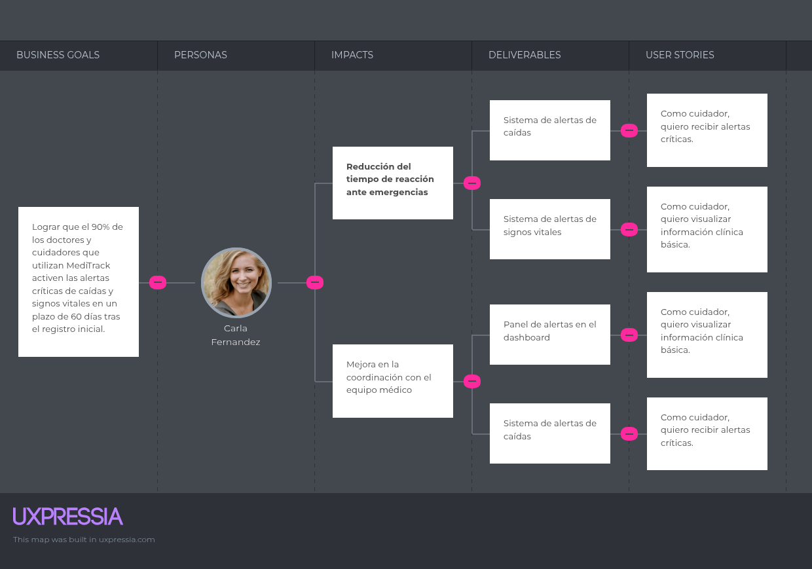

Impact Map para el segmento de Doctores de clínicas:

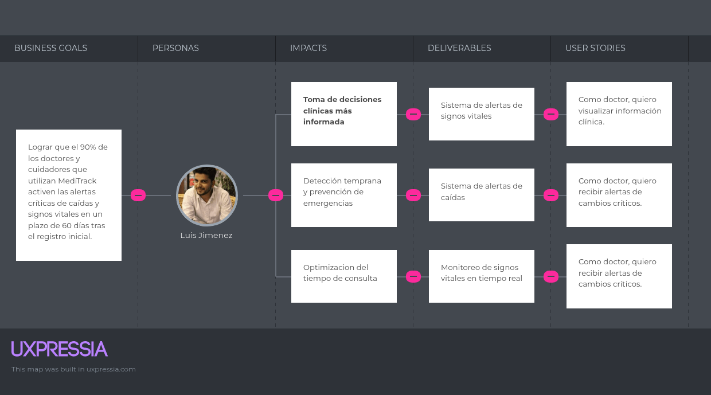

Impact Map para el segmento de Familiares:

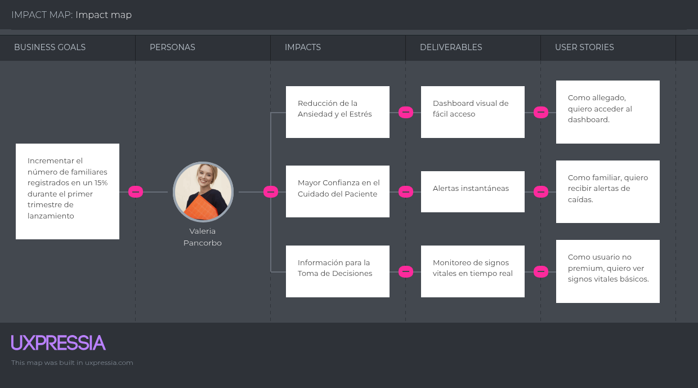

## 3.3. Product Backlog

El Product Backlog es una lista priorizada y dinámica de todas las funcionalidades pendientes de desarrollo. Está ordenado según la necesidad del negocio, comenzando por las historias que permiten la incorporación de nuevos usuarios (registro, inicio de sesión, visualización de planes), seguidas por la gestión interna (registro de clínicas, doctores, adultos mayores y cuidadores), y finalizando con funcionalidades de monitoreo y soporte.

| Puntos | Nivel de esfuerzo | Características                                                       |
| ------ | ----------------- | --------------------------------------------------------------------- |
| **1**  | Muy bajo          | Pantallas estáticas, sin lógica ni backend                            |
| **2**  | Bajo              | Funcionalidades simples con validaciones básicas                      |
| **3**  | Medio             | Flujo con interacción con backend o estados                           |
| **5**  | Alto              | Lógica condicional, comunicación con sensores, o integración de datos |
| **8**  | Muy alto          | Funcionalidades críticas, tiempo real, seguridad, o gestión compleja  |

---

| Story ID | Título                                                              | Descripción                                                                                                                                                                                       | Story Points | Epic ID |
| -------- | ------------------------------------------------------------------- | ------------------------------------------------------------------------------------------------------------------------------------------------------------------------------------------------- | ------------ | ------- |
| US01     | Visualización de la Landing Page                                    | Como visitante, quiero acceder a la landing page para conocer la solución de cuidado geriatrico                                                                                                   | 1            | EP01    |
| US02     | Visualizar Problemas Actuales                                       | Como visitante, quiero ver claramente los problemas actuales en el cuidado geriátrico para entender la importancia de la solución.                                                                | 1            | EP01    |
| US03     | Visualizar Soluciones Propuestas                                    | Como visitante, quiero ver las soluciones tecnológicas de MediTrack para evaluar su utilidad en mi práctica profesional.                                                                          | 1            | EP01    |
| US04     | Visualizar Impacto en Cifras                                        | Como visitante, quiero ver indicadores de impacto (reducción de emergencias, satisfacción familiar, etc.) para confiar en la solución.                                                            | 2            | EP01    |
| US05     | Ver Tecnologías que Salvan Vidas                                    | Como visitante, quiero conocer los dispositivos y sensores que usa MediTrack para evaluar su fiabilidad.                                                                                          | 1            | EP01    |
| US06     | Ver Nuestra Misión                                                  | Como visitante, quiero entender la misión de MediTrack para confiar en la seriedad de la empresa.                                                                                                 | 1            | EP01    |
| US07     | Ver Nuestra Visión                                                  | Como visitante, quiero conocer la visión a futuro de MediTrack para evaluar su proyección en el mercado.                                                                                          | 1            | EP01    |
| US08     | Consultar Plan Gratuito                                             | Como visitante, quiero ver el plan gratuito para empezar a probar MediTrack sin compromiso.                                                                                                       | 2            | EP01    |
| US09     | Consultar Plan Premium                                              | Como visitante, quiero ver el plan premium con más beneficios para decidir si invertir.                                                                                                           | 2            | EP01    |
| US10     | Consultar Plan Enterprise                                           | Como visitante, quiero ver el plan Enterprise para soluciones a gran escala.                                                                                                                      | 2            | EP01    |
| US11     | Acceder al Formulario de Contacto                                   | Como visitante, quiero llenar un formulario para recibir más información personalizada.                                                                                                           | 3            | EP01    |
| US12     | Información de Contacto Alternativa                                 | Como visitante, quiero ver datos de contacto directo (teléfono, email) para comunicarme sin usar formulario.                                                                                      | 1            | EP01    |
| US13     | Visualizar Planes Disponibles                                       | Como visitante, quiero visualizar los planes que ofrece MediTrack, para elegir el que mejor se adapte a mis necesidades.                                                                          | 2            | EP01    |
| US14     | Acceso al formulario de inicio de sesión                            | Como visitante, quiero acceder al formulario de inicio de sesión del Aplicativo al hacer clic en el botón para poder ingresar mis credenciales.                                                   | 2            | EP02    |
| US15     | Iniciar Sesión en MediTrack                                         | Como usuario, quiero iniciar sesión con mis credenciales, para acceder a mi dashboard y gestionar la información de salud correspondiente.                                                        | 3            | EP02    |
| US16     | Registrarse en MediTrack                                            | Como visitante, quiero completar un formulario de registro según el plan seleccionado, para crear una cuenta y acceder a la plataforma.                                                           | 3            | EP02    |
| US17     | Registro de clínica                                                 | Como administrador de una clínica, quiero registrar a mi clínica en la plataforma, para obtener una cuenta enterprise y habilitar el acceso a mi personal.                                        | 4            | EP03    |
| US18     | Creación automática del rol de administrador                        | Como administrador de una clínica,<br>quiero recibir un correo con las credenciales del administrador único,<br>para gestionar doctores, adultos mayores y allegados desde un solo panel.         | 4            | EP03    |
| US19     | Acceso inicial del administrador sin cambio obligatorio             | Como administrador de la clínica, quiero iniciar sesión con mis credenciales válidas para acceder al panel de gestión de la clínica.                                                              | 3            | EP03    |
| US20     | Registro de adultos mayores                                         | Como administrador de la clínica<br>quiero registrar adultos mayores<br>para que puedan ser monitoreados dentro del sistema                                                                       | 3            | EP03    |
| US21     | Añadir doctor                                                       | Como administrador de la clínica<br>quiero añadir doctores en la plataforma para que tengan una cuenta y puedan acceder a la gestión de adultos mayores                                           | 4            | EP03    |
| US22     | Ver lista de adultos mayores asignados en clínica                   | Como administrador de una clínica, quiero ver la lista de adultos mayores asignados para monitorear su estado                                                                                     | 3            | EP03    |
| US23     | Visualizar información clínica del adulto mayor en clínica          | Como administrador de una clínica, quiero visualizar la información clínica del adulto mayor para dar seguimiento                                                                                 | 4            | EP03    |
| US17     | Registro de clínica                                                 | Como administrador de una clínica, quiero registrar a mi clínica en la plataforma, para obtener una cuenta enterprise y habilitar el acceso a mi personal.                                        | 5            | EP03    |
| US18     | Creación automática del rol de administrador                        | Como administrador de una clínica,<br>quiero recibir un correo con las credenciales del administrador único,<br>para gestionar doctores, adultos mayores y allegados desde un solo panel.         | 5            | EP03    |
| US19     | Acceso inicial del administrador sin cambio obligatorio             | Como administrador de la clínica, quiero iniciar sesión con mis credenciales válidas para acceder al panel de gestión de la clínica.                                                              | 3            | EP03    |
| US20     | Registro de adultos mayores                                         | Como administrador de la clínica<br>quiero registrar adultos mayores<br>para que puedan ser monitoreados dentro del sistema                                                                       | 3            | EP03    |
| US21     | Añadir doctor                                                       | Como administrador de la clínica<br>quiero añadir doctores en la plataforma para que tengan una cuenta y puedan acceder a la gestión de adultos mayores                                           | 5            | EP03    |
| US22     | Ver lista de adultos mayores asignados en clínica                   | Como administrador de una clínica, quiero ver la lista de adultos mayores asignados para monitorear su estado                                                                                     | 3            | EP03    |
| US23     | Visualizar información clínica del adulto mayor en clínica          | Como administrador de una clínica, quiero visualizar la información clínica del adulto mayor para dar seguimiento                                                                                 | 5            | EP03    |
| US24     | Recibir alertas críticas de adultos mayores en clínicas             | Como administrador de una clínica, quiero recibir alertas sobre cambios críticos en los adultos mayores para actuar a tiempo.                                                                     | 5            | EP03    |
| US25     | Añadir un adulto mayor junto a sus datos en la clínica              | Como administrador de una clínica quiero poder agregar un adulto mayor en base a su nombre, apellido, edad, peso, altura, dni y id del parche, para poder asignarle a un doctor                   | 3            | EP03    |
| US26     | Añadir doctor para asignar adulto mayor en la clínica               | Como administrador de una clínica quiero poder agregar un doctor para que atiende a un adulto mayor                                                                                               | 3            | EP03    |
| US27     | Asignar adulto mayor a un doctor en la clínica                      | Como administrador de una clínica quiero poder asignar un adulto mayor a un doctor para que sea atendido por el doctor                                                                            | 4            | EP03    |
| US28     | Recibir alertas críticas de adultos mayores en casa de reposo       | Como administrador de una casa de reposo, quiero recibir alertas sobre cambios críticos en el estado de salud de los adultos mayores, para coordinar asistencia inmediata con el equipo médico.   | 5            | EP04    |
| US29     | Visualizar información clínica de adultos mayores en casa de reposo | Como administrador de una casa de reposo, quiero visualizar la información clínica básica de los adultos mayores, para dar seguimiento a su estado y reportar incidencias oportunamente.          | 4            | EP04    |
| US30     | Ver lista de adultos mayores asignados en casa de reposo            | Como administrador de una casa de reposo, quiero ver la lista de adultos mayores bajo mi responsabilidad, para monitorear su estado y asegurar un control adecuado de la información.             | 3            | EP04    |
| US31     | Añadir un adulto mayor junto a sus datos en la casa de reposo       | Como administrador de casa de una reposo quiero poder agregar un adulto mayor en base a su nombre, apellido, edad, peso, altura, dni y id del parche, para poder asignarle a un cuidador          | 3            | EP04    |
| US32     | Añadir cuidador para asignar adulto mayor en la casa de reposo      | Como administrador de una casa de reposo quiero poder agregar un cuidador para que atiende a un adulto mayor                                                                                      | 3            | EP04    |
| US33     | Asignar adulto mayor a un cuidador en la casa de reposo             | Como administrador de una casa de reposo quiero poder asignar un adulto mayor a un cuidador para que sea atendido por el cuidador                                                                 | 4            | EP04    |
| US34     | Añadir cuidador                                                     | Como administrador de la casa de reposo<br>quiero añadir cuidadores en la plataforma para que tengan una cuenta y puedan acceder a la gestión de adultos mayores                                  | 4            | EP04    |
| US35     | Acceso al dashboard MediTrack                                       | Como allegado, quiero acceder al dashboard para visualizar la información general de mi adulto mayor.                                                                                             | 3            | EP05    |
| US36     | Visualizar signos vitales básicos                                   | Como allegado, quiero visualizar los signos vitales básicos (presión arterial, ritmo cardíaco, saturación de oxígeno y gráficas estadísticas) para conocer el estado de salud de mi adulto mayor. | 4            | EP05    |
| US37     | Visualizar signos vitales premium                                   | Como allegado, quiero ver signos vitales adicionales como temperatura para tener un seguimiento más completo y que estos datos estén en las gráficas estadísticas                                 | 5            | EP05    |
| US38     | Recibir alertas de caídas                                           | Como allegado, quiero recibir alertas en caso de caída del adulto mayor para actuar rápidamente.                                                                                                  | 5            | EP05    |
| US39     | Recibir alertas de salud                                            | Como allegado, quiero recibir alertas en el dashboard para estar informado de cambios importantes en la salud del adulto mayor.                                                                   | 4            | EP05    |
| US40     | Adaptar Dashboard según Plan                                        | Como usuario, quiero que el sistema adapte las funciones del dashboard según mi plan, para visualizar las herramientas disponibles en mi suscripción.                                             | 4            | EP06    |
| US41     | Acceso a soporte desde el dashboard                                 | Como usuario, quiero acceder fácilmente a soporte técnico desde el dashboard para resolver problemas rápidamente.                                                                                 | 3            | EP06    |
| US42     | Selección de idioma                                                 | Como usuario, quiero poder cambiar el idioma de la plataforma entre inglés y español desde un botón visible, para usarla en el idioma que prefiera.                                               | 3            | EP06    |
| US43     | Consultar la hora exacta                                            | Como usuario quiero ver la hora actualizada y precisa de mi zona horaria para tener certeza de la hora correcta.                                                                                  | 2            | EP06    |
| US29     | Visualizar información clínica de adultos mayores en casa de reposo | Como administrador de una casa de reposo, quiero visualizar la información clínica básica de los adultos mayores, para dar seguimiento a su estado y reportar incidencias oportunamente.          | 5            | EP04    |
| US30     | Ver lista de adultos mayores asignados en casa de reposo            | Como administrador de una casa de reposo, quiero ver la lista de adultos mayores bajo mi responsabilidad, para monitorear su estado y asegurar un control adecuado de la información.             | 3            | EP04    |
| US31     | Añadir un adulto mayor junto a sus datos en la casa de reposo       | Como administrador de casa de una reposo quiero poder agregar un adulto mayor en base a su nombre, apellido, edad, peso, altura, dni y id del parche, para poder asignarle a un cuidador          | 3            | EP04    |
| US32     | Añadir cuidador para asignar adulto mayor en la casa de reposo      | Como administrador de una casa de reposo quiero poder agregar un cuidador para que atiende a un adulto mayor                                                                                      | 3            | EP04    |
| US33     | Asignar adulto mayor a un cuidador en la casa de reposo             | Como administrador de una casa de reposo quiero poder asignar un adulto mayor a un cuidador para que sea atendido por el cuidador                                                                 | 5            | EP04    |
| US34     | Añadir cuidador                                                     | Como administrador de la casa de reposo<br>quiero añadir cuidadores en la plataforma para que tengan una cuenta y puedan acceder a la gestión de adultos mayores                                  | 5            | EP04    |
| US35     | Acceso al dashboard MediTrack                                       | Como allegado, quiero acceder al dashboard para visualizar la información general de mi adulto mayor.                                                                                             | 3            | EP05    |
| US36     | Visualizar signos vitales básicos                                   | Como allegado, quiero visualizar los signos vitales básicos (presión arterial, ritmo cardíaco, saturación de oxígeno y gráficas estadísticas) para conocer el estado de salud de mi adulto mayor. | 3            | EP05    |
| US37     | Visualizar signos vitales premium                                   | Como allegado, quiero ver signos vitales adicionales como temperatura para tener un seguimiento más completo y que estos datos estén en las gráficas estadísticas                                 | 2            | EP05    |
| US38     | Recibir alertas de caídas                                           | Como allegado, quiero recibir alertas en caso de caída del adulto mayor para actuar rápidamente.                                                                                                  | 5            | EP05    |
| US39     | Recibir alertas de salud                                            | Como allegado, quiero recibir alertas en el dashboard para estar informado de cambios importantes en la salud del adulto mayor.                                                                   | 3            | EP05    |
| US40     | Adaptar Dashboard según Plan                                        | Como usuario, quiero que el sistema adapte las funciones del dashboard según mi plan, para visualizar las herramientas disponibles en mi suscripción.                                             | 3            | EP06    |
| US41     | Acceso a soporte desde el dashboard                                 | Como usuario, quiero acceder fácilmente a soporte técnico desde el dashboard para resolver problemas rápidamente.                                                                                 | 3            | EP06    |
| US42     | Selección de idioma                                                 | Como usuario, quiero poder cambiar el idioma de la plataforma entre inglés y español desde un botón visible, para usarla en el idioma que prefiera.                                               | 3            | EP06    |
| US43     | Consultar la hora exacta                                            | Como usuario quiero ver la hora actualizada y precisa de mi zona horaria para tener certeza de la hora correcta.                                                                                  | 2            | EP06    |
| TS1      | Endpoint para registro de organizaciones                            | Como developer, quiero crear un endpoint para registrar nuevas organizaciones                                                                                                                     | 3            |         |
| TS2      | Endpoint para obtener organización por ID                           | Como developer, quiero crear un endpoint para obtener los datos de una organización específica                                                                                                    | 4            |         |
| TS3      | Endpoint para listar administradores de una organización            | Como developer, quiero crear un endpoint para listar los administradores asociados a una organización .                                                                                           | 5            |         |
| TS4      | Endpoint para registrar administrador de organización               | Como developer, quiero crear un endpoint para agregar administradores a una organización y permitir su gestión dentro del sistema.                                                                | 3            |         |
| TS5      | Endpoint para registro de cuidadores                                | Como developer, quiero crear un endpoint para registrar nuevos cuidadores                                                                                                                         | 3            |         |
| TS6      | Endpoint para obtener cuidador por ID                               | Como developer, quiero crear un endpoint para obtener los datos de un cuidador específico                                                                                                         | 2            |         |
| TS7      | Endpoint para listar cuidadores de una organización                 | Como developer, quiero crear un endpoint para listar cuidadores de una organización.                                                                                                              | 3            |         |
| TS8      | Endpoint para registrar doctores                                    | Como developer, quiero crear un endpoint para registrar nuevos doctores                                                                                                                           | 2            |         |
| TS9      | Endpoint para obtener doctor por ID                                 | Como developer, quiero crear un endpoint para obtener los datos de un doctor                                                                                                                      | 2            |         |
| TS10     | Endpoint para listar doctores por organización                      | Como developer, quiero crear un endpoint para listar doctores de una organización.                                                                                                                | 2            |         |
| TS11     | Endpoint para listar adultos mayores por organización               | Como developer, quiero crear un endpoint para listar adultos mayores pertenecientes a una organización                                                                                            | 5            |         |
| TS12     | Endpoint para listar adultos mayores por doctor                     | Como developer, quiero crear un endpoint para listar adultos mayores asignados a un doctor                                                                                                        | 2            |         |
| TS13     | Endpoint para listar adultos mayores por cuidador                   | Como developer, quiero crear un endpoint para listar adultos mayores asignados a un cuidador                                                                                                      | 3            |         |
| TS14     | Endpoint para asignar adultos mayores a doctor                      | Como developer, quiero crear un endpoint para asociar adultos mayores a un doctor                                                                                                                 | 2            |         |
| TS15     | Endpoint para asignar adultos mayores a cuidador                    | Como developer, quiero crear un endpoint para registrar adultos mayores bajo el cuidado de un cuidador                                                                                            | 3            |         |
| TS16     | Endpoint para listar familiares                                     | Como developer, quiero crear un endpoint para listar todos los familiares registrados                                                                                                             | 2            |         |
| TS17     | Endpoint para registrar dispositivos                                | Como developer, quiero crear un endpoint para registrar nuevos dispositivos                                                                                                                       | 3            |         |
| TS18     | Endpoint para listar todos los dispositivos                         | Como developer, quiero crear un endpoint para obtener la lista de todos los dispositivos registrados                                                                                              | 3            |         |
| TS19     | Endpoint para obtener dispositivo por ID                            | Como developer, quiero crear un endpoint para obtener los datos de un dispositivo específico                                                                                                      | 2            |         |
| TS20     | Endpoint para listar alertas de un dispositivo                      | Como developer, quiero crear un endpoint para listar todas las alertas generadas por un dispositivo                                                                                               | 3            |         |
| TS21     | Endpoint para listar todas las alertas                              | Como developer, quiero crear un endpoint para obtener todas las alertas registradas en el sistema                                                                                                 | 3            |         |
| TS22     | Endpoint para obtener alerta por ID                                 | Como developer, quiero crear un endpoint para obtener los datos de una alerta específica                                                                                                          | 2            |         |
| TS23     | Endpoint para registrar frecuencia cardíaca                         | Como developer, quiero crear un endpoint para registrar los valores de frecuencia cardíaca de un dispositivo                                                                                      | 3            |         |
| TS24     | Endpoint para consultar frecuencia cardíaca                         | Como developer, quiero crear un endpoint para consultar los registros de frecuencia cardíaca de un dispositivo                                                                                    | 2            |         |
| TS25     | Endpoint para registrar niveles de oxígeno                          | Como developer, quiero crear un endpoint para registrar los niveles de saturación de oxígeno de un dispositivo                                                                                    | 3           |         |
| TS26     | Endpoint para consultar niveles de oxígeno                          | Como developer, quiero crear un endpoint para consultar los registros de oxígeno de un dispositivo                                                                                                | 2            |         |
| TS27     | Endpoint para registrar presión arterial                            | Como developer, quiero crear un endpoint para registrar los valores de presión arterial de un dispositivo                                                                                         | 3            |         |
| TS28     | Endpoint para consultar presión arterial                            | Como developer, quiero crear un endpoint para consultar los registros de presión arterial de un dispositivo                                                                                       | 2            |         |
| TS29     | Endpoint para registrar temperatura corporal                        | Como developer, quiero crear un endpoint para registrar los valores de temperatura corporal de un dispositivo                                                                                     | 3            |         |
| TS30     | Endpoint para consultar temperatura corporal                        | Como developer, quiero crear un endpoint para consultar los registros de temperatura corporal de un dispositivo                                                                                   | 2            |         |

# Capítulo IV: Product Design

## 4.1. Style Guidelines

### 4.1.1. General Style Guidelines

### Branding

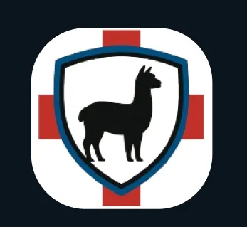

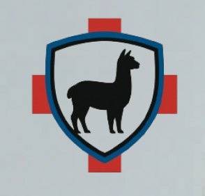

Contamos con dos versiones de nuestro logo: una con fondo transparente y otra con fondo blanco. Esto se hizo con fines de diseño, para asegurar su correcta visibilidad y resaltar mejor según el contexto en el que se utilice

### Typography

Elegimos **Inter** como tipografía para nuestra aplicación médica porque está optimizada para pantallas digitales, ofreciendo una lectura clara y fluida en móviles y computadoras. Su estilo moderno, sobrio y profesional transmite confianza, mientras que su versatilidad en pesos permite jerarquizar la información de forma sencilla, asegurando una experiencia visual coherente y accesible para los usuarios.

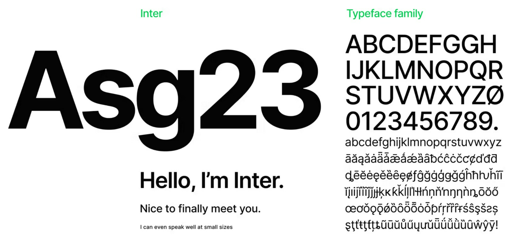
Elegimos **Noto Sans** porque es una tipografía moderna, limpia y altamente legible en todo tipo de pantallas. Su diseño neutral y profesional transmite seriedad y confianza, cualidades esenciales en una aplicación médica. Además, ofrece una gran versatilidad y compatibilidad multilingüe, lo que garantiza accesibilidad y coherencia visual para todos los usuarios.

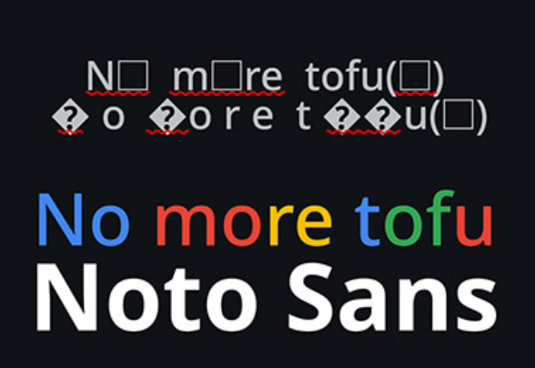

### Colors

La paleta de colores seleccionada combina tonos **azules** como primarios, transmitiendo confianza, calma y profesionalismo, valores clave en el ámbito médico. El **naranja secundario** aporta energía y vitalidad como acento, mientras que los **tonos rojos** se reservan para alertas o advertencias, asegurando que los mensajes críticos resalten con claridad. Los fondos claros y las variantes suaves refuerzan la legibilidad y la accesibilidad, garantizando una experiencia visual equilibrada y coherente en la aplicación.

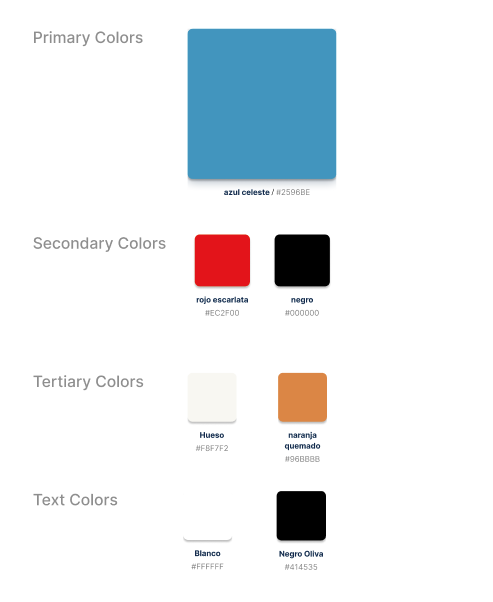

### Spacing

- **Propiedad:** `m` (margin), `p` (padding).
- **Lados:** `t` (top), `b` (bottom), `s` (start), `e` (end), `x` (izq+der), `y` (arriba+abajo), vacío (todos).
- **Escala de tamaños**

  Basada en `$spacer = 1rem` (16px aprox.):

  - `0` (0px), `1` (4px), `2` (8px), `3` (16px), `4` (24px), `5` (48px), `auto` (margen automático).

- **Breakpoints responsivos**

  Se aplican según el tamaño de pantalla: `sm`, `md`, `lg`, `xl`, `xxl`.

  Ejemplo: `.mb-md-5` → margen inferior grande en pantallas medianas o mayores.

- **Ventajas principales en nuestro producto**
  - Consistencia en todo el proyecto.
  - Rapidez al no escribir CSS manual.
  - Facilita la responsividad y el mantenimiento del código.

## Secciones

### Encabezado

El titular actual _"Cuidado Continuo, Conectado y Confiable"_ utiliza un tono serio, respetuoso y sereno que transmite seguridad y confianza desde la primera interacción. La eficacia de esta frase radica en su uso estratégico de palabras clave que refuerzan la promesa del servicio, creando una conexión inmediata con el usuario. Para mantener esta línea comunicativa, recomendamos continuar con frases igualmente concisas y contundentes como _"Tu tranquilidad, siempre conectada"_ o _"Tecnología al servicio de quienes más quieres"_, que conservan el mismo impacto emocional.

### Sección “El Desafío del Cuidado Geriátrico”

El enfoque del cuidado geriátrico moderno debe equilibrar tecnología con humanidad. Al identificar problemas como las "emergencias no detectadas", ofrecemos una "respuesta inmediata" que transforma la preocupación en tranquilidad. Nuestra solución no solo monitorea signos vitales, sino que crea un puente de comunicación constante entre adultos mayores y sus cuidadores, permitiendo independencia con seguridad. Este sistema, formal en su precisión pero cercano en su propósito, refleja nuestro compromiso: proporcionar herramientas que detectan situaciones críticas y activan protocolos de ayuda oportunos, todo comunicado con la claridad y empatía que las familias merecen.

### Métricas de impacto (85%, 95%, 24/7)

Nuestras estadísticas respaldan con solidez la eficacia de MediTrack, presentando datos precisos que demuestran nuestro impacto real. Con más del 95% de emergencias detectadas oportunamente y un sistema de monitoreo que funciona ininterrumpidamente las 24 horas del día, los 7 días de la semana, ofrecemos una solución confiable que combina precisión técnica con la tranquilidad que las familias necesitan. Estos números no son solo cifras; representan vidas mejor cuidadas y la seguridad que brindamos a quienes confían en nuestra tecnología.

### Sección de Contacto

La sección de contacto utiliza un tono cercano y respetuoso, invitando a los usuarios a establecer comunicación con nosotros. El texto actual _"Contáctanos para saber más sobre MediTrack"_ cumple su función básica, pero recomendamos humanizar más la interacción con frases como _"Estamos aquí para ayudarte y responder tus dudas"_ o _"Conversemos sobre cómo podemos cuidar mejor de tus seres queridos"_, creando así una conexión más empática que refuerce la confianza en nuestro servicio y facilite el primer paso hacia una relación duradera con los usuarios potenciales.

### Referencia a Design Systems

Puedes tomar como inspiración **Design Systems serios y accesibles** como:

- **Material Design (Google):** claro, legible, accesible y consistente.
- **IBM Design Language:** muy usado en salud y tecnología, con foco en confianza y profesionalismo.
- **Atlassian Design System:** comunicación empática y clara, adaptable a productos SaaS.

MediTrack adapta estos principios manteniendo:

- **Colores serenos** (azules, blancos, acentos cálidos).
- **Tipografía legible** y jerarquías claras.
- **Iconografía simple y universal** (salud, seguridad, conectividad).

### 4.1.2. Web Style Guidelines

En la landing page de MediTrack se han tomado decisiones de diseño visual e interacción que garantizan coherencia estética, usabilidad y adaptabilidad a diferentes dispositivos.

1. **Paleta de colores:** Se emplean principalmente tonos azules y verdes, asociados a confianza, salud y calma, lo que refuerza la identidad de la marca. El contraste cumple con estándares de accesibilidad (WCAG) asegurando legibilidad en pantallas de escritorio y móviles.
2. **Tipografía:** Se utilizan tipografías modernas y legibles, con una jerarquía tipográfica clara: títulos destacados, subtítulos intermedios y párrafos de fácil lectura. Esto permite mantener claridad en dispositivos pequeños y reducir la fatiga visual.
3. **Imágenes e íconos:** Se combinan fotografías relacionadas con el cuidado de adultos mayores e íconos minimalistas que representan funciones clave (emergencias, monitoreo, conectividad). Esto aporta cercanía humana y facilita la navegación intuitiva.
4. **Diseño responsive:** La estructura está basada en rejillas flexibles (grid/flexbox), con un enfoque _mobile-first_ y breakpoints definidos. Esto asegura que los elementos se reorganicen de forma fluida en diferentes tamaños de pantalla, manteniendo siempre la coherencia visual.
5. **Interacción y navegación:** El menú es simplificado y fijo, complementado con secciones ancla y scroll fluido. Los botones (CTA’s) presentan alto contraste y dimensiones adecuadas para la interacción táctil, destacando llamadas a la acción como “Contáctanos” y “Ver planes”.
6. **Accesibilidad:** El diseño prioriza la legibilidad con contrastes adecuados, tamaños mínimos de fuente y una estructura semántica clara. Esto facilita la comprensión y navegación incluso en adultos mayores o personas con limitaciones visuales, cumpliendo con los principios WCAG 2.1.

las decisiones de estándares visuales e interacción aplicadas en MediTrack aseguran una experiencia digital consistente, confiable y empática, adaptándose a diferentes dispositivos y necesidades del usuario.

## 4.2. Information Architecture

### 4.2.1. Organization Systems

En la landing page se han aplicado diferentes **sistemas de organización** con el fin de estructurar la información de manera clara, jerárquica y accesible para los usuarios.

- **Organización visual jerárquica:** utilizada en la sección inicial (_hero section_), donde se destacan el título principal, subtítulo y botón de acción. La tipografía, el tamaño y el contraste de colores establecen prioridades visuales que guían la atención del usuario hacia los elementos más importantes.
- **Organización secuencial:** presente en las secciones de **Servicios** y **Planes**, donde el contenido se muestra de forma progresiva. Primero se explica qué ofrece el producto y posteriormente se presentan las opciones de suscripción, logrando un recorrido paso a paso que facilita la comprensión.
- **Organización matricial:** aplicada en la sección de **Planes**, en la cual se comparan diferentes alternativas mediante un formato de tabla o tarjetas alineadas. Esto permite que el usuario evalúe en paralelo precios, características y beneficios.

En cuanto a los **esquemas de categorización del contenido**, se emplean los siguientes criterios:

- **Por tópicos:** en la sección **Servicios**, donde cada bloque agrupa funcionalidades específicas.
- **Según audiencia:** en la sección **Planes**, diseñados para distintos tipos de usuarios (individual, familiar o corporativo).
- **Cronológico:** en la sección **Contacto**, que organiza los pasos para enviar una consulta y garantiza un flujo de atención ordenado.

### 4.2.2. Labeling Systems

1. **Navegación Principal (Navbar)**

| Clave JS       | Etiqueta Simplificada |
| -------------- | --------------------- |
| `nav-home`     | Inicio                |
| `nav-services` | Servicios             |
| `nav-about`    | Nosotros              |
| `nav-plans`    | Planes                |
| `nav-contact`  | Contacto              |

2. **Sección Hero**

| Clave JS               | Etiqueta Simplificada |
| ---------------------- | --------------------- |
| `hero-title`           | Título principal      |
| `hero-description`     | Descripción destacada |
| `hero-discover-button` | Botón: Descubrir      |
| `hero-plans-button`    | Botón: Ver planes     |

3.  **Servicios - Parte 1: Problemas y Soluciones**

| Clave JS                              | Etiqueta Simplificada        |
| ------------------------------------- | ---------------------------- |
| `services-title`                      | Título de sección            |
| `services-description`                | Introducción a los servicios |
| `services-problems-title`             | Título: Problemas actuales   |
| `services-problems-description`       | Descripción de los problemas |
| `services-problem-[1-3]-title`        | Problema N (título)          |
| `services-problem-[1-3]-description`  | Problema N (descripción)     |
| `services-solution-title`             | Título: Nuestra solución     |
| `services-solution-description`       | Descripción de la solución   |
| `services-solution-[1-3]-title`       | Solución N (título)          |
| `services-solution-[1-3]-description` | Solución N (descripción)     |

4.  **Sección de Impacto**

| Clave JS            | Etiqueta Simplificada |
| ------------------- | --------------------- |
| `impact-title`      | Título de impacto     |
| `impact-[1-4]-text` | Métrica/Beneficio N   |

5.  **Servicios - Parte 2: Tecnología**

| Clave JS                                   | Etiqueta Simplificada      |
| ------------------------------------------ | -------------------------- |
| `services-part2-tag`                       | Etiqueta destacada         |
| `services-part2-title`                     | Título de sección          |
| `services-part2-description`               | Descripción tecnológica    |
| `services-part2-feature-title`             | Título: Características    |
| `services-part2-feature-description`       | Descripción general        |
| `services-part2-feature-[1-6]-title`       | Característica N (título)  |
| `services-part2-feature-[1-6]-description` | Característica N (detalle) |

6.  **Misión y Visión**

| Clave JS                     | Etiqueta Simplificada |
| ---------------------------- | --------------------- |
| `mission-vision-tag`         | Etiqueta filosófica   |
| `mission-vision-title`       | Título principal      |
| `mission-vision-description` | Descripción general   |
| `mission-title`              | Título misión         |
| `mission-description`        | Descripción misión    |
| `vision-title`               | Título visión         |
| `vision-description`         | Descripción visión    |

7.  **Planes de Servicio**

| Clave JS                   | Etiqueta Simplificada     |
| -------------------------- | ------------------------- |
| `plans-title`              | Título de sección         |
| `plan-[1-3]-title`         | Plan N (nombre)           |
| `plan-[1-3]-price`         | Plan N (precio)           |
| `plan-[1-3]-recommended`   | Plan N (destacado)        |
| `plan-[1-3]-feature-[1-5]` | Plan N - Característica M |
| `plan-[1-3]-button`        | Plan N - Botón CTA        |

8.  **Contacto**

| Clave JS                       | Etiqueta Simplificada |
| ------------------------------ | --------------------- |
| `contact-title`                | Título de sección     |
| `contact-description`          | Descripción breve     |
| `contact-name-placeholder`     | Campo: Nombre         |
| `contact-email-placeholder`    | Campo: Correo         |
| `contact-phone-placeholder`    | Campo: Teléfono       |
| `contact-interest-placeholder` | Campo: Interés        |
| `contact-send-button`          | Botón: Enviar         |

9. **Footer (Pie de página)**

| Clave JS                | Etiqueta Simplificada        |
| ----------------------- | ---------------------------- |
| `footer-brand-name`     | Nombre de marca              |
| `footer-brand-platform` | Nombre de la plataforma      |
| `footer-description`    | Descripción de empresa       |
| `footer-email`          | Correo de contacto           |
| `footer-phone`          | Teléfono                     |
| `footer-location`       | Ubicación                    |
| `footer-company-title`  | Sección: Empresa             |
| `footer-about-us`       | Enlace: Sobre nosotros       |
| `footer-contact`        | Enlace: Contacto             |
| `footer-product-title`  | Sección: Producto            |
| `footer-meditrack`      | Enlace: Meditrack            |
| `footer-features`       | Enlace: Características      |
| `footer-pricing`        | Enlace: Precios              |
| `footer-legal-title`    | Sección: Legal               |
| `footer-privacy`        | Enlace: Privacidad           |
| `footer-terms`          | Enlace: Términos de Servicio |
| `footer-cookies`        | Enlace: Cookies              |
| `footer-security`       | Enlace: Seguridad            |
| `footer-copyright-part` |                              |
| `[1-2]`                 | Aviso legal                  |

### 4.2.3. SEO Tags and Meta Tags

1. **Sistema de grillas y columnas**
   - `container`, `row`, `col`, `row-cols-1`, `row-cols-md-2`, `row-cols-lg-3`.
   - Permiten organizar el contenido en múltiples dispositivos con un enfoque _mobile-first_.
2. **Flexbox y alineación**
   - `d-flex`, `flex-column`, `flex-row`, `justify-content-center`, `align-items-center`.
   - Facilitan la disposición de elementos, mejorando la experiencia visual en pantallas pequeñas y grandes.
3. **Espaciado y separación**
   - `px-4`, `py-3`, `mb-5`, `gap-3`, `gap-4`.
   - Estándares de padding y margin que generan jerarquía visual y mejoran la legibilidad.
4. **Tipografía y jerarquía de texto**
   - `font-noto-bold`, `font-noto-regular`, `fs-2`, `fs-6`, `text-uppercase`.
   - Refuerzan la identidad visual de la marca y diferencian títulos, subtítulos y párrafos.
5. **Colores y fondos**
   - `bg-light`, `bg-dark`, `bg-primary`, `bg-secondary`, `text-dark`, `text-white`.
   - Asociados a confianza y claridad, con contraste adecuado para cumplir criterios de accesibilidad (WCAG).
6. **Botones y llamadas a la acción (CTA)**
   - `btn`, `btn-lg`, `btn-secondary`, `rounded-pill`.
   - Garantizan botones táctiles accesibles y visibles en dispositivos móviles.
7. **Bordes, esquinas y sombras**
   - `rounded-3`, `rounded-4`, `rounded-pill`, `shadow`.
   - Refuerzan un diseño moderno, limpio y con sensación de profundidad.
8. **Listas e íconos**
   - `list-unstyled` con integración de **Lucide Icons** (`data-lucide="check"`, `mail`, `map-pin`, etc.).
   - Permiten resaltar beneficios, datos de contacto y características de cada plan.
9. **Accesibilidad y semántica**
   - Uso de `placeholder` en inputs, jerarquía `h2`, `h3`, `p`, y estructura clara en formularios.
   - Garantizan comprensión para adultos mayores y personas con limitaciones visuales.

**Task**:

- **Callouts:** Tarjetas con beneficios clave (`d-flex flex-row gap-3 bg-light shadow`).
- **Misión y Visión:** Sección de dos columnas con títulos jerárquicos y subrayado visual.
- **Planes de Servicio:** Cards comparativas de planes (_Freemium, Premium, Enterprise_) con CTA’s claros.
- **Formulario de Contacto:** Inputs básicos y botón destacado para conversión.
- **Footer:** Tres columnas con branding, información de contacto y menús legales.

### 4.2.4. Searching Systems

La landing page de MediTrack implementa una barra de navegación fija en el _header_, la cual actúa como punto de referencia principal para orientar al usuario durante su recorrido. Esta barra incluye botones de acceso directo a las secciones clave: Inicio, Servicios, Planes, Contacto y Nosotros.

Cada botón funciona como un ancla interna que conduce al usuario de manera fluida hacia la sección correspondiente mediante un desplazamiento (_scroll_) suave. Este diseño asegura que los visitantes puedan localizar rápidamente la información que buscan sin necesidad de abandonar la página.

La organización secuencial de los menús guía a los usuarios en un flujo natural: primero se presenta la propuesta de valor en Inicio, luego se explican los Servicios ofrecidos, se muestran las opciones en Planes, se habilita un canal de comunicación en Contacto y finalmente se refuerza la confianza con la sección Nosotros.

Con esta estructura clara y jerárquica, la navegación resulta intuitiva, accesible y consistente, facilitando que los usuarios alcancen sus objetivos e interactúen de manera satisfactoria con el producto digital.

### 4.2.5. Navigation Systems

La barra de navegación situada en el _header_ contiene estos botones principales:

- **Inicio:** lleva al usuario a la parte superior de la página donde se muestra la propuesta de valor.
- **Servicios:** exhibe las funcionalidades y beneficios del producto digital.
- **Planes:** muestra las distintas opciones disponibles, comparando características y precios.
- **Contacto:** ofrece acceso directo a los canales de comunicación para consultas o información adicional.
- **Nosotros:** brinda información institucional que genera confianza y credibilidad.

Esta estructura clara permite una navegación **simple e intuitiva**, facilitando que el usuario explore la información de forma organizada.


## 4.3. Landing Page UI Design

### 4.3.1. Landing Page Wireframe

**Landing Page para Desktop Web Browser**

Se presenta la landing page en el desktop web browser. Incluye secciones relevantes para la presencia del usuario, como
mostrar informacion precisa sobre la solucion presentada, ademas de presentar el producto de la manera mas cercana a la
plataforma web, mediante secciones como mision-vision, about the product y planes.


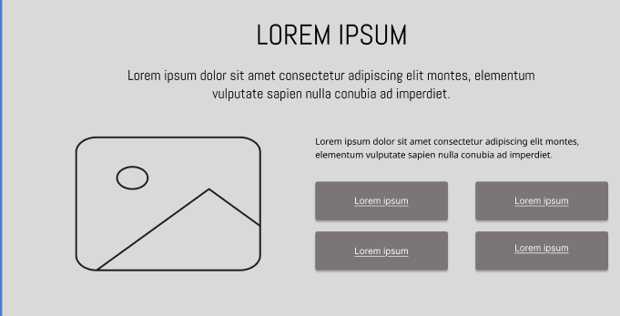

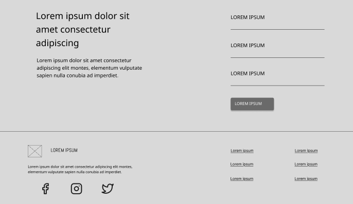

**Landing Page para Mobile Web Browser**

Se presenta la landing page en la visa del mobile web browser. Se incluye los contenidos mostrados en la landing page para
desktop, pero considerando el diseño responsibe para mantener el aspecto visual.


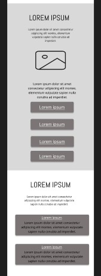
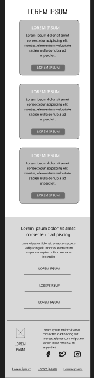

### 4.3.2. Landing Page Mock-up

**Landing page en español**

#### Landing Page para Desktop Web Browser

El wireframe de la versión desktop en navegador web de la landing page fue útil para estructurar la disposición de los
elementos. Con base en este esquema, se desarrolló el mock-up de la landing page, que incluye los mismos contenidos
descritos previamente. En la imagen siguiente se observa la aplicación de la paleta de colores primarios y secundarios,
así como la tipografía previamente establecida.


#### Landing Page para Mobile Web Browser

De igual manera, el mock-up de la landing page en vista mobile web browser incorpora los mismos elementos señalados
previamente. Se aprecia que la tipografía seleccionada y el contraste de colores entre el texto y el fondo favorecen la
legibilidad de la información en ambos dispositivos.

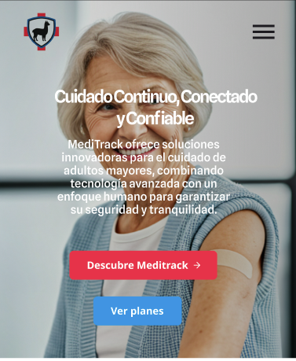


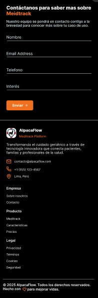

### Landing page en inglés

#### Landing Page para Desktop Web Browser

Con el fin de mejorar la accesibilidad de la información, el equipo consideró importante incorporar la opción de cambio
de idioma en la landing page. Por esta razón, se muestran evidencias gráficas de la versión en español e inglés en la
vista desktop web browser.


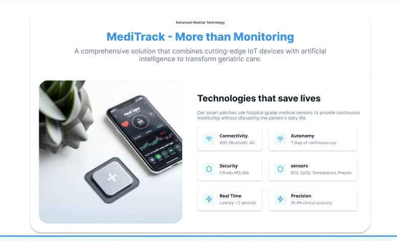


#### Landing Page para Mobile Web Browser

Se incorpora el lenguaje ingles en la landing page para mobile.


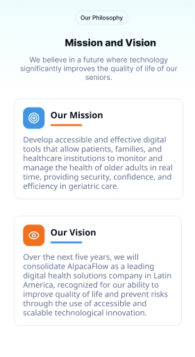


## 4.4. Web Applications UX/UI Design

### 4.4.1. Web Applications Wireframes

Enlace para acceder al [Figma](https://www.figma.com/design/5pPYbw6ldTV7ILDVfciH8l/MediTrack?node-id=68-2&t=cLuXhW6jD5n7WWOn-1)
https://www.figma.com/design/5pPYbw6ldTV7ILDVfciH8l/MediTrack?node-id=68-2&t=cLuXhW6jD5n7WWOn-1

**Web Application para Desktop Web Browser**

Los siguientes Wireframes fueron para ser base a los muck-ups proximos a presentar.

- Selección de Usuario

Permite a nuestros usuarios escoger a que tipo de inicio de sesión accederán, para que posteriormente ingresen sus credenciales


- Inicio de Sesión

Permite al usuario iniciar sesión a través de sus credenciales.


- Escoger un plan

Permite a un nuevo usuario escoger un plan previo al registro.


- Registro

Permite a un nuevo usuario o entidad regitrarse a la plataforma adjuntando sus datos.

Registro allegado con el plan freemium:

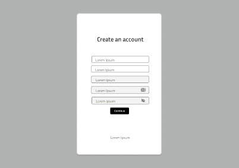

Registro allegado con el plan premium:


Registro de una entidad:


- Registro de Adulto Mayor

Posterior al registro del allegado se permite registrar al adulto mayor


- Dashboard Allegado Freemium y Premium

Luego del registro del paciente, el allegado podrá visualizar el dashboard dependiendo del plan que elegido con anterioridad.

Dashboard Freemium

Perfil Adulto Mayor


Estadísticas


Alertas


Dashboard Premium

Perfil Adulto Mayor


Estadísticas

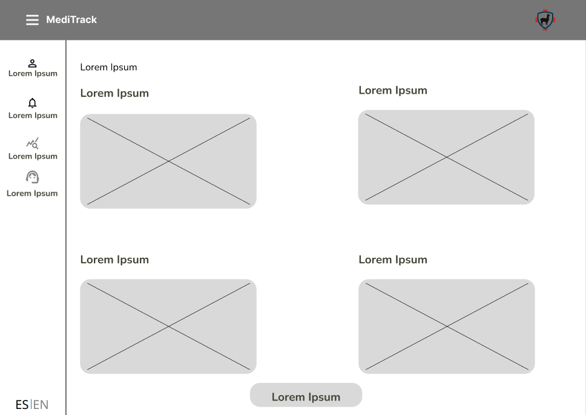

Alertas


Soporte


- Dashboard Personal de Clínica - Administrador

Se visualiza el dashboard donde el administrador encargado de una clínica ejecutará acciones con el fin de administrar a los doctores y los adultos mayores a quienes asignará un doctor encargado

Dashboard del administrador sin doctores


Formulario para agregar a un doctor


Doctor visible en el dashboard


Asignació de un adulto mayor para el doctor

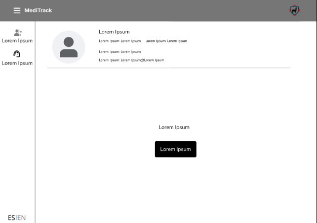

Formulario para agregar a un adulto mayor


Adulto mayor visible en el dashboard

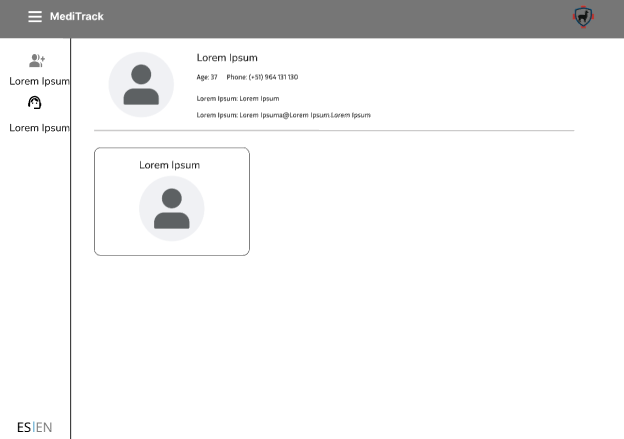

Formulario de soporte


- Dashboard Personal de Clínica - Doctor

Se visualiza el dashboard donde el doctor registrado de una clínica visualizará a los adultos mayores que se le fue asignado con el fin de comprabar su estado de salud y dar chequeos.

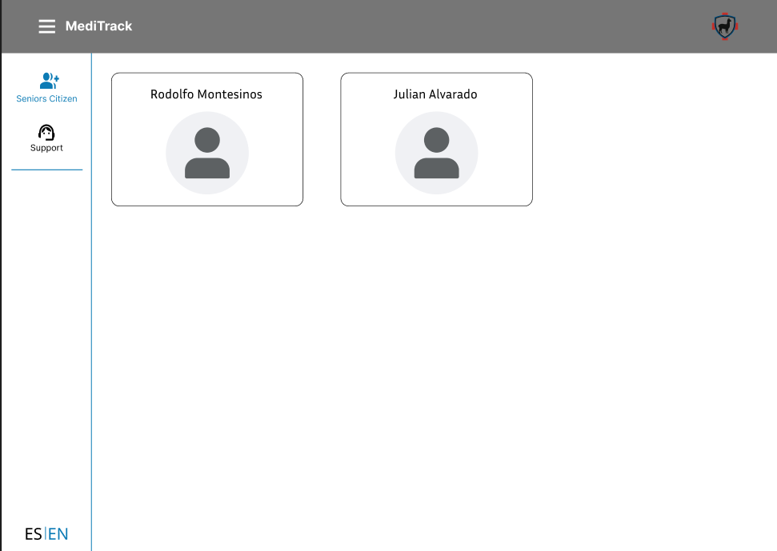

Perfil del adulto mayor asignado

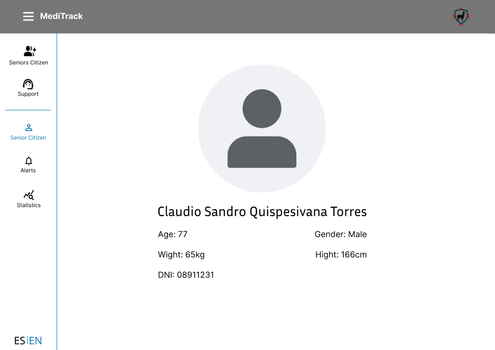

Alertas del adulto mayor asignado

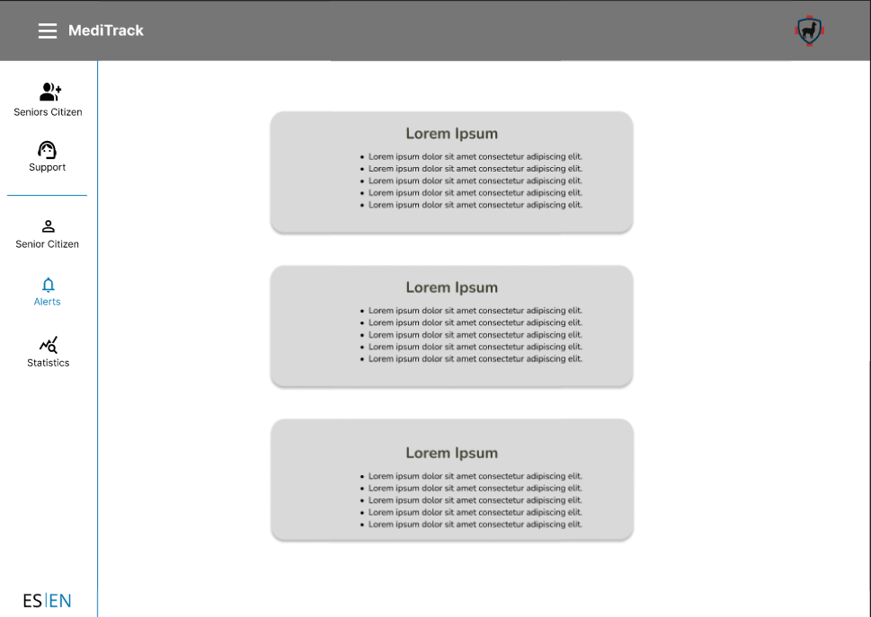

Estadísticas del adulto mayor asignado


- Dashboard Personal de Casas de Reposo - Administrador

Se visualiza el dashboard donde el administrador encargado de una casa de reposo ejecutará acciones con el fin de administrar a los cuidadores y los adultos mayores a quienes asignará un doctor encargado.

Dashboard del administrador sin cuidadores


Formulario para agregar a un cuidador

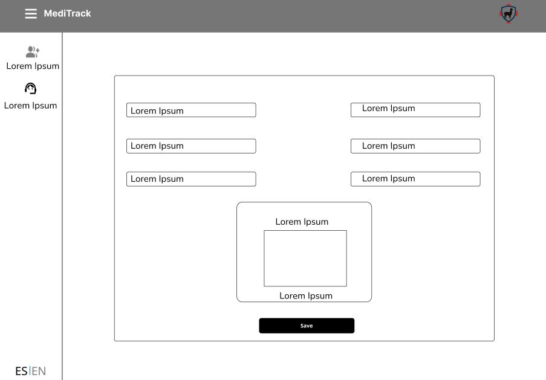

Cuidador visible en el dashboard


Asignació de un adulto mayor para el cuidador


Formulario para agregar a un adulto mayor


Adulto mayor visible en el dashboard


Formulario de soporte

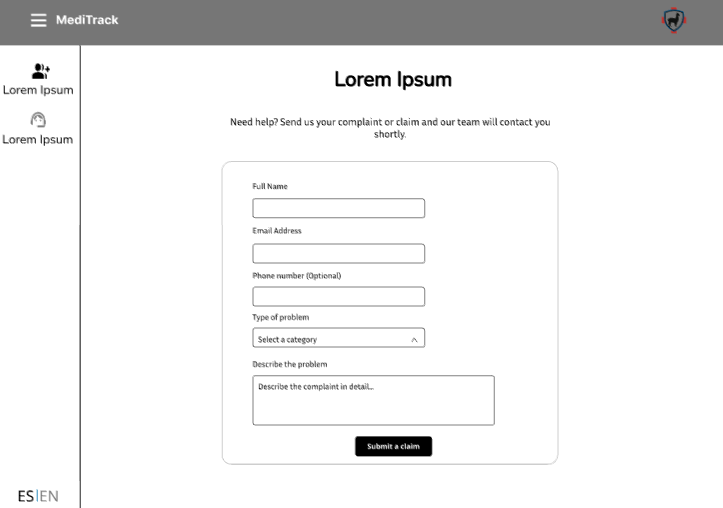

- Dashboard Personal de Casas de Reposo - Cuidador

Se visualiza el dashboard donde el cuidador registrado de una clínica visualizará a los adultos mayores que se le fue asignado con el fin de comprabar su estado de salud.


Perfil del adulto mayor asignado


Alertas del adulto mayor asignado


Estadísticas del adulto mayor asignado


### 4.4.2. Web Applications Wireflow Diagrams

[Ver proyecto en lucidchart](https://lucid.app/lucidspark/b1c3fed1-0457-43fd-996b-a2e5f89d3dcd/edit?invitationId=inv_02b8548c-fef4-4095-b7f5-c52e0eec7ce6)
https://lucid.app/lucidspark/b1c3fed1-0457-43fd-996b-a2e5f89d3dcd/edit?invitationId=inv_02b8548c-fef4-4095-b7f5-c52e0eec7ce6

#### User Goal: Registro Usuario

User persona: Allegados
Explicacion de flujo: EL usuario ingresa a la plataforma e ingresa a registrarse, seguidamente selecciona el plan de su
preferencia y se registra en la plataforma.

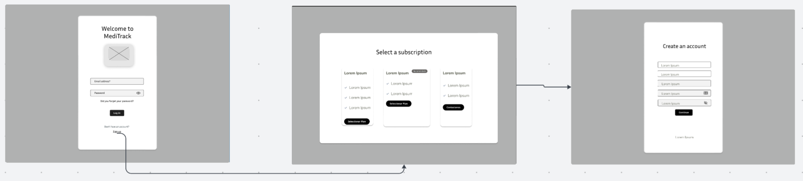

#### User Goal: Registro Clinica o Casa de Reposo

User persona: Clinica y Casa de reposo
Explicacion de flujo: El administrador de la clinica o casa de reposo selecciona el plan Enterprise para que se contacte
con la plataforma e ingresa sus credenciales para poder identificarse como administrador.

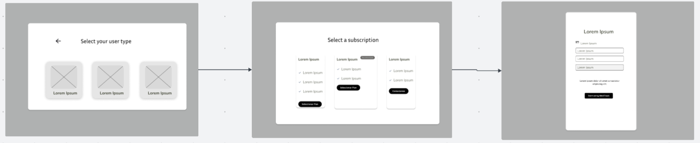

#### User Goal: Registro de paciente como allegado

User persona: Allegado
Explicacion de flujo: El allegado del paciente se registra como allegado y completa el formulario de registro de paciente
de allegado

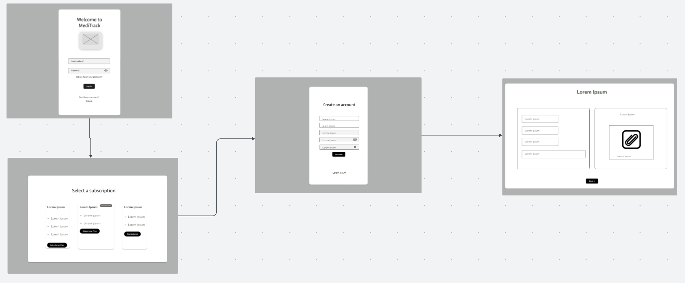

#### User Goal: Registro de medicos

User persona: Clinica
Explicacion de flujo: El administrador de la clinica inicia sesion, agrega un medico mediante un formulario y verifica
que el registro haya sido exitoso.

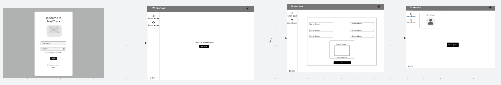

#### User Goal: Asignar un paciente a un medico

User persona: Clinica
Explicacion de flujo: Se asigna un paciente a un medico registrado, mediante un formulario para completar los datos
personales y verificar si se asigno correctamente.


#### User Goal: Analisis de signos vitales

User persona: Clinica
Explicacion de flujo: Se selecciona a un paciente geriatrico para ver su historial de estado para el registro de salud,
ademas de contar con un analisis estadistico sobre el estado actual.


#### User Goal: Registro de cuidador

User persona: Casa de reposo
Explicacion de flujo: Se ingresa a la plataforma y se selecciona en agregar cuidador, se completa un formulario con informacion
personal del cuidador y se confirma el registro correcto.

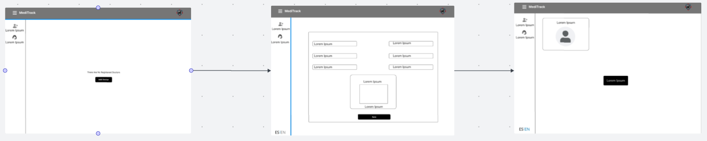

#### User Goal: Asignar paciente a cuidador

User persona: Casa de reposo
Explicacion de flujo: Se selecciona al cuidador objetivo y se selecciona en agregar paciente,

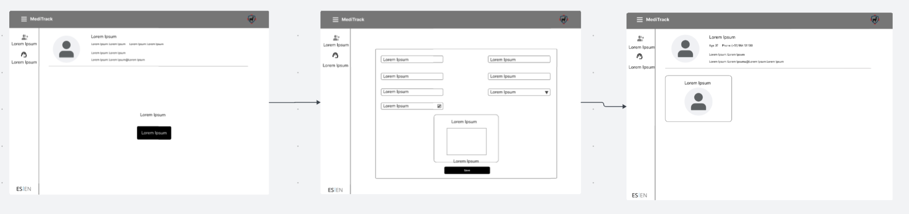

#### User Goal: Analisis de estado de paciente geriatrico

User persona: Casa de reposo
Explicacion de flujo: Se selecciona a un paciente y se verifica el historial de notificacion, ademas se puede acceder a
un analisis estadistico en tiempo real para controlar los signos vitales.

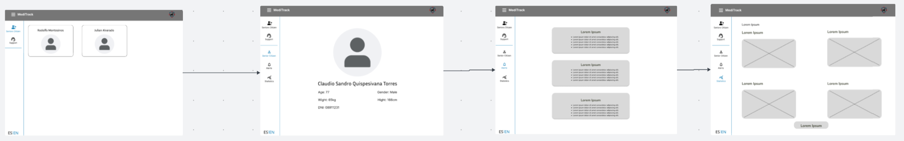

### 4.4.3. Web Applications Mock-ups

Los siguientes Muck-ups fueron elaborados a base de los wireframes presentados con anteoridad. Representan con fidelidad lo que nuestros usuarios van a visualizar en nuestra aplicación web.

- Selección de Usuario

Permite a nuestros usuarios escoger a que tipo de inicio de sesión accederán, para que posteriormente ingresen sus credenciales


- Inicio de Sesión

Permite al usuario iniciar sesión a través de sus credenciales.


- Escoger un plan

Permite a un nuevo usuario escoger un plan previo al registro.


- Registro

Permite a un nuevo usuario o entidad regitrarse a la plataforma adjuntando sus datos.

Registro allegado con el plan freemium:

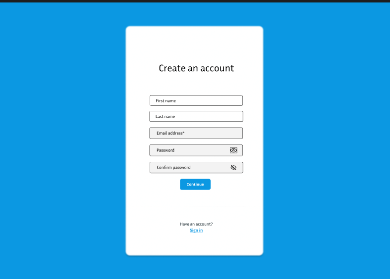

Registro allegado con el plan premium:


Registro de una entidad:

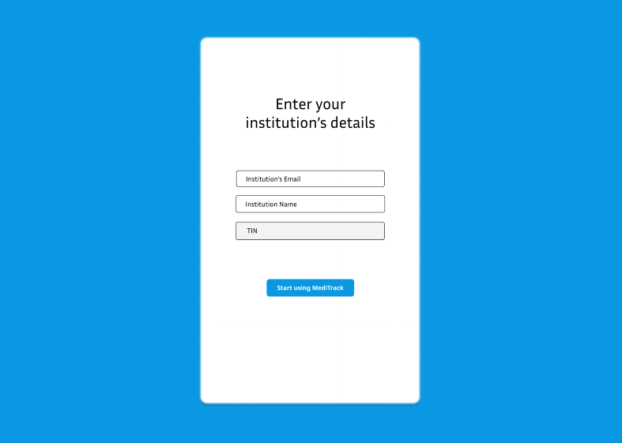

- Registro de Adulto Mayor

Posterior al registro del allegado se permite registrar al adulto mayor


- Dashboard Allegado Freemium y Premium

Luego del registro del paciente, el allegado podrá visualizar el dashboard dependiendo del plan que elegido con anterioridad.

Dashboard Freemium

Perfil Adulto Mayor


Estadísticas


Alertas


Dashboard Premium

Perfil Adulto Mayor


Estadísticas

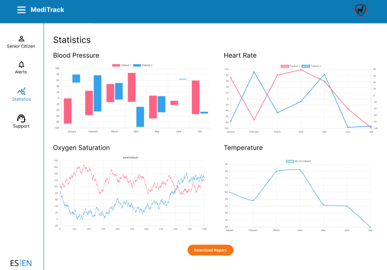

Alertas

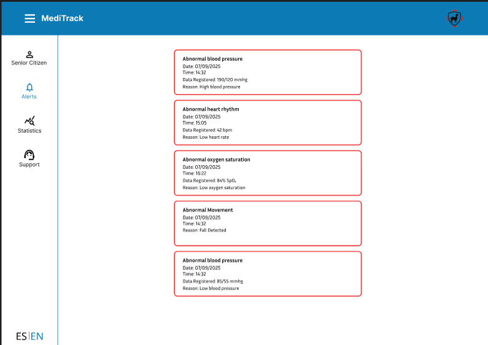

Soporte

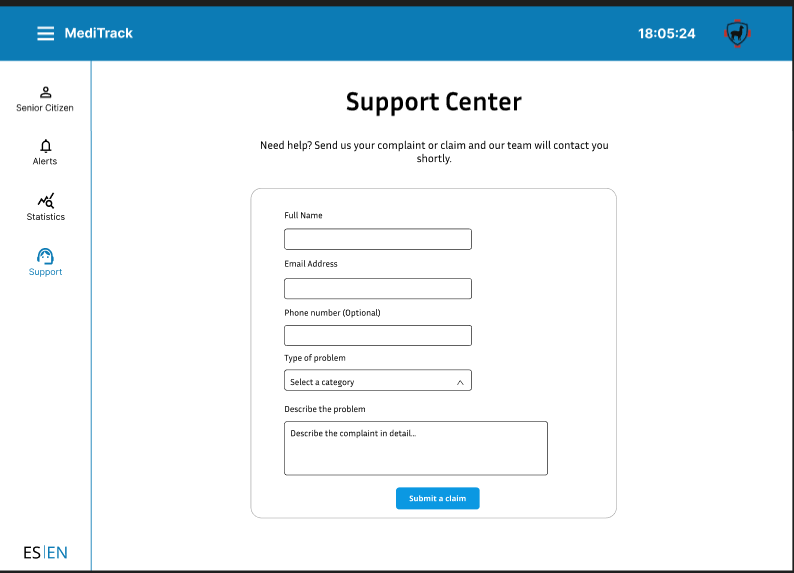

- Dashboard Personal de Clínica - Administrador

Se visualiza el dashboard donde el administrador encargado de una clínica ejecutará acciones con el fin de administrar a los doctores y los adultos mayores a quienes asignará un doctor encargado

Dashboard del administrador sin doctores

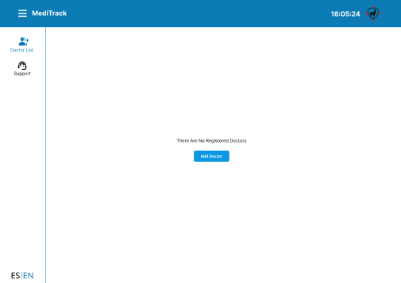

Formulario para agregar a un doctor


Doctor visible en el dashboard


Asignació de un adulto mayor para el doctor


Formulario para agregar a un adulto mayor

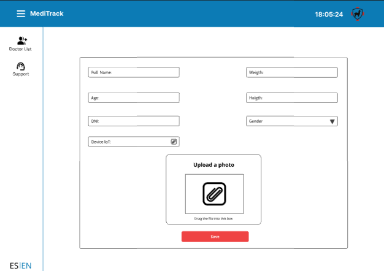

Adulto mayor visible en el dashboard


Formulario de soporte


- Dashboard Personal de Clínica - Doctor

Se visualiza el dashboard donde el doctor registrado de una clínica visualizará a los adultos mayores que se le fue asignado con el fin de comprabar su estado de salud y dar chequeos.

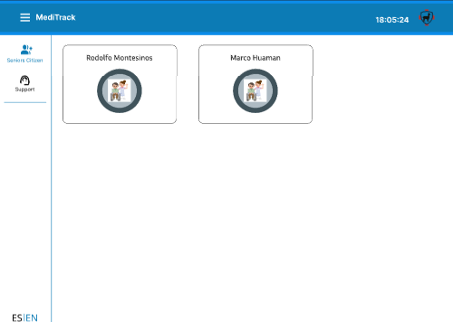

Perfil del adulto mayor asignado

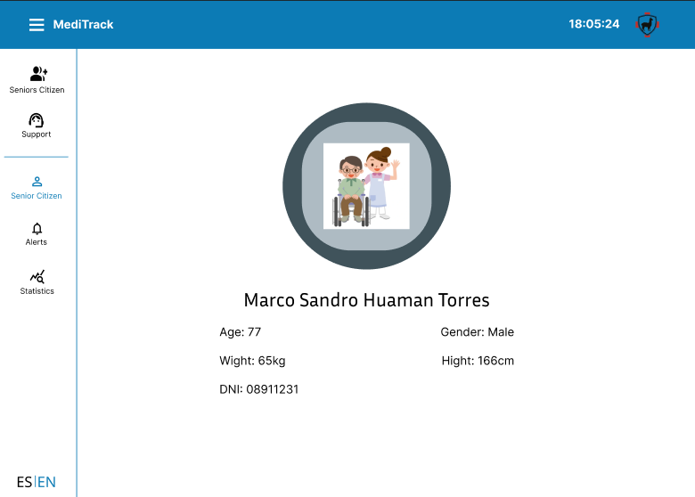

Alertas del adulto mayor asignado


Estadísticas del adulto mayor asignado


- Dashboard Personal de Casas de Reposo - Administrador

Se visualiza el dashboard donde el administrador encargado de una casa de reposo ejecutará acciones con el fin de administrar a los cuidadores y los adultos mayores a quienes asignará un doctor encargado.

Dashboard del administrador sin cuidadores


Formulario para agregar a un cuidador


Cuidador visible en el dashboard


Asignació de un adulto mayor para el cuidador


Formulario para agregar a un adulto mayor

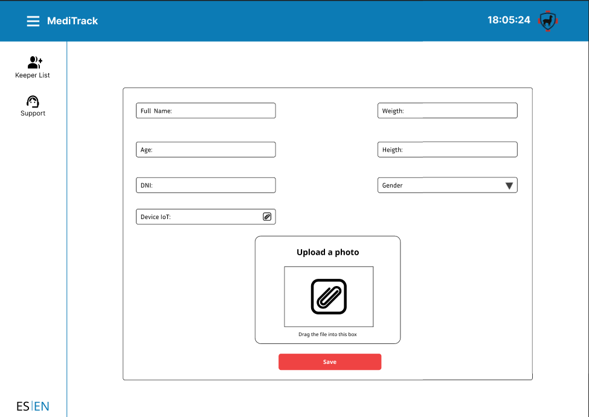

Adulto mayor visible en el dashboard


Formulario de soporte


- Dashboard Personal de Casas de Reposo - Cuidador

Se visualiza el dashboard donde el cuidador registrado de una clínica visualizará a los adultos mayores que se le fue asignado con el fin de comprabar su estado de salud.


Perfil del adulto mayor asignado


Alertas del adulto mayor asignado


Estadísticas del adulto mayor asignado


### 4.4.4. Web Applications User Flow Diagrams

Enlace para acceder a [Lucidchard](https://lucid.app/lucidchart/a6da7c11-ad99-4658-a4c8-2b630c5794eb/edit?invitationId=inv_5c2699bb-77b5-4655-93e3-7e771f566105)

https://lucid.app/lucidchart/a6da7c11-ad99-4658-a4c8-2b630c5794eb/edit?invitationId=inv_5c2699bb-77b5-4655-93e3-7e771f566105

#### User Goal: Registro Usuario

User persona: Allegados
Explicacion de flujo: EL usuario ingresa a la plataforma e ingresa a registrarse, seguidamente selecciona el plan de su
preferencia y se registra en la plataforma.


#### User Goal: Registro Clinica o Casa de Reposo

User persona: Clinica y Casa de reposo
Explicacion de flujo: El administrador de la clinica o casa de reposo selecciona el plan Enterprise para que se contacte
con la platforma e ingresa sus credenciales para poder identificarse como administrador.

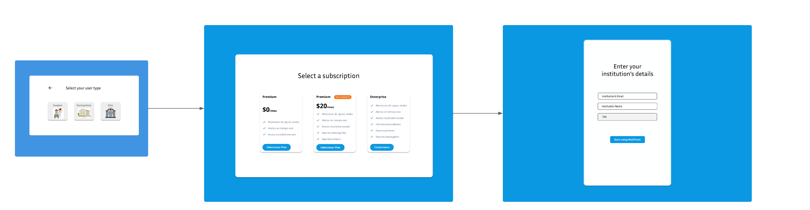

#### User Goal: Registro de paciente como allegado

User persona: Allegado
Explicacion de flujo: El allegado del paciente se registra como allegado y completa el formulario de registro de paciente
de allegado


#### User Goal: Registro de medicos

User persona: Clinica
Explicacion de flujo: El administrador de la clinica inicia sesion, agrega un medico mediante un formulario y verifica
que el registro haya sido exitoso.

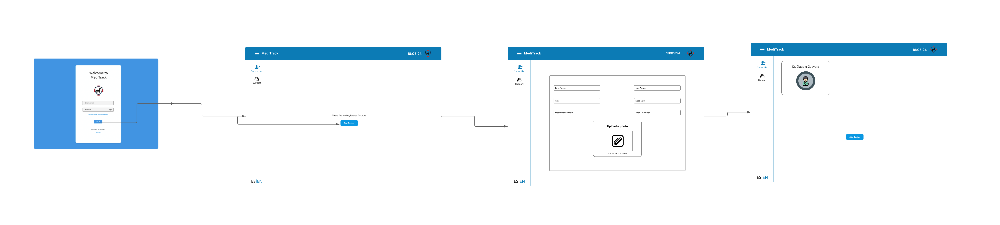

#### User Goal: Asignar un paciente a un medico

User persona: Clinica
Explicacion de flujo: Se asigna un paciente a un medico registrado, mediante un formulario para completar los datos
personales y verificar si se asigno correctamente.

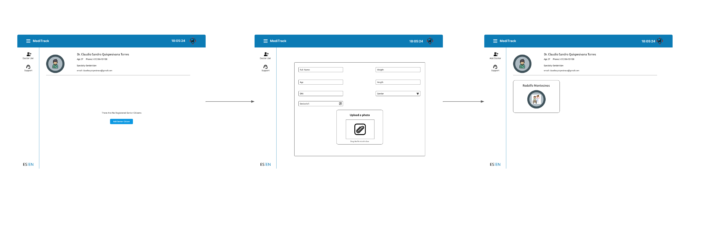

#### User Goal: Analisis de signos vitales

User persona: Clinica
Explicacion de flujo: Se selecciona a un paciente geriatrico para ver su historial de estado para el registro de salud,
ademas de contar con un analisis estadistico sobre el estado actual.


#### User Goal: Registro de cuidador

User persona: Casa de reposo
Explicacion de flujo: Se ingresa a la plataforma y se selecciona en agregar cuidador, se completa un formulario con informacion
personal del cuidador y se confirma el registro correcto.


#### User Goal: Asignar paciente a cuidador

User persona: Casa de reposo
Explicacion de flujo: Se selecciona al cuidador objetivo y se selecciona en agregar paciente,


#### User Goal: Analisis de estado de paciente geriatrico

User persona: Casa de reposo
Explicacion de flujo: Se selecciona a un paciente y se verifica el historial de notificacion, ademas se puede acceder a
un analisis estadistico en tiempo real para controlar los signos vitales.

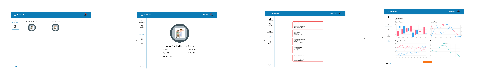

## 4.5. Web Applications Prototyping

## 4.6. Domain-Driven Software Architecture

El Domain Driven Design (DDD) busca lograr una comprensión común del dominio que define el espacio del problema. Este
enfoque facilita la colaboración entre desarrolladores y expertos del área gracias a la perspectiva que ofrece. No se
limita únicamente al uso de un lenguaje ubicuo, sino que incluye un conjunto de patrones, prácticas y representaciones
arquitectónicas del sistema. Todos estos elementos tienen como finalidad alinear el software con el dominio y fortalecer
la visión compartida que promueve DDD.

### 4.6.1. Software Architecture Context Diagram

Este diagrama de contexto muestra la vista de alto nivel de las relaciones entre la plataforma MediTrack y los sistemas
externos, asi como el rol de los usuarios.


### 4.6.2. Software Architecture Container Diagrams

El diagrama de contenedores ofrece una visión general de alto nivel sobre las relaciones entre las aplicaciones y las
fuentes de datos que intervienen en la ejecución de a plataforma MediTrack


### 4.6.3. Software Architecture Components Diagrams

Los diagramas de componentes proporcionan una visión de las relaciones entre los principales elementos del sistema de
software. Dichos componentes describen con mayor detalle la implementación de los módulos correspondientes dentro del programa.

**Auth Bounded Context**


**Relative Bounded Context**


**Organization Bounded Context**


**Shared Bounded Context**


## 4.7 . Software Object-Oriented Design

### 4.7.1. Class Diagrams

En esta sección se presenta y explica el Diagrama de Clases UML correspondiente al sistema desarrollado. El propósito de este diagrama es representar de manera estructurada los elementos principales de cada producto de software y, cuando es aplicable, de cada bounded context identificado durante la fase de Event Storming.

El nivel de detalle incluye no solo las clases, interfaces y enumeraciones, sino también sus atributos y métodos, especificando el alcance (public, private, protected) en cada caso. Asimismo, se definen las relaciones entre clases, indicando la multiplicidad, la dirección y la calificación de los vínculos con nombres claros y consistentes.

Para garantizar la trazabilidad del diseño, se ha elaborado un diagrama independiente por bounded context (User Management, Device Management, Dashboard & Analytics, Relationship Management, Report, Identity & Access Management). Esto permite reflejar con precisión las responsabilidades de cada contexto y la forma en que interactúan sus entidades internas.

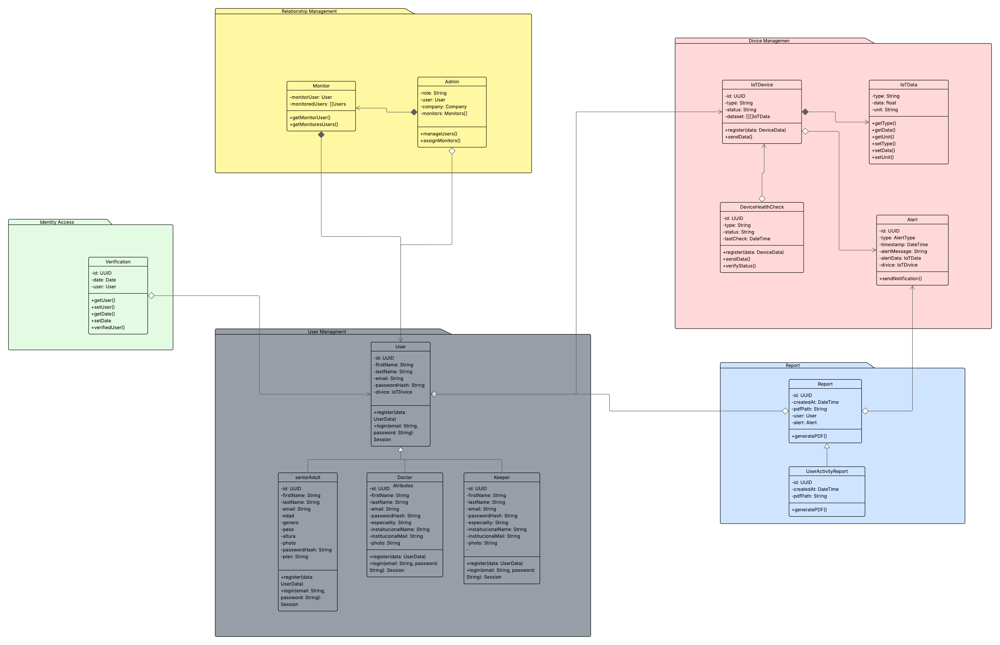

## 4.8. Database Design

### 4.8.1. Database Diagrams


# Capítulo V: Product Implementation, Validation & Deployment

## 5.1. Software Configuration Management

### 5.1.1. Software Development Environment Configuration

#### Gestión de Proyecto (Project Management)

**GitHub Pages**: Servicio en línea que permite publicar sitios web directamente desde un repositorio de GitHub. Brinda una manera sencilla de compartir documentación y proyectos, favoreciendo la colaboración y el acceso público o privado a los contenidos.  
**Ruta de acceso:** [https://pages.github.com](https://pages.github.com)

#### Gestión de Requisitos (Requirements Management)

**Trello**: Herramienta en línea que permite organizar actividades, asignar tareas y dar seguimiento al progreso del equipo. Se usará para coordinar las responsabilidades y controlar el avance de sprints e historias de usuario.  
**Ruta de acceso:** [https://trello.com/es](https://trello.com/es)

#### Diseño de UX/UI del Producto (Product UX/UI Design)

**Figma**: Plataforma colaborativa para diseñar interfaces y prototipos gráficos. Se utilizará para crear las versiones Desktop y Mobile de la aplicación.  
**Ruta de acceso:** [https://www.figma.com/login](https://www.figma.com/login)

**Overflow**: Aplicación especializada en la creación de diagramas de flujo y wireflows, útil para representar la experiencia del usuario en el sistema.  
**Ruta de acceso:** [https://overflow.io](https://overflow.io)

---

#### Desarrollo de Software (Software Development)

**Visual Studio Code**: Editor de código versátil empleado para programar y compilar, gracias a su compatibilidad con múltiples lenguajes y extensiones.  
**Ruta de acceso:** [https://code.visualstudio.com](https://code.visualstudio.com)

**WebStorm**: IDE para desarrollo en JavaScript y TypeScript, que ofrece potentes herramientas de refactorización y navegación.  
**Ruta de acceso:** [https://www.jetbrains.com/webstorm](https://www.jetbrains.com/webstorm)

**IntelliJ IDEA**: Entorno de desarrollo avanzado diseñado para proyectos en Java y Kotlin, fundamental en la construcción de componentes del sistema.  
**Ruta de acceso:** [https://www.jetbrains.com/idea](https://www.jetbrains.com/idea)

**HTML5**: Lenguaje de marcado utilizado para estructurar y dar forma al contenido web.  
**Ruta de acceso:** [https://developer.mozilla.org/en-US/docs/Web/HTML](https://developer.mozilla.org/en-US/docs/Web/HTML)

**CSS**: Lenguaje de estilos para definir la presentación visual de las páginas web, garantizando una experiencia de usuario consistente.  
**Ruta de acceso:** [https://developer.mozilla.org/en-US/docs/Web/CSS](https://developer.mozilla.org/en-US/docs/Web/CSS)

**JavaScript**: Lenguaje de programación que habilita la interactividad en las interfaces web, esencial para la dinámica del sistema.  
**Ruta de acceso:** [https://developer.mozilla.org/en-US/docs/Web/JavaScript](https://developer.mozilla.org/en-US/docs/Web/JavaScript)

**Vue.js**: Framework progresivo de JavaScript para construir interfaces de usuario interactivas y aplicaciones de una sola página.  
**Ruta de acceso**: [https://vuejs.org](https://vuejs.org)

**C#**: Lenguaje de programación orientado a objetos desarrollado por Microsoft, utilizado para crear aplicaciones modernas, seguras y escalables en diferentes plataformas.  
**Ruta de acceso**: [https://learn.microsoft.com/dotnet/csharp](https://learn.microsoft.com/dotnet/csharp)

**.NET**: Framework de desarrollo multiplataforma de Microsoft que permite construir aplicaciones web, de escritorio, móviles, servicios en la nube y más.  
**Ruta de acceso**: [https://dotnet.microsoft.com](https://dotnet.microsoft.com)

---

#### Despliegue de Software (Software Deployment)

**Git**: Sistema de control de versiones que permite registrar cambios en el código, colaborar en equipo y mantener un historial completo del proyecto.  
**Ruta de acceso:** [https://git-scm.com](https://git-scm.com)

---

#### Documentación del Software (Software Documentation)

**Markdown**: Sintaxis ligera de marcado que facilita la creación de documentación clara y legible, especialmente en repositorios colaborativos.  
**Ruta de acceso:** [https://www.markdownguide.org](https://www.markdownguide.org)

**GitHub Pages**: Herramienta integrada en GitHub que permite publicar documentación y sitios web directamente desde un repositorio, ofreciendo una forma sencilla y gratuita de compartir contenidos en línea.  
**Ruta de acceso:** [https://pages.github.com](https://pages.github.com)

**Structurizr**: Modelado arquitectónico como código: Structurizr permite definir un modelo arquitectónico en un lenguaje de dominio específico (DSL) y luego generar múltiples diagramas (C4, contexto, contenedores, componentes) desde ese modelo único. Además, puede combinarse con documentación y registros de decisiones arquitectónicas embebidos.  
**Ruta de acceso**: [https://structurizr.com](https://structurizr.com)

**Lucidchart** Herramienta colaborativa basada en la web para la creación de diagramas técnicos (UML, ERD, procesos, arquitectura). Permite colaboración en tiempo real, importación de datos, plantillas para distintos tipos de diagramas y edición visual.  
**Ruta de acceso**: [https://www.lucidchart.com](https://www.lucidchart.com)

### 5.1.2. Source Code Management

GitHub será la herramienta principal para el control de versiones del proyecto. En este espacio se presentarán los enlaces a los repositorios correspondientes a la documentación, el informe y la página de aterrizaje (Landing Page).

#### URL de Repositorios

- **Documentación e Informe**: [https://github.com/UPC-PRE-202502-1ASI0730-7461-Rurasqay/report](https://github.com/UPC-PRE-202502-1ASI0730-7461-Rurasqay/report)

https://github.com/UPC-PRE-202502-1ASI0730-7461-Rurasqay/report


- **Landing Page**: [https://github.com/UPC-PRE-202502-1ASI0730-7461-Rurasqay/landing-page](https://github.com/UPC-PRE-202502-1ASI0730-7461-Rurasqay/landing-page)

https://github.com/UPC-PRE-202502-1ASI0730-7461-Rurasqay/landing-page

Cada repositorio contendrá todos los archivos relacionados con el proyecto.

#### Modelo de GitFlow

**GitFlow** se adoptará como la estrategia de ramificación del proyecto, garantizando una gestión ordenada de las ramas y una integración continua y eficiente entre los desarrolladores.


#### Ramas principales

- **Master (`master`)**  
  Rama principal del proyecto. Aquí siempre estará el código estable y listo para ser desplegado en producción.

- **Desarrollo (`develop`)**  
  Rama destinada al trabajo de desarrollo. Todas las mejoras y nuevas funcionalidades se integran primero aquí antes de pasar a `main`.

- **Funcionalidades (`feature`)**  
  Cada nueva característica se desarrolla en una rama independiente creada a partir de `develop`.  
  Convención: `feature/nombre-de-la-funcionalidad`  
  Ejemplo: `feature/ch1-target-segment`

- **Liberaciones (`release`)**  
  Se crean a partir de `develop` para preparar una nueva versión estable.  
  En estas ramas se corrigen errores menores, se hacen pruebas finales y se documenta el código previo al lanzamiento.  
  Convención: `release/version`  
  Ejemplo: `release/v1.0.0`

- **Correcciones urgentes (`hotfix`)**  
  Usadas para solucionar errores críticos detectados en producción. Estas ramas parten de `main`.  
  Convención: `hotfix/nombre-de-la-corrección`  
  Ejemplo: `hotfix/imagen-bug`

---

#### Convenciones para Versiones

Se utilizará **Semantic Versioning (SemVer)** para todas las versiones publicadas, siguiendo el formato:  
`MAJOR.MINOR.PATCH` (por ejemplo: `1.0.0`).

---

#### Convenciones para Commits

Se seguirá el estándar **Conventional Commits** para garantizar claridad y consistencia en los mensajes:

- `feat`: Introducción de nuevas características.
- `fix`: Solución de errores.
- `docs`: Modificaciones en la documentación.
- `style`: Cambios de formato sin afectar la lógica.
- `refactor`: Reestructuración del código sin alterar su comportamiento.
- `test`: Creación o modificación de pruebas.
- `chore`: Tareas de mantenimiento.

### 5.1.3. Source Code Style Guide & Conventions

#### HTML

**Estándares base**  
Adoptamos **W3Schools – HTML5 Syntax** y la **Google HTML/CSS Style Guide** para garantizar legibilidad, consistencia y mantenibilidad del marcado. Estas pautas cubren estructura del documento, semántica, formato, atributos, accesibilidad y validación.

**Formato y espacios**

- **Indentación:** 2 espacios por nivel (no tabs).
- **Líneas y ancho:** evitar superar ~**80–100** caracteres; divide atributos largos o listas de clases extensas.
- **Espacios en etiquetas:** no incluir espacios antes de `>` ni entre el nombre de la etiqueta y `>`; deja un **espacio** entre el nombre de atributo y `=` y entre pares de atributos.
  ```html
  <!-- Correcto -->
  <input type="email" name="userEmail" required />
  <!-- Incorrecto -->
  <input type="email" name="userEmail" required />
  ```
- **Mayúsculas/minúsculas:** etiquetas y atributos **en minúsculas**; valores literales consistentes (comillas dobles).

**Sentencias y bloques**

- **Estructura mínima válida:** `<!DOCTYPE html>`, `<html lang="...">`, `<head>`, `<meta charset="utf-8">`, `<meta name="viewport"...>`, `<title>`, `<body>`.
- **Cierre de etiquetas:** cerrar correctamente todos los elementos no vacíos. No usar barra de cierre en elementos **void** (p. ej., ``, `<br>`, `<hr>`, `<meta>`, `<link>`).
  ```html
  <!-- Correcto -->
  
  <!-- Incorrecto (XHTML autocierre no requerido en HTML5) -->
  
  ```
- **Anidación:** seguir el orden semántico correcto; no superponer etiquetas.

**Comentarios**

- Comentar secciones lógicas del documento con claridad y sin exceso.
  ```html
  <!-- =======================================
       Cabecera del sitio
     ======================================= -->
  ```
- No comentar código muerto; elimínalo o justifica su permanencia.

**Nomenclatura y declaraciones**

- **Atributos booleanos** sin valor redundante: `required`, `disabled`, `checked` (no `required="required"`).
- **Orden de atributos:** prioriza legibilidad; sugerido: `id`, `class`, `name`, `data-*`, `type`, `href/src`, `alt`, `aria-*`, `role`.
- **Clases:** en minúsculas y con guiones (`.site-header`, `.hero-title`). Evita IDs salvo para anclas o integración con scripts.
- **Rutas y archivos:** nombres en minúsculas, sin espacios; usa `-` para separar palabras: `about-us.html`, `user-profile.jpg`.

**Strings y literales**

- En atributos, usa **comillas dobles** y escapa correctamente entidades cuando incrustes texto en atributos (`&quot;`, `&amp;`).
- Usa entidades para símbolos especiales cuando sea necesario (`&copy;`, `&nbsp;`, `&lt;`, `&gt;`).

**Funciones y callbacks**

- **Evita `onclick` y otros manejadores inline**. Separa el comportamiento en archivos JS y añade listeners desde el script.
- No incrustes bloques de `<script>` largos en el HTML; referencia archivos externos y colócalos al final del `<body>` o con `defer`.

**Bucles y condicionales**

- (No aplican directamente al HTML). En motores de plantillas, mantén la lógica mínima y deja la presentación al HTML/CSS.

**Etiquetas (estructura semántica)**

- Emplea **etiquetas semánticas**: `header`, `nav`, `main`, `section`, `article`, `aside`, `footer`, `figure/figcaption`.
- Usa `ul/ol` para listas, `dl` para definiciones, y tablas (`table`, `thead`, `tbody`, `th`, `td`, `caption`) **solo para datos tabulares**.
- Para formularios, agrupa con `form`, `fieldset`, `legend`, y asocia etiquetas con `label for`/`id`.

**Web APIs y seguridad**

- Proveer **atributos `alt`** descriptivos en `img`. Si la imagen es decorativa, `alt=""`.
- En enlaces externos, usa `rel="noopener noreferrer"` cuando apliques `target="_blank"`.
- No incrustes HTML no confiable; sanitiza contenido dinámico del lado del servidor.

**Accesibilidad (a11y)**

- Añadir `lang` al elemento `<html>` y metadatos adecuados.
- Mantener un **orden de encabezados** lógico (`h1`–`h6`) y un **único `h1`** por página.
- Asegurar **foco visible**, etiquetas `label` asociadas y `aria-*` solo cuando sea necesario (no para sustituir semántica nativa).
- Usar `title` descriptivo y `meta`/landmarks correctos para navegación asistida.

**Ejemplo breve**

```html
<!DOCTYPE html>
<html lang="es">
  <head>
    <meta charset="utf-8" />
    <meta name="viewport" content="width=device-width, initial-scale=1" />
    <title>Mi página accesible</title>
    <link rel="stylesheet" href="/assets/styles.css" />
  </head>
  <body>
    <!-- =======================================
         Cabecera
       ======================================= -->
    <header class="site-header" role="banner">
      <h1 class="site-title">Marca</h1>
      <nav class="site-nav" aria-label="Principal">
        <ul>
          <li><a href="/">Inicio</a></li>
          <li><a href="/productos.html">Productos</a></li>
          <li><a href="/contacto.html">Contacto</a></li>
        </ul>
      </nav>
    </header>

    <main id="main" class="site-main">
      <article class="hero">
        <h2 class="hero-title">Bienvenido</h2>
        <p>Contenido introductorio.</p>
        <figure>
          
          <figcaption>Tu compañía, en cualquier dispositivo.</figcaption>
        </figure>
      </article>
    </main>

    <footer class="site-footer" role="contentinfo">
      <p>&copy; 2025 Mi Compañía</p>
    </footer>

    <script src="/assets/app.js" defer></script>
  </body>
</html>
```

#### CSS

**Estándares base**  
Adoptamos la **Google HTML/CSS Style Guide** para asegurar legibilidad, consistencia y mantenibilidad del código CSS en el equipo. Estas pautas cubren formato, nomenclatura, organización, especificidad, modularidad y buenas prácticas para desarrollo web colaborativo.

**Formato y espacios**

- **Indentación:** 2 espacios por nivel de anidación (no tabs).
- **Llaves y líneas:** llave de apertura en la misma línea del selector (con un espacio antes) y llave de cierre en línea nueva alineada con el selector.
- **Una declaración por línea** y **un selector por línea** cuando se usen listas de selectores.
- **Espacios:** un espacio después de `:` en cada propiedad y después de comas en funciones (`rgba(0, 0, 0, 0.5)`).
- **Punto y coma final:** todas las declaraciones terminan con `;`, incluida la última.
- **Separación visual:** dejar una línea en blanco entre bloques de reglas.
- **Longitud de línea:** evitar superar ~**80–100** caracteres; dividir listas de selectores o valores largos.

**Sentencias y bloques**

- **Bloques de reglas:** agrupar propiedades relacionadas y mantener un **orden lógico** (posición/modelo de caja → tipografía → color/visual).
- **Selectores múltiples:** separar con comas y colocar **cada selector en una línea** para legibilidad.
- **Especificidad moderada:** evitar encadenamientos profundos; máximo **3 niveles**. Preferir clases sobre IDs.
- **No usar `!important`** salvo excepciones documentadas y justificadas.
- **Evitar estilos en línea**; centralizar estilos en hojas `.css`/`.scss`.

**Comentarios**

- Encabezar secciones con bloques delimitados, por ejemplo:
  ```css
  /* ==========================================================================
     Componentes
     ========================================================================== */
  ```
- Comentar decisiones no obvias (hacks, compatibilidad, razones de diseño).
- Evitar comentarios superfluos; los nombres semánticos deben explicar el propósito.

**Nomenclatura y declaraciones**

- **Clases en minúsculas con guiones** (`.product-card`, `.main-header`). Evitar nombres genéricos (`.red`, `.center`).
- **Convención recomendada:** **BEM** (Block**Element--Modifier), p. ej. `.card**title--highlighted`.
- **Evitar IDs** como selectores en CSS para mejorar reutilización y reducir especificidad.
- **Una regla por responsabilidad:** mantener componentes/modularidad; evitar reglas monolíticas.
- **Importaciones:** usar `@import` (si aplica) o mejor un **bundler** (PostCSS/Sass) para concatenar/minificar en build.

**Strings y literales**

- **Comillas dobles** para strings: `content: "";` `font-family: "Roboto", sans-serif;`
- **Colores:** hex en minúsculas (`#fff`), `rgb()/rgba()` o `hsl()/hsla()` cuando mejore la claridad. Preferir **variables CSS** `var(--color-primary)`.
- **Unidades:** omitir unidades en cero (`0` en lugar de `0px`). Usar unidades **relativas** (`rem`, `em`, `%`) para tipografía y espaciado flexible.
- **Shorthand:** usar abreviados solo si no se pierde intención (p. ej., `margin: 10px 0;`).

**Funciones y callbacks**

- **Funciones CSS:** usar `calc()`, `min()`, `max()`, `clamp()` con espacios alrededor de operadores para legibilidad (`calc(100% - 2rem)`).
- **Variables (custom properties):** definir en ámbitos predecibles (`:root`) y documentar su propósito.
- **Compatibilidad:** evitar prefijos manuales; usar **Autoprefixer** en la build.

**Bucles y condicionales**

- En **preprocesadores** (Sass/SCSS), limitar anidación a **máx. 3 niveles** y evitar lógica compleja. Mantener reglas simples y predecibles.
- **Cascada y herencia:** diseñar pensando en la cascada; no depender de especificidad alta para “ganar” estilos.

**Objetos y arreglos**

- **Arquitectura de componentes:** separar **base**, **componentes**, **layout**, **utilidades**.
- **Utilidades atómicas** (opcional): clases pequeñas y reutilizables (`.mt-2`, `.text-center`) si el equipo las adopta de forma consistente.
- **Estructura recomendada del archivo/proyecto:**
  1. Variables y tokens de diseño
  2. Reset/Normalize
  3. Elementos base (html, body, headings, links)
  4. Layout (grid, contenedores)
  5. Componentes (botones, cards, modales)
  6. Utilidades y helpers

**Logs y diagnóstico**

- **Depuración visual:** usar `outline: 1px dashed` temporalmente para diagnosticar layout; **remover antes de producción**.
- **Herramientas:** apoyarse en DevTools para auditoría de cascada y especificidad. Evitar dejar reglas “debug” en commits.

**Web APIs y seguridad (cuando aplica)**

- Evitar estilos embebidos por JavaScript que podrían introducir inconsistencias; preferir añadir/remover **clases** controladas.
- Cuidar temas de **accesibilidad** (contraste, `prefers-reduced-motion`, tamaños relativos, estados `:focus` visibles).

**Asincronía**

- _No aplica directamente a CSS_. Si se cargan estilos de forma diferida, documentar el comportamiento (p. ej., `media="print"` + `onload`).

**Ejemplo breve**

```css
/* Base */
:root {
  --color-primary: #0a84ff;
}

html {
  font-size: 16px;
}

body {
  margin: 0;
  color: #333;
  background-color: #fff;
  font-family: "Inter", system-ui, -apple-system, Segoe UI, Roboto, sans-serif;
}

/* Componente */
.button {
  display: inline-block;
  padding: 0.5rem 1rem;
  border: 0;
  border-radius: 4px;
  background-color: var(--color-primary);
  color: #fff;
  text-decoration: none;
}

.button:hover {
  background-color: #006edb;
}
.button:focus {
  outline: 2px solid #000;
  outline-offset: 2px;
}
```

#### JS

**Estándares base**  
Usamos las “JavaScript Coding Conventions” de W3Schools y las “Guidelines for writing JavaScript code examples” de MDN para asegurar legibilidad, consistencia y mantenibilidad del código. Estas guías cubren nombres, espacios en blanco, indentación, sentencias, comentarios y prácticas modernas del lenguaje.

**Formato y espacios**

- **Espacios alrededor de operadores y después de comas**.  
  _Ej:_ `let total = a + b;` · `const cars = ["Volvo", "Saab", "Fiat"];`
- **Indentación**: 2 espacios (no tabs).
- **Longitud de línea**: evita superar **80** caracteres; si es necesario, divide tras coma u operador.
- **Formateador**: para consistencia automática, adoptar **Prettier** con una configuración compartida del repositorio.

**Sentencias y bloques**

- **Punto y coma**: terminar **siempre** las sentencias simples con `;`.
- **Llaves en compuestos**: llave de apertura al final de la primera línea (con un espacio antes) y cierre en línea nueva; no terminar el bloque con `;`.
- **Control de flujo**: si un `if` termina con `return`, **omite** el `else` y continúa después.

**Comentarios**

- **Usa comentarios de línea** (`//`) y evita `/* ... */` para bloques; cada línea comentada debe iniciar con `//`. Añade un espacio tras `//` y escribe frases claras.
- **Comentarios de salida**: cuando uses `console.log()` en ejemplos, puedes anotar el **resultado esperado** al final de la línea para facilitar la lectura.
- **Elipsis**: si omites partes del ejemplo, marca con `// …` para mantener el código **válido** al copiar/pegar.

**Nomenclatura y declaraciones**

- **camelCase** para variables y funciones; evita guiones en identificadores; **UPPER_CASE** para constantes globales cuando aplique.
- **Una variable por línea** para claridad y para evitar globals implícitas por asignaciones encadenadas.
- **`const` y `let` en lugar de `var`**; prefiere `const` si no hay reasignación.
- **Evita coerciones implícitas** como `+val` o `"" + val`; usa `Number(val)` y `String(val)`.

**Strings y literales**

- **Template literals** para interpolación y evitar errores de espaciado: `` `Hola, ${name}` ``.  
  Si no hay sustituciones, usa string literal normal.

**Funciones y callbacks**

- **Prefiere declaraciones de función** sobre expresiones asignadas, cuando sea posible.
- **Callbacks**: usa **arrow functions** cuando no necesites `this`. Prefiere **return implícito** si cabe en una expresión.
- **Métodos/identificadores**: evita asignar funciones a identificadores con `=>` para métodos; usa `function` cuando definas métodos.

**Bucles y condicionales**

- Para iterar colecciones, **prefiere** `for...of` o `.forEach()` a `for(;;)`; declara el iterador con `const`/`let` correctamente.
- **Atajos booleanos**: usa `if (x)` y `if (!x)` en lugar de comparar con `true`/`false`, salvo que manejes explícitamente truthy/falsy.

**Objetos y arreglos**

- **Objetos**: llave de apertura en la misma línea; `prop: valor` con un espacio tras `:`; sin coma final; cierra en línea nueva y termina con `;`. Los objetos cortos pueden ir en una sola línea si conservan espacios.
- **Arreglos**: espacio después de cada coma.

**Logs y diagnóstico**

- Usa `console.log()` para mensajes y `console.error()` para errores; en ejemplos estáticos, anota la salida esperada como comentario de fin de línea.

**Web APIs y seguridad (cuando se manipula DOM)**

- **Evita `innerHTML`** para insertar **texto**; usa `textContent` para reducir riesgos XSS.
- **Evita APIs obsoletas**; prefiere alternativas modernas (p.ej., `fetch()` sobre XHR).

**Asincronía**

- **Prefiere `async/await`** sobre Promesas encadenadas cuando sea posible; evita `top-level await` fuera de ES Modules.

#### GERKHIN

Se utilizó el lenguaje Gherkin para redactar escenarios de las User Stories, empleando palabras clave como:

- Given

- When

- Then

- And

### 5.1.4. Software Deployment Configuration

#### Despliegue de la Landing Page

El despliegue de la Landing Page se realizó utilizando **GitHub Pages**, aprovechando su simplicidad y accesibilidad.

Pasos seguidos para despliegue de una página estática en GitHub Pages

1. **Abrir epositorio del Landing Page** en GitHub el archivo `index.html` es la raíz.
2. Dirigirse a **Settings → Pages** (barra lateral izquierda).
3. En **Build and deployment → Source**, se selecciona **Deploy from a branch**.
4. En **Branch**, elige `main` y **/ (root)**. Luego hacemos clic en **Save**.
5. Se espero entre **1 y 2 minutos**. GitHub generará la página y mostrará la URL:  
   `https://<tu-usuario>.github.io/<tu-repo>/`
6. Comprobar el funcionamiento de la URL para ver si el sitio esta funcionando.


- **Landing URL**: [https://upc-pre-202502-1asi0730-7461-rurasqay.github.io/landing-page/](https://upc-pre-202502-1asi0730-7461-rurasqay.github.io/landing-page/)

https://upc-pre-202502-1asi0730-7461-rurasqay.github.io/landing-page/

## 5.2. Landing Page, Services & Applications Implementation

### 5.2.1. Sprint 1

Durante el Sprint 1 del proyecto MediTrack, el equipo de RurasqaySoft se enfocó en el diseño y desarrollo funcional de la Landing Page de la plataforma. Se implementaron las secciones principales como el mensaje de bienvenida, los botones de registro y navegación y la información de contacto. También se trabajó en aspectos de interacción, incluyendo la fijación del encabezado al hacer scroll y una presentación atractiva de la propuesta de valor. El equipo logró finalizar todas las tareas planificadas, priorizando siempre la navegación fluida, la accesibilidad y la claridad en la comunicación con los nuevos usuarios. RurasqaySoft implementó la totalidad de las funcionalidades de la Landing Page y realizó el diseño completo de la misma, incorporando llamados a la acción (CTA), diseño responsive, sección de planes, testimonios, preguntas frecuentes y una navegación optimizada y fluida, concluyendo con éxito todo lo necesario para garantizar una mejor experiencia de usuario.

#### 5.2.1.1. Sprint Planning 1

# Sprint 1

| **Sprint #** | Sprint 1 |
| ------------ | -------- |

| **Sprint Planning Background** |                                                                               |
| ------------------------------ | ----------------------------------------------------------------------------- |
| **Date**                       | 1 de septiembre del 2025                                                      |
| **Time**                       | 10:00 PM                                                                      |
| **Location**                   | Vía Discord                                                                   |
| **Prepared By**                | Barrientos Quispe Marcelo                                                     |
| **Attendees (to planning)**    | Franco Diego, Rioja Gabriel, Rivera Juaquin, Cuba Parejo, Sebastián Beingolea |

---

| **Sprint 1 – Review Summary**        | El equipo logró publicar la primera versión de la **Landing Page de MediTrack** en GitHub Pages, incluyendo las secciones principales de bienvenida, misión, visión, planes, formulario de contacto y preguntas frecuentes. Se alcanzó la meta de contar con un entorno de despliegue operativo que permite validar la propuesta de valor y facilita la interacción inicial con los usuarios. |
| ------------------------------------ | --------------------------------------------------------------------------------------------------------------------------------------------------------------------------------------------------------------------------------------------------------------------------------------------------------------------------------------------------------------------------------------------- |
| **Sprint 1 – Retrospective Summary** | El equipo identificó como fortaleza la capacidad de entrega en el tiempo planificado y el compromiso demostrado en el desarrollo de la landing. Sin embargo, se reconoció la necesidad de mejorar la coordinación en la integración de cambios y reforzar la comunicación interna para optimizar la colaboración en próximos sprints.                                                         |

---

| **Sprint Goal & User Stories** |                                                                                                                                                                                                                                                                                                              |
| ------------------------------ | ------------------------------------------------------------------------------------------------------------------------------------------------------------------------------------------------------------------------------------------------------------------------------------------------------------ |
| **Sprint 1 Goal**              | Nuestro objetivo fue diseñar, desarrollar y desplegar la Landing Page de MediTrack con una experiencia visual clara, navegación fluida y compatibilidad responsive. Buscamos validar la propuesta de valor inicial y brindar a los usuarios un acceso confiable a la información principal de la plataforma. |
| **Sprint 1 Velocity**          | 18                                                                                                                                                                                                                                                                                                           |
| **Sum of Story Points**        | 18                                                                                                                                                                                                                                                                                                           |

#### 5.2.1.2. Aspect Leaders and Collaborators

| Nombre             | GitHub User  | Crear landing page principal | Mostrar problemas de geriatría | Mostrar soluciones tecnológicas | Mostrar indicadores de impacto | Mostrar lista de tecnologías | Mostrar misión institucional | Mostrar visión a futuro | Crear sección plan gratuito | Crear sección plan premium | Crear sección plan enterprise | Crear formulario de contacto | Mostrar información de contacto |
| ------------------ | ------------ | ---------------------------- | ------------------------------ | ------------------------------- | ------------------------------ | ---------------------------- | ---------------------------- | ----------------------- | --------------------------- | -------------------------- | ----------------------------- | ---------------------------- | ------------------------------- |
| Joaquín Cuba       | joacuba      | L                            | L                              | L                               | L                              | C                            | C                            | C                       | C                           | C                          | C                             | C                            | C                               |
| Marcelo Barrientos | MarceBq      | C                            | C                              | C                               | C                              | L                            | L                            | L                       | C                           | C                          | C                             | C                            | C                               |
| Sebastian Montalvo | sebaxchen    | C                            | C                              | C                               | C                              | C                            | C                            | C                       | L                           | L                          | C                             | C                            | C                               |
| Gabriel Rivera     | guestwhoo    | C                            | C                              | C                               | C                              | C                            | C                            | C                       | C                           | C                          | L                             | L                            | C                               |
| Jarod Cespedes     | FrancoDiegoR | C                            | C                              | C                               | C                              | C                            | C                            | C                       | C                           | C                          | C                             | C                            | L                               |

#### 5.2.1.3. Sprint Backlog 1

Durante el primer sprint backlog, el equipo de MediTrack tuvo como objetivo principal diseñar y completar la Landing Page. Para la organización y gestión de los miembros se utilizó Trello, lo que permitió dividir las user stories en tareas manejables y asignarlas a cada integrante según sus habilidades. El propósito de este sprint fue construir en su totalidad la landing page, asegurando que fuera atractiva, funcional y alineada con la propuesta de valor de MediTrack.


Enlace del Panel de Trello: [https://trello.com/invite/b/68ce4ba3a9cf2239270c2cd3/ATTI8d7ced15e22c90258829bd96cb36bae55FF3F4E7/1asi0729-7394-meditrack](https://trello.com/invite/b/68ce4ba3a9cf2239270c2cd3/ATTI8d7ced15e22c90258829bd96cb36bae55FF3F4E7/1asi0729-7394-meditrack)

| Sprint # | Sprint 1 |
| -------- | -------- |

| US-ID | Title                               | ID   | Title                           | Description                                                                | Estimation (Hours) | Assigned To        | Status |
| ----- | ----------------------------------- | ---- | ------------------------------- | -------------------------------------------------------------------------- | ------------------ | ------------------ | ------ |
| US01  | Visualización de la Landing Page    | UT01 | Crear landing page principal    | Como visitante, quiero acceder a la landing page para conocer la solución. | 6                  | Joaquín Cuba       | Done   |
| US02  | Visualizar Problemas Actuales       | UT02 | Mostrar problemas de geriatría  | Como familiar, quiero ver los problemas actuales en el cuidado geriátrico. | 5                  | Joaquín Cuba       | Done   |
| US03  | Visualizar Soluciones Propuestas    | UT03 | Mostrar soluciones tecnológicas | Como médico, quiero ver las soluciones tecnológicas de MediTrack.          | 7                  | Joaquín Cuba       | Done   |
| US04  | Visualizar Impacto en Cifras        | UT04 | Mostrar indicadores de impacto  | Como visitante, quiero ver indicadores de impacto.                         | 4                  | Joaquín Cuba       | Done   |
| US05  | Ver Tecnologías que Salvan Vidas    | UT05 | Mostrar lista de tecnologías    | Como enfermero, quiero conocer los sensores y dispositivos.                | 8                  | Marcelo Barrientos | Done   |
| US06  | Ver Nuestra Misión                  | UT06 | Mostrar misión institucional    | Como familiar, quiero entender la misión de MediTrack.                     | 3                  | Marcelo Barrientos | Done   |
| US07  | Ver Nuestra Visión                  | UT07 | Mostrar visión a futuro         | Como médico, quiero conocer la visión a futuro de MediTrack.               | 4                  | Marcelo Barrientos | Done   |
| US08  | Consultar Plan Gratuito             | UT08 | Crear sección plan gratuito     | Como visitante, quiero ver el plan gratuito.                               | 5                  | Sebastian Montalvo | Done   |
| US09  | Consultar Plan Premium              | UT09 | Crear sección plan premium      | Como allegado, quiero ver el plan premium.                                 | 6                  | Sebastian Montalvo | Done   |
| US10  | Consultar Plan Enterprise           | UT10 | Crear sección plan enterprise   | Como médico o institución, quiero ver el plan enterprise.                  | 5                  | Gabriel Rivera     | Done   |
| US11  | Acceder al Formulario de Contacto   | UT11 | Crear formulario de contacto    | Como visitante, quiero llenar un formulario.                               | 6                  | Gabriel Rivera     | Done   |
| US12  | Información de Contacto Alternativa | UT12 | Mostrar información de contacto | Como médico, quiero ver datos de contacto directo.                         | 3                  | Franco Rioja       | Done   |

#### 5.2.1.4. Development Evidence for Sprint Review

| Repository                                                            | Branch  | Commit Id | Commit Message                                                                                  | Commit Message Body                                | Committed on (Date) |
| --------------------------------------------------------------------- | ------- | --------- | ----------------------------------------------------------------------------------------------- | -------------------------------------------------- | ------------------- |
| https://github.com/UPC-PRE-202502-1ASI0730-7461-Rurasqay/landing-page | main    | 130fcc9   | chore: added .gitignore file                                                                    | chore: added .gitignore file                       | 17/09/25            |
| https://github.com/UPC-PRE-202502-1ASI0730-7461-Rurasqay/landing-page | main    | 4a7ec75   | docs: add readme and license                                                                    | docs: add readme and license                       | 17/09/25            |
| https://github.com/UPC-PRE-202502-1ASI0730-7461-Rurasqay/landing-page | main    | 1b2f145   | chore: added boostrap base file styles and assets                                               | chore: added boostrap base file styles and assets  | 17/09/25            |
| https://github.com/UPC-PRE-202502-1ASI0730-7461-Rurasqay/landing-page | main    | 49ce789   | feat(hero): added hero section                                                                  | feat(hero): added hero section                     | 17/09/25            |
| https://github.com/UPC-PRE-202502-1ASI0730-7461-Rurasqay/landing-page | main    | 05bcfad   | Merge pull request #1 from UPC-PRE-202502-1ASI0730-7461-Rurasqay/feature/hero-section           | First Merge                                        | 17/09/25            |
| https://github.com/UPC-PRE-202502-1ASI0730-7461-Rurasqay/landing-page | main    | 13b2e61   | feat(services): added services section                                                          | feat(services): added services section             | 17/09/25            |
| https://github.com/UPC-PRE-202502-1ASI0730-7461-Rurasqay/landing-page | main    | fb9e6b7   | Merge pull request #2 from UPC-PRE-202502-1ASI0730-7461-Rurasqay/feature/service-section        | Second Merge                                       | 18/09/25            |
| https://github.com/UPC-PRE-202502-1ASI0730-7461-Rurasqay/landing-page | main    | 4c5682b   | feat(mission-vision): added mission vision section                                              | feat(mission-vision): added mission vision section | 18/09/25            |
| https://github.com/UPC-PRE-202502-1ASI0730-7461-Rurasqay/landing-page | main    | c888dbb   | Merge pull request #3 from UPC-PRE-202502-1ASI0730-7461-Rurasqay/feature/mission-vision-section | Third Merge                                        | 18/09/25            |
| https://github.com/UPC-PRE-202502-1ASI0730-7461-Rurasqay/landing-page | develop | 2710bbe   | fix: fix premium printing cart                                                                  | Third Merge                                        | 18/09/25            |
| https://github.com/UPC-PRE-202502-1ASI0730-7461-Rurasqay/landing-page | develop | 2710bbe   | feat(plans): added plans section                                                                | feat(plans): added plans section                   | 18/09/25            |
| https://github.com/UPC-PRE-202502-1ASI0730-7461-Rurasqay/landing-page | main    | e3f64de   | Merge pull request #4 from UPC-PRE-202502-1ASI0730-7461-Rurasqay/feature/plans-section          | Fourth Merge                                       | 18/09/25            |
| https://github.com/UPC-PRE-202502-1ASI0730-7461-Rurasqay/landing-page | develop | 5a5be28   | feat(contact): added contact section                                                            | feat(contact): added contact section               | 18/09/25            |
| https://github.com/UPC-PRE-202502-1ASI0730-7461-Rurasqay/landing-page | main    | e53865d   | Merge pull request #5 from UPC-PRE-202502-1ASI0730-7461-Rurasqay/feature/contact-section        | Fifth                                              | 18/09/25            |
| https://github.com/UPC-PRE-202502-1ASI0730-7461-Rurasqay/landing-page | develop | 4fb92cb   | feat(footer): added footer section                                                              | feat(footer): added footer section                 | 18/09/25            |
| https://github.com/UPC-PRE-202502-1ASI0730-7461-Rurasqay/landing-page | main    | 2539286   | Merge pull request #6 from UPC-PRE-202502-1ASI0730-7461-Rurasqay/feature/footer-section         | Sixth Merge                                        | 18/09/25            |
| https://github.com/UPC-PRE-202502-1ASI0730-7461-Rurasqay/landing-page | develop | 9c624ad   | feat(animations): added js animations                                                           | feat(animations): added js animations              | 18/09/25            |
| https://github.com/UPC-PRE-202502-1ASI0730-7461-Rurasqay/landing-page | main    | 1965aae   | Merge pull request #7 from UPC-PRE-202502-1ASI0730-7461-Rurasqay/feature/animations             | Seventh Merge                                      | 12/09/25            |
| https://github.com/UPC-PRE-202502-1ASI0730-7461-Rurasqay/landing-page | develop | 3e36c12   | feat: added button switcher in the ui                                                           | feat: added button switcher in the ui              | 18/09/25            |
| https://github.com/UPC-PRE-202502-1ASI0730-7461-Rurasqay/landing-page | develop | 08b6b2e   | feat(i18n): add i18n support                                                                    | feat(i18n): add i18n support                       | 18/09/25            |
| https://github.com/UPC-PRE-202502-1ASI0730-7461-Rurasqay/landing-page | develop | 29091cb   | fix(footer): fix copyrigth section transalation                                                 | fix(footer): fix copyrigth section transalation    | 18/09/25            |
| https://github.com/UPC-PRE-202502-1ASI0730-7461-Rurasqay/landing-page | develop | 9ac0477   | fix: i18n typo errors                                                                           | fix: i18n typo errors                              | 18/09/25            |
| https://github.com/UPC-PRE-202502-1ASI0730-7461-Rurasqay/landing-page | main    | 184c6d3   | Merge pull request #8 from UPC-PRE-202502-1ASI0730-7461-Rurasqay/feature/i18n                   | Eight Merge                                        | 18/09/25            |

#### 5.2.1.5. Execution Evidence for Sprint Review

Durante el Sprint 1 se logró implementar de manera satisfactoria la Landing Page del proyecto. Esta página incluye diferentes secciones orientadas a brindar a los usuarios información clara y completa acerca del producto y sus funcionalidades más relevantes.

# Estructura de la Landing Page

## 1. Hero Section

Incluye nuestro **header**, que contiene tanto el **logo** como la **navegación** principal para recorrer la página web.


---

## 2. Desafíos y Problemáticas

Sección donde presentamos los **desafíos y problemáticas** que afrontamos, explicando el contexto y la importancia de la solución que ofrecemos.


---

## 3. Sobre Nosotros

Un apartado para dar a conocer **quiénes somos**, nuestra historia, valores y el propósito que nos impulsa.


---

## 4. Planes y Servicios

Aquí mostramos los distintos **planes y servicios** que ofrecemos, detallando beneficios y opciones para nuestros usuarios.


---

## 5. Formulario y Footer

Sección final con un **formulario de contacto** para interactuar con los usuarios y el **footer** que incluye enlaces útiles y redes sociales.


#### 5.2.1.6. Services Documentation Evidence for Sprint Review

Para este primer sprint no se vio una ejecutación de servicios.

#### 5.2.1.7. Software Deployment Evidence for Sprint Review

# Sprint 1 - MediTrack

Durante el **Sprint 1** del desarrollo de **MediTrack**, se ejecutaron las primeras tareas de despliegue, centradas en la **publicación de la Landing Page**.

#### Inicialización y preparación del proyecto de desarrollo

- Se creó el **repositorio principal en GitHub**, estableciendo la rama **main** como línea base.
- Se organizó la estructura del proyecto para la **Landing Page**.
- Se definió el archivo `index.html` como punto de inicio principal.
- Se definió la carpeta `assets` como fuente de acceso para el contenido multimedia utilizados.
- Se definió la carpeta `css` como fuente de acceso para el contenido de estilos utilizados.
- Se definió la carpeta `js` como fuente de acceso para el contenido scripts utilizados.

#### Configuración del entorno de publicación

- Se adoptó **GitHub Pages** como solución de hosting inicial para la Landing Page, debido a su simplicidad y rapidez de integración.
- El repositorio quedó vinculado al entorno de despliegue.
- Cada actualización enviada a la rama **main** se publica de forma automática y continua.

#### Activación de GitHub Pages en el repositorio


#### Visualización activa del dominio temporal generado por GitHub Pages


Enlace de la Landing Page: [https://upc-pre-202502-1asi0730-7461-rurasqay.github.io/landing-page/](https://upc-pre-202502-1asi0730-7461-rurasqay.github.io/landing-page/)

#### 5.2.1.8. Team Collaboration Insigths during Sprint

| Nombre             | GitHub User  | Actividades                                                                                                                   |
| ------------------ | ------------ | ----------------------------------------------------------------------------------------------------------------------------- |
| Joaquín Cuba       | joacuba      | Crear landing page principal, Mostrar problemas de geriatría, Mostrar soluciones tecnológicas, Mostrar indicadores de impacto |
| Marcelo Barrientos | MarceBq      | Mostrar lista de tecnologías, Mostrar misión institucional, Mostrar visión a futuro                                           |
| Jarod Cespedes     | FrancoDiegoR | Crear sección plan gratuito, Crear sección plan premium                                                                       |
| Gabriel Rivera     | guestwhoo    | Crear sección plan enterprise, Crear formulario de contacto                                                                   |
| Sebastian Montalvo | sebaxchen    | Mostrar información de contacto                                                                                               |


> **Nota:**  
> Para este repositorio se evidenció el trabajo colaborativo de los estudiantes. Sin embargo, la gráfica de GitHub muestra que un solo usuario realizó la mayoría de los cambios. Esto se debió a la falta de tiempo y a errores imprevistos que impidieron que los demás integrantes integraran sus aportes. Aun así, podemos asegurar que el trabajo fue realizado de manera colaborativa por todo el equipo.

### 5.2.2. Sprint 2

#### 5.2.2.1. Sprint Planning 2

| **Sprint #** | Sprint 2 |
| ------------ | -------- |

| **Sprint Planning Background** |                                                                                 |
| ------------------------------ | ------------------------------------------------------------------------------- |
| **Date**                       | 29 de septiembre del 2025                                                       |
| **Time**                       | 16:00 PM                                                                        |
| **Location**                   | Vía Discord                                                                     |
| **Prepared By**                | Barrientos Quispe Marcelo                                                       |
| **Attendees (to planning)**    | Franco Jarod Cespedes, Gabriel Rivera, Joaquin Cuba Parejo, Sebastián Beingolea |

---

| **Sprint 2 – Review Summary**        | El equipo logró publicar la primera versión de la **aplicación front-end de MediTrack** en GitHub Pages, incorporando las secciones principales de bienvenida, misión, visión, planes, formulario de contacto y preguntas frecuentes. Además, se desarrollaron y configuraron las **rutas de navegación**, el **formulario de registro e inicio de sesión**, la **visualización de datos mediante gráficos estadísticos** y el **registro de información de usuarios**. Se alcanzó la meta de contar con un entorno de despliegue funcional que permite validar la propuesta de valor del proyecto y facilita la interacción inicial con los usuarios, brindando una experiencia fluida y accesible desde la interfaz web. |
| ------------------------------------ | -------------------------------------------------------------------------------------------------------------------------------------------------------------------------------------------------------------------------------------------------------------------------------------------------------------------------------------------------------------------------------------------------------------------------------------------------------------------------------------------------------------------------------------------------------------------------------------------------------------------------------------------------------------------------------------------------------------------------- |
| **Sprint 2 – Retrospective Summary** | El equipo destacó como fortaleza la capacidad de cumplir con los plazos establecidos y el compromiso demostrado durante el desarrollo de la aplicación. No obstante, se identificó la necesidad de **mejorar la comunicación interna y la coordinación en la asignación e integración de tareas**, con el fin de optimizar la colaboración y la eficiencia en los próximos sprints.                                                                                                                                                                                                                                                                                                                                        |
|                                      |

---

| **Sprint Goal & User Stories** |                                                                                                                                                                                                                                                                                                                                                                                    |
| ------------------------------ | ---------------------------------------------------------------------------------------------------------------------------------------------------------------------------------------------------------------------------------------------------------------------------------------------------------------------------------------------------------------------------------- |
| **Sprint 2 Goal**              | Nuestro objetivo fue diseñar, desarrollar y desplegar la **aplicación front-end de MediTrack**, priorizando una experiencia visual clara, una navegación fluida y compatibilidad responsive. Buscamos validar la propuesta de valor inicial de la plataforma y ofrecer a los usuarios un acceso confiable e interactivo a las principales funcionalidades y secciones del sistema. |
|                                |
| **Sprint 2 Velocity**          | 21 story points                                                                                                                                                                                                                                                                                                                                                                     |
| **Sum of Story Points**        | 21 story points                                                                                                                                                                                                                                                                                                                                                                     |

#### 5.2.2.2. Aspect Leaders and Collaborators

Con la finalidad de mejorar la colaboración en equipo a cada integrante se asignó un rol de líder por cada aspecto. Los aspectos están relacionados con los entregables.

| Team member (LastName, First Name) | GitHub UserName | Aspect 1: Landing Page Leader (L) / Collaborator (C) | Aspect 2: UX/UI Leader (L) / Collaborator (C) | Aspect 3: Report Leader (L) / Collaborator (C) | Aspect 4: Frontend Leader (L) / Collaborator (C) | Aspect 5: Videos (L) / Collaborator (C) |
| ---------------------------------- | --------------- | ---------------------------------------------------- | --------------------------------------------- | ---------------------------------------------- | ------------------------------------------------ | --------------------------------------- |
| Joaquin Cuba                       | guestwhoo       | C                                                    | L                                             | C                                              | C                                                | C                                       |
| Sebastian Montalvo                 | sebaxchen       | C                                                    | C                                             | C                                              | C                                                | L                                       |
| Juaquin, Cuba                      | joacuba         | C                                                    | C                                             | L                                              | C                                                | C                                       |
| Jarod Cespedes                     | FrancoDiegoR    | C                                                    | C                                             | C                                              | L                                                | C                                       |
| Barrientos Marcelo                 | MarceBq         | L                                                    | C                                             | C                                              | C                                                | C                                       |

#### 5.2.2.3. Sprint Backlog 2

| User Story |                                                                     | Work-item/task |                              |                                                                                                                                                                                                   |            |             |        |
| ---------- | ------------------------------------------------------------------- | -------------- | ---------------------------- | ------------------------------------------------------------------------------------------------------------------------------------------------------------------------------------------------- | ---------- | ----------- | ------ |
| ID         | Title                                                               | ID             | Title                        | Description                                                                                                                                                                                       | Estimation | Assigned to | Status |
| US15       | Iniciar Sesión en MediTrack                                         | TU01           | Inicio de sesión             | Como usuario, quiero iniciar sesión con mis credenciales, para acceder a mi dashboard y gestionar la información de salud correspondiente.                                                        | 1 hour     | Joaquin     | Done   |
| US16       | Registrarse en MediTrack                                            | TU02           | Registro                     | Como visitante, quiero completar un formulario de registro según el plan seleccionado, para crear una cuenta y acceder a la plataforma.                                                           | 1 hour     | Gabriel     | Done   |
| US19       | Acceso inicial del administrador sin cambio obligatorio             | TU03           | Acceso inicial               | Como administrador de la clínica, quiero iniciar sesión con mis credenciales válidas para acceder al panel de gestión de la clínica.                                                              | 3 hours    | Javier      | Done   |
| US23       | Visualizar información clínica del adulto mayor en clínica          | TU04           | Visualización clínica        | Como administrador de una clínica, quiero visualizar la información clínica del adulto mayor para dar seguimiento.                                                                                | 4 hours    | Carlos      | Done   |
| US29       | Visualizar información clínica de adultos mayores en casa de reposo | TU05           | Visualización casa de reposo | Como administrador de una casa de reposo, quiero visualizar la información clínica básica de los adultos mayores, para dar seguimiento a su estado y reportar incidencias oportunamente.          | 4 hours    | Marcelo     | Done   |
| US35       | Acceso al dashboard MediTrack                                       | TU06           | Acceso al dashboard          | Como allegado, quiero acceder al dashboard para visualizar la información general de mi adulto mayor.                                                                                             | 3 hours    | Marcelo     | Done   |
| US36       | Visualizar signos vitales básicos                                   | TU07           | Visualización signos vitales | Como allegado, quiero visualizar los signos vitales básicos (presión arterial, ritmo cardíaco, saturación de oxígeno y gráficas estadísticas) para conocer el estado de salud de mi adulto mayor. | 4 hours    | Joaquin     | Done   |
| US42       | Selección de idioma                                                 | TU08           | Selección de idioma          | Como usuario, quiero poder cambiar el idioma de la plataforma entre inglés y español desde un botón visible, para usarla en el idioma que prefiera.                                               | 3 hours    | Gabriel     | Done   |
| US43       | Consultar la hora exacta                                            | TU09           | Consultar la hora exacta     | Como usuario quiero ver la hora actualizada y precisa de mi zona horaria para tener certeza de la hora correcta.                                                                                  | 2 hours    | Gabriel     | Done   |

#### 5.2.2.4. Development Evidence for Sprint Review.

En esta sección se demuestran los commits relacionados con los principales avances en la implementación.
Estos commits provienen del repositorio del frontend de la organización de GitHub.

| Repository         | Branch               | Commit Id                                | Commit Message                                                 | Commit Message Body | Commited on (Date) |
| ------------------ | -------------------- | ---------------------------------------- | -------------------------------------------------------------- | ------------------- | ------------------ |
| Meditrack-frontend | feature/organization | e3bf8e78879fb3d11a25920253f0770fc2530ca3 | feat(organization): implement doctor list view                 |                     | 30/09/2025         |
| Meditrack-frontend | feature/relatives    | a6f7b56924f4d7005f1de8a18908464ab556b21f | fix(profile): fix text not showing in profile view             |                     | 30/09/2025         |
| Meditrack-frontend | feature/auth         | 76872b9d5f18d330513296116f34a15f26940273 | fix(router): redirect to login route when access to root route |                     | 30/09/2025         |
| Meditrack-frontend | feature/organization | e12f1dab0cf585c8ef8332889951edbc8819e115 | feat(organization): implement organization entities            |                     | 30/09/2025         |
| Meditrack-frontend | feature/relatives    | 8cca0766099d592ed644d436b48bc7290a4586bc | feat(iam): implement iam bounded-context                       |                     | 30/09/2025         |

#### 5.2.2.5. Execution Evidence for Sprint Review

Durante el desarrollo del segundo sprint se desarrolló los componentes principales con respecto al negocio.
A continuación se muestran evidencias del frontend.


#### 5.2.2.6. Services Documentation Evidence for Sprint Review
| Endpoint             | Acción                                           | Verbo HTTP | Sintaxis de llamada                                                          | Parámetros                                                             | Ejemplo de Request                                                                                                                                                                                                                         | Ejemplo de Response                                                                                   | Explicación                                                                               |                                                                                         |                                |
| -------------------- | ------------------------------------------------ | ---------: | ---------------------------------------------------------------------------- | ---------------------------------------------------------------------- | ------------------------------------------------------------------------------------------------------------------------------------------------------------------------------------------------------------------------------------------ | ----------------------------------------------------------------------------------------------------- | ----------------------------------------------------------------------------------------- | --------------------------------------------------------------------------------------- | ------------------------------ |
| `/symptoms`          | Listar síntomas por paciente (recientes primero) |        GET | `{BASE_URL}/symptoms?patientId={id}&_sort=timestamp&_order=desc&_limit={n}`  | `patientId` (req), `_sort`, `_order`, `_limit` (opt)                   | **GET** `{BASE_URL}/symptoms?patientId=1&_sort=timestamp&_order=desc&_limit=2`                                                                                                                                                             | `[{"id":3,"patientId":1,"timestamp":"2025-10-10T17:10:14Z","glucose":12}]`                            | Devuelve lista paginable/ordenable de síntomas por paciente.                              |                                                                                         |                                |
| `/symptoms`          | Registrar nuevos síntomas                        |       POST | `{BASE_URL}/symptoms`                                                        | Body: campos clínicos + `timestamp`                                    | **POST** Body `{"patientId":1,"glucose":150,"bloodPressure":"130/85","heartRate":88,"temperature":36.8,"oxygenSaturation":97,"fatigue":4,"pain":1,"dizziness":2,"notes":"Leve dolor","timestamp":"2025-10-11T14:00:00Z","isEdited":false}` | `{"id":4,"patientId":1,"glucose":150,"isEdited":false}`                                               | Crea un registro de síntomas.                                                             |                                                                                         |                                |
| `/symptoms/{id}`     | Editar/actualizar un registro de síntomas        |      PATCH | `{BASE_URL}/symptoms/{id}`                                                   | Path: `id` (req); Body parcial                                         | **PATCH** `/symptoms/3` Body `{"isEdited":true,"notes":"Actualizado"}`                                                                                                                                                                     | `{"id":3,"isEdited":true,"notes":"Actualizado"}`                                                      | Modifica campos puntuales del registro.                                                   |                                                                                         |                                |
| `/symptoms/{id}`     | Eliminar un registro de síntomas                 |     DELETE | `{BASE_URL}/symptoms/{id}`                                                   | Path: `id` (req)                                                       | **DELETE** `/symptoms/3`                                                                                                                                                                                                                   | `{}`                                                                                                  | Elimina el registro (mock).                                                               |                                                                                         |                                |
| `/medications`       | Listar medicación activa del paciente            |        GET | `{BASE_URL}/medications?patientId={id}&isActive=true`                        | `patientId` (req), `isActive` (opt)                                    | **GET** `{BASE_URL}/medications?patientId=1&isActive=true`                                                                                                                                                                                 | `[{"id":1,"name":"Metformina","isActive":true}]`                                                      | Medicación vigente de un paciente.                                                        |                                                                                         |                                |
| `/medications`       | Crear prescripción (mock)                        |       POST | `{BASE_URL}/medications`                                                     | Body: `patientId,name,dosage,frequency,schedule,prescribedBy`          | **POST** Body `{"patientId":1,"name":"Atorvastatina","dosage":"20mg","frequency":"1 vez/día","schedule":"21:00","isActive":true,"prescribedBy":3}`                                                                                         | `{"id":3,"patientId":1,"name":"Atorvastatina","isActive":true}`                                       | Registra una nueva medicación.                                                            |                                                                                         |                                |
| `/adherence`         | Registrar toma/salto de dosis                    |       POST | `{BASE_URL}/adherence`                                                       | Body: `medicationId,patientId,scheduledTime,takenAt,confirmed,skipped` | **POST** Body `{"medicationId":1,"patientId":1,"scheduledTime":"2025-10-11T20:00:00Z","takenAt":"2025-10-11T20:03:00Z","confirmed":true,"skipped":false}`                                                                                  | `{"id":3,"confirmed":true,"skipped":false}`                                                           | Marca adherencia de una dosis.                                                            |                                                                                         |                                |
| `/adherence`         | Listar adherencia por medicamento/paciente       |        GET | `{BASE_URL}/adherence?patientId={id}&medicationId={id}`                      | `patientId` (opt), `medicationId` (opt)                                | **GET** `{BASE_URL}/adherence?patientId=1&medicationId=1`                                                                                                                                                                                  | `[{"id":1,"scheduledTime":"2025-04-05T08:00:00Z","takenAt":"2025-04-05T08:05:00Z","confirmed":true}]` | Historial de tomas por filtro.                                                            |                                                                                         |                                |
| `/alerts`            | Listar alertas activas del paciente              |        GET | `{BASE_URL}/alerts?patientId={id}&resolved=false`                            | `patientId` (req), `resolved` (opt)                                    | **GET** `{BASE_URL}/alerts?patientId=1&resolved=false`                                                                                                                                                                                     | `[{"id":2,"type":"blood_pressure_high","severity":"critical","resolved":false}]`                      | Alertas clínicas pendientes.                                                              |                                                                                         |                                |
| `/alerts/{id}`       | Marcar alerta como resuelta                      |      PATCH | `{BASE_URL}/alerts/{id}`                                                     | Path: `id`; Body `{ "resolved": true }`                                | **PATCH** `/alerts/2` Body `{"resolved":true}`                                                                                                                                                                                             | `{"id":2,"resolved":true}`                                                                            | Cierra una alerta.                                                                        |                                                                                         |                                |
| `/appointments`      | Listar citas del paciente/médico                 |        GET | `{BASE_URL}/appointments?patientId={id}` o `?doctorId={id}`                  | `patientId` **o** `doctorId`                                           | **GET** `{BASE_URL}/appointments?patientId=1`                                                                                                                                                                                              | `[{"id":1,"date":"2025-04-15","time":"10:00","status":"scheduled"}]`                                  | Agenda por actor.                                                                         |                                                                                         |                                |
| `/appointments`      | Crear cita                                       |       POST | `{BASE_URL}/appointments`                                                    | Body: `patientId,doctorId,date,time,type,status`                       | **POST** Body `{"patientId":1,"doctorId":3,"date":"2025-10-20","time":"09:00","type":"Control","status":"scheduled"}`                                                                                                                      | `{"id":3,"patientId":1,"status":"scheduled"}`                                                         | Registra nueva cita.                                                                      |                                                                                         |                                |
| `/appointments/{id}` | Actualizar estado de cita                        |      PATCH | `{BASE_URL}/appointments/{id}`                                               | Path: `id`; Body parcial                                               | **PATCH** `/appointments/1` Body `{"status":"completed","notes":"Atendido"}`                                                                                                                                                               | `{"id":1,"status":"completed"}`                                                                       | Cambia estado/detalles de la cita.                                                        |                                                                                         |                                |
| `/diagnoses`         | Listar diagnósticos del paciente                 |        GET | `{BASE_URL}/diagnoses?patientId={id}`                                        | `patientId` (req)                                                      | **GET** `{BASE_URL}/diagnoses?patientId=1`                                                                                                                                                                                                 | `[{"id":1,"icd10Code":"E11.9","status":"controlled"}]`                                                | Diagnósticos (ICD-10) por paciente.                                                       |                                                                                         |                                |
| `/treatmentPlans`    | Ver plan(es) de tratamiento activos              |        GET | `{BASE_URL}/treatmentPlans?patientId={id}&status=active`                     | `patientId` (req), `status` (opt)                                      | **GET** `{BASE_URL}/treatmentPlans?patientId=1&status=active`                                                                                                                                                                              | `[{"id":1,"title":"Control de Diabetes","medications":[1]}]`                                          | Plan de tratamiento y metas.                                                              |                                                                                         |                                |
| `/records`           | Listar registros clínicos (vitales/consultas)    |        GET | `{BASE_URL}/records?patientId={id}&type={vital_signs                         | symptoms                                                               | consultation}&_sort=date&_order=desc`                                                                                                                                                                                                      | `patientId` (req), `type`, `_sort`, `_order`, `_limit`                                                | **GET** `{BASE_URL}/records?patientId=1&type=vital_signs&_sort=date&_order=desc&_limit=1` | `[{"id":1,"type":"vital_signs","glucose":180,"bloodPressure":"140/90"}]`                | Historial clínico con filtros. |
| `/devices`           | Dispositivos vinculados al paciente              |        GET | `{BASE_URL}/devices?patientId={id}&isActive=true`                            | `patientId`, `isActive`                                                | **GET** `{BASE_URL}/devices?patientId=1&isActive=true`                                                                                                                                                                                     | `[{"id":1,"type":"glucometer","brand":"Accu-Chek"}]`                                                  | Lista los dispositivos activos.                                                           |                                                                                         |                                |
| `/messages`          | Listar mensajes entre usuario A y B              |        GET | `{BASE_URL}/messages?senderId={id}&receiverId={id}`                          | `senderId`, `receiverId`                                               | **GET** `{BASE_URL}/messages?senderId=1&receiverId=3`                                                                                                                                                                                      | `[{"id":1,"subject":"Consulta sobre glucosa","read":false}]`                                          | Conversación entre dos usuarios.                                                          |                                                                                         |                                |
| `/messages`          | Enviar mensaje                                   |       POST | `{BASE_URL}/messages`                                                        | Body: `senderId,receiverId,subject,content,timestamp`                  | **POST** Body `{"senderId":1,"receiverId":3,"subject":"Consulta","content":"¿Reviso glucosa después de almuerzo?","timestamp":"2025-10-11T15:00:00Z","read":false}`                                                                        | `{"id":3,"senderId":1,"receiverId":3,"read":false}`                                                   | Envía un mensaje interno.                                                                 |                                                                                         |                                |
| `/patients/{id}`     | Obtener perfil del paciente                      |        GET | `{BASE_URL}/patients/{id}`                                                   | Path: `id`                                                             | **GET** `{BASE_URL}/patients/1`                                                                                                                                                                                                            | `{"id":1,"firstName":"Ana","lastName":"Rodríguez","bmi":24.9}`                                        | Perfil básico del paciente.                                                               |                                                                                         |                                |
| `/doctors`           | Listar doctores (por tenant o independientes)    |        GET | `{BASE_URL}/doctors?tenantId={id}&isIndependent={bool}`                      | `tenantId` (opt), `isIndependent` (opt)                                | **GET** `{BASE_URL}/doctors?tenantId=1`                                                                                                                                                                                                    | `[{"id":1,"firstName":"María","specialty":"Endocrinología"}]`                                         | Listado por filtros.                                                                      |                                                                                         |                                |
| `/subscriptions`     | Ver suscripción del paciente/tenant              |        GET | `{BASE_URL}/subscriptions?patientId={id}` o `?payerType=tenant&payerId={id}` | según caso                                                             | **GET** `{BASE_URL}/subscriptions?patientId=1`                                                                                                                                                                                             | `[{"id":1,"plan":"premium","status":"active"}]`                                                       | Estado del plan del paciente o tenant.                                                    |                                                                                         |                                |
| `/nudges`            | Listar recordatorios/notificaciones              |        GET | `{BASE_URL}/nudges?patientId={id}&isDismissed=false`                         | `patientId` (req), `isDismissed`/`isSnoozed` (opt)                     | **GET** `{BASE_URL}/nudges?patientId=1&isDismissed=false`                                                                                                                                                                                  | `[{"id":1,"type":"medication_reminder","priority":"urgent"}]`                                         | Nudges activos para el paciente.                                                          |                                                                                         |                                |
| `/users`             | Buscar usuario por email o rol                   |        GET | `{BASE_URL}/users?email={mail}` o `?role={patient                            | doctor                                                                 | hospital_admin}`                                                                                                                                                                                                                           | `email`/`role`                                                                                        | **GET** `{BASE_URL}/users?role=doctor`                                                    | `[{"id":2,"email":"dr.maria@hospital.com"},{"id":3,"email":"dr.juan@chronicaree.com"}]` | Búsqueda simple en usuarios.   |
| `/tenants`           | Ver instituciones (mock)                         |        GET | `{BASE_URL}/tenants?status=active`                                           | `status` (opt)                                                         | **GET** `{BASE_URL}/tenants?status=active`                                                                                                                                                                                                 | `[{"id":1,"name":"Clínica SaludVida","plan":"enterprise"}]`                                           | Lista de instituciones/tenants.                                                           |                                                                                         |                                |
| `/staff`             | Listar personal del tenant                       |        GET | `{BASE_URL}/staff?tenantId={id}`                                             | `tenantId` (req)                                                       | **GET** `{BASE_URL}/staff?tenantId=1`                                                                                                                                                                                                      | `[{"id":1,"role":"admin","firstName":"Admin"}]`                                                       | Personal asociado al tenant.                                                              |                                                                                         |                                |

Durante este Sprint, se completó la implementación de funcionalidades clave en el frontend, y se procedió con el despliegue del mismo utilizando Netlify como plataforma de publicación gratuita. Este paso tuvo como objetivo poner a disposición una versión funcional del sistema en un entorno accesible para el equipo y los stakeholders, permitiendo su revisión continua y retroalimentación oportuna.

Actividades realizadas:
Se creó una cuenta en Netlify y se vinculó el repositorio del proyecto para automatizar los despliegues desde la rama principal.

Se configuró el despliegue automático desde Netlify seleccionando la rama develop del repositorio, definiendo los comandos de build y la carpeta de salida (dist generada por Angular).

#### 5.2.2.7. Software Deployment Evidence for Sprint Review

Se verificó el despliegue exitoso del sistema en la siguiente URL pública:

Frontend desplegado en Netlify: http://meditrack-web.netlify.app/

Se realizaron pruebas de verificación en la versión desplegada para validar la correcta carga de componentes y funcionalidades básicas como navegación, visualización de datos y responsividad.

#### Evidencias de despliegue:


#### 5.2.2.8. Team Collaboration Insights during Sprint

En esta sección se evidencia la colaboración de cada integrante en el repositorio del frontend.

#### Capturas de Insights del repositorio:


### 5.2.3. Sprint 3

#### 5.2.3.1. Sprint Planning 3

| **Sprint #** | Sprint 3 |
| ------------ | -------- |

| **Sprint Planning Background** |                                                                  |
| ------------------------------ | ---------------------------------------------------------------- |
| **Date**                       | 28 de octubre del 2025.                                          |
| **Time**                       | 16:00 PM                                                         |
| **Location**                   | Vía Discord                                                      |
| **Prepared By**                | Barrientos Quispe Marcelo                                        |
| **Attendees (to planning)**    | Franco Rioja, Jarod Cespedes, Gabriel Rivera, Marcelo Barrientos |

---

| **Sprint 3 – Review Summary**        | El equipo logró publicar la primera versión de la aplicación back-end de MediTrack en Microsoft Azure, incorporando los principales endpoints para las operaciones de la plataforma. Se alcanzó la meta de contar con un entorno de despliegue funcional que permite validar la propuesta de valor del proyecto y facilita la interacción inicial con los usuarios, brindando una experiencia fluida y accesible desde la interfaz web. |
| ------------------------------------ | --------------------------------------------------------------------------------------------------------------------------------------------------------------------------------------------------------------------------------------------------------------------------------------------------------------------------------------------------------------------------------------------------------------------------------------- |
| **Sprint 3 – Retrospective Summary** | Los integrantes mencionaron contar con las capacidades, habilidades y tiempo necesarias para desempeñar sus responsabilidades en el tiempo establecido.                                                                                                                                                                                                                                                                                 |
|                                      |

---

| **Sprint Goal & User Stories** |                                                                                                                                                                                                                                                                                                                                                            |
| ------------------------------ | ---------------------------------------------------------------------------------------------------------------------------------------------------------------------------------------------------------------------------------------------------------------------------------------------------------------------------------------------------------- |
| **Sprint 3 Goal**              | Nuestro objetivo fue diseñar, desarrollar y desplegar la primera version de la aplicación back-end de MediTrack, priorizando el enfoque Domain Driven Design. Nos aseguramos de que cada función registre y gestione los datos correctamente, ofrezca retroalimentación clara ante errores y brinde una experiencia de usuario coherente, segura y eficaz. |
|                                |
| **Sprint 3 Velocity**          | 7 story points                                                                                                                                                                                                                                                                                                                                             |
| **Sum of Story Points**        | 7 story points                                                                                                                                                                                                                                                                                                                                             |

#### 5.2.3.2. Aspect Leaders and Collaborators

Con la finalidad de mejorar la colaboración en equipo a cada integrante se asignó un rol de líder por cada aspecto. Los aspectos están relacionados con los entregables.

| **Team member (LastName, First Name)** | **GitHub UserName** | **Aspect 1: Relative Leader (L) / Collaborator (C)** | **Aspect 2: Organization Leader (L) / Collaborator (C)** | **Aspect 3: Device Leader (L) / Collaborator (C)** | **Aspect 4: IAM Leader (L) / Collaborator (C)** |
| -------------------------------------- | ------------------- | ---------------------------------------------------- | -------------------------------------------------------- | -------------------------------------------------- | ----------------------------------------------- |
| Gabriel Rivera                         | guestwhoo           | C                                                    | C                                                        | L                                                  | C                                               |
| Franco Rioja                           | FrancoDiegoR        | C                                                    | C                                                        | C                                                  | L                                               |
| Jarod Cespedes                         | PruebaJJC           | C                                                    | L                                                        | C                                                  | C                                               |
| Barrientos Marcelo                     | MarceBq             | L                                                    | C                                                        | C                                                  | C                                               |

#### 5.2.3.3. Sprint Backlog 3

Trello:


A continuacion se muestra el backlog del sprint 3 con las historias de usuario y tareas asociadas.

| User Story |                                                                         | Work-item/task |                                                                          |                                                                                                                                                                           |            |                    |             |
| ---------- | ----------------------------------------------------------------------- | -------------- | ------------------------------------------------------------------------ | ------------------------------------------------------------------------------------------------------------------------------------------------------------------------- | ---------- | ------------------ | ----------- |
| ID         | Title                                                                   | ID             | Title                                                                    | Description                                                                                                                                                               | Estimation | Assigned to        | Status      |
| TS-001     | Obtener una Organización por id                                         | TSK-002.1      | Crear Endpoint GET /api/v1/organizations/{organizationId}                | Implementar el endpoint que permita buscar y recuperar una organización por su identificador único.                                                                       | 1h         | Jarod Cespedes     | Done        |
|            |                                                                         | TSK-001.2      | Implementar Escenario Encontrado                                         | Asegurar que, si se encuentra la organización, se devuelva el recurso (OrganizationResource) con una respuesta 200 OK.                                                    | 3h         | Marcelo Barrientos | In Progress |
|            |                                                                         | TSK-001.3      | Implementar Escenario No Encontrado                                      | Asegurar que, si el organizationId no existe, se devuelva una respuesta 404 Not Found y devuelve una carga útil de error.                                                 | 1h         | Marcelo Barrientos | In Progress |
| TS-002     | Obtener todos los Administradores por Organización                      | TSK-002.1      | Crear Endpoint GET /api/v1/organization/{organizationId}/admin           | Implementar el endpoint que lista todos los administradores asociados a una organización.                                                                                 | 2h         | Marcelo Barrientos | Done        |
|            |                                                                         | TSK-002.2      | Asegurar respuesta de endpoint administradores                           | Asegurar que el endpoint responde 200 OK con un array de ítems de AdminResource.                                                                                          | 1h         | Joaquin Cuba       | Done        |                                                            
| TS-005     | Crear un Cuidador (Caregiver)                                           | TSK-005.1      | Crear Modelo de Datos CaregiverResource                                  | Diseñar y definir la entidad CaregiverResource con campos clave como: id, OrgId, UserId, FirstName, LastName, BirthDate, PhoneNumber, ProfileImage.                       | 4h         | Joaquin Cuba       | Done        |
|            |                                                                         | TSK-005.2      | Crear Endpoint POST /api/v1/caregivers                                   | Implementar el endpoint para crear un cuidador.                                                                                                                           | 1h         | Jarod Cespedes     | In Progress |
|            |                                                                         | TSK-005.3      | Implementar Flujo de Creación Exitosa                                    | Validar, persistir el cuidador y retornar 201 Created con el CaregiverResource creado.                                                                                    | 3h         | Joaquin Cuba       | In Progress |
|            |                                                                         | TSK-005.4      | Validar Atributos y Errores                                              | Añadir validaciones (ej. OrgId, UserId, obligatorios). Retornar 400 Bad Request en caso de error.                                                                         | 2h         | Joaquin Cuba       | Done        |
| TS-006     | Obtener un Cuidador por id                                              | TSK-006.1      | Crear Endpoint GET /api/v1/caregivers/{caregiverId}                      | Implementar el endpoint para buscar un cuidador por su ID.                                                                                                                | 1h         | Marcelo Barrientos | Done        |
|            |                                                                         | TSK-006.2      | Implementar Escenario Encontrado                                         | Devolver 200 OK con el CaregiverResource si el cuidador existe.                                                                                                           | 4h         | Joaquin Cuba       | In Progress |
|            |                                                                         | TSK-006.3      | Implementar Escenario No Encontrado                                      | Devolver 404 Not Found si el caregiverId es inexistente.                                                                                                                  | 2h         | Jarod Cespedes     | In Progress |
| TS-007     | Obtener todos los Cuidadores por organización                           | TSK-007.1      | Crear Endpoint GET /api/v1/organization/{organizationId}/caregiver       | Implementar el endpoint para listar cuidadores asociados a una organización.                                                                                              | 3h         | Joaquin Cuba       | Done        |
|            |                                                                         | TSK-007.2      | Devolver Lista de Cuidadores                                             | Asegurar que el endpoint responde 200 OK con un array de ítems de CaregiverResource.                                                                                      | 1h         | Jarod Cespedes     | Done        |
| TS-007     | Crear un Médico (Doctor)                                                | TSK-008.1      | Crear Modelo de Datos DoctorResource                                     | Diseñar y definir la entidad DoctorResource con campos clave: DoctorId, OrgId, UserId, FirstName, LastName, BirthDate, PhoneNumber, Specialty, ProfileImage.              | 4h         | Marcelo Barrientos | In Progress |
|            |                                                                         | TSK-007.2      | Crear Endpoint POST /api/v1/doctors                                      | Implementar el endpoint para crear un médico.                                                                                                                             | 3h         | Joaquin Cuba       | In Progress |
|            |                                                                         | TSK-007.3      | Implementar Flujo de Creación Exitosa                                    | Validar, persistir el médico y retornar 201 Created con el DoctorResource creado.                                                                                         | 2h         | Jarod Cespedes     | Done        |
|            |                                                                         | TSK-007.4      | Validar Atributos y Errores                                              | Añadir validaciones (ej. OrgId, UserId, Specialty obligatorios). Retornar 400 Bad Request en caso de error.                                                               | 1h         | Joaquin Cuba       | Done        |
| TS-009     | Obtener un Médico por id                                                | TSK-009.1      | Crear Endpoint GET /api/v1/doctors/{doctorId}                            | Implementar el endpoint para buscar un médico por su ID.                                                                                                                  | 2h         | Jarod Cespedes     | In Progress |
|            |                                                                         | TSK-009.2      | Implementar Escenario Encontrado                                         | Devolver 200 OK con el DoctorResource si el médico existe.                                                                                                                | 3h         | Marcelo Barrientos | In Progress |
|            |                                                                         | TSK-009.3      | Implementar Escenario No Encontrado                                      | Devolver 404 Not Found si el doctorId es inexistente.                                                                                                                     | 4h         | Joaquin Cuba       | Done        |
| TS-010     | Obtener todos los Médicos por organización                              | TSK-010.1      | Crear Endpoint GET /api/v1/organization/{organizationId}/doctor          | Implementar el endpoint para listar médicos asociados a una organización.                                                                                                 | 1h         | Jarod Cespedes     | Done        |
|            |                                                                         | TSK-010.2      | Devolver Lista de Médicos                                                | Asegurar que el endpoint responde 200 OK con un array de ítems de DoctorResource.                                                                                         | 2h         | Joaquin Cuba       | In Progress |
| TS-011     | Obtener todos los Ciudadanos Mayores (Senior Citizens) por organización | TSK-011.1      | Crear Endpoint GET /api/v1/organization/{organizationId}/senior-citizens | Implementar el endpoint para listar ciudadanos mayores asociados a una organización.                                                                                      | 3h         | Joaquin Cuba       | In Progress |
|            |                                                                         | TSK-011.2      | Devolver Lista de Ciudadanos Mayores                                     | Asegurar que el endpoint responde 200 OK con un array de ítems de SeniorCitizenResource.                                                                                  | 4h         | Marcelo Barrientos | Done        |
| TS-012     | Obtener todos los Ciudadanos Mayores por Médico                         | TSK-012.1      | Crear Endpoint GET /api/v1/doctor/{doctorId}/senior-citizens             | Implementar el endpoint para listar ciudadanos mayores asignados a un médico.                                                                                             | 1h         | Joaquin Cuba       | Done        |
|            |                                                                         | TSK-012.2      | Devolver Lista de Ciudadanos Mayores                                     | Asegurar que el endpoint responde 200 OK con un array de ítems de SeniorCitizenResource.                                                                                  | 2h         | Jarod Cespedes     | In Progress |
| TS-013     | Obtener todos los Ciudadanos Mayores por cuidador                       | TSK-013.1      | Crear Endpoint GET /api/v1/caregiver/{caregiverId}/senior-citizens       | Implementar el endpoint para listar ciudadanos mayores asignados a un cuidador.                                                                                           | 3h         | Joaquin Cuba       | In Progress |
|            |                                                                         | TSK-013.2      | Devolver Lista de Ciudadanos Mayores                                     | Asegurar que el endpoint responde 200 OK con un array de ítems de SeniorCitizenResource.                                                                                  | 4h         | Jarod Cespedes     | Done        |
| TS-014     | Agregar un ciudadano mayor a un Médico                                  | TSK-014.1      | Actualizar Modelo de Datos SeniorCitizenResource con DoctorId            | Asegurar que la entidad SeniorCitizenResource (id, FirstName, LastName, Dni, Gender, Height, BirthDate, Weight, ProfileImage, DeviceId) incluya la relación con DoctorId. | 1h         | Marcelo Barrientos | Done        |
|            |                                                                         | TSK-014.2      | Crear Endpoint POST /api/v1/doctor/{doctorId}/senior-citizens            | Implementar el endpoint para crear un ciudadano mayor asociado a un médico.                                                                                               | 2h         | Joaquin Cuba       | In Progress |
|            |                                                                         | TSK-014.3      | Implementar Flujo de Creación Exitosa                                    | Validar, persistir el ciudadano mayor y su relación, y retornar 201 Created con el SeniorCitizenResource creado.                                                          | 3h         | Jarod Cespedes     | In Progress |
|            |                                                                         | TSK-014.4      | Validar Atributos y Errores                                              | Añadir validaciones (ej. FirstName, Dni obligatorios). Retornar 400 Bad Request en caso de error.                                                                         | 4h         | Joaquin Cuba       | Done        |
| TS-015     | Agregar un ciudadano mayor a un Cuidador                                | TSK-015.1      | Actualizar Modelo de Datos SeniorCitizenResource con CaregiverId         | Asegurar que la entidad SeniorCitizenResource soporte la relación con CaregiverId.                                                                                        | 1h         | Jarod Cespedes     | Done        |
|            |                                                                         | TSK-015.2      | Crear Endpoint POST /api/v1/caregiver/{caregiverId}/senior-citizens      | Implementar el endpoint para crear un ciudadano mayor asociado a un cuidador.                                                                                             | 2h         | Marcelo Barrientos | In Progress |
|            |                                                                         | TSK-015.3      | Implementar Flujo de Creación Exitosa                                    | Validar, persistir el ciudadano mayor y su relación, y retornar 201 Created con el SeniorCitizenResource creado.                                                          | 3h         | Joaquin Cuba       | In Progress |
|            |                                                                         | TSK-015.4      | Validar Atributos y Errores                                              | Añadir validaciones. Retornar 400 Bad Request en caso de error de validación.                                                                                             | 4h         | Jarod Cespedes     | Done        |
| TS-016     | Obtener todos los Ciudadanos Mayores por allegado                       | TSK-016.1      | Crear Endpoint GET /api/v1/relative/{relativeId}/senior-citizens         | Implementar el endpoint para listar ciudadanos mayores asignados a un allegado.                                                                                           | 1h         | Joaquin Cuba       | Done        |

#### 5.2.3.4. Development Evidence for Sprint Review.

En esta sección se demuestran los commits relacionados con los principales avances en la implementación.
Estos commits provienen del repositorio del frontend de la organización de GitHub.

| Repository | Branch | Commit Id | Commit Message | Commit Message Body | Commited on (Date) |
| ---------- | ------ | --------- | -------------- | ------------------- | ------------------ |

TODO

#### 5.2.3.5. Execution Evidence for Sprint Review

Durante el desarrollo del segundo sprint se desarrolló los componentes principales con respecto al negocio.
A continuación se muestran evidencias de la plataforma backend.


#### 5.2.3.6. Services Documentation Evidence for Sprint Review

Durante este Sprint, se completó la implementación de la primera version de la plataforma backend. Este paso permitio ofrecer una API que permita la conexion con nuestro front end.

Actividades realizadas:
Se creó una cuenta en Microsoft Azure y se vinculó el repositorio del proyecto para automatizar los despliegues desde la rama principal.

Se configuró el despliegue automático desde Microsoft Azure seleccionando la rama master del repositorio.

#### 5.2.3.7. Software Deployment Evidence for Sprint Review

Se verificó el despliegue exitoso de la plataforma en la siguiente URL pública:

Backend desplegado en Microsoft Azure: https://meditrack-platform.azurewebsites.net/swagger

Se realizaron pruebas para verificar el manejo correcto de datos segun operaciones CRUD.

#### Evidencias de despliegue:


#### 5.2.3.8. Team Collaboration Insights during Sprint

En esta sección se evidencia la colaboración de cada integrante en el repositorio del backend.

| **Alumno**                      | **GitHub User** | **Actividad**            |
| ------------------------------- | --------------- | ------------------------ |
| Barrientos Quispe, Marcelo      | MarceBq         | Módulo Allegados         |
| Cespedes Pillco, Jarod Jack     | PruebaJJC       | Módulo de Organizaciones |
| Rioja Nuñez, Franco Diego       | FrancoDiegoR    | Módulo de Dispositivos   |
| Rivera Ayala, Gabriel Alejandro | guestwhoo       | Módulo de Dispositivos   |

#### Capturas de Insights del repositorio:

Front End:


Back End:


# Conclusiones

En esta sección se enuncian las conclusiones sobre el trabajo, incluyendo los resultados a los que hemos llegado en relación a los Problem Statements especificados, los assumptions realizados frente al comportamiento real de los segmentos, los Hypotheses Statements establecidos y los criterios de éxito especificados en el proceso de Lean UX, en contraste con los resultados obtenidos de las validaciones.
Igualmente se incluyen recomendaciones sobre los siguientes pasos en relación a Roadmap de los productos digitales que forman parte del alcance del modelo de negocio digital.

## Conclusiones y recomendaciones

### Conclusiones

La solución MediTrack ha logrado un alto nivel de alineación entre los objetivos iniciales del negocio (Lean UX) y la propuesta de diseño y arquitectura, la cual se sustenta en la validación temprana con los segmentos objetivo.

Los problemas centrales identificados en el cuidado geriátrico como la falta de información en tiempo real, la incertidumbre familiar y la ineficiencia en la gestión multi-paciente por parte de las instituciones han sido abordados directamente por la propuesta de valor de MediTrack. El diseño del producto, basado en un parche inteligente IoT y un dashboard visual, resuelve los Pain Points identificados, al ofrecer alertas en tiempo real, datos históricos y una plataforma unificada de gestión.

Las principales suposiciones de negocio y de funcionalidad se vieron fuertemente validadas por los resultados cualitativos de las entrevistas con los segmentos objetivo (Familiares, Médicos y Cuidadores):

- Validación de Necesidad y Valor: La suposición de que los usuarios necesitan monitoreo continuo y preciso y que el principal valor es la tranquilidad y la seguridad fue confirmada. El segmento familiar se mostró proactivo y dispuesto a pagar por la seguridad , mientras que los médicos y cuidadores reconocieron que la solución mejoraría la prevención, la respuesta y reduciría el estrés operativo.

- Disposición: Si bien la necesidad y la disposición fueron validadas, un desafío crítico identificado fue la desconfianza en la precisión de los datos digitales por parte del 66% de los familiares. Esto implica que la asunción sobre la confiabilidad del dispositivo debe ser demostrada mediante validación clínica y certificación, más allá de la usabilidad del software.

Consolidación del trabajo colaborativo
A pesar de que la gráfica de GitHub mostró un único usuario con mayor carga de commits, el uso de Trello y la asignación de tareas evidenció que todos los integrantes participaron activamente, lo que refleja la capacidad del equipo para trabajar en conjunto.

Mejora en la organización y gestión de tareas
La implementación de Trello permitió dividir el backlog en tareas claras y manejables, lo que mejoró la coordinación y facilitó la asignación de responsabilidades en función de las habilidades de cada miembro.

Avance en la calidad del producto
Se logró construir una landing page completa, con secciones clave como soluciones, planes, misión, visión y contacto, lo cual representa un avance en la presentación profesional y en la experiencia inicial para los usuarios.

Aprendizaje sobre integración y control de versiones
El equipo identificó dificultades en la integración de cambios en GitHub, lo que resalta la necesidad de mejorar la sincronización y las buenas prácticas en control de versiones para futuros sprints.

Enfoque en la experiencia del usuario
El sprint permitió validar la importancia de la navegabilidad, el diseño responsive y los llamados a la acción (CTA), lo que servirá como base para seguir optimizando la usabilidad y la accesibilidad en los próximos incrementos del producto.

### Recomendaciones

- Validación en clínicas: Ejecutar formalmente las entrevistas de validación y obtener las métricas de éxito . Es crucial establecer una fase de prueba técnica (piloto B2B) para obtener datos reales que demuestren la confiabilidad del dispositivo (parche IoT) y así abordar la principal barrera de adopción identificada.

- Desarrollo de Bounded Context Críticos: Concentrar el desarrollo en el Dashboard and Analytics Bounded Context, lo cual es valorado por los médicos para el seguimiento de los pacientes. Esto convertirá el producto de un monitor a una herramienta clínica de apoyo a la decisión.

- Expansión del Roadmap B2B (Piloto): Implementar un programa piloto pagado en al menos una casa de reposo o clínica (modelo Enterprise de suscripción) para validar la hipótesis de la reducción del 50% en el tiempo de respuesta y obtener case studies que sirvan como evidencia de valor para futuras alianzas comerciales.

- Optimización de Canales Digitales: Implementar la estrategia de captación B2C (Google Ads, Marketing de Contenidos) y B2B (alianzas con clínicas) una vez que se cuente con la evidencia cuantitativa de precisión (Paso 1). El enfoque de contenidos debe responder a la búsqueda de tranquilidad y seguridad por parte de los familiares.

## Video About-the-Product

# Bibliografía

- Instituto Nacional de Estadística e Informática. (2023a, 29 de diciembre). 42,2 % de los hogares del país tienen entre sus miembros a una persona de 60 años o más [Nota de prensa]. Gobierno del Perú.

- Instituto Nacional de Estadística e Informática. (2023b, tercer trimestre). La población de 60 años o más con algún problema de salud crónico alcanzó el 80,8 % [Informe técnico]. Gobierno del Perú.

- Instituto Nacional de Estadística e Informática. (2024a, segundo trimestre). Aumenta la población adulta mayor que hace uso de Internet [Nota de prensa]. Gestión.

- Instituto Nacional de Estadística e Informática. (2024b, 11 de julio). Hasta 2024 la población peruana alcanza los 34 millones 39 mil habitantes [Nota de prensa]. Gobierno del Perú.

- Instituto Nacional de Estadística e Informática. (2025, 26 de marzo). El 42,0 % de los hogares del país tiene entre sus miembros al menos a una persona de 60 años o más [Nota de prensa]. Gobierno del Perú.

- Organización Panamericana de la Salud. (s. f.). Salud en las Américas+ perfil país: Perú [Perfil país]. OPS.

# Anexos

### VIDEOS:

| Título                            | Descripción                                        | Enlace                                                                                                                                                                                                                                                                                                                  |
| --------------------------------- | -------------------------------------------------- | ----------------------------------------------------------------------------------------------------------------------------------------------------------------------------------------------------------------------------------------------------------------------------------------------------------------------- |
| Video de exposición TP            | Video explicativo de los avances de la entrega TP1 |                                                                                                                                                                                                                                                                                                                         |
| Video de exposición TF            | Video explicativo de los avances de la entrega TF1 |                                                                                                                                                                                                                                                                                                                         |
| Needfinding interviews            | Video recopilatorio de todas las entrevistas       | https://shorturl.at/VvNz9                                                                                                                                                                                                                                                                                               |
| Validation interviews             | Video recopilatorio de todas las entrevistas       |                                                                                                                                                                                                                                                                                                                         |
| Video About the Product           | Video About the Product                            | https://upcedupe-my.sharepoint.com/:v:/g/personal/u20221e646_upc_edu_pe/IQAFmUTy2h4ARrqWYIudu277ATPAX6tz2GnAfntsxPGByhI?nav=eyJyZWZlcnJhbEluZm8iOnsicmVmZXJyYWxBcHAiOiJTdHJlYW1XZWJBcHAiLCJyZWZlcnJhbFZpZXciOiJTaGFyZURpYWxvZy1MaW5rIiwicmVmZXJyYWxBcHBQbGF0Zm9ybSI6IldlYiIsInJlZmVycmFsTW9kZSI6InZpZXcifX0%3D&e=vevSOH |
| Video About the Product - YouTube | Video About the Product - YouTube                  | https://youtu.be/nZr7J9OIdZ0                                                                                                                                                                                                                                                                                            |
| Video About the Team              | Video About the Team                               | https://upcedupe-my.sharepoint.com/:v:/g/personal/u20221e646_upc_edu_pe/IQCGAup3AEMFQIr4s5O4KK8tAQS2UPfLpzN2U3LiJZp3sLo?nav=eyJyZWZlcnJhbEluZm8iOnsicmVmZXJyYWxBcHAiOiJTdHJlYW1XZWJBcHAiLCJyZWZlcnJhbFZpZXciOiJTaGFyZURpYWxvZy1MaW5rIiwicmVmZXJyYWxBcHBQbGF0Zm9ybSI6IldlYiIsInJlZmVycmFsTW9kZSI6InZpZXcifX0%3D&e=tvdrJ7 |
| Video About the Team - YouTube    | Video About the Team - YouTube                     | https://youtu.be/vmKJYRnUzHI                                                                                                                                                                                                                                                                                            |

### UX/UI

| Título | Descripción                                                           | Enlace                                                                                          |
| ------ | --------------------------------------------------------------------- | ----------------------------------------------------------------------------------------------- |
| Figma  | Proyecto de figma con el diseño planteado para la solución planteada. | https://www.figma.com/design/5pPYbw6ldTV7ILDVfciH8l/MediTrack?node-id=68-2&t=cLuXhW6jD5n7WWOn-1 |

### GITHUB

| Título                | Descripción                            | Enlace                                                                      |
| --------------------- | -------------------------------------- | --------------------------------------------------------------------------- |
| Organización          | Enlace a la organización               | https://github.com/UPC-PRE-202502-1ASI0730-7461-Rurasqay                    |
| Reporte               | Enlace al repositorio del reporte      | https://github.com/UPC-PRE-202502-1ASI0730-7461-Rurasqay/report             |
| Landing Page          | Enlace al repositorio del Landing Page | https://github.com/UPC-PRE-202502-1ASI0730-7461-Rurasqay/landing-page       |
| Frontend              | Enlace al repositorio del frontend     | https://github.com/UPC-PRE-202502-1ASI0730-7461-Rurasqay/meditrack-frontend |
| Backend               | Enlace al repositorio del backend      | https://github.com/UPC-PRE-202502-1ASI0730-7461-Rurasqay/meditrack-platform |
| Deployed Landing Page | Enlace del deploy del Landing Page     | https://upc-pre-202502-1asi0730-7461-rurasqay.github.io/landing-page/       |
| Deployed Frontend     | Enlace del deploy del frontend         | https://meditrack-web.netlify.app/                                          |
| Deployed Backend      | Enlace del deploy del backend          | https://meditrack-platform.azurewebsites.net/swagger                        |
